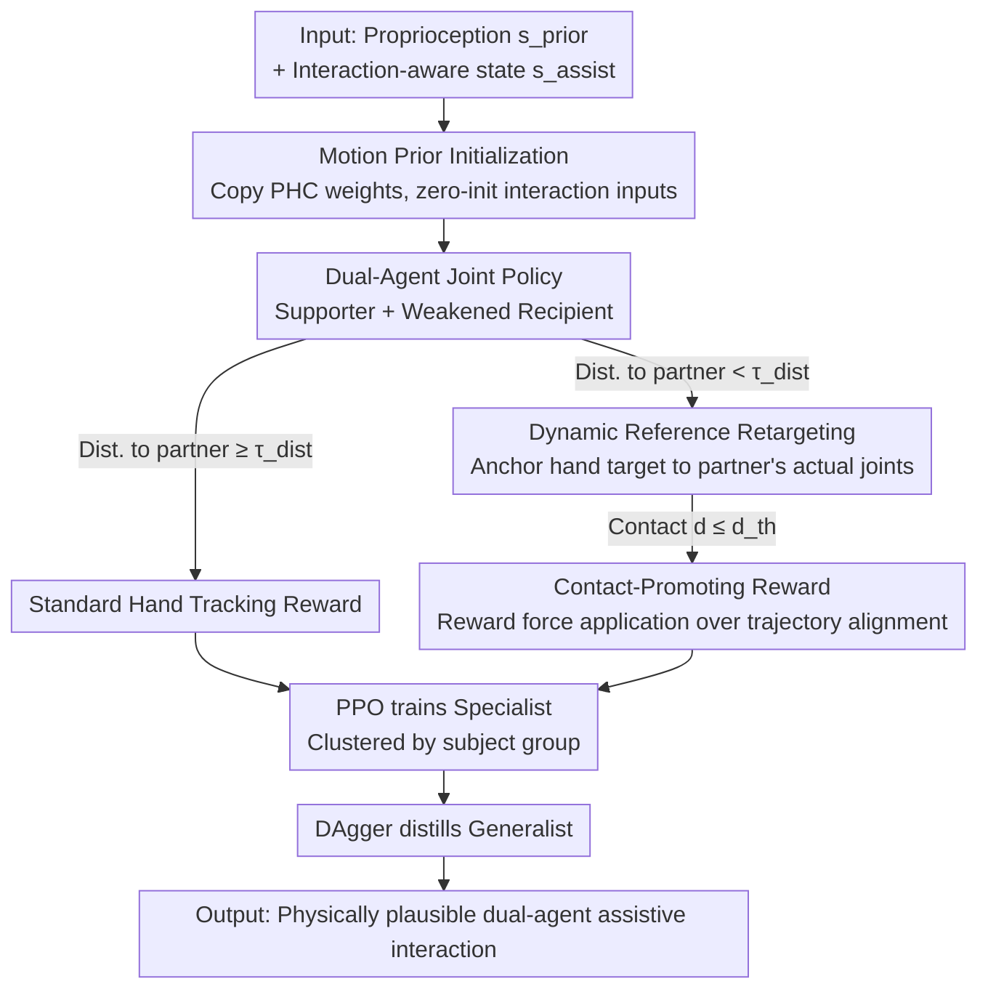

# Learning to Assist: Physics-Grounded Human-Human Control via Multi-Agent Reinforcement Learning

**Conference**: CVPR 2026  
**arXiv**: [2603.11346](https://arxiv.org/abs/2603.11346)  
**Code**: [AssistMimic](https://yutoshibata07.github.io/AssistMimic/)  
**Area**: Video Understanding  
**Keywords**: multi-agent reinforcement learning, physics-based character control, human-human interaction, assistive motion imitation, motion tracking

## TL;DR

AssistMimic is proposed to model the physical imitation of human-human assistive interactions as a Multi-Agent Reinforcement Learning (MARL) problem. Through motion prior initialization, dynamic reference retargeting, and contact-promoting rewards, it achieves the first physics-based simulation and tracking of assistive movements involving force exchange.

## Background & Motivation

- **Background**: Physics-based human motion imitation (e.g., DeepMimic, PHC) has enabled virtual characters and humanoid robots to replicate single-person movements with high quality. However, research has focused primarily on single-agent scenarios, leaving close-contact multi-person interactions largely unexplored.
- **Limitations of Prior Work**: Existing multi-agent interaction methods (e.g., Human-X, Phys-Reaction) rely on "kinematic playback" strategies—training a supporter while replaying a pre-generated recipient motion from a single-person controller. In assistive scenarios, however, the recipient cannot physically complete the motion independently (e.g., a paralyzed person cannot stand up alone), making standalone trajectory generation physically infeasible.
- **Key Challenge**: Assistive human-human interaction (HHI) requires both parties to continuously perceive each other's posture and adapt forces/positions in real-time. Decoupled training breaks physical consistency, leading to artifacts like interpenetration or characters being launched by physics engines.
- **Goal**: To learn physically plausible dual-person assistive interaction controllers, enabling the supporter to provide meaningful physical assistance based on the recipient's real-time state.
- **Key Insight**: The problem is modeled as a multi-agent MDP with asymmetric dynamics. By jointly training policies for both parties, the recipient also learns "how to be helped."
- **Core Idea**: Convergence in high-contact MARL training is achieved through the synergy of three designs: initialization via transfer from single-person motion priors, dynamic reference retargeting for contact alignment, and contact-promoting rewards instead of noisy hand tracking.

## Method

### Overall Architecture

AssistMimic solves a task impossible for single-person imitation frameworks: enabling a virtual character to **physically support or lift another character who cannot move independently**. It trains both the Supporter and the physically weakened Recipient as two agents simultaneously within a physics simulator. Both agents share a symmetric goal-conditioned policy: the input includes both its own proprioception $s_{\text{prior}}$ (joint states, goal $g$) and an interaction-aware state $s_{\text{assist}}$—comprising the partner's observations, current contact state, contact forces, and the previous action. The recipient is intentionally "weakened" by reducing PD gains and maximum torque, making it physically impossible to stand without external support. The pipeline trains a specialist policy for each subject group using PPO, followed by distilling multiple specialists into a generalist using DAgger.

The joint training succeeds due to three interlocking designs: starting from a stable motion prior, anchoring the supporter's hands to the partner's shifting body via dynamic retargeting, and replacing strict tracking of noisy hand trajectories with the application of appropriate forces at the correct locations.

### Key Designs

**1. Motion Prior Initialization: Learning to walk before learning to help**

The exploration space for HHI MARL is too vast for training from scratch—ablation shows a 0% success rate without this component. AssistMimic uses a pre-trained single-person tracking controller (PHC) as a starting point. Weights from the PHC input layer are copied to the corresponding $s_{\text{prior}}$ part of the new policy, while weights for the new interaction-aware input $s_{\text{assist}}$ are initialized to zero: $\mathbf{W}_{\text{new}}^{\text{input}} = [\mathbf{W}_{\text{prior}}^{\text{input}} \mid \mathbf{0}]$. This ensures that at the start of training, the policy behaves exactly like the single-person PHC—already capable of standing, walking, and balancing—making exploration feasible.

**2. Dynamic Reference Retargeting: Tracking the partner, not the recording**

Because the recipient is physically weakened, their actual pose continuously deviates from the reference motion. If the supporter stubbornly reaches for fixed global hand coordinates from the reference, they will miss the recipient's body. Retargeting activates when the distance between agents is below $\tau_{\text{dist}}$. It finds the recipient's body joint $k^*$ closest to the supporter's wrist in reference space, calculates the relative offset $\Delta\hat{\mathbf{p}}$ provided by the reference, and adds this offset to the **actual** joint position of the simulated recipient to obtain a new hand target:

$$\hat{\mathbf{p}}_{h_i,t}^{(S)} = \mathbf{p}_{k^*,t}^{(R)} + \Delta\hat{\mathbf{p}}_{h_i,t}.$$

This ensures the supporter's target moves with the partner's real body, maintaining contact even when the recipient collapses or shifts.

**3. Contact-Promoting Reward: Machining force instead of tracking noise**

Hand trajectories in motion capture are often noisy or occluded. Strict tracking at close range forces the policy to replicate erroneous jitters, which can hinder effective support. When the supporter's hand enters the proximity range ($d_{i,t} \leq d_{\text{th}}$), the standard tracking reward is replaced with a contact-promoting reward:

$$r = \beta f_{i,t} \exp(- \alpha d_{i,t}) + b_{\text{contact}},$$

where $f_{i,t}$ is the aggregated finger contact force (saturated for safety), $\exp(-\alpha d_{i,t})$ encourages closer proximity, and $b_{\text{contact}}$ is a constant reward for successful contact. This transition allows the policy to learn the essence of assistance: applying the right force at the right place, rather than frame-by-frame replication of an unreliable kinematic trajectory.

### Loss & Training

The foundation is the tracking reward $r_{\text{track}}^{(m)} = \exp(-D(\hat{\mathbf{q}}_t^{(m)}, \mathbf{q}_t^{(m)}))$, where $D$ measures weighted distances of joint rotations, positions, and velocities. Total rewards differ slightly: the recipient uses tracking plus power penalties and assistive stability terms, while the supporter switches to the contact-promoting reward at close range. Specialists are trained per subject cluster using PPO, utilizing a 0.25m pose deviation threshold for early termination and Physical State Initialization (PSI) to avoid interpenetration at the start of episodes. Finally, multiple specialists are distilled into one generalist via DAgger.

## Key Experimental Results

### Main Results: Specialist Policy Evaluation

| Method | Inter-X SR(%)↑ | Inter-X MPJPE(mm)↓ | Mass×1.2 SR(%)↑ | Kp/Kd×0.5 SR(%)↑ |
|---|---|---|---|---|
| Sequential Training | 62.4 | 92.3 | 49.9 | 50.5 |
| **AssistMimic** | **83.4** | 107 | **73.1** | **83.3** |
| (−) Dynamic Retargeting | 74.9 | 113 | 57.9 | 72.8 |
| (−) Contact Reward | 81.6 | 80.4 | 66.3 | 77.1 |
| (−) Weight Init | 0.0 | 248 | 0.0 | 0.0 |

| Method | HHI-Assist SR(%)↑ | MPJPE(mm)↓ | Mass×1.5 SR(%)↑ | Hip torque×0.5 SR(%)↑ |
|---|---|---|---|---|
| **AssistMimic** | **97.7** | 89.5 | **67.8** | **73.2** |
| (−) Dynamic Retargeting | 85.4 | 125 | 49.1 | 62.9 |
| (−) Contact Reward | 85.8 | 127 | 56.4 | 27.7 |
| (−) Weight Init | 19.1† | 364† | - | - |

### Ablation Study: Generalist Policy and COM Stability

| Method | Inter-X Generalist SR(%)↑ | MPJPE(mm)↓ |
|---|---|---|
| AssistMimic | 39.8 | 103 |
| + DAgger Distillation | **64.7** | 106 |

| Method | COM Std(seen)↓ | COM Std(Mass×1.5)↓ | COM Std(Hip τ×0.5)↓ |
|---|---|---|---|
| **AssistMimic** | **0.0921** | **0.0738** | **0.0865** |
| (−) Dyn Retarget | 0.1038 | 0.0902 | 0.0924 |
| (−) Contact | 0.0938 | 0.0838 | 0.0849 |

## Highlights & Insights

1. **First Physical Tracking of Force-Exchange Assistance**: AssistMimic is the first method to successfully track close-contact, force-coupled HHI actions across Inter-X and HHI-Assist benchmarks.
2. **The Recipient Must Also Learn**: The comparison between joint and decoupled training (83.4% vs 62.4%) demonstrates that the party being helped must actively learn to cooperate and accept support.
3. **Crucial Role of Motion Priors**: The 0% success rate without weight initialization proves that RL cannot effectively explore high-dimensional HHI spaces without a sound starting point.
4. **Robustness via Contact Rewards**: Superior performance under unseen dynamics (e.g., hip torque×0.5: 73.2% vs 27.7%) suggests that learning to actively apply force is more critical than precisely following hand trajectories.
5. **Generalization to Generative Motion**: The framework can track interaction trajectories generated by diffusion models, converting kinematic outputs into physically plausible motions.

## Limitations & Future Work

1. **Lack of Hand Dexterity**: Current models struggle in scenarios requiring grasping and lifting the recipient's arms; fine-grained finger coordination is difficult to learn from noisy demonstrations.
2. **Absence of Visual Observations**: Dependence on ground-truth proprioception limits the feasibility of sim-to-real transfer to physical humanoid robots.
3. **Decoupled Planning and Control**: There is a lack of tight integration between high-level motion planners and low-level controllers, preventing true real-time adaptive coordination.
4. **Generalist Performance Gap**: The 64.7% success rate for the generalist across 30 diverse clips still trails the 83.4% of specialists, suggesting a need for more data and larger policy capacities.

## Related Work & Insights

| Aspect | AssistMimic | Human-X (2025) | Phys-Reaction (2024) |
|---|---|---|---|
| Interaction Modeling | Joint MARL, mutual optimization | Diffusion planner + Single-agent tracking | Single-agent + Kinematic playback |
| Physical Consistency | Full physics w/ force feedback | Partial physics, open-loop reaction | Playback breaks physical consistency |
| Target Scenarios | Force-coupled assistance (Lifting) | Social interaction (High-fives) | Non-contact social interaction |
| Key Limitation | Limited dexterity | Cannot handle force-coupled HHI | Recipient trajectories not independently generatable |

**vs PHC**: AssistMimic leverages PHC as a single-person motion prior, extending it to a multi-agent architecture, proving that robust single-person controllers provide a strong foundation for HHI.

**vs CooHOI**: While CooHOI focuses on human-object collaboration, AssistMimic addresses human-human assistance where the recipient is an agent with autonomous dynamics, requiring bilateral adaptation.

## Rating

- **Novelty**: ⭐⭐⭐⭐ — Modeling assistive interaction as asymmetric MARL is a first; the three components have clear physical intuition.
- **Experimental Thoroughness**: ⭐⭐⭐⭐ — Comprehensive testing across multiple datasets and unseen dynamics; however, lacks physical robot experiments.
- **Writing Quality**: ⭐⭐⭐⭐ — Clear problem definitions, well-motivated components, and intuitive visualization of failure modes.
- **Value**: ⭐⭐⭐⭐⭐ — Addresses a key challenge for assistive robotics by providing a foundation for physically plausible HHI control.

<!-- RELATED:START -->

## Related Papers

- [\[CVPR 2026\] VideoChat-M1: Collaborative Policy Planning for Video Understanding via Multi-Agent Reinforcement Learning](videochatm1_collaborative_policy_planning_for_vide.md)
- [\[CVPR 2026\] Dual-Agent Reinforcement Learning for Adaptive and Cost-Aware Visual-Inertial Odometry](dual-agent_reinforcement_learning_for_adaptive_and_cost-aware_visual-inertial_od.md)
- [\[CVPR 2026\] Efficient Frame Selection for Long Video Understanding via Reinforcement Learning](efficient_frame_selection_for_long_video_understanding_via_reinforcement_learnin.md)
- [\[CVPR 2026\] MaskAdapt: Learning Flexible Motion Adaptation via Mask-Invariant Prior for Physics-Based Characters](maskadapt_learning_flexible_motion_adaptation_via_mask-invariant_prior_for_physi.md)
- [\[CVPR 2026\] Learning to Refuse: Refusal-Aware Reinforcement Fine-Tuning for Hard-Irrelevant Queries in Video Temporal Grounding](learning_to_refuse_refusal-aware_reinforcement_fine-tuning_for_hard-irrelevant_q.md)

<!-- RELATED:END -->
