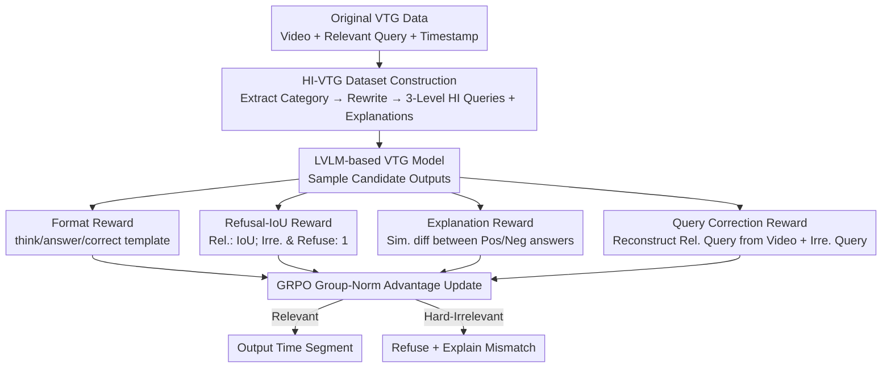

# Learning to Refuse: Refusal-Aware Reinforcement Fine-Tuning for Hard-Irrelevant Queries in Video Temporal Grounding

**Conference**: CVPR 2026  
**Paper**: [CVF Open Access](https://openaccess.thecvf.com/content/CVPR2026/html/Lee_Learning_to_Refuse_Refusal-Aware_Reinforcement_Fine-Tuning_for_Hard-Irrelevant_Queries_in_CVPR_2026_paper.html)  
**Code**: To be confirmed  
**Area**: Video Understanding  
**Keywords**: Video temporal grounding, Refusal, Reinforcement fine-tuning, GRPO, Fine-grained semantics

## TL;DR
Addressing the blind assumption of "always providing a segment for any query" in Video Temporal Grounding (VTG), this paper proposes Refusal-Aware Reinforcement Fine-Tuning (RA-RFT) based on GRPO. Combined with four rewards (format, refusal-IoU, explanation, query correction) and a specifically constructed "hard-irrelevant query" dataset HI-VTG, the model learns to refuse queries that are **highly semantically similar but actually mismatched** and explain why. This significantly improves refusal and explanation quality across several relevance-aware VTG scenarios without compromising standard grounding accuracy.

## Background & Motivation
**Background**: The task of Video Temporal Grounding (VTG) is to output a time interval $[t_s, t_e]$ corresponding to a natural language query given a video. Recent trends have shifted from small feature-fusion models to Large Vision-Language Models (LVLMs), further branching into SFT and RFT approaches. The latter has adopted the GRPO "reinforcement fine-tuning with rewards" framework into VTG (e.g., Time-R1, VideoChat-R1), significantly enhancing grounding reasoning through time-aware rewards.

**Limitations of Prior Work**: Almost all VTG models harbor a dangerous internal assumption: **the video must contain a segment related to the query**. Consequently, even if the query is entirely unrelated to the video, the model will forcibly output a timestamp. A few works (RaTSG, NA-VMR) attempt "refusal," but they only handle **entirely unrelated** queries (constructed via cross-video random query shuffling as negative samples), thus learning only coarse-grained differences.

**Key Challenge**: The most difficult cases in reality are **hard-irrelevant queries**, where the query and video overlap heavily in high-level semantics but mismatch in details. For example, if the video shows "a chef boiling pasta in a kitchen" and the query is "a chef cutting steak in a kitchen," both share "chef in a kitchen cooking," but the action (boil vs. cut) and object (pasta vs. steak) are wrong. Existing methods only learn binary "relevant/irrelevant" classifications and fail to capture such fine-grained mismatches, leading them to still output incorrect segments.

**Goal**: To enable VTG models to accurately ground when a query is relevant and refuse to output segments when a query (even a hard-irrelevant one) is irrelevant, while **clearly explaining the reason for the mismatch**. This requires solving two issues: a training strategy that drives fine-grained semantic discrimination and a dataset containing hard-irrelevant samples.

**Key Insight**: The authors observe that SFT suffers from catastrophic forgetting of generalization capabilities due to mimicking instruction formats, degenerating into "refusing nothing." Conversely, RFT (GRPO) adjusts output via reward signals, making it easier to generalize "refusal" behavior. Therefore, the authors focus on RFT models, using carefully designed rewards to teach the model when to refuse, how to explain, and what the error is.

**Core Idea**: Replace pure grounding rewards with three types of semantic rewards ("Refusal-IoU + Explanation + Query Correction"), forcing the model to perform fine-grained semantic comparison between query and video. This teaches the model to refuse hard-irrelevant queries, supported by the HI-VTG dataset constructed with three difficulty levels.

## Method

### Overall Architecture
The method consists of two components: a **data construction pipeline** that upgrades existing VTG datasets into the HI-VTG dataset with hard-irrelevant queries and refusal explanations, and a **Reinforcement Fine-Tuning (RA-RFT)** process that uses GRPO to post-train LVLM-based VTG models. Four rewards are used to simultaneously learn "grounding if relevant, refusing if irrelevant, and explaining clearly."

Data side: Original VTG samples are triplets $\{v, q_r, a_{time}\}$ (video, relevant query, timestamped answer). The authors first use an LLM to extract semantic categories from relevant queries, then rewrite them into hard-irrelevant queries $q_{ir}$ and corresponding refusal explanations $a_{refusal}$, forming $\{v, q_r, a_{time}, q_{ir}, a_{refusal}\}$. Training side: The model samples a group of candidate outputs (GRPO groups) for each input, scored by four rewards, and updates the policy via group-normalized advantages. The model is required to output following a fixed template `<think>…</think><answer>…</answer><correct>…</correct>`, where `<answer>` provides either timestamps or a refusal reason, and `<correct>` reconstructs the originally relevant query in irrelevant cases.

The training objective for GRPO follows the standard form: for each input $q$, policy $\pi_\theta$ generates a group of candidates $\{o_1,\dots,o_G\}$. The rewards are group-normalized to maximize weighted rewards with a KL divergence constraint:

$$R(o)=\sum_i \frac{\pi_\theta(o_i)}{\pi_{\theta_{old}}(o_i)}\cdot\frac{r(o_i)-\mathrm{mean}(\{r(o_j)\})}{\mathrm{std}(\{r(o_j)\})},\quad \max_{\pi_\theta}\mathbb{E}\big[R(o)-\beta D_{KL}(\pi_\theta\|\pi_{ref})\big]$$

The core novelty lies in the reward design $r(o)=r_{for}+r_{R\text{-}IoU}+r_{exp}+r_{cor}$ and the HI-VTG data.

### Key Designs

**1. Refusal-IoU Reward: Unifying "Grounding" and "Refusal" into One Score**

Naive VTG rewards only encourage accurate timestamps, resulting in "never refusing." This paper modifies the reward to score relevant and irrelevant scenarios separately:

$$r_{R\text{-}IoU}(o)=\begin{cases} \mathrm{IoU}(a_{time},\hat a), & q\in\text{Rel. and } \{t_s,t_e\}\in\hat a\\ 1, & q\in\text{Irre. and } \{t_s,t_e\}\notin\hat a\\ 0, & \text{otherwise}\end{cases}$$

Where $\hat a$ is the answer extracted from the `<answer>` tag. For relevant queries with valid timestamps, the reward is the IoU between predicted and ground-truth segments, encouraging accuracy. For irrelevant queries where the model **does not** output any timestamp, it receives a full score of 1, directly rewarding the "refusal" behavior itself. Other cases (refusing relevant or grounding irrelevant) receive 0. This piecewise function integrates the conflicting goals of "when to ground" and "when to stay silent" into a single scalar.

**2. Explanation Reward: Forcing the Model to Specify Mismatches via Contrastive Similarity**

Refusal alone is insufficient; hard-irrelevant queries share high-level semantics with the video, so identifying **exactly which detail mismatches** proves true understanding. The authors employ a contrastive explanation reward:

$$r_{exp}(o)=\mathrm{sim}(a_{pos},\hat a)-\mathrm{sim}(a_{neg},\hat a)$$

$\mathrm{sim}$ is the cosine similarity of SentenceBERT embeddings. For relevant queries, the positive sample is the timestamped answer $a_{time}$ and the negative is $a_{refusal}$. For hard-irrelevant queries, it is reversed. This reward encourages the generated answer $\hat a$ to be close to the positive reference and away from the negative, pushing the model to generate explanations that explicitly point out semantic mismatches.

**3. Query Correction Reward: Forcing Semantic Comparison via Reconstruction**

To determine what is wrong with a query, the most thorough way is to know "what the correct query should have been." The model is tasked to reconstruct the original relevant query $q_r$ within the `<correct>` tag based on video $v$ and the hard-irrelevant query $q_{ir}$:

$$r_{cor}(o)=\begin{cases} 0, & q\in\text{Rel.}\\ \mathrm{sim}(q_r,\hat c), & q\in\text{Irre.}\end{cases}$$

$\hat c$ is the corrected query. To reconstruct $q_r$, the model must compare the video content against the erroneous query element-by-element (e.g., "video is boiling, query says cutting"). This reconstruction task naturally forces fine-grained reasoning, which is more effective for semantic discrimination than simply outputting "irrelevant."

**4. HI-VTG Dataset: Semantic Categories + Triple Difficulty Gradient**

The authors use an LLM (GPT-5-mini) to generate data in two steps: first, defining 11 semantic relevance categories under four main groups (Action, Object, Scene, Attribute) to characterize original queries; then, modifying 1/2/3 semantic elements based on these categories to create **Strong / Moderate / Weak** hard-irrelevant queries. Stronger difficulty (fewer changes) makes refusal harder. The final dataset contains 2.5K relevant and 7.5K hard-irrelevant pairs (10K total), covering HowTo100M, DiDeMo, and InternVID.

### Loss & Training
Post-training uses GRPO as defined in the **Overall Architecture** section. The backbones are 7B-scale RFT-based VTG models (Time-R1, VideoChat-R1). Videos are sampled at 2 FPS and scaled to ~2.8M pixels. Training spans 3 epochs with a batch size of 16. Models are evaluated using the final checkpoint **without specialized fine-tuning on downstream benchmarks**. Experiments are conducted on 8×A100 with ZeRO-3.

## Key Experimental Results

### Main Results
Evaluation is conducted on three relevance-aware VTG scenarios: Hard-Irrelevant VTG (HI-ActivityNet / HI-TVGBench / HI-Charades), Simple-Shuffled RA-VTG (SS-*), and human-annotated RA-VTG. Metrics include RA-IoU and F1. Gains for RA-RFT on F1 (avg) across HI-VTG benchmarks:

| Dataset | Backbone | F1 (Baseline) | F1 (+RA-RFT) | Gain |
|---------|----------|---------------|--------------|------|
| HI-ActivityNet | Time-R1 | 70.5 | 76.3 | +5.8 |
| HI-TVGBench | Time-R1 | 64.5 | 70.0 | +5.5 |
| HI-Charades | VideoChat-R1 | 62.3 | 73.3 | +11.0 |
| HI-ActivityNet | VideoChat-R1 | 64.4 | 72.9 | +8.5 |

On the human-annotated set, explanation quality improvements are striking (Time-R1): F1 avg 57.1→71.2, LLM score 1.16→2.13. SFT-based baselines (TimeChat, TRACE) failed significantly, with F1 scores for irrelevant queries near 0, confirming the catastrophic forgetting/mimicry issue.

### Ablation Study
Step-by-step reward addition (HI-ActivityNet, Time-R1 backbone):

| Configuration | F1 | mIoU | RT-IoU | LLM | Description |
|---------------|----|------|--------|-----|-------------|
| Time-R1 Baseline | 70.5 | 45.8 | 30.4 | 2.00 | Original RFT model |
| +GRPO w/o HI-VTG | 70.0 | 46.4 | 28.3 | 1.85 | Using only shuffled data (slight drop) |
| +GRPO w/ R.IoU | 75.1 | 50.9 | 34.5 | 2.29 | Swapping to HI-VTG + Refusal-IoU |
| +GRPO w/ R.IoU-Exp | 75.6 | 52.2 | 36.0 | 2.37 | Adding Explanation reward |
| +GRPO w/ R.IoU-Exp-Cor | 76.3 | 51.9 | 37.1 | 2.44 | Adding Correction reward |

### Key Findings
- **Data Precedes Reward**: Using simple shuffled irrelevant queries even with the Refusal-IoU reward cannot handle hard-irrelevant cases. The HI-VTG dataset itself is the prerequisite for learning fine-grained refusal.
- **Complementary Rewards**: Refusal-IoU handles relevance discrimination, Explanation reward improves "why," and Correction reward further boosts both without dropping RA-IoU.
- **Higher Gains on Harder Samples**: The Strong difficulty level (most similar) shows the largest relative improvement (Time-R1 F1 60.0→70.6).
- **No Harm to Normal Grounding**: On standard VTG (ActivityNet Captions), mIoU remains stable (41.2→41.3), proving refusal capability does not sacrifice accuracy.

## Highlights & Insights
- **Refusal as Rewardable Behavior**: Using a piecewise function to unify "grounding" and "refusing" into a single scalar allows GRPO to naturally distinguish correct behaviors within a group. This strategy is transferable to any task involving an "abstain" option.
- **Query Correction as a Clever Proxy**: Instead of model just shouting "irrelevant," forcing it to reconstruct the correct query forces element-wise semantic comparison, effectively translating "fine-grained understanding" into a supervised signal.
- **Controlled Data Synthesis**: Moving from semantic category extraction to 1/2/3 element modification provides a semantic gradient for training and a way to quantitatively verify benefits on harder samples.
- **Plug-and-Play**: The method is backbone-agnostic and functions as a post-training phase rather than an architectural change.

## Limitations & Future Work
- **LLM-Dependence**: The HI-VTG data relies entirely on GPT-5-mini, which may introduce distribution bias.
- **Binary Hard-Decision for Refusal**: The Refusal-IoU reward for irrelevant cases only checks for the absence of timestamps, which is a coarse signal.
- **Explanation Reward Constraints**: SentenceBERT cosine similarity might penalize good explanations with different phrasing or reward bad explanations with similar wording.
- **Minor Trade-offs**: Some backbones (VideoChat-R1) showed slight mIoU drops on standard VTG, indicating a minor trade-off between refusal and grounding precision.

## Related Work & Insights
- **vs. RaTSG / NA-VMR (Refusal VTG)**: These rely on coarse random shuffling for negative samples. Ours uses hard-irrelevant data and fine-grained rewards to tackle "similar but wrong" queries and provide explanations.
- **vs. SFT-based VTG**: SFT models suffer from catastrophic forgetting and output segments for everything. This work uses RFT to generalize refusal behavior.
- **vs. Standard RFT VTG**: Previous models focused only on "grounding if exists." This work expands the objective to include "staying silent if not" through Refusal-IoU and Explanation rewards.

## Rating
- Novelty: ⭐⭐⭐⭐ 
- Experimental Thoroughness: ⭐⭐⭐⭐ 
- Writing Quality: ⭐⭐⭐⭐ 
- Value: ⭐⭐⭐⭐ 

<!-- RELATED:START -->

## Related Papers

- [\[CVPR 2026\] SARL-STG: A Spatially Aware Reinforcement Learning Framework for Refining MLLMs in Spatio-Temporal Video Grounding](sarl-stg_a_spatially_aware_reinforcement_learning_framework_for_refining_mllms_i.md)
- [\[CVPR 2026\] CVA: Context-aware Video-text Alignment for Video Temporal Grounding](cva_context-aware_video-text_alignment_for_video_temporal_grounding.md)
- [\[CVPR 2026\] Efficient Frame Selection for Long Video Understanding via Reinforcement Learning](efficient_frame_selection_for_long_video_understanding_via_reinforcement_learnin.md)
- [\[NeurIPS 2025\] TempSamp-R1: Effective Temporal Sampling with Reinforcement Fine-Tuning for Video LLMs](../../NeurIPS2025/video_understanding/tempsampr1_effective_temporal_sampling_with_reinforcement_fi.md)
- [\[CVPR 2026\] VideoChat-M1: Collaborative Policy Planning for Video Understanding via Multi-Agent Reinforcement Learning](videochatm1_collaborative_policy_planning_for_vide.md)

<!-- RELATED:END -->
## Related Papers

- [\[CVPR 2026\] CVA: Context-aware Video-text Alignment for Video Temporal Grounding](cva_context-aware_video-text_alignment_for_video_temporal_grounding.md)
- [\[CVPR 2026\] Efficient Frame Selection for Long Video Understanding via Reinforcement Learning](efficient_frame_selection_for_long_video_understanding_via_reinforcement_learnin.md)
- [\[NeurIPS 2025\] TempSamp-R1: Effective Temporal Sampling with Reinforcement Fine-Tuning for Video LLMs](../../NeurIPS2025/video_understanding/tempsampr1_effective_temporal_sampling_with_reinforcement_fi.md)
- [\[CVPR 2026\] T2SGrid: Temporal-to-Spatial Gridification for Video Temporal Grounding](t2sgrid_temporal-to-spatial_gridification_for_video_temporal_grounding.md)
- [\[CVPR 2026\] VideoChat-M1: Collaborative Policy Planning for Video Understanding via Multi-Agent Reinforcement Learning](videochatm1_collaborative_policy_planning_for_vide.md)

<!-- RELATED:END -->
