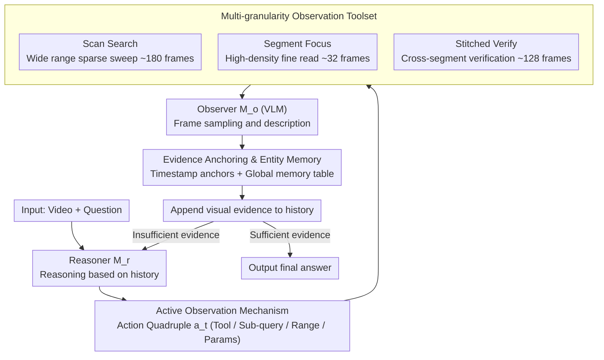

# LensWalk: Agentic Video Understanding by Planning How You See in Videos

**Conference**: CVPR 2026  
**arXiv**: [2603.24558](https://arxiv.org/abs/2603.24558)  
**Code**: None  
**Area**: Video Understanding  
**Keywords**: Video agents, active observation, visual language models, long video understanding, tool use

## TL;DR

LensWalk is proposed as an agentic framework that allows an LLM reasoner to actively control the temporal scope and sampling density of video observations. Through a reason-plan-observe loop, it achieves adaptive video understanding, providing a plug-and-play performance gain of over 5% on long video benchmarks without the need for fine-tuning.

## Background & Motivation

Video understanding is a core task in computer vision, yet the dense temporal nature of videos poses significant challenges for automated analysis. Existing methods face a fundamental contradiction: a disconnection between reasoning and perception.

Prior work primarily suffers from three types of issues: (1) One-shot forward methods sample videos uniformly into a fixed visual context, easily missing key events or being overwhelmed by redundant information; (2) Heuristic keyframe selection methods are more refined but remain one-time static samplings that cannot adjust according to intermediate hypotheses; (3) Retrieval-based agents can acquire information dynamically but operate on pre-processed static representations (e.g., ASR transcripts, clip-level captions), failing to generate new observations from the source video on demand.

**Key Challenge**: The reasoning process of a model should drive "what to see" and "how to see," but existing pipelines isolate observation from reasoning—observations are completed once before reasoning or are limited by fixed pre-processing artifacts. **Key Insight**: This work draws inspiration from human visual cognitive strategies, where purposeful information seeking handles information overload by switching between macro-scanning and fine-focusing, accompanied by continuous reflection and verification. **Core Idea**: Enable an LLM reasoner to autonomously decide the temporal range and sampling density, transforming video understanding into an active reason-plan-observe loop.

## Method

### Overall Architecture

LensWalk addresses the disconnection between reasoning and observation. Traditional pipelines sample videos into a fixed context for one-shot reasoning, depriving the model of the chance to "look back" based on intermediate hypotheses. LensWalk transforms this into a multi-turn closed loop: a reasoner ($M_r$) analyzes the current question and existing evidence, plans which segment to watch and at what granularity, and formulates a structured action plan $a_t$. This plan is executed by a VLM observer ($M_o$) which samples frames and describes the visual content. The resulting evidence is appended to the history for the next reasoning round. This reason $\rightarrow$ plan $\rightarrow$ observe cycle continues until the reasoner reaches a final answer. Supporting this loop, timestamp anchors and a global entity memory table are maintained to prevent drift in temporal localization and entity reference.

### Key Designs

**1. Multi-granularity Observation Toolset: Defining "How to See"**

If an agent is restricted to a single sampling method, it either misses key events in long videos or lacks resolution for details. LensWalk provides three complementary tools corresponding to discovery, focus, and verification. **Scan Search** performs sparse sampling across a wide temporal range (approx. 180 frames) for rapid clue localization. **Segment Focus** targets a single window with high-density sampling (approx. 32 frames) to capture fine-grained actions, text, or objects. **Stitched Verify** concatenates frames from several **discontinuous** intervals into one batch (approx. 128 frames), allowing the observer to perform cross-segment comparisons and causal verification (e.g., "Is the person seen earlier the same one who fell later?"). These tools ensure complete coverage from global search to local reading without compromising conflicting sampling needs.

**2. Active Observation Mechanism: Structured Action Planning**

To ensure the reasoner can explicitly decide where and how to look in a traceable manner, LensWalk parameterizes each round’s action into a quadruple:

$$a_t = (o_t,\; q_t,\; \mathcal{I}_t,\; \rho_{o_t})$$

where $o_t$ is the selected tool, $q_t$ is a guided sub-query for the observer, $\mathcal{I}_t$ is the temporal range, and $\rho_{o_t}$ represents tool-specific parameters (e.g., density). This maps reasoning states directly to video scheduling. Furthermore, these plans remain in the history, allowing the agent to track explored regions and prioritize unexplored areas in subsequent rounds.

**3. Evidence Anchoring and Entity Memory: Preventing Temporal and Entity Drift**

Multi-turn reasoning often suffers from inaccurate timestamps or inconsistent entity identification across rounds. LensWalk uses two mechanisms: **Timestamp Anchors** insert temporal markers between frames during observation, ensuring the observer's response includes precise time references. This facilitates accurate re-observation and avoids "seeing but not knowing where." A **Global Entity Memory Table** resides outside the main history to record entity attributes and occurrences. This prevents redundant identification efforts and keeps long contexts from scrambling entity references.

### Mechanism Example: Answering "Who left the room first?"

Given a 40-minute meeting recording:

1.  **Round 1 (Localization)**: The reasoner decides to find when someone leaves. It issues $a_1$ = (Scan Search, "Where is someone leaving?", 0–40min, sparse). The observer scans 180 frames and reports activity near the door at 18–22min with timestamps.
2.  **Round 2 (Focus)**: The reasoner issues $a_2$ = (Segment Focus, "Who left and what color were they wearing?", 18–22min, high-density). The observer notes a man in a dark blue jacket leaving at 21:05. This is recorded in the entity memory.
3.  **Round 3 (Verification)**: To confirm "first," the reasoner checks earlier timeframes. It issues $a_3$ = (Stitched Verify, "Anyone leaving between 0–18min?", stitched 0–6/6–12/12–18min). The observer confirms no earlier departures.
4.  **Completion**: With closed evidence, the reasoner outputs "Dark blue." High-density observation was only applied to relevant segments, keeping peak context usage low.

### Loss & Training

LensWalk is a training-free, plug-and-play framework that does not fine-tune models. The reasoner also serves as the memory updater. During runtime, the agent can call tools up to 20 times. Frame budgets for Scan Search, Segment Focus, and Stitched Verify are approximately 180, 32, and 128 respectively.

## Key Experimental Results

### Main Results

| Dataset | Metric | Ours (Best Config) | Prev. SOTA | Gain |
| :--- | :--- | :--- | :--- | :--- |
| LVBench | Accuracy | 68.6% (o3 self) | 60.8% (MR.Video) | +7.8% |
| VideoMME Long | Accuracy(w/o sub) | 71.4% (o3 self) | 67.3% (DVD) | +4.1% |
| LongVideoBench | Accuracy | 70.6% (o3 self) | 68.6% (DVD) | +2.0% |
| MMVU (MC) | Accuracy | 80.9% (o3/GPT-4.1) | 78.9% (o3) | +2.0% |
| Video-MMMU | Overall | 78.33% (o3 self) | 75.44% (o3) | +2.89% |
| EgoSchema | Val | 77.2% (o3/Qwen2.5-VL-72B) | 76.6% (DVD) | +0.6% |

### Ablation Study

| Configuration | Metric (VideoMME Long) | Description |
| :--- | :--- | :--- |
| Full LensWalk (o3/GPT-4.1) | 70.0% | Baseline |
| w/o Scan Search | 65.4% | -4.6%, localization is most critical |
| w/o Stitched Verify | 66.8% | -3.2%, cross-segment integration is important |
| w/o Segment Focus | 68.1% | -1.9%, fine-grained extraction contributes |
| w/o Timestamp Anchor | 69.4% | -0.6% |
| w/o Subject Memory | 69.7% | -0.3% |

### Key Findings

- o3 performs exceptionally well as a self-observer (both reasoner and observer), achieving gains of 11.5% on LVBench and 6.7% on VideoMME Long.
- Open-source reasoners like Qwen3-235B-A22B help weak observers (Qwen2.5-VL-7B +4.3%) but offer limited help to strong observers (GPT-4.1 +0.1%).
- The agent exhibits six behavior patterns: direct query, progressive zoom, range split, strategy reflection, integrated verification, and static repetition.
- The framework adaptively allocates observation budgets: simple questions are solved quickly with few frames, while complex ones receive more rounds.

## Highlights & Insights

- The core design philosophy of integrating "how to observe" into the reasoning loop is elegant and mimics human purposeful visual search.
- The training-free, plug-and-play nature allows it to enhance existing models directly, offering high engineering value.
- The emergence of diverse cognitive strategies (progressive zoom, reflection) demonstrates the agent's autonomous reasoning capabilities.
- Token consumption is comparable to one-shot methods, but peak token counts per round are significantly lower, mitigating long-context memory pressure.

## Limitations & Future Work

- Performance is highly dependent on the reasoner's cognitive ability—weak reasoners may generate invalid plans.
- Occasional "static repetition" (repeatedly observing the same area) suggests the planning mechanism is not yet perfect.
- Current tools apply only to the visual modality, ignoring audio and subtitles.
- The 20-tool-call limit may be insufficient for extremely long videos.

## Related Work & Insights

- **vs Deep Video Discovery**: DVD consumes millions of tokens by pre-generating captions; LensWalk observes on-demand, with token usage similar to one-shot methods but with higher accuracy.
- **vs MR.Video**: MR.Video relies on fixed clip retrieval; LensWalk dynamically scales observation range and density.
- **vs VideoAgent**: VideoAgent tools operate on pre-processed products; LensWalk schedules new observations directly from source video.
- **Insight**: "Scalable Visual Cognition"—beyond just increasing model size, models must learn to observe actively.

## Rating

- Novelty: ⭐⭐⭐⭐⭐ Redefines video understanding as active observation scheduling.
- Experimental Thoroughness: ⭐⭐⭐⭐⭐ 6 benchmarks, various model combinations, and detailed ablation.
- Writing Quality: ⭐⭐⭐⭐⭐ Clear narrative and in-depth analysis.
- Value: ⭐⭐⭐⭐⭐ Extremely practical plug-and-play framework for enhancing SOTA models.

<!-- RELATED:START -->

## Related Papers

- [\[CVPR 2026\] Do You See What I Am Pointing At? Gesture-Based Egocentric Video Question Answering](do_you_see_what_i_am_pointing_at_gesture-based_egocentric_video_question_answeri.md)
- [\[CVPR 2026\] VideoARM: Agentic Reasoning over Hierarchical Memory for Long-Form Video Understanding](videoarm_agentic_reasoning_over_hierarchical_memory_for_long-form_video_understa.md)
- [\[CVPR 2026\] VideoChat-M1: Collaborative Policy Planning for Video Understanding via Multi-Agent Reinforcement Learning](videochatm1_collaborative_policy_planning_for_vide.md)
- [\[CVPR 2026\] An Empirical Study on How Video-LLMs Answer Video Questions](an_empirical_study_on_how_video-llms_answer_video_questions.md)
- [\[ICML 2026\] VideoTemp-o3: Harmonizing Temporal Grounding and Video Understanding in Agentic Thinking](../../ICML2026/video_understanding/videotemp-o3_harmonizing_temporal_grounding_and_video_understanding_in_agentic_t.md)

<!-- RELATED:END -->
