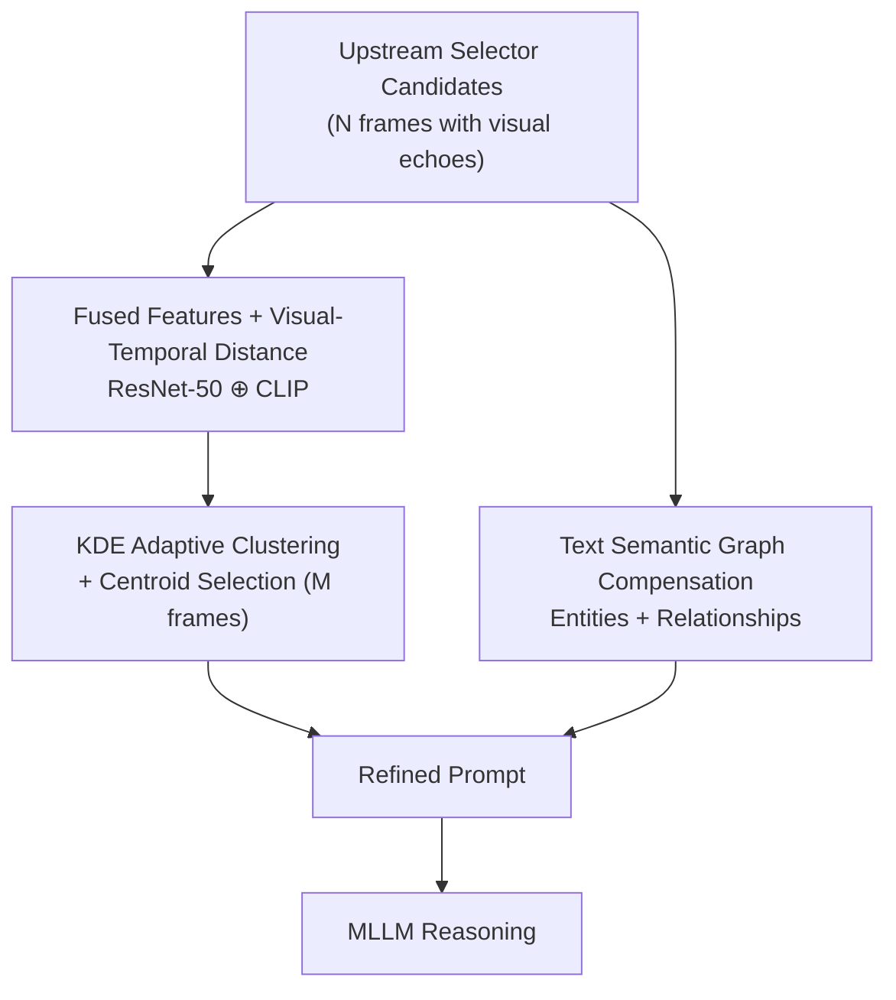

# Less is More: Token-Efficient Video-QA via Adaptive Frame-Pruning and Semantic Graph Integration

**Conference**: CVPR 2026  
**arXiv**: [2508.03337](https://arxiv.org/abs/2508.03337)  
**Code**: https://github.com/shaoguangwang/Adaptive-Frame-Pruning (Available)  
**Area**: Video Understanding / Multimodal VLM / LLM Efficiency  
**Keywords**: Video-QA, Keyframe Pruning, Visual Redundancy, Text Semantic Graph, Token Efficiency

## TL;DR
Addressing the pervasive "visual echoes" (temporally-proximate near-duplicate frames) generated by keyframe selectors in Video-QA, this paper proposes a plug-and-play refinement layer. By using Adaptive Frame Pruning (AFP) to cluster and merge redundant frames and a lightweight text semantic graph to compensate for pruned semantics, the method reduces input tokens by up to 82.2% while frequently improving the accuracy of upstream selectors.

## Background & Motivation

**Background**: When applying Multimodal Large Language Models (MLLMs) to Video-QA, each frame consumes significant visual tokens—based on OpenAI pricing, one low-resolution image takes 85 tokens. A one-hour video sampled at 1 fps yields 3600 frames, far exceeding context windows. Consequently, **query-aware keyframe selection** (e.g., AKS, T*, VSLS) has become the mainstream preprocessing step, picking Top-K candidates for the MLLM.

**Limitations of Prior Work**: The authors observed that even SOTA selectors often choose frames that are **temporally proximate and visually highly similar**, termed **"visual echoes."** For example, in a 32-frame selection, objects like Mount Fuji, a seated person, or a red Torii gate might appear in multiple nearly identical frames.

**Key Challenge**: To avoid missing decisive moments (maximizing recall), selectors are designed to be "inclusive," leading to redundancy. Excessive visual information causes **"context dilution"**, where noise overwhelms the reasoning capability of the MLLM, resulting in the **"less is more" paradox** where more frames lead to worse performance. Empirical tests on LongVideoBench show that GPT-4o using a well-designed AKS* (47.0%) actually underperforms compared to simple uniform sampling (47.1%) when using 8 frames.

**Goal**: Refine a redundant, noisy set of initial keyframes into a prompt that is both **visually concise and semantically complete**. This is framed as two sub-problems: (1) how to remove visual echoes; (2) how to cost-effectively compensate for lost semantics during pruning.

**Key Insight**: Visual and text token costs are **asymmetric**. Pruning one frame saves ~85 tokens, while adding a text summary costs only a few dozen. Therefore, "pruning visual, adding text" is extremely economical on the token budget.

**Core Idea**: Use adaptive clustering to **prune** visual echoes (AFP) and a text semantic graph of a few dozen tokens to **compensate** for pruned entities and relationships, serving as a universal refinement layer for any upstream selector.

## Method

### Overall Architecture
The method acts as a refinement layer placed **after** any upstream selector, featuring parallel branches for **pruning and compensation**. The input consists of $N$ candidate frames (containing visual echoes), and the output is a refined prompt for the MLLM. The pruning branch (AFP) executes three steps: extracting fused features → adaptive clustering based on a joint "visual + temporal" distance → selecting one representative centroid frame per cluster, reducing $N$ frames to $M$ frames ($M \ll N$). Simultaneously, the compensation branch uses a text-only LLM call to generate an entity-relationship semantic graph based solely on the question and options.

### Key Designs

**1. Fused Features + Visual-Temporal Joint Distance: Precise Echo Identification**

To prune visual echoes, one must measure how "similar" two frames are. Pixels alone may misidentify distant frames with similar appearances, while high-level semantics might miss detailed differences. AFP extracts dual features: ResNet-50 for low-level visual patterns and CLIP ViT-B/32 for high-level semantics. These are projected to 512D, L2-normalized, and fused: $\mathbf{f}_{\text{fused}}=(1-\alpha)\cdot\mathbf{f}_{\text{ResNet}}+\alpha\cdot\mathbf{f}_{\text{CLIP}}$ (with $\alpha=0.6$ in main experiments). The distance $D(i,j)$ between frames $i, j$ further incorporates **temporal proximity**: $D(i,j)=\beta\cdot d_{\cos}(\mathbf{f}_i,\mathbf{f}_j)+(1-\beta)\cdot d_{\text{temp}}(t_i,t_j)$, where $d_{\cos}$ is cosine distance and $d_{\text{temp}}$ is normalized timestamp difference, with $\beta=0.9$. This ensures only frames that are **both visually similar and temporally close** are clustered as echoes.

**2. KDE Adaptive Threshold Clustering + Centroid Selection: Content-Driven Pruning**

Redundancy levels vary across videos. Fixed cluster numbers ($K$) risk over-pruning or leaving noise. AFP employs Agglomerative Clustering with an **adaptive** threshold $\tau$. Using Gaussian Kernel Density Estimation (KDE) on all $d_{\cos}$ pairs, the algorithm identifies the distribution peak (the "most common frame distance" in the video) and sets $\tau$ slightly above it. The pruning intensity thus adapts to the video's own similarity structure. For representative frame selection, the **centroid strategy** is used: selecting the frame with the minimum average visual distance to others within the cluster: $k^*=\arg\min_{k_i\in C_j}\sum_{k_m\in C_j} d_{\cos}(\mathbf{f}_i,\mathbf{f}_m)$. This allows AFP to be selector-agnostic.

**3. Lightweight Text Semantic Graph Compensation: Low-Cost Semantic Recovery**

Pruning might inadvertently remove critical semantics. Using the asymmetric cost of "pruning visual, adding text," the compensation branch uses a **text-only** LLM (seeing only the question and options) to generate a semantic graph. This performs **entity anchoring** (identifying query-relevant objects/characters) and **relationship scaffolding** (summarizing logical or physical relations). Injecting this structured text into the prompt pre-activates the MLLM's reasoning path. When refining 32 frames from AKS*, AFP reduces visual tokens from ~2877 to ~505, while the graph adds only ~60 tokens. By focusing on explicit entity/relation extraction from text inputs, the risk of hallucination is minimized (human audit shows 98% entity accuracy).

### Loss & Training
This is a **training-free** inference-time refinement layer. ResNet-50 and CLIP are frozen pre-trained models. Clustering and KDE are non-parametric. The semantic graph is generated via a zero-shot LLM call. Hyperparameters $\alpha=0.6$ and $\beta=0.9$ provide a balanced trade-off between performance and efficiency.

## Key Experimental Results

Datasets: LongVideoBench and VideoMME. MLLMs: GPT-4o, Qwen2.5-VL-7B, LLaVA-Video-7B. Upstream selector: AKS*. Token cost: $\overline{T}=\frac{1}{N}\sum_i (T_i^{\text{text}}+85\cdot F_i)$.

### Main Results
On LongVideoBench, starting from AKS* Top-32 keyframes, accuracy (%) is reported by video length (Long/Medium/Short); Avg. Frames denotes average frames used:

| Model + Method | Avg. Frames | Long | Medium | Short |
|------|------|------|------|------|
| GPT-4o + Uniform | 32.0 | 50.6 | 53.5 | 74.0 |
| GPT-4o + AKS* | 32.0 | 47.0 | 49.2 | 58.0 |
| **GPT-4o + AFP+Graph** | **4.1** | 49.1 | 53.5 | **84.0** |
| LLaVA-Video-7B + Uniform | 32.0 | 41.7 | 46.2 | 40.0 |
| LLaVA-Video-7B + AKS* | 32.0 | 43.5 | 46.5 | 50.0 |
| **LLaVA-Video-7B + AFP+Graph** | **4.1** | **45.2** | **53.8** | **64.0** |

Key points: The method matches or exceeds the 32-frame baseline using only **4.1 frames** (~74% reduction). Open-source models benefit most—LLaVA-Video-7B on short videos improves from 50.0% to **64.0% (+14 pts)**, indicating high sensitivity to context dilution. Overall tokens on LongVideoBench Top-32 are reduced from **2877 to 568**.

### Ablation Study
Component-level ablation (GPT-4o, LongVideoBench, starting from AKS* Top-32):

| Config | Avg. Frames | Avg. Tok | Long | Med | Short |
|------|------|------|------|------|------|
| Text Only | 0.0 | 157.05 | 42.9 | 45.8 | 48.0 |
| Graph Only | 0.0 | 219.48 | 47.0 | 53.5 | 82.0 |
| Uniform (M) | 4.1 | 505.21 | 47.0 | 47.7 | 66.0 |
| AKS* (Top-M) | 4.1 | 505.21 | 43.5 | 45.8 | 62.0 |
| AFP only | 4.1 | 505.21 | 47.9 | 45.8 | 64.0 |
| **AFP + Graph** | 4.1 | 567.64 | **49.1** | **53.5** | **84.0** |

### Key Findings
- **AFP and Graph are complementary**: AFP alone improves some metrics, but the semantic graph is necessary to recover relationship clues lost during pruning.
- **"Less is More" paradox confirmed**: 8-frame AKS* (47.0%) losing to uniform sampling (47.1%) supports the theory that high-recall selectors dilute context with visual echoes.
- **Redundancy reduction**: Average Maximum Similarity (AMS) was reduced from ~0.950 to ~0.80 across various datasets.
- **Robustness in dense scenarios**: Improvements of +3.47% were maintained on the dynamic Video-HOLMES dataset.

## Highlights & Insights
- **The "visual echoes" terminology**: Effectively defines the problem of temporal redundancy in keyframe selection and links it to "context dilution."
- **Asymmetric token cost as a pivot**: The insight that "pruning visual tokens and adding text tokens" is a profitable trade-off is applicable to many multimodal compression scenarios.
- **Hallucination mitigation**: Generating semantic graphs from text alone (query and options) keeps costs low and limits hallucination (98% entity accuracy).
- **Plug-and-play**: As a training-free refinement layer, it provides immediate value for any upstream selector.

## Limitations & Future Work
- **Dependency on Upstream Quality**: As a refinement layer, it cannot recover frames if the upstream selector failed to recall them initially.
- **"Blind Generation" Risk**: The semantic graph is generated without seeing the video; for questions highly dependent on obscure visual details, the compensation might fail.
- **Hyperparameter Transferability**: While $\alpha$ and $\beta$ were determined via sensitivity analysis, their robustness across all possible domains requires further evidence.
- **Future Directions**: Conditioning semantic graphs on pruned frames or making KDE thresholds query-aware.

## Related Work & Insights
- **vs. AKS / T* / VSLS (Selectors)**: These solve "which frames to pick" (high recall); Ours acts as a **downstream refiner** for their redundancy.
- **vs. TRIM (Patch-level reduction)**: TRIM prunes patches within a frame; Ours operates at the **frame level**. They are orthogonal.
- **vs. Scene Graphs / CROSS**: Traditional scene graphs require GNNs or complex temporal modeling; Ours is a **lightweight, prompt-injected text graph** that is MLLM-compatible.

## Rating
- Novelty: ⭐⭐⭐⭐ (Well-defined "visual echoes" problem and clever asymmetric cost solution)
- Experimental Thoroughness: ⭐⭐⭐⭐ (Multiple benchmarks, MLLMs, and redundancy quantification)
- Writing Quality: ⭐⭐⭐⭐ (Clear terminology and self-consistent logic)
- Value: ⭐⭐⭐⭐ (Plug-and-play, training-free, and high efficiency gains)

<!-- RELATED:START -->

## Related Papers

- [\[CVPR 2026\] UTPTrack: Towards Simple and Unified Token Pruning for Visual Tracking](utptrack_towards_simple_and_unified_token_pruning_for_visual_tracking.md)
- [\[CVPR 2026\] GIFT: Global Irreplaceability Frame Targeting for Efficient Video Understanding](gift_global_irreplaceability_frame_targeting_for_efficient_video_understanding.md)
- [\[CVPR 2026\] Efficient Frame Selection for Long Video Understanding via Reinforcement Learning](efficient_frame_selection_for_long_video_understanding_via_reinforcement_learnin.md)
- [\[CVPR 2026\] An Efficient Token Compression Framework for Visual Object Tracking](an_efficient_token_compression_framework_for_visual_object_tracking.md)
- [\[CVPR 2026\] HERBench: A Benchmark for Multi-Evidence Integration in Video Question Answering](herbench_a_benchmark_for_multi-evidence_integration_in_video_question_answering.md)

<!-- RELATED:END -->
