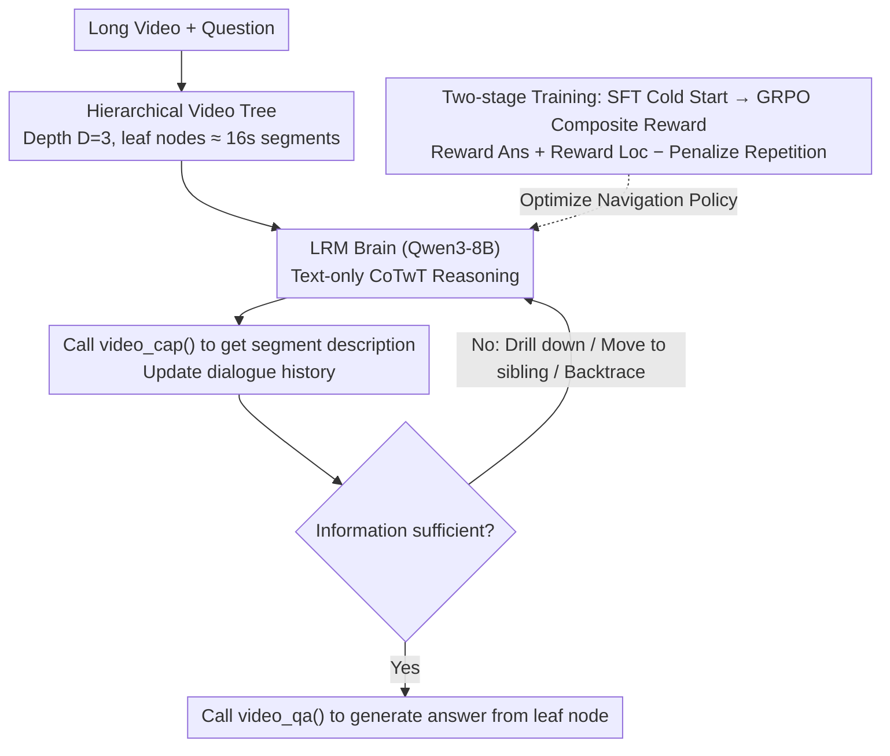

# LongVideo-R1: Smart Navigation for Low-cost Long Video Understanding

**Conference**: CVPR2026  
**arXiv**: [2602.20913](https://arxiv.org/abs/2602.20913)  
**Code**: [qiujihao19/LongVideo-R1](https://github.com/qiujihao19/LongVideo-R1)  
**Area**: Video Understanding  
**Keywords**: Long Video Understanding, Intelligent Navigation, Multimodal Agent, Hierarchical Reasoning, Reinforcement Learning, Chain-of-Thought

## TL;DR

LongVideo-R1 is proposed as a multimodal Agent equipped with reasoning capabilities. Utilizing a hierarchical video tree structure and an intelligent navigation strategy, it achieves efficient long video question answering with an average of only 10.5 tool calls, significantly outperforming exhaustive methods in the accuracy-efficiency trade-off.

## Background & Motivation

1.  **Computational Bottlenecks in Long Video Understanding**: Current MLLMs are limited by finite context windows and cannot directly process 1-2 hour videos. They rely on brute-force pipelines (segmentation → sequential processing → aggregation), where computational costs grow linearly with video duration.
2.  **Inefficiency of Existing Methods**: While methods like Ego-R1 and VideoTree achieve decent accuracy, they require exhaustive processing of all or numerous video segments (e.g., Ego-R1 generates a caption every 30 seconds, requiring 86 captions on average), leading to prohibitive latency.
3.  **Restricted Real-world Deployment**: High computational costs severely hinder the deployment of long-video MLLMs in real-world scenarios such as embodied Agents (requiring low-latency responses) and high-throughput video chat services.
4.  **Neglect of Accuracy-Efficiency Trade-off**: Existing works almost exclusively optimize QA accuracy, lacking formal measurement and optimization of the computational budget.
5.  **Inspiration from Human Search Strategies**: Humans do not watch long videos frame-by-frame. Instead, they view a general summary and then "drill down" into segments of interest based on the question. This active, goal-oriented strategy is far more efficient than exhaustive scanning.
6.  **Maturity of Large Reasoning Models**: LRMs (e.g., Qwen3-8B) and the CoT reasoning paradigm provide the technical foundation for training Agents capable of autonomously deciding "when to stop and where to look."

## Method

### Overall Architecture

LongVideo-R1 addresses the computational pain points of long video understanding. Conventional brute-force pipelines segment the entire video and process it piece by piece, causing costs to explode linearly with duration. Instead, it adopts an active navigation approach—similar to how humans first scan a summary and then target segments of interest. The long video is organized into a multi-layered tree with depth $D=3$. Each non-leaf node has $K = \text{round}(\sqrt[D]{T/16s})$ child nodes, and leaf nodes correspond to approximately 16-second short segments. An LRM (fine-tuned Qwen3-8B) acts as the brain, equipped with two multimodal tools for Chain-of-Thought-with-Tool (CoTwT) reasoning. It iterates in a closed loop of "retrieve description → judge information sufficiency → navigate to the next segment if insufficient," completing a question with an average of only ~10.5 calls.

### Key Designs

**1. Hierarchical Video Tree: Replacing "Sequential Scanning" with "On-demand Drilling"**

Linear scanning is expensive because it processes every segment without prioritization. LongVideo-R1 builds a video tree: depth $D=3$, each non-leaf node has $K = \text{round}(\sqrt[D]{T/16s})$ child nodes, and leaf nodes are ~16s. This tree provides a navigation space for the Agent to refine its search from root to leaf. It can observe a global summary at the root node and then drill down only into relevant branches, ignoring unrelated segments. Computational complexity is thus reduced from linear scanning to roughly a dozen navigation rounds.

**2. Text-only CoTwT + Two Multimodal Tools: Decoupling Planning from Observation**

To enable a text-based reasoning model to navigate video, "seeing" and "thinking" must be decoupled. LongVideo-R1 equips the LRM with two tools: `video_cap()` receives a segment at any level and outputs a text description (generated by Qwen2.5-VL-72B) to provide global/local context; `video_qa()` is called only at the leaf nodes (executed by Qwen2.5-VL-32B) to provide the final answer for specific questions. The entire reasoning process occurs in pure text, with multimodal components treated as external function calls, allowing the LRM to focus on "when to stop and where to look."

**3. GRPO Composite Reward: Rewarding Accuracy/Localization and Punishing Redundancy**

Rewarding only the final answer prevents the model from learning how to find evidence "efficiently." During the GRPO stage, a composite reward $$R = w_{\text{ans}} \cdot r_{\text{ans}} + w_{\text{loc}} \cdot r_{\text{loc}} + w_{\text{repeat}} \cdot r_{\text{repeat}}$$ is used to shape navigation: $r_{\text{ans}}$ is 1 for a correct answer and 0 otherwise; $r_{\text{loc}}$ uses F1 to measure the coverage and precision of accessed time slots against Ground Truth (GT) key segments, encouraging hits while punishing redundancy; $r_{\text{repeat}}$ penalizes repeated visits to the same segment. Ablations show that removing $r_{\text{loc}}$ results in a 4.2% AUC drop, identifying localization rewards as a key source of efficiency.

### A Complete Example

Given a long video and a question, the Agent proceeds as follows: It starts at the root node (full video) to get a top-level caption. The LRM reasons based on the accumulated context to judge if the information is sufficient. If not, it decides on a navigation direction—drilling down to child segments, traversing sibling nodes, or backtracing to a higher level. It calls `video_cap()` to retrieve the target segment's description and updates the dialogue history. This repeats until the LRM deems the information sufficient to call `video_qa()` for the answer or reaches the maximum number of rounds. The process averages ~10.5 rounds (compared to Ego-R1's average of 86 segments), using only ~1/8 of the computational cost.

### Loss & Training

For data, 800 videos and 5.6K QA pairs from CG-Bench (with clue-grounded annotations) were used. Qwen2.5-VL-72B pre-extracted captions for various levels (256/128/64/32 frame sampling), and GPT-5 generated zero-shot CoTwT trajectories. When zero-shot failed, clue-grounded annotations provided step-by-step hints. Finally, 5.6K trajectories (averaging 5.8 steps) were expanded into ~33K SFT samples. Training involves two stages: first, SFT cold start on Qwen3-8B for 3 epochs to learn the structured format of `<think>...</think>` + `<tool>...</tool>` + `<answer>...</answer>`; followed by GRPO reinforcement learning for 2 epochs using the composite reward to optimize the navigation strategy.

## Key Experimental Results

### Main Results

| Benchmark | LongVideo-R1 | LongVideo-R1 (new) | Prev. SOTA |
|-----------|--------------|-------------------|------------|
| LVBench Overall | 50.0% | **60.7%** | AdaReTake-72B: 53.3% |
| LVBench-TG (Temporal Grounding) | **56.4%** | 62.7% | AdaReTake-72B: 45.5% |
| LVBench-KIR (Key Info Retrieval) | 56.4% | **70.1%** | AdaReTake-72B: 62.2% |
| MLVU | 68.1% | **71.3%** | VideoChat-Flash-7B: 74.7% |
| Video-MME-Long (w/ sub) | 64.4% | **68.6%** | Ego-R1: 64.9% |

- On LVBench, the 8B LongVideo-R1 outperforms GPT-4o (48.9%) and GLM-4V-plus (48.7%).
- **Temporal Grounding (TG) sub-task reaches 56.4%, leading the runner-up by 10.9 percentage points.**
- Upgrading the caption tool to Qwen3-VL-32B-Instruct improves overall accuracy to 60.7%.

### Efficiency Comparison

| Metric | LongVideo-R1 | Ego-R1 |
|--------|--------------|--------|
| Video-MME Avg. Caption Segments | **10.5 rounds** | 86 segments |
| LVBench Time per Question | **~3 minutes** | Significantly longer |

### Ablation Study

| Ablation Item | LVBench | Video-MME/L |
|---------------|---------|-------------|
| SFT only (10K) | 39.1% | 57.7% |
| SFT only (full 33K) | 41.6% | 59.2% |
| + RL (10K data) | 47.4% | 60.2% |
| + RL (full data, final model) | **50.0%** | **64.4%** |
| w/o $r_{\text{loc}}$ | 45.8% | 61.4% |

- Increasing SFT data from 10K to 33K yields +2.5% on LVBench; adding RL yields an additional +8.4%.
- The localization reward $r_{\text{loc}}$ contributes +4.2% on LVBench and +3.0% on Video-MME.
- Increasing max rounds from 10 to 30 improves LVBench from 43.0% to 50.0%, but time increases from 104s to 176s.

## Highlights & Insights

1.  **Valuable Problem Definition**: Formulates the problem of "long video understanding under a low computational budget" for the first time, proposing a Pareto-optimal research direction for accuracy and efficiency.
2.  **Elegant Design Intuition**: The hierarchical video tree + active reasoning navigation simulates the human "global-to-local" video understanding strategy.
3.  **Significant Efficiency Advantage**: Requires an average of only 10.5 rounds to complete QA, using ~1/8 the computation of Ego-R1 while maintaining comparable or superior accuracy.
4.  **Ultra-long Video Capability**: Capable of completing QA in 10-20 rounds even for TV series spanning dozens of hours, where linear scanning methods are unfeasible.
5.  **Clever Data Construction**: Utilizes grounding annotations from CG-Bench to prompt GPT-5 step-by-step, ensuring correctness while minimizing hint leakage.
6.  **Fully Open Source**: LRM is based on Qwen3-8B and tools are based on the Qwen2.5-VL series, allowing for full local deployment.

## Limitations & Future Work

1.  **Non-optimal Uniform Partitioning**: The video tree uses equal-length segments; semantically similar content may fall into adjacent sub-segments, increasing localization ambiguity.
2.  **Limited Tool Types**: Only `caption` and `qa` tools are provided, lacking fine-grained tools like instance recognition or segment partitioning.
3.  **Underperformance on Global Questions**: On MLVU (containing short videos) and Video-MME (containing "video gist" global questions), it lags behind uniform sampling methods because these questions do not require precise localization.
4.  **Misguided Navigation**: The LRM is sometimes "attracted" to semantically related but irrelevant segments, falling into wrong areas and requiring human hints to correct.
5.  **Single Question Assumption**: Assumes each QA is processed independently, without considering scenarios where multiple questions share a video index to amortize initial overhead.
6.  **Dependency on Caption Quality**: Framework performance relies heavily on the quality of video description tools; inaccurate descriptions cause error propagation in reasoning.

## Related Work

| Method | Type | LVBench | Computation | Limitations |
|--------|------|---------|-------------|-------------|
| VideoAgent | Agent | 29.3% | Exhaustive+GPT | Low accuracy |
| VideoTree | Agent | 28.8% | Tree Exhaustive | Linear complexity |
| MemVid | Agent | 44.4% | Memory-Aug | Weak on some sub-tasks |
| Ego-R1 | Agent+RL | ~64.9%(VME) | Caption every 30s | High computational cost |
| AdaReTake-72B | MLLM | 53.3% | Adaptive Sampling | 72B Large Model |
| **LongVideo-R1** | **Agent+RL** | **50.0%** | **~10 rounds nav.** | **Weak on global Qs** |

## Rating

- Novelty: ⭐⭐⭐⭐ — The problem definition of "low-cost long video understanding" and the hierarchical active navigation framework are distinctly innovative.
- Experimental Thoroughness: ⭐⭐⭐⭐ — Includes three major benchmarks + ultra-long video cases + multi-dimensional ablations (data volume/reward/tool scale/max rounds).
- Writing Quality: ⭐⭐⭐⭐ — Clear motivation, complete method description, and standardized algorithm pseudocode.
- Value: ⭐⭐⭐⭐⭐ — Addresses the core efficiency pain point of long video Agents; open-source and reproducible with direct significance for practical deployment.

<!-- RELATED:START -->

## Related Papers

- [\[CVPR 2026\] Toward Low-Cost yet Effective Temporal Learning for UAV Tracking](toward_low-cost_yet_effective_temporal_learning_for_uav_tracking.md)
- [\[CVPR 2026\] Efficient Frame Selection for Long Video Understanding via Reinforcement Learning](efficient_frame_selection_for_long_video_understanding_via_reinforcement_learnin.md)
- [\[CVPR 2026\] Dual-Agent Reinforcement Learning for Adaptive and Cost-Aware Visual-Inertial Odometry](dual-agent_reinforcement_learning_for_adaptive_and_cost-aware_visual-inertial_od.md)
- [\[CVPR 2026\] Video Panels for Long Video Understanding](video_panels_for_long_video_understanding.md)
- [\[CVPR 2026\] Wavelet-based Frame Selection by Detecting Semantic Boundary for Long Video Understanding](wavelet-based_frame_selection_by_detecting_semantic_boundary_for_long_video_unde.md)

<!-- RELATED:END -->
