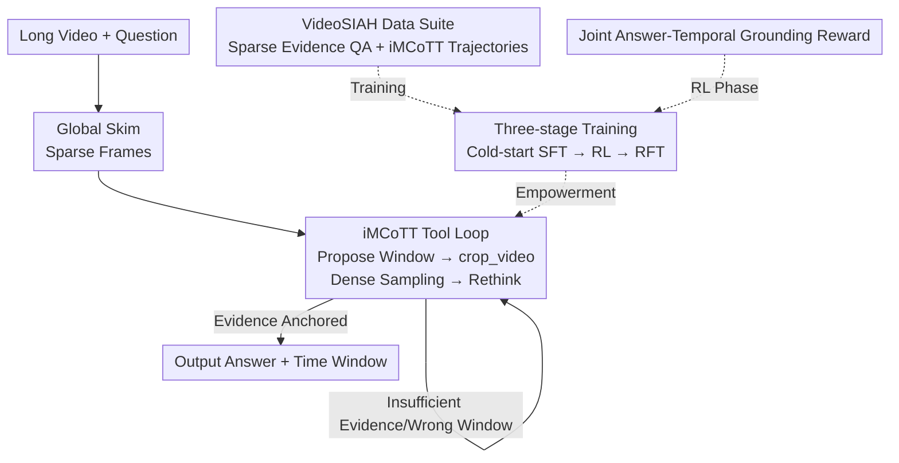

# LongVT: Incentivizing "Thinking with Long Videos" via Native Tool Calling

**Conference**: CVPR2026  
**arXiv**: [2511.20785](https://arxiv.org/abs/2511.20785)  
**Code**: https://github.com/EvolvingLMMs-Lab/LongVT  
**Area**: Video Understanding / Multimodal VLM / LLM Reasoning  
**Keywords**: Long Video Reasoning, Agents, Tool Calling, Temporal Grounding, Reinforcement Learning  

## TL;DR
LongVT enables multimodal large language models to process long videos by emulating the human strategy of "global skimming followed by zooming into suspicious clips." It encapsulates the model's inherent temporal grounding capability into a native `crop_video` tool, which is interleaved within the reasoning chain to iteratively "re-examine" and correct errors. Supported by the self-constructed VideoSIAH data suite and a three-stage training pipeline, it achieves new open-source SOTA results across four long-video benchmarks.

## Background & Motivation
**Background**: Current mainstream video reasoning follows the R1 paradigm—first performing Supervised Fine-Tuning (SFT) with text-based Chain-of-Thought (CoT), followed by Reinforcement Learning (RL) using GRPO. While models perform well on short clips of tens of seconds, they struggle with long videos exceeding 15 minutes or containing thousands of frames.

**Limitations of Prior Work**: Two critical flaws exist. First, the reasoning process is "language-centric"—the model repeatedly rewrites and talks to itself in text without truly returning to the visual content, leading to severe hallucinations in long videos. Second, uniform sampling is typically used for long videos; sparse frames easily miss the crucial moments required for an answer, as evidence is often sparse and temporally scattered.

**Key Challenge**: The fundamental difficulty of long video reasoning is "Video Segment-In-A-Haystack"—decisive evidence is hidden within a narrow time window inside hours of footage. However, constrained by context length, models cannot inspect every frame in detail, while sparse uniform sampling sacrifices critical details. A fundamental conflict exists between "seeing the whole" and "seeing clearly."

**Goal**: To enable an LMM to decide which parts to skip-scan and which to zoom-in on, similar to how a human searches a silent football recording for a specific goal. Every step of reasoning should be anchored to "truly perceived visuals." This decomposes into three capabilities: proposing precise time windows, reasoning over densely sampled frames within those windows, and self-correcting when a window is misplaced.

**Key Insight**: Humans understand long videos by "roughly skipping to find strong signals (crowd cheering, player celebrations, scoreboard changes), then backtracking to lock onto the specific moment." Projecting this global-to-local strategy onto LMMs allows limited context to handle ultra-long videos. Conveniently, LMMs possess latent temporal grounding capabilities, eliminating the need for external expert models or retrievers.

**Core Idea**: To activate the model's inherent temporal grounding capability as a **native** video cropping tool, creating an interleaved loop of "propose time window → fetch segment → rethink → decide to refine or answer"—termed the Interleaved Multimodal Chain-of-Tool-Thought (iMCoTT).

## Method

### Overall Architecture
LongVT is an end-to-end agentic framework. Given a long video and an open-ended question, the model first performs a "skim" of global sparse frames. During reasoning, it autonomously calls the `crop_video(start_time, end_time)` tool: it proposes a time window based on current understanding, actively re-samples that window at a finer frame rate, and "thinks again" based on new evidence to decide whether to further narrow the window or answer directly. This global-to-local "hypothesize-verify" cycle continues until the answer is supported by retrieved visual evidence.

To enable a base model (Qwen2.5-VL-7B) to learn this behavior, two pillars are required: the **VideoSIAH** data suite (providing tool-augmented reasoning trajectories and sparse-evidence QA) and a **three-stage training** process (Cold-start SFT → Agent RL → RFT). In the RL stage, a **joint answer-temporal grounding reward** optimizes "answering correctly" and "locating accurately" simultaneously.

### Key Designs

**1. iMCoTT: Transforming temporal grounding into a native crop_video tool to anchor reasoning to visuals**

To address the issue where text-centric CoT merely rewrites text without inspecting visuals, leading to hallucinations, the authors designed the Interleaved Multimodal Chain-of-Tool-Thought. Unlike traditional text-only CoT, iMCoTT inserts calls to `crop_video(start_time, end_time)` into the reasoning flow. The model proposes a window after a global preview, re-samples that clip at a higher frame rate, and re-evaluates. Crucially, this tool is not an external retriever but an **activation of the model's own temporal grounding potential** through tool-integrated fine-tuning. This anchors every reasoning step to "actually seen content," suppressing hallucinations and fostering human-like self-reflection.

**2. VideoSIAH: A dataset tailored for "sparse-evidence long video reasoning" with length-adaptive tool trajectories**

The community lacks such fine-grained data; existing tool-augmented LMMs are often trained on coarse-grained, clip-level data. Furthermore, most video benchmarks use multiple-choice questions, which can be guessed without true temporal grounding. The authors built VideoSIAH using a semi-automated human-in-the-loop pipeline: long videos are segmented using pixel-level scene detection, and units shorter than 10 seconds are merged for semantic stability. Qwen2.5-VL-72B generates detailed descriptions for each segment, followed by "Text QA Filtering (removing leakage) + Multimodal QA Filtering (GLM-4.5V verification)." A key innovation is **adaptive multi-round sampling probability based on video length**:

$$P_{\text{multi}}=1-\frac{L_{\max}-\operatorname{clip}(L_{\text{video}},L_{\min},L_{\max})}{L_{\max}-L_{\min}}$$

where $L_{\text{video}}$ is the video duration, and $L_{\min}/L_{\max}$ are thresholds. Longer videos have a higher probability of being selected for multi-round tool calling, ensuring proportional coverage. The suite includes ~247.9K cold-start SFT samples, 1.6K RL samples, 15.4K RFT samples, and a human-verified 652-item benchmark, VideoSIAH-Eval (average length ~1688s).

**3. Three-stage training: Cold-start SFT for foundations, RL for exploration, and RFT for behavior stabilization**

The authors found that running RL directly on Qwen2.5-VL-7B led to **performance degradation** due to weak native tool-calling abilities. The three stages were designed as follows: ① **Cold-start SFT** teaches the model basic skills—proposing precise windows, reasoning over dense frames, and self-correction. ② **Agent RL** (GRPO) treats the model as an agent deciding when and where to look, improving open-ended QA generalization. ③ **Agent RFT** selects high-quality trajectories (correct answer and accurate grounding) from early RL as privileged demonstrations for self-distillation. This stabilizes agentic behavior and consolidates fine-grained localization.

**4. Joint Answer-Temporal Grounding Reward: Coupling "answering" with "locating"**

While previous works separate answer and temporal alignment rewards, this work unifies three components for the $k$-th rollout: **Answer Accuracy** $R_{\text{acc}}^{(k)}$ via LLM-as-a-Judge (Full=1, Partial=0.5, Incorrect=0); **Format Compliance** $R_{\text{format}}^{(k)}$ (1 if schema-correct); and **Temporal Overlap** $R_{\text{time}}^{(k)}=\text{IoU}^{(k)}$ between predicted window $[t_s,t_e]$ and ground truth $[t_s',t_e']$. Total reward $R^{(k)}=R_{\text{acc}}^{(k)}+R_{\text{format}}^{(k)}+R_{\text{time}}^{(k)}$. This coupling ties the answer choice to its temporal evidence, improving accuracy and encouraging more effective tool usage and precise timestamps. The authors verified that using Recall as a temporal reward leads to reward hacking, where the model widens windows to inflate Recall.

### Mechanism Example
Consider the question: "In this silent football recording, which foot did the French player use to score the equalizer?" Using iMCoTT: The model performs a global skim to find strong signals (cheering, celebrations) → proposes a suspected goal period and calls `crop_video` to re-sample → observes a celebration but cannot see the foot clearly, thus "looks again" by narrowing the window and re-sampling a close-up → locks onto the contact moment and confirms the foot → outputs the answer with sufficient evidence.

## Key Experimental Results

### Main Results
Using Qwen2.5-VL-7B as the base, evaluation was conducted on four benchmarks. The table below shows performance under dense frame sampling:

| Model | VideoMME(w/sub) | VideoMMMU(perception) | LVBench | VideoSIAH-Eval | Average |
|------|------|------|------|------|------|
| Qwen2.5-VL-7B (Base) | 64.3 | 54.7 | 40.9 | 33.8 | 46.0 |
| Video-Thinker-7B | 60.8 | 55.3 | 54.3 | 6.6 | 42.9 |
| VideoRFT-7B | 49.2 | 48.7 | 18.7 | 26.9 | 37.0 |
| **LongVT-7B-SFT** | 64.9 | 49.7 | 41.1 | 34.8 | 44.1 |
| **LongVT-7B-RL** | 66.1 | 56.3 | 41.4 | 35.9 | 46.6 |
| **LongVT-7B-RFT** | **67.0** | **56.7** | 41.3 | **42.0** | **47.7** |

On VideoSIAH-Eval, which best reflects "sparse evidence retrieval," LongVT-7B-RFT reached 42.0, outperforming the next best model by 6 points. Its average score of 47.7 sets a new open-source SOTA.

### Ablation Study
| Configuration | VideoSIAH-Eval | Average | Description |
|------|------|------|------|
| SFT w/o iMCoTT | 4.1 | 24.8 | Removing tool trajectories collapses long video understanding |
| SFT w/ iMCoTT (LongVT-SFT) | 34.8 | 44.1 | Complete SFT phase |
| RL w/o self-constructed QA | 30.8 | 40.4 | Removing sparse evidence QA weakens grounding |
| RL only (No SFT cold-start) | 28.2 | 41.9 | Direct RL results in poor localization |
| SFT+RL (LongVT-RL) | 35.9 | 46.6 | RL shows steady improvement after cold-start |
| SFT+RL+RFT (LongVT-RFT) | 42.0 | 47.7 | RFT breaks the SFT ceiling |

### Key Findings
- **Self-constructed fine-grained data is vital**: Removing iMCoTT from SFT caused VideoSIAH-Eval to plummet from 34.8 to 4.1, indicating that tool-augmented trajectories provide previously missing supervision for hypothesis formation and verification.
- **Cold-start SFT is indispensable**: Direct RL on the base model fails due to weak native tool-calling; SFT prepares the foundation.
- **RFT provides breakthrough supervision**: Re-injecting high-quality RL trajectories (correct answer and IoU $\ge$ 0.3) pushed VideoSIAH-Eval from 35.9 to 42.0.
- **Rewards must be "strict on boundaries"**: IoU rewards prevent the reward hacking observed with Recall rewards.

## Highlights & Insights
- **Turning "Tools" into Native Capabilities**: `crop_video` reuses the LMM's latent temporal grounding, unified within the same model through fine-tuning, avoiding external retrievers.
- **Length-Adaptive Data Generation**: The $P_{\text{multi}}$ strategy cleverly allocates supervision budgets to long videos where multi-round retrieval is most needed.
- **Coupled Reward Design**: Tying the answer to the temporal evidence location prevents the model from speculating between split objectives.
- **Three-stage Self-distillation (SFT→RL→RFT)**: This paradigm allows a model to surpass pure SFT performance by recycling its own high-quality RL experiences.

## Limitations & Future Work
- **Reliance on Base Grounding Potential**: The method assumes the base model has latent grounding capabilities to be "activated."
- **Dependency on Closed-Source Models**: The data pipeline relies heavily on models like Qwen2.5-VL-72B and GLM-4.5V for generation and verification.
- **Benchmark Vulnerability**: An earlier version of VideoSIAH-Eval contained duplicate entries; though cleaned to 652 items, it highlights the fragility of automated data pipelines.
- **Single-axis Scaling**: `crop_video` focuses on temporal zooming; future work could extend this to spatial zooming or cross-modal (audio) cues.

## Related Work & Insights
- **vs. VITAL**: Both use tool-augmented RL, but LongVT focuses on the segment-in-a-haystack setting, provides large-scale high-quality data, and introduces the SFT→RL→RFT pipeline.
- **vs. R1 Paradigms (Video-R1, VideoRFT)**: These use pure text CoT and uniform sampling, lacking fine-grained evidence capture. LongVT reduces hallucinations through visual anchoring.
- **vs. Image-side Tools**: LongVT extends the concept of spatial zooming/cropping in images to the temporal dimension.

## Rating
- Novelty: ⭐⭐⭐⭐⭐ Activating grounding as a native tool + three-stage loop establishes a new paradigm for "thinking with videos."
- Experimental Thoroughness: ⭐⭐⭐⭐ Solid results across four benchmarks and three ablation groups, though direct comparison with concurrent tool-based methods is missing.
- Writing Quality: ⭐⭐⭐⭐⭐ Excellent motivation and clear procedural descriptions.
- Value: ⭐⭐⭐⭐⭐ Open-source SOTA with released code/data/weights; VideoSIAH is a valuable contribution to the community.

<!-- RELATED:START -->

## Related Papers

- [\[CVPR 2026\] VideoSeek: Long-Horizon Video Agent with Tool-Guided Seeking](videoseek_long-horizon_video_agent_with_tool-guided_seeking.md)
- [\[CVPR 2026\] Thinking with Drafts: Speculative Temporal Reasoning for Efficient Long Video Understanding](thinking_with_drafts_speculative_temporal_reasoning_for_efficient_long_video_und.md)
- [\[CVPR 2026\] META: Meta Evolution of Tool Trajectory Adaptation for Long-Video Understanding](meta_meta_evolution_of_tool_trajectory_adaptation_for_long-video_understanding.md)
- [\[CVPR 2026\] Incentivizing Versatile Video Reasoning in MLLMs via Data-Efficient Reinforcement Learning](incentivizing_versatile_video_reasoning_in_mllms_via_data-efficient_reinforcemen.md)
- [\[CVPR 2025\] T*: Re-thinking Temporal Search for Long-Form Video Understanding](../../CVPR2025/video_understanding/re-thinking_temporal_search_for_long-form_video_understanding.md)

<!-- RELATED:END -->
