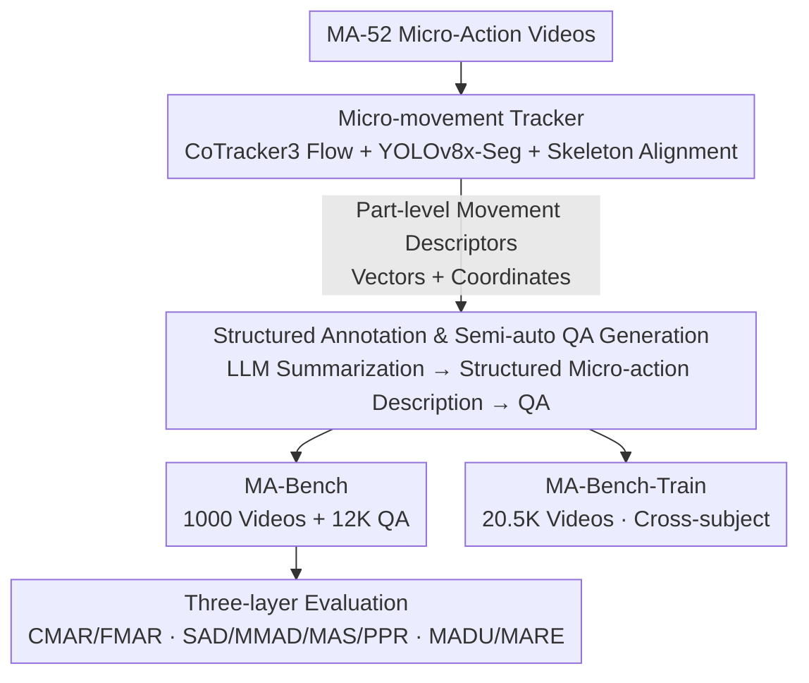

# MA-Bench: Towards Fine-grained Micro-Action Understanding

**Conference**: CVPR 2026  
**arXiv**: [2603.26586](https://arxiv.org/abs/2603.26586)  
**Code**: [https://MA-Bench.github.io](https://MA-Bench.github.io)  
**Area**: Video Understanding / Multimodal VLM  
**Keywords**: Micro-action understanding, Fine-grained action recognition, Multimodal Large Model evaluation, Sentiment analysis, VideoQA

## TL;DR

Ours proposes MA-Bench, a micro-action understanding benchmark containing 1,000 videos and 12,000 structured QA pairs. It systematically evaluates the fine-grained micro-action understanding capabilities of 23 MLLMs through a three-layer "Perception-Understanding-Reasoning" architecture and provides MA-Bench-Train (20.5K samples) for model fine-tuning.

## Background & Motivation

1. **Background**: Micro-actions are spontaneous, subtle body movements resulting from emotional changes, which are crucial for interpersonal interaction and emotional state analysis. Existing datasets like iMiGUE, SMG, and MA-52 primarily serve traditional classification models.
2. **Limitations of Prior Work**: While MLLMs are rapidly advancing in video understanding, micro-action understanding remains unexplored due to the lack of specialized evaluation benchmarks. Existing benchmarks (e.g., MVBench, Video-MME) focus on daily activities or long videos rather than fine-grained micro-actions.
3. **Key Challenge**: Micro-actions are extremely subtle (average duration of 2.12 seconds, involving local movements of fingers or the head), and it is unknown whether current MLLMs can capture such fine-grained dynamics.
4. **Goal**: (1) Build a benchmark specifically for evaluating MLLM micro-action understanding; (2) Design a multi-level evaluation system from perception to reasoning; (3) Provide training data to support model improvement.
5. **Key Insight**: Starting from the Micro-Action-52 dataset, movement descriptors are constructed using optical flow and skeleton information, followed by structured annotation generation using MLLMs.
6. **Core Idea**: To establish the first micro-action understanding benchmark for MLLMs, revealing significant deficiencies in current models regarding motion granularity and body part dynamics.

## Method

### Overall Architecture

MA-Bench addresses the subtlety of micro-actions (short duration, localized in fingers/head) which are easily missed by direct MLLM annotation. The pipeline starts from the Micro-Action-52 dataset and follows three steps: first, a micro-movement tracker extracts part-level descriptors (vectors + coordinates); second, this structured information is fed to an LLM with prompts to summarize part-level dynamics into structured micro-action descriptions and semi-automatically generate QA pairs; finally, QA pairs are organized into "Perception-Understanding-Reasoning" levels. The output includes the MA-Bench evaluation set (1,000 videos + 12K QA) and the MA-Bench-Train set (20.5K videos).

### Key Designs

**1. Micro-movement Tracker: Part-level signals instead of "raw video viewing"**  
The difficulty lies in movements scattered across body parts with tiny amplitudes. The tracker decomposes the video into part-level granularity: CoTracker3 extracts dense optical flow with four direction components; YOLOv8x-Seg segments human-centric regions; the flow is then aligned with skeleton data to generate descriptors containing movement vectors and spatial coordinates for the head, upper limbs, lower limbs, and torso.

**2. Structured Annotation & Semi-auto QA Generation: Converting descriptors to evaluatable text**  
Descriptors are language-ized by prompting LLMs (e.g., DeepSeek-v3.2, DeepSeek-R1) to summarize movement patterns into part-level descriptions, then integrated into structured micro-action descriptions. These serve as supervision for MA-Bench-Train and are rewritten into multiple-choice or binary QA pairs for MA-Bench, targeting perception or reasoning dimensions.

**3. Three-layer Evaluation Architecture: Decomposing capability into deep questions**  
The QA pairs are categorized into three levels. The Perception layer (CMAR/FMAR) asks "what was done" (coarse vs. fine recognition). The Understanding layer (SAD/MAS/MMAD/PPR) asks "how it was done" regarding spatio-temporal relationships and inter-part dynamics in a YES/NO format. The Reasoning layer (MADU/MARE) asks "why this judgment was made," requiring detailed movement descriptions and reasoning chains.

**4. MA-Bench-Train Corpus: Providing a path for improvement**  
To address the exposed flaws, 20.5K videos from 166 participants in MA-52 are paired with structured descriptions. A cross-subject design ensures that participants in the training and evaluation sets do not overlap, preventing the model from memorizing specific appearances and ensuring fair evaluation.

### Loss & Training

Evaluation is split by task type: closed-ended questions (CMAR/FMAR, etc.) use accuracy; open-ended questions (MADU/MARE) use VLM-as-a-judge to score 1–5 across three levels: L1 (description quality), L2 (movement details), and L3 (reasoning coherence). For fine-tuning, Qwen3-VL-8B is trained on MA-Bench-Train using standard instruction fine-tuning.

## Key Experimental Results

### Main Results

| Model | CMAR | FMAR | SAD | MMAD | MAS | PPR | AVG |
|------|------|------|-----|------|-----|-----|-----|
| Random | 14.7 | 20.0 | 50.0 | 50.0 | 50.0 | 50.0 | 39.05 |
| GPT-4o | 20.50 | 30.70 | 51.30 | 62.35 | 49.25 | 55.10 | 44.87 |
| Gemini-2.5-Flash | 43.00 | 31.40 | 56.55 | 60.50 | 55.50 | 57.25 | 50.70 |
| InternVideo2-Chat-8B | 22.90 | 28.10 | 57.60 | 58.95 | 55.80 | 49.00 | 45.39 |

### Ablation Study

| Configuration | Key Finding | Description |
|------|---------|------|
| Qwen3-VL-8B (Original) | Baseline level | Limited micro-action understanding |
| Qwen3-VL-8B + MA-Bench-Train | Significant MARE/MADU gain | Structured annotation fine-tuning is effective |
| Closed vs. Open questions | Closed questions near random | MLLMs struggle to distinguish fine-grained categories |
| Proprietary vs. Open-source | Gemini-2.5-Flash best (50.70%) | Proprietary models lead in the perception layer |

### Key Findings

- **MLLMs perform near random on micro-action recognition**: On the CMAR task (7 coarse categories), GPT-4o achieves only 20.50% (random is 14.7%), indicating current models fail to distinguish part-level movements.
- **Understanding level outperforms Perception level**: YES/NO relational tasks (e.g., SAD) show better performance than classification, suggesting models possess some local judgment capability but lack holistic classification ability.
- **Extremely low reasoning scores**: In the MARE task, most models score below 1/5 for L3 (Reasoning coherence), showing an inability to generate coherent reasoning chains.
- **Gemini-2.5-Flash leads significantly**: Reaching 43.00% on CMAR, it far exceeds GPT-4o, likely benefiting from stronger temporal modeling.

## Highlights & Insights

- The **movement descriptor-driven annotation strategy** is ingenious: instead of direct annotation, extracting precise motion info via flow/skeletons and then language-izing ensures high annotation quality.
- The **three-layer progressive evaluation design** is transferable to other fine-grained tasks (e.g., micro-expressions, gestures), providing a general evaluation paradigm.
- The **cross-subject design** adheres to behavioral analysis standards, ensuring the robustness and generalization of the evaluation.

## Limitations & Future Work

- Videos are restricted to psychological interview scenarios, limiting scene diversity (mostly seated).
- While 12,000 QA pairs are provided, the long-tail distribution across 52 categories may lead to insufficient evaluation of rare classes.
- Open-ended evaluation uses VLM-as-a-judge, which may carry its own biases regarding micro-movements.
- **Future Directions**: (1) Expansion to diverse scenes (social, classroom, etc.); (2) Incorporation of audio modality; (3) Designing specialized micro-action guidance modules for VLM architectures.

## Related Work & Insights

- **vs. MotionBench**: MotionBench focuses on general fine-grained motion, whereas MA-Bench focuses on the micro-action domain with higher quality, structured annotations.
- **vs. FAVOR-Bench**: While FAVOR-Bench emphasizes description detail, MA-Bench adds reasoning and relational layers.
- **vs. Micro-Action-52**: MA-52 is a traditional classification dataset; MA-Bench upgrades it into an MLLM evaluation benchmark, representing a paradigm shift.

## Rating

- Novelty: ⭐⭐⭐⭐ First MLLM micro-action benchmark with an innovative three-layer design.
- Experimental Thoroughness: ⭐⭐⭐⭐ Broad evaluation of 23 models, though lacking deeper analysis on frame sampling or temporal modeling.
- Writing Quality: ⭐⭐⭐⭐ Clear structure, well-defined tasks, and good visualization.
- Value: ⭐⭐⭐⭐ Identifies crucial capability gaps in MLLMs for fine-grained motion, benefiting affective computing and HCI.

<!-- RELATED:START -->

## Related Papers

- [\[CVPR 2026\] Frame2Freq: Spectral Adapters for Fine-Grained Video Understanding](frame2freq_spectral_adapters_for_fine-grained_video_understanding.md)
- [\[CVPR 2026\] Mistake Attribution: Fine-Grained Mistake Understanding in Egocentric Videos](mistake_attribution_fine-grained_mistake_understanding_in_egocentric_videos.md)
- [\[CVPR 2026\] UFVideo: Towards Unified Fine-Grained Video Cooperative Understanding with Large Language Models](ufvideo_towards_unified_fine-grained_video_cooperative_understanding_with_large_.md)
- [\[CVPR 2026\] Fine-VAD: Towards Fine-Grained Video Anomaly Detection via Progressive Cross-Granularity Learning](fine-vad_towards_fine-grained_video_anomaly_detection_via_progressive_cross-gran.md)
- [\[AAAI 2026\] FineTec: Fine-Grained Action Recognition Under Temporal Corruption via Skeleton Decomposition and Sequence Completion](../../AAAI2026/video_understanding/finetec_fine-grained_action_recognition_under_temporal_corruption_via_skeleton_d.md)

<!-- RELATED:END -->
