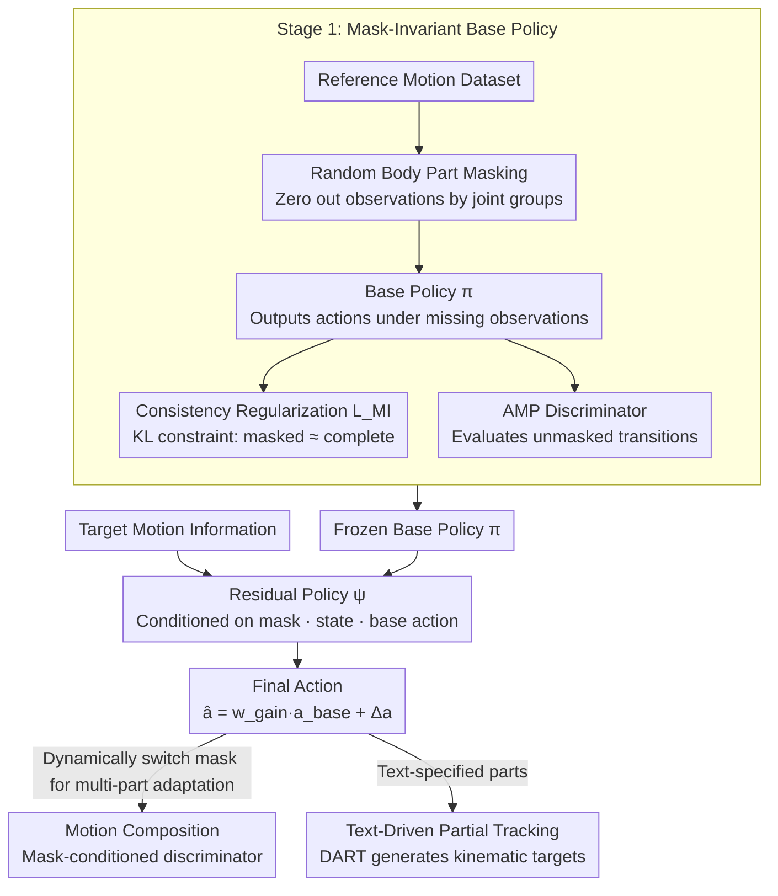

# MaskAdapt: Learning Flexible Motion Adaptation via Mask-Invariant Prior for Physics-Based Characters

**Conference**: CVPR 2026  
**arXiv**: [2603.29272](https://arxiv.org/abs/2603.29272)  
**Code**: None  
**Area**: Video Understanding / Physics-based Character Control  
**Keywords**: Physics simulation, motion adaptation, residual learning, body part masking, humanoid control

## TL;DR

This paper proposes the MaskAdapt framework, which achieves flexible and precise motion adaptation for physics-based humanoid characters through a two-stage residual learning paradigm: first training a mask-invariant robust base policy, and then training a residual policy on a frozen base controller to modify target body parts.

## Background & Motivation

**Background**: Physics-based humanoid character control is a core problem in computer graphics and robotics. Recently, Deep Reinforcement Learning (DRL) driven physical character control has made significant progress, capable of mimicking reference motions and generating physically plausible movements. However, flexibly modifying the behavior of specific body parts (e.g., making a walking character perform other actions with its upper body) while maintaining existing motion quality remains a major challenge.

**Limitations of Prior Work**: Existing motion control methods usually learn a unified full-body policy, making it difficult to achieve independent adaptation of partial body parts. (1) Direct fine-tuning on existing policies leads to catastrophic forgetting—modifying upper body movements affects the lower body; (2) Training composite motions from scratch incurs high engineering and computational costs; (3) Existing methods lack flexibility in choosing target body parts—different applications require modifying different parts, requiring separate training for each combination.

**Key Challenge**: Motion adaptation must simultaneously satisfy two contradictory goals: (1) Precisely modifying the behavior of target body parts to match new motion objectives; (2) Maintaining the stability and naturalness of the original motion in non-target parts. The coupled nature of full-body policies makes it difficult to balance both.

**Goal**: Design a framework that can (1) train a base motion prior robust to missing body part observations; (2) achieve flexible adaptation of target parts via lightweight residual learning on top of this prior without interfering with other parts.

**Key Insight**: Drawing inspiration from masked pretraining—if the base policy is accustomed to masked observations of certain body parts during training, it can naturally transition when those parts are "taken over" during the adaptation phase without causing system instability.

**Core Idea**: A two-stage paradigm—the first stage uses random masking to train a base policy robust to missing observations (anticipating future regions to be adapted), and the second stage trains a residual policy on a frozen base policy to modify only the target parts.

## Method

### Overall Architecture

MaskAdapt addresses the contradiction of precisely rewriting the motion of a specific body part (e.g., changing a walking character's upper body to waving) without affecting other parts or retraining for every combination of "which part to change." It splits the problem into two stages. The first stage trains a "mask-invariant" base policy: during adversarial motion prior (AMP) imitation training, observations of random body parts are masked, and a consistency constraint is added to force the policy to output similar actions regardless of masking, resulting in a motion prior that does not collapse even with partial observations. The second stage freezes the entire base policy and trains a lightweight residual policy. Conditioned on a mask, it generates modifications only for the specified (masked) target parts, with the output added to the base policy's action to form the final control signal. The key to connecting the two stages is that the first stage prepares the base policy for "missing" observations, so it is not destabilized by unfamiliar inputs when the residual policy takes over those parts.

### Key Designs

**1. Random Body Part Masking Training: Preparing the base policy for "part takeover"**

If a base policy is only trained on complete observations, it will receive input patterns never seen during training when a residual policy takes over a part in the second stage, leading to instability. This design integrates such scenarios into training beforehand. Specifically, humanoid observations (joint angles, angular velocities, positions, etc.) are grouped by body parts. At each training step, one or several groups are randomly selected to be zeroed out (or replaced with default values). Masking probabilities and combinations change dynamically to ensure the policy sees various missing patterns. Masking alone is insufficient—the policy must also produce similar actions regardless of masking to provide a stable "foundation" for the second stage. Thus, a consistency (mask-invariant) regularization $\mathcal{L}_{MI}$ is added, using KL divergence to constrain the action distributions of the policy before and after masking to be as consistent as possible. Once trained, the base policy becomes insensitive to "missing a few parts," leaving smooth transition space for subsequent takeover.

**2. Residual Policy Adaptation: Modifying only target parts on a frozen base**

With a robust foundation, the second stage uses residual learning for precise rewriting. The residual policy $\psi$ receives the simulation state, the base action, and a mask indicating "which parts to change" as conditions, and outputs a residual action $\Delta a$. The final executed action is a combination of the base action and the residual: $\hat a = w_{gain}\cdot a_{base} + \Delta a$ (where $w_{gain}$ is a learnable or fixed gain coefficient). Residual control is confined to target parts through two mechanisms: first, observations of target parts are masked when fed to the base policy, effectively making the base policy "silent" on those parts and handing control to the residual; second, the residual policy is mask-conditioned to generate modifications only for the masked target areas while keeping others stable. This arrangement offers three benefits: freezing the base policy guarantees that non-target behaviors remain unchanged; the residual only learns the delta, making training much more efficient than training combinations from scratch; and changing target parts only requires swapping the mask without retraining. For example, to change a walking character's upper body to waving, one masks the upper body observations, lets the residual fit the waving target, while the lower body walking motion is output normally by the frozen base.

**3. Multi-application Adaptation: Supporting motion composition and text-driven tracking**

The synergy of the first two designs allows the framework to serve two types of applications without changing the backbone. Motion Composition is achieved by dynamically switching masks within a sequence to adapt different parts to different motion sources, effectively stitching movements together. Here, residual learning is paired with a **conditioned discriminator** (inspired by CALM but conditioned on masks rather than skill embeddings). Unlike CML, which integrates separate discriminators for each part, this uses a single mask-conditioned discriminator to selectively constrain action realism under different masking configurations, with real samples mixed from dataset motions and new target motions. Text-Driven Partial Goal Tracking connects kinematic targets for specific parts to a pretrained text-conditioned autoregressive diffusion model (DART) while maintaining original actions for other parts. This enables specifying new actions for certain parts via natural language; the kinematic targets define the "intent," while MaskAdapt ensures physical plausibility.

### Loss & Training

**Stage 1 (Base Policy Training, following the AMP framework)**:
- Adversarial imitation reward: The discriminator always evaluates unmasked transitions, forcing the policy to generate expert-like realistic actions even when observations are masked.
- Consistency (mask-invariant) regularization: $\mathcal{L}_{MI} = \mathbb{E}_m\big[D_{KL}(\pi(\cdot\mid s, m^0) \,\|\, \pi(\cdot\mid \bar{s}, m))\big]$, enforcing consistency between masked and complete observation policy distributions.
- Total objective: $\mathcal{L} = \mathcal{L}_{PPO} + \lambda_{MI}\mathcal{L}_{MI}$, optimized using PPO.

**Stage 2 (Residual Policy Training)**:
- Target tracking reward: Matching joint angles/positions of target parts with new motion objectives.
- Motion composition uses a mask-conditioned discriminator (CALM-style with gradient penalty) to constrain the realism of adapted actions.
- The residual is mask-conditioned to modify only target parts; the base policy is completely frozen, optimizing only the residual policy.
- PPO is likewise used for optimization.

## Key Experimental Results

### Main Results (Motion Adaptation Quality)

| Method | Target Tracking Error ↓ | Non-target Retention ↑ | Physical Stability ↑ | Overall Index |
| :--- | :--- | :--- | :--- | :--- |
| Direct Fine-tuning | Medium | Low (Catastrophic Forgetting) | Low | Poor |
| Training from Scratch | High (Composition Difficulty) | N/A | Medium | Medium |
| Residual w/o Mask-inv | Low-Medium | Medium | Medium-Low | Medium |
| **MaskAdapt (Ours)** | **Lowest** | **Highest** | **Highest** | **Optimal** |

### Ablation Study

| Configuration | Key Metrics | Description |
| :--- | :--- | :--- |
| Full MaskAdapt | Best | Complete two-stage framework |
| w/o Masking Training | Unstable during adaptation | Base policy cannot handle missing observations |
| w/o Consistency Reg | Large action deviation after masking | Inconsistent policy distributions |
| w/o Mask Condition | Non-target parts altered | Residual loses part selectivity; adaptation leaks |
| Single-stage (No Residual) | Inflexible adaptation | Requires retraining for every part combination |

### Key Findings

- Mask-invariant training is the prerequisite for successful adaptation—without it, the residual policy causes the base policy behavior to collapse during adaptation.
- Consistency regularization plays a significant role—it ensures that action differences caused by masking are minimized, providing a stable "foundation" for the residual policy.
- In motion composition tasks, MaskAdapt can achieve independent adaptation of multiple parts within the same sequence, producing diverse composite behaviors.
- Text-driven adaptation demonstrates natural collaboration with motion generation models—kinematic targets come from the text-conditioned generator, while physical plausibility is guaranteed by MaskAdapt.

## Highlights & Insights

- **Elegant Migration of Masked Pretraining**: Migrating the masked training concept widely used in NLP/CV to the field of physics control, allowing the policy to "anticipate" missing information, is a clever cross-domain analogy.
- **Combination of Residual Learning + Selective Freezing**: Freezing the base policy ensures stability, while the residual policy handles adaptability, and L2 regularization controls the adaptation range—the three mechanisms work in synergy for precise and controllable partial adaptation.
- **High Practicality**: A single base policy can be paired with multiple residual policies for different adaptation goals, eliminating the need to retrain the entire system for every new action.

## Limitations & Future Work

- Current experiments are primarily conducted on standard humanoid body shapes; applicability to non-standard shapes (e.g., quadruped or alien robots) has not been verified.
- The grouping of body parts is predefined, which may not cover all fine-grained adaptation needs (e.g., control of a single finger).
- The robustness of the base policy is strongly related to the design of masking training—the choice of masking probabilities and grouping strategies requires empirical tuning.
- Currently, the combination of residual and base policies is a simple addition; more complex combination methods (e.g., gating mechanisms) might yield further improvements.
- Future work could explore combining MaskAdapt with large-scale motion priors (such as MoFlow, MotionDiffuse, etc.) to achieve richer adaptation capabilities.

## Related Work & Insights

- **vs. PHC/UHC Full-body Imitation Control**: These methods pursue precise full-body imitation but do not support flexible partial adaptation. MaskAdapt adds component-level control capabilities on top of them.
- **vs. CompositeMotion/Multi-policy Combination**: Traditional multi-policy combination methods require designing specialized fusion mechanisms for each combination type; MaskAdapt provides a more unified and flexible framework via residual learning.
- **vs. MotionGPT-based Physics Control**: MaskAdapt decouples kinematic generation (non-physical) from physics control, bridging the two via a residual policy—this decoupled design allows independent upgrades of each system component.
- The core idea—"making the model robust to missing information first, then utilizing this robustness for selective adaptation"—has potential applications in model editing, skill composition, and other fields.

## Rating

- Novelty: ⭐⭐⭐⭐ The combination of mask-invariant priors and residual adaptation is a novel design in physics control.
- Experimental Thoroughness: ⭐⭐⭐⭐ Demonstrates both motion composition and text-driven applications with ablation studies.
- Writing Quality: ⭐⭐⭐⭐ The method description is clear, and the two-stage structure is easy to follow.
- Value: ⭐⭐⭐⭐ Proposes an elegant solution for flexible adaptation in physical humanoid control with good practical value.

<!-- RELATED:START -->

## Related Papers

- [\[CVPR 2026\] Learning to Assist: Physics-Grounded Human-Human Control via Multi-Agent Reinforcement Learning](learning_to_assist_physics-grounded_human-human_control_via_multi-agent_reinforc.md)
- [\[CVPR 2026\] Learnable Motion-Focused Tokenization for Effective and Efficient Video Unsupervised Domain Adaptation](learnable_motion-focused_tokenization_for_effective_and_efficient_video_unsuperv.md)
- [\[ECCV 2024\] Motion-prior Contrast Maximization for Dense Continuous-Time Motion Estimation](../../ECCV2024/video_understanding/motion-prior_contrast_maximization_for_dense_continuous-time_motion_estimation.md)
- [\[CVPR 2026\] GoalForce: Teaching Video Models to Accomplish Physics-Conditioned Goals](goal_force_teaching_video_models_to_accomplish_physics-conditioned_goals.md)
- [\[CVPR 2026\] Interactive Tracking: A Human-in-the-Loop Paradigm with Memory-Augmented Adaptation](interactive_tracking_a_human-in-the-loop_paradigm_with_memory-augmented_adaptati.md)

<!-- RELATED:END -->
