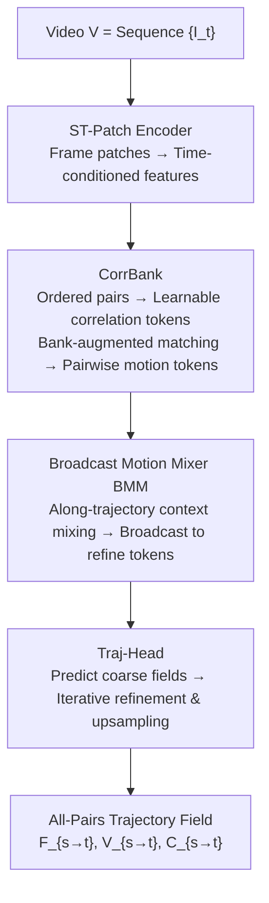

# Matching Every Pair to Track Every Point: PairFormer for All-Pairs Tracking and Video Trajectory Fields

**Conference**: CVPR 2026  
**Paper**: [CVF Open Access](https://openaccess.thecvf.com/content/CVPR2026/html/Wu_Matching_Every_Pair_to_Track_Every_Point_PairFormer_for_All-Pairs_CVPR_2026_paper.html)  
**Code**: Pending Release (The paper states it will be released upon publication)  
**Area**: Video Understanding / Point Tracking  
**Keywords**: All-Pairs Tracking, Point Tracking TAP, Trajectory Fields, Feed-forward Transformer, Synthetic Data

## TL;DR
PairFormer upgrades video motion modeling from "tracking a few query points" to "predicting dense displacement and visibility fields for every frame pair" (All-Pairs Tracking, APT). Using a feed-forward Transformer (Spatio-temporal encoder + CorrBank + Broadcast Motion Mixer + Trajectory Field Decoder), it outputs sequence-consistent dense trajectory fields in a single forward pass. Accompanied by the PAIRender synthetic data platform providing all-to-all supervision and benchmarks, it achieves SOTA on APT-Bench and competitiveness on standard TAP benchmarks.

## Background & Motivation
**Background**: Understanding video motion primarily follows two paths. **TAP (Tracking-Any-Point)** outputs long-range, occlusion-resistant sparse trajectories given query points; **Optical Flow** only calculates dense correspondences between adjacent frames. These tasks are handled separately: TAP is sparse and depends on user-defined query points, while Flow is dense but restricted to adjacent frames.

**Limitations of Prior Work**: True motion understanding requires a representation of "how every pixel position relates to every frame in the sequence," which existing paradigms fail to fully provide. TAP models tracking as conditional prediction for query points, making dense structures **implicit**. Trajectories propagated from a single source frame lead to **cross-source inconsistency** in scenarios like multi-keyframe editing or reconstruction. Optical Flow is locked into adjacent frames, and chaining them into long trajectories requires independent models for pre-processing and post-processing (e.g., occlusion detection) to prevent drift.

**Key Challenge**: Achieving "dense + long-range + sequence-consistent" simultaneously is difficult—the number of frame pairs grows **quadratically** with sequence length. Relevant context for each correspondence is scattered across distant frames and spatial positions, compounded by ambiguities from repetitive textures, large motions, and occlusions. Hand-crafted cost volumes and local propagation schemes struggle to aggregate this non-local context or maintain consistency across the entire sequence scale.

**Goal**: Elevate dense correspondence to a first-class citizen—given a video, predict dense displacement $F_{s\to t}$ and visibility $V_{s\to t}$ for **every ordered frame pair** $(s,t)$. Trajectories of any pixel can be "read out on demand" from this explicit all-pairs field rather than being propagated from a single frame.

**Key Insight**: The authors propose the new task formulation of **APT (All-Pairs Tracking)**—it strictly generalizes two-frame optical flow and encompasses TAP-style point tracking. This allows "matching at any temporal offset" to be handled uniformly, making sequence-wide temporal consistency the primary modeling objective.

**Core Idea**: Follow a simple principle—**construct pairwise correspondences first, then enforce global consistency over the entire sequence**. Use a feed-forward Transformer (PairFormer) to produce a globally consistent all-pairs trajectory field in one forward pass, supported by a synthetic data platform that provides all-to-all dense supervision.

## Method

### Overall Architecture
Input is a video $V=\{I_t\}_{t=1}^T$, and the output is dense displacement $F_{s\to t}$, visibility $V_{s\to t}$, and confidence $C_{s\to t}$ for every ordered frame pair $(s,t)$—an explicit All-Pairs Trajectory Field. PairFormer consists of four components following the "pairwise first, global later" principle: **ST-Patch Encoder** maps all frames into time-conditioned patch features; **CorrBank** transforms each ordered frame pair into learnable correlation tokens with bank-augmented matching to produce pairwise motion tokens; **Broadcast Motion Mixer (BMM)** performs context mixing along trajectories and broadcasts it back to refine the pairwise tokens; **Trajectory Field Decoder (Traj-Head)** predicts coarse dense fields and iteratively refines them to full-resolution outputs.

### Key Designs

**1. CorrBank: Replacing Explicit 4D Cost Volumes with Learnable Correlation Banks**
The number of frame pairs grows quadratically, making traditional explicit 4D cost volumes expensive and difficult for efficient attention kernels. CorrBank's approach: For each ordered pair $(s,t)$, a small CNN computes a residual feature map $R_{s,t}=h(Z_t-Z_s)$ to highlight local motion cues. A set of learnable correlation tokens $A\in\mathbb{R}^{K\times D}$ **shared across all pairs** is maintained. Residual features act as queries to cross-attend to these tokens, resulting in pair-conditioned correlation features $M_{s,t}=\text{Attn}(Q{=}R_{s,t},K{=}A,V{=}A)$. Finally, **bank-augmented matching** uses source feature $Z_s$ as query, target $Z_t$ as key, and $M_{s,t}$ as value to produce pairwise motion tokens $Y_{s,t}=\text{Attn}(Q{=}Z_s,K{=}Z_t,V{=}M_{s,t})$. This replaces 4D cost volumes with a token-based module compatible with FlashAttention. Ablations show 64 tokens are optimal, suggesting benefits come from the "mechanism of using the bank" rather than infinite capacity.

**2. Broadcast Motion Mixer (BMM): Gathering Trajectory Context and Broadcasting Back**
Pairwise motion tokens only encode local correspondences and lack global consistency. BMM refines this in two steps. **Trajectory-level Mixing**: For each source frame $s$ and patch $p$, the temporal sequence of motion tokens $\{Y_{s,\tau}(p)\}_{\tau=1}^T$ is concatenated with $K$ learnable context tokens $U$ and passed through self-attention blocks. The first $K$ positions output **trajectory context tokens** $H_{s,p}$ (absorbing all temporal information into a compact summary), while the others are updated motion tokens. **Context Mixing**: Trajectory context tokens for all $P$ patches of source frame $s$ undergo self-attention to produce refined $H^*_{s,p}$. **Broadcast Refinement**: $H^*_{s,p}$ acts as broadcast context to refine motion tokens via cross-attention $\tilde{Y}^*_{s,\cdot}(p)=\text{Attn}(Q{=}\tilde{Y}_{s,\cdot}(p),K{=}H^*_{s,p},V{=}H^*_{s,p})$, then reshaped back to $Y^*_{s,t}$. This injects sequence-wide consistency by conditioning each pairwise token on the "trajectory summary + source frame context."

**3. Trajectory Field Decoder + Correspondence Regularization: Coarse-to-Fine and Consistency**
Refined motion tokens are mapped to dense pixel-wise outputs. A lightweight head predicts coarse displacement/visibility/confidence on the patch grid, followed by an iterative update module (similar to AllTracker) that utilizes motion tokens and local evidence to predict residuals. Finally, it upsamples to full resolution $F_{s\to t}, V_{s\to t}, C_{s\to t}$. Beside the $\ell_1$ displacement loss, **Correspondence Regularization $L_{corr}$** is key: synthetic supervision provides time-consistent trajectories identifying pixel pairs $((s,x),(t,x'))$ matching the same physical point. Trajectory descriptors $q_s(x)=[\phi_{s\to1}(x),\dots,\phi_{s\to T}(x)]$ are defined, requiring $L_{corr}=\mathbb{E}\|q_s(x)-q_t(x')\|_1$ to be minimized—enforcing that points on the same physical trajectory share consistent all-pairs predictions.

### Loss & Training
The total objective is $L=\lambda_{traj}L_{traj}+\lambda_{conf}L_{conf}+\lambda_{vis}L_{vis}+\lambda_{corr}L_{corr}$. Specifically, **Confidence Adjustment** $\ell_{conf}=r_{s\to t}(x)C_{s\to t}(x)-\alpha\log C_{s\to t}(x)$ ($\alpha=0.3$) uses predicted confidence $C$ as a weight for the residual, with a log term to prevent collapsing to zero. Weights are $(\lambda_{traj},\lambda_{conf},\lambda_{vis},\lambda_{corr})=(1,1,1,0.3)$. Training uses a 1:1 mix of $\pi$-R10K and Kubric datasets with $384\times512$ segments of 30–60 frames, trained for 50k iterations on 8 H100-80G GPUs with AdamW and cosine decay.

## Key Experimental Results

> Metric Definitions: $\delta_{avg}$ is the average TAP-style $\delta$-accuracy across thresholds $k\in\{1,2,4,8,16\}$; **AJ** (Average Jaccard) evaluates localization and visibility jointly; **OA** (Occlusion Accuracy) measures visibility state correctness; $\Delta^{epe}_g$ is the average Endpoint Error (EPE) at frame interval $|s-t|=g$.

### Main Results
TAP Benchmarks ($\delta_{avg}$↑, 8-dataset average):

| Method | Bad. | Ego. | Rgb. | Rob. | 8-Set Avg |
|------|------|------|------|------|----------|
| CoTracker3 | 48.3 | 60.4 | 84.2 | 81.6 | 67.2 |
| **PairFormer** | **49.7** | **63.2** | **89.1** | **83.8** | **68.1** |

Ours achieves the best $\delta_{avg}$ on 6 out of 8 datasets, with significant gains in Rgb. and Rob. where dense spatial context is critical. On TAP-Vid subsets, AJ is 65.9 vs 63.1 and OA is 91.1 vs 89.3, outperforming CoTracker3.

APT Benchmarks (APT-Bench, Higher is better / EPE lower is better):

| Method | $\delta_{avg}$↑ | EPE↓ | AJ↑ | $\Delta^{epe}_1$↓ | $\Delta^{epe}_5$↓ | $\Delta^{epe}_{25}$↓ |
|------|------|------|------|------|------|------|
| CoTracker3 Offline | 75.2 | 4.25 | 72.5 | 2.47 | 4.18 | 6.48 |
| DOT | 76.7 | 3.68 | 75.4 | 2.18 | 3.69 | 6.02 |
| **PairFormer** | **77.5** | **3.26** | **76.3** | **2.03** | **3.21** | **5.39** |

Ours is best across all metrics on CVO and APT-Bench. While all methods show increasing EPE as the interval $g$ grows, **PairFormer's growth rate is consistently lower**, indicating more stable trajectories and fewer cumulative errors over long durations.

### Ablation Study
On APT-Bench held-out split:

| Ablation | Configuration | $\delta_{avg}$↑ | EPE↓ | Conclusion |
|---------|------|------|------|------|
| Depth Allocation | Encoder/BMM 24/9 | 66.9 | 4.4 | Favor deep encoder |
| Depth Allocation | Encoder/BMM 9/24 | 67.6 | 4.2 | Better to allocate to BMM |
| Correspondence Reg. | w/o $L_{corr}$ | 67.2 | 4.3 | Slight drop |
| Correspondence Reg. | w/ $L_{corr}$ | 67.8 | 4.1 | Consistent gain |

### Key Findings
- **Compute should be spent on sequence-level reasoning**: Shifting depth from the encoder to BMM improves performance. Deepening the encoder only refines per-frame descriptors, whereas BMM strengthens cross-frame trajectory mixing.
- **$L_{corr}$ improves long-range consistency**: It results in smoother trajectories over long durations and reduces jitter when revisiting the same region.
- **CorrBank capacity does not need to be excessive**: 64 tokens are sufficient; 128 tokens increase memory without significant gains.

## Highlights & Insights
- **Task Redefinition**: Shifting from "tracking points (TAP)" to "all-pairs dense fields (APT)" treats optical flow and point tracking as special cases, making sequence consistency a first-class objective.
- **Learnable Correlation Bank**: Replacing 4D cost volumes with CorrBank (tokens + cross-attention) saves computational costs and leverages efficient attention kernels, "Transformer-izing" the cost volume paradigm.
- **"Pairwise First, Global Later"**: Decoupling local pairwise matching from sequence-wide broadcast mixing is a robust design for dense correspondence tasks like 4D reconstruction.
- **Synthetic Data as Enabler**: The PAIRender platform provides all-to-all supervision for 2D/3D trajectories, depth, and visibility, which is essential for training APT models and evaluating consistency.

## Limitations & Future Work
- PairFormer faces **quadratic computational costs for ultra-long videos**, partially mitigated by query-centric windowed inference.
- Strong reliance on **synthetic PAIRender data** may lead to domain gaps in real-world scenarios where all-to-all GT is missing.
- Future work involves sparsifying/hierarchical frame pair selection to reduce costs and introducing self-supervised consistency on real videos to bridge the domain gap.

## Related Work & Insights
- **vs. Optical Flow (RAFT / SEA-RAFT)**: PairFormer handles **all ordered pairs** rather than just adjacent frames and replaces hand-crafted cost volumes with CorrBank.
- **vs. TAP (CoTracker3)**: These operate on **sparse** query points and suffer from cross-source inconsistency. PairFormer provides a dense field from which any trajectory can be read, ensuring consistency.
- **vs. Dense Trackers (DOT / AllTracker)**: Ours borrows iterative refinement but adds sequence-wide broadcasting (BMM) and correspondence regularization, outperforming Prev. SOTA DOT.

## Rating
- Novelty: ⭐⭐⭐⭐⭐ Proposes APT task + architecture + data platform.
- Experimental Thoroughness: ⭐⭐⭐⭐ Solid TAP/APT evaluation, though real-world quantification is less direct.
- Writing Quality: ⭐⭐⭐⭐⭐ Logic flows clearly from motivation to architecture.
- Value: ⭐⭐⭐⭐⭐ Dense all-pairs fields have clear utility for 4D reconstruction and video editing.

<!-- RELATED:START -->

## Related Papers

- [\[ECCV 2024\] Local All-Pair Correspondence for Point Tracking](../../ECCV2024/video_understanding/local_all-pair_correspondence_for_point_tracking.md)
- [\[CVPR 2026\] Efficient All-Pairs Correlation Volume Sampling for Optical Flow Estimation](efficient_all-pairs_correlation_volume_sampling_for_optical_flow_estimation.md)
- [\[CVPR 2026\] Generative Point Tracking and Forecasting](generative_point_tracking_and_forecasting.md)
- [\[CVPR 2026\] ProgTrack: A Multi-Object Tracking Algorithm with Progressive Matching Strategy](progtrack_a_multi-object_tracking_algorithm_with_progressive_matching_strategy.md)
- [\[CVPR 2026\] MV-TAP: Tracking Any Point in Multi-View Videos](mv-tap_tracking_any_point_in_multi-view_videos.md)

<!-- RELATED:END -->
