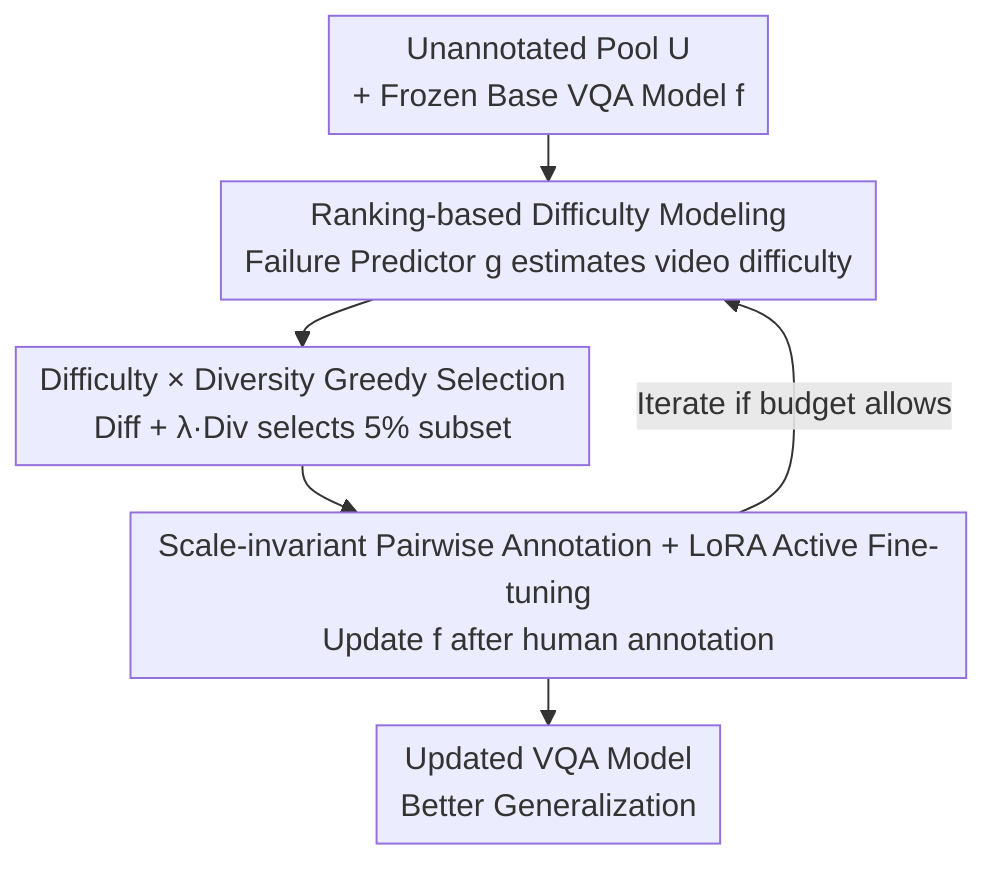

# MDS-VQA: Model-Informed Data Selection for Video Quality Assessment

**Conference**: CVPR 2026  
**Paper**: [CVF Open Access](https://openaccess.thecvf.com/content/CVPR2026/html/Zou_MDS-VQA_Model-Informed_Data_Selection_for_Video_Quality_Assessment_CVPR_2026_paper.html)  
**Code**: https://github.com/Multimedia-Analytics-Laboratory/MDS-VQA  
**Area**: Video Understanding / Video Quality Assessment / Active Learning  
**Keywords**: Video Quality Assessment, Model-Informed Data Selection, Failure Prediction, Active Fine-tuning, Learning to Rank

## TL;DR
MDS-VQA enables a VQA model to "identify which videos it cannot assess accurately" by using a ranking-based failure predictor to estimate difficulty combined with content diversity for greedy selection. By annotating only a 5% "difficult and diverse" subset for active fine-tuning, the average multi-domain SRCC improved from 0.651 to 0.722, and the method achieved first place in the gMAD competition.

## Background & Motivation

**Background**: Video Quality Assessment (VQA) aims to predict perceptual quality consistent with subjective human judgment. Models have evolved from manual features and 2D/3D CNNs to Transformers (e.g., FAST-VQA) and Visual-Language Models (e.g., VisualQuality-R1 using reinforcement learning for MOS alignment). On the data side, new subjective experiments are continuously conducted to collect Mean Opinion Scores (MOS).

**Limitations of Prior Work**: These two lines of research are disconnected. Models iterate on a small set of frequently reused benchmarks, leading to overfitting to dataset-specific characteristics. Meanwhile, data collection involves significant manual effort to acquire new labels but rarely **systematically targets samples that current top-tier models fail to assess**. This leads to the "easy dataset problem," where data is saturated with distortions that are easily identified even by simple baselines, masking the weaknesses of advanced architectures and diminishing the marginal value of new annotations.

**Key Challenge**: Annotation budgets are limited, but passive sampling (representative or random) wastes budget on "homogeneous easy samples" that the model already handles well. This fails to illuminate actual model blind spots and cannot reliably drive cross-domain generalization.

**Goal**: Select the most "informative" subset for a base model under a fixed budget, such that active fine-tuning improves both average correlation and worst-case generalization.

**Key Insight**: The authors advocate for **model-aware** data selection—prioritizing the annotation of videos that are 1) difficult for the base model and 2) content-diverse. Difficulty can be estimated using an auxiliary "failure predictor," while diversity can be measured via deep semantic features.

**Core Idea**: A closed loop of "failure predictor + diversity metric" guides data collection based on model weaknesses, followed by utilizing the acquired data to improve the model—forming a "difficult and diverse" active fine-tuning loop.

## Method

### Overall Architecture
MDS-VQA formulates data selection as a subset optimization problem: in an unannotated video pool $\mathcal{U}$, find a subset $\mathcal{D}\subset\mathcal{U}$ that maximizes $\mathrm{Diff}(\mathcal{S};f)+\lambda\,\mathrm{Div}(\mathcal{S})$, where $\mathrm{Diff}$ measures the difficulty of the subset for the base model $f(\cdot)$, $\mathrm{Div}$ encourages content coverage, and $\lambda$ balances the two. The pipeline consists of three steps: freezing the base quality model and training an auxiliary failure predictor $g(\cdot)$ to estimate difficulty; combining difficulty scores with diversity for greedy selection of a 5% subset; and performing active fine-tuning via LoRA on $f(\cdot)$ after human annotation, with the possibility of further iterations.

### Key Designs

**1. Ranking-based Difficulty Modeling: Estimating "how much the model will fail"**

The challenge lies in quantifying "how difficult this video is for the base model." Directly regressing absolute prediction error is biased by MOS scale differences across datasets, while binary "easy/hard" classification lacks granularity. The authors frame difficulty learning as **Learning to Rank**: a LoRA module is attached to the base model $f(\cdot)$ (VisualQuality-R1 based on Qwen2.5-VL) to create the failure predictor $g(\cdot)$, where $W_{\mathrm{LoRA}}=W_0+\frac{\alpha}{r}BA$. Only $A$ and $B$ are trained. For a pair $(x,y)$, $g$ outputs scalars treated as means of Gaussians under the Thurstone model, yielding the probability $\hat p(x,y)=\Phi\!\big(\frac{g(x)-g(y)}{\sqrt2}\big)$ that $x$ is more difficult than $y$. Supervision comes from the actual error of $f$: if $|f(x)-\mu(x)|\ge|f(y)-\mu(y)|$ (where $\mu$ is MOS), then $p=1$, otherwise $0$. Optimization uses a fidelity loss $\ell=1-\sqrt{p\hat p}-\sqrt{(1-p)(1-\hat p)}$. This relative comparison is immune to scale differences, allowing $g$ to assign higher difficulty scores to videos where $f$ produces larger errors.

**2. Difficulty × Diversity Greedy Selection: Avoiding redundant hard samples**

Selecting only the hardest videos leads to "clusters of nearly identical hard samples," wasting budget. The authors incorporate diversity: each video uses a CLIP visual encoder for frame-level semantic features $\mathcal{F}_x$. Dissimilarity between videos is measured via Chamfer distance $d_{\mathrm{CD}}$ (capturing semantic differences beyond single pooled descriptors). Subset diversity $\mathrm{Div}(\mathcal{S})$ is the average pair-wise Chamfer distance, and subset difficulty $\mathrm{Diff}(\mathcal{S})=\frac{1}{|\mathcal{S}|}\sum_{x\in\mathcal{S}}g(x)$. Since optimization is NP-hard, a greedy approximation is used: starting from an empty set, each step adds the video maximizing $g(x)+\frac{\lambda}{|\mathcal{D}_k|}\sum_{y\in\mathcal{D}_k}d_{\mathrm{CD}}(\mathcal{F}_x,\mathcal{F}_y)$ until the budget is reached ($\lambda=0.25$). This ensures the subset is **both difficult and non-redundant**.

**3. Scale-invariant Pairwise Annotation + LoRA Active Fine-tuning: Seamless integration**

After selection, subjective experiments provide human quality judgments. A key trick is representing new annotations in a **scale-invariant pairwise format**. Comparison pairs are constructed from the annotated videos; this format remains constant regardless of the absolute scale of any single experiment. Thus, the new subset can be directly **merged** with existing pairwise VQA data without cross-dataset perceptual scale alignment. Fine-tuning follows the VisualQuality-R1 recipe but replaces full fine-tuning with LoRA to mitigate overfitting/catastrophic forgetting while maintaining efficient adaptation.

## Key Experimental Results

Evaluation involves five VQA datasets: YouTube-UGC (source domain for base model), CGVDS (cloud gaming), LIVE-Livestream (4K sports), YouTube-SFV+HDR (short videos), and AIGVQA-DB (AI-generated), with the latter four acting as "unannotated pools." LSVQ-1080p is used for gMAD. The base model is VisualQuality-R1 trained on YouTube-UGC.

**Metrics**: SRCC and PLCC measure consistency with MOS; gMAD (group maximum differentiation) detects worst-case generalization by finding samples where two models disagree most.

### Main Results

Failure Identification (SRCC/PLCC between base model and MOS on the selected 5% subset; **lower is better**, indicating focus on failed samples):

| Method | CGVDS | LIVE-Livestream | YT-SFV SDR | YT-SFV HDR2SDR | AIGVQA-DB | Average |
|------|-------|-----------------|-----------|----------------|-----------|------|
| Base model | 0.544/0.635 | 0.473/0.493 | 0.665/0.710 | 0.538/0.591 | 0.733/0.740 | 0.591/0.634 |
| Random sampling | 0.673/0.782 | 0.521/0.555 | 0.642/0.787 | 0.438/0.407 | 0.652/0.729 | 0.585/0.652 |
| Core-set [23] | 0.415/0.599 | 0.289/0.378 | 0.599/0.741 | 0.516/0.555 | 0.676/0.742 | 0.499/0.603 |
| FreeSel [45] | 0.252/0.450 | 0.232/0.418 | 0.546/0.690 | 0.262/0.422 | 0.565/0.643 | 0.371/0.525 |
| **MDS-VQA (Ours)** | **0.162/0.316** | **0.133/0.288** | **0.264/0.361** | **0.161/0.354** | **0.487/0.487** | **0.241/0.361** |

MDS-VQA achieved the lowest SRCC/PLCC across all target domains. Notably, neither the base model nor the failure predictor had seen target domain labels, suggesting that uncertainty/inconsistency patterns are more "domain-agnostic" than quality mapping itself.

Active Fine-tuning (SRCC/PLCC on test sets after fine-tuning on source + 5% target subsets; **higher is better**):

| Method | YT-UGC | CGVDS | LIVE-LS | YT-SFV SDR | YT-SFV HDR2SDR | AIGVQA-DB | Average |
|------|--------|-------|---------|-----------|----------------|-----------|------|
| Base model | 0.708/0.709 | 0.766/0.780 | 0.561/0.587 | 0.666/0.718 | 0.495/0.557 | 0.711/0.748 | 0.651/0.683 |
| Random | 0.760/0.756 | 0.807/0.804 | 0.569/0.628 | 0.703/0.761 | 0.518/0.588 | 0.756/0.751 | 0.686/0.715 |
| FreeSel [45] | 0.814/0.798 | 0.832/0.849 | 0.627/0.646 | 0.719/0.787 | 0.498/0.590 | 0.789/0.785 | 0.713/0.742 |
| **MDS-VQA (Ours)** | 0.819/0.807 | **0.874/0.875** | **0.632/0.654** | **0.731/0.794** | 0.507/0.595 | 0.769/0.769 | **0.722/0.749** |

Average SRCC increased from 0.651 to 0.722, the highest among all methods. ⚠️ On AIGVQA-DB, MDS-VQA (0.769) was slightly lower than FreeSel (0.789), indicating that "difficulty + diversity" may not be globally optimal for AI-generated domains, though it remains superior on average.

### Ablation Study

| Configuration | SRCC Rank | gMAD Rank | ΔRank | Description |
|------|-----------|-----------|-------|------|
| **MDS-VQA (Ours)** | 1 | 1 | 0 | 1st in both average correlation and worst-case |
| FreeSel [45] | 2 | 2 | 0 | Runner-up, consistent across both |
| NoiseStability [13] | 3 | 6 | -3 | Strong average but fails in worst-case |
| Core-set [23] | 5 | 8 | -3 | Significant mismatch between SRCC and gMAD |
| Base model | 10 | 7 | 3 | — |

MDS-VQA ranked first in both SRCC and gMAD, whereas some competitors showed significant rank misalignment, suggesting that average correlation can hide critical failures.

### Key Findings
- **Difficulty and Diversity are both essential**: Relying solely on uncertainty (MC dropout) or diversity (Core-set) is inferior to combining them. Diversity constraints prevent redundant labeling of similar hard samples.
- **Cross-domain Transferability**: Failure predictors trained on the source domain effectively select hard samples in unseen target domains.
- **Average vs. Worst-case**: MDS-VQA also led in gMAD. Qualitative analysis shows it exposes severe underestimations of high-MOS animation/abstract content in other models.

## Highlights & Insights
- **Letting the model answer "what is worth annotating"**: Training a failure predictor via Learning to Rank sidesteps MOS scale sensitivity, providing a clean "model-to-data" feedback interface.
- **Scale-invariant pairwise annotation is a significant engineering cleverness**: It allows new annotations to be merged with existing datasets without cross-dataset alignment, enhancing reusability.
- **gMAD for generalization**: Using gMAD alongside SRCC reveals that many selection strategies have a "good average, poor worst-case" liability—a perspective applicable to any scoring task.

## Limitations & Future Work
- ⚠️ In the AI-generated domain (AIGVQA-DB), performance lagged slightly behind pure diversity methods, suggesting difficulty signals may be less effective for semantic/logical distortions.
- The failure predictor inherits system biases from the base model's prediction errors used during supervision.
- Iterative selection costs and the cost-benefit curve weren't fully explored.
- Whether CLIP features + Chamfer distance provide enough granularity for pure signal-level distortions (e.g., blockiness) warrants further verification.

## Related Work & Insights
- **vs. Pure Uncertainty Selection (MC dropout [21])**: They select solely on uncertainty; ours adds ranking-based failure prediction and diversity, leading to better average and worst-case performance.
- **vs. Pure Diversity/Representativeness (Core-set [23], FreeSel [45])**: They ignore where the model fails; ours explicitly incorporates failure signals, significantly leading in failure identification (CGVDS SRCC 0.162 vs. 0.252~0.673).
- **vs. VisualQuality-R1 [44]**: Using it as a base, we prove model-aware data selection can extract substantial gains from strong VLMs without architectural changes.

## Rating
- Novelty: ⭐⭐⭐⭐ Clean closed-loop model-aware selection; individual components (LoRA, ranking, Chamfer) are known but combined effectively.
- Experimental Thoroughness: ⭐⭐⭐⭐⭐ Five datasets, 8 methods, and a multi-dimensional perspective (Failure ID/Active Tuning/gMAD).
- Writing Quality: ⭐⭐⭐⭐ Clear motivation and formulas; some implementation details on iterations could be more expansive.
- Value: ⭐⭐⭐⭐ Highly practical for quality assessment with limited budgets; methodology is transferable to other rating tasks.

<!-- RELATED:START -->

## Related Papers

- [\[CVPR 2026\] CoCoVideo: The High-Quality Commercial-Model-Based Contrastive Benchmark for AI-Generated Video Detection](cocovideo_the_high-quality_commercial-model-based_contrastive_benchmark_for_ai-g.md)
- [\[CVPR 2026\] SkillSight: Efficient First-Person Skill Assessment with Gaze](skillsight_efficient_first-person_skill_assessment_with_gaze.md)
- [\[CVPR 2026\] VAST: Video Ability-Stratified Taxonomy for Data-Efficient Video Reasoning](vast_video_ability-stratified_taxonomy_for_data-efficient_video_reasoning.md)
- [\[CVPR 2026\] Towards Data-Efficient Video Pre-training with Frozen Image Foundation Models](towards_data-efficient_video_pre-training_with_frozen_image_foundation_models.md)
- [\[CVPR 2026\] Efficient Frame Selection for Long Video Understanding via Reinforcement Learning](efficient_frame_selection_for_long_video_understanding_via_reinforcement_learnin.md)

<!-- RELATED:END -->
