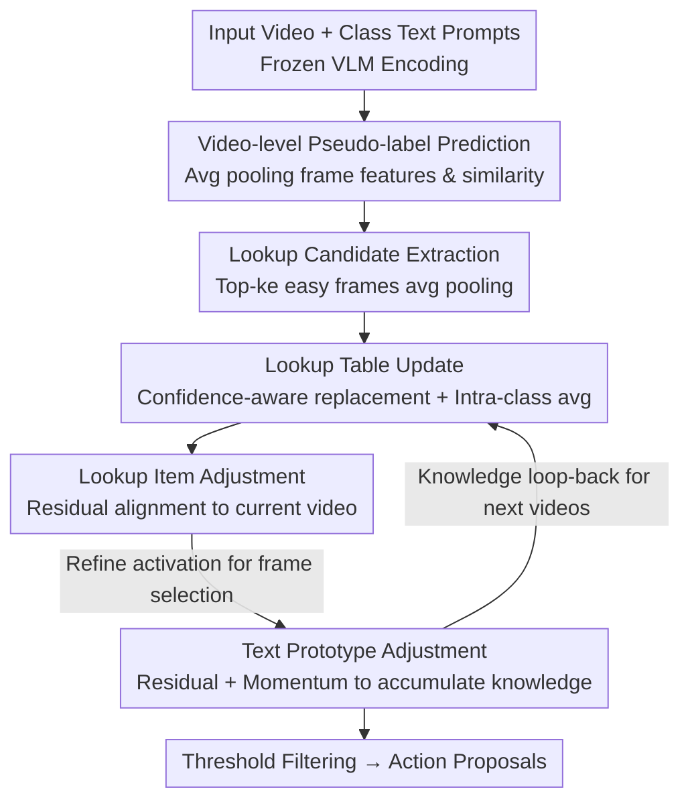

# Memory Matters: Boosting Training-Free Zero-Shot Temporal Action Localization with a Learnable Lookup Table

**Conference**: CVPR 2026  
**Area**: Video Understanding  
**Keywords**: Zero-Shot Temporal Action Localization, Training-Free, Test-Time Adaptation, Learnable Lookup Table, Vision-Language Models

## TL;DR
Addressing the issue where "Training-Free Zero-Shot Temporal Action Localization (TF ZS-TAL) adapts independently per video, discards knowledge after use, and cannot accumulate historical insights," this paper proposes a **Learnable Lookup Table (LLT) maintained by action category and updated online during the test stream**. High-confidence "easy-to-judge frames" are aggregated into category prototypes, and a lightweight residual module aligns lookup items and text prototypes to the current video. Without fine-tuning the VLM, this allows training-free ZS-TAL to reuse knowledge across videos, improving the average mAP on THUMOS'14 (75/25 split) from 9.2 (T3AL) to 12.8 (a relative +40%).

## Background & Motivation

**Background**: Temporal Action Localization (TAL) aims to identify action instances and their boundaries in untrimmed long videos. Zero-Shot TAL (ZS-TAL) further requires identifying unseen action categories. There are two main paradigms: Training-based (fine-tune VLMs on labeled $D_{seen}$ then transfer to $D_{unseen}$) and Training-free (directly use frozen VLMs for test-time adaptation without training labels). A representative training-free method is T3AL, which adapts by online fine-tuning of the VLM's projection layer for each test video.

**Limitations of Prior Work**: Training-based methods fit models to labeled $D_{seen}$ categories, which ironically damages the generalization of VLMs. As shown in experiments, methods like EffPrompt and STALE see their average mAPs collapse from 23 to 4 or even 0.3 in Out-of-Distribution (OOD) scenarios. While the training-free T3AL solves the generalization issue, it has a fatal flaw: **it adapts to each video independently and resets learned knowledge after processing each video**, starting from scratch for the next.

**Key Challenge**: Significant shared potential knowledge exists across different videos—e.g., "running" is present in both basketball and football videos, and "shooting" and "dribbling" segments jointly support the overall understanding of "basketball." This cross-video knowledge could implicitly help subsequent videos distinguish actions from background. However, sample-wise adaptation lacks a mechanism for knowledge accumulation, wasting performance when encountering similar categories.

**Goal**: Equip training-free ZS-TAL with "memory" to accumulate and reuse reliable category knowledge during the test video stream, without damaging the zero-shot generalization of the VLM (i.e., without backpropagating through the encoder).

**Key Insight**: The authors observe that frames with the highest activation scores (top-k) in a test video are often the most unambiguous and discriminative action segments ("easy-to-judge frames"). These frames represent an action category more robustly than fixed text prototypes. Therefore, easy-to-judge frames accumulated across videos can be aggregated into category representations to serve as "prior knowledge" for disambiguating blurry frames in subsequent videos.

**Core Idea**: Reformulate training-free ZS-TAL as **memory-augmented retrieval**. Maintain a Learnable Lookup Table (LLT) partitioned by category with a fixed capacity and confidence-aware replacement strategy to online collect high-confidence easy-to-judge frames as "positive action lookup items." Two lightweight learnable residuals are then used to align These lookup items and text prototypes with the current video. By freezing the VLM and only updating the lookup table and residuals, the method is efficient without hurting generalization.

## Method

### Overall Architecture
The LLT framework processes each video in a test stream through two main phases. **Phase 1: Lookup Table Collection**: Predict a video-level pseudo-label (determining its action class), extract "positive action lookup candidates" (aggregated easy-to-judge frames), and use a confidence-aware replacement strategy to decide whether to insert the candidate into the corresponding category's buffer. All candidates in a buffer are averaged to form the "lookup item" for that class. **Phase 2: Learnable Residuals within Current Video**: Retrieve the lookup item for the current class, use a learnable residual vector to align it with the current video context (Lookup Item Adjustment), and recalculate frame activation scores for frame selection. Simultaneously, a residual is learned for the text prototype with momentum updates (Text Prototype Adjustment) to accumulate knowledge for future videos. The VLM remains frozen throughout, with only the lookup table and two residual vectors being optimized.

### Key Designs

**1. Lookup Candidate Extraction: Distilling the "hardest" frames into a positive action representation**

The limitation is that fixed text prototypes (vectors encoded from "a video of action [CLS]") are easily mis-activated by scene context or irrelevant actions, making action/background discrimination unstable. The authors' approach: For current video $V_n$, perform video-level pseudo-label prediction by average pooling frame features $\{x_{n;i}\}$ into $\bar{x}_n$, calculating cosine similarity with text embeddings $y_c$, and taking the argmax to get pseudo-label $\hat{c}_n$ (Eq. 1). The softmax of similarities yields the video-level confidence $\xi_v^{(n)}$. Activation scores $p_{n;t}=\langle y_{\hat{c}_n}, x_{n;t}\rangle / (\|y_{\hat{c}_n}\|\,\|x_{n;t}\|)$ are calculated for each frame using the pseudo-label embedding (Eq. 2). The top-$k_e$ positions are selected as easy-to-judge frames, where $k_e=\max(1,\lfloor T_n\times\gamma_e\rfloor)$ is controlled by sampling ratio $\gamma_e$. These frames are averaged into a lookup candidate $z_n=\frac{1}{k_e}\sum_{x\in E_n^{ea}} x$ (Eq. 4). This works because top-$k$ frames correspond to the least ambiguous segments; aggregating them into $z_n$ provides a more robust visual prior than text prototypes.

**2. Confidence-Aware Lookup Table Update: Accumulating cross-video knowledge with a fixed-capacity buffer**

This is the core "memory" component, solving T3AL’s lack of historical accumulation. A fixed-size buffer of capacity $B$ is maintained for each action class $c$, accepting only candidates with pseudo-label $\hat{c}_n=c$. After processing a video, the triplet $(z_n,\hat{c}_n,\xi_v^{(n)})$ is used for a confidence-aware replacement: if the buffer isn't full, insert directly; if full, compare $\xi_v^{(n)}$ with the lowest confidence in the buffer. If higher, **discard the least confident entry** and insert the new candidate. The lookup item is the average of all buffer candidates $v_c=\frac{1}{N_c}\sum_{m=1}^{N_c} z_c^{(m)}$ (Eq. 5). This design offers two benefits: First, it creates an **implicit bottleneck** for each pseudo-label class, aggregating shared knowledge across videos to mitigate background interference. Second, it is **storage-efficient**, keeping only aggregated prototypes rather than per-frame features, and only updating the lookup items and prototypes without backpropagation. As the stream progresses, candidates become more reliable (Table 4 confirms background and localization errors decrease while true positives increase).

**3. Learnable Residuals: Dual-residual fine-tuning to align "Universal Class Prototypes" to "Current Video"**

The lookup item $v_{\hat{c}_n}$ is a "universal" representation averaged across videos, which might suffer from distribution shifts in the current test video. A learnable residual vector $r_v$ is introduced to create an adaptive lookup item $\tilde{v}_{\hat{c}_n}=\mathrm{Norm}(v_{\hat{c}_n}+r_v)$ (Eq. 6). To optimize $r_v$, the authors use an entropy minimization concept, leveraging natural frame diversity within the same video for self-supervision: recalculate activation scores using $\tilde{v}_{\hat{c}_n}$, take top-$K$ and bottom-$K$ scores to form a confidence vector $p_{con}^{vis}$ (Eq. 8), and align it with an ideal binary target $s_{bin}^{vis}=[1,\dots,1,0,\dots,0]$ (Eq. 9). The separation loss $L_{sep}^{vis}=2-2\cdot\langle p_{con}^{vis},s_{bin}^{vis}\rangle/(\|p_{con}^{vis}\|\,\|s_{bin}^{vis}\|)$ (Eq. 10) increases discriminability. An alignment loss $L_{align}^{vis}$ (Eq. 11) pulls $\tilde{v}_{\hat{c}_n}$ closer to representative action frames. Total objective $L=L_{sep}^{vis}+\lambda\cdot L_{align}^{vis}$ (Eq. 12).

$$\tilde{v}_{\hat{c}_n}=\mathrm{Norm}(v_{\hat{c}_n}+r_v),\qquad L=L_{sep}^{vis}+\lambda\cdot L_{align}^{vis}$$

Similarly, a residual $r_y$ is learned for the text prototype to get $\tilde{y}_{\hat{c}_n}=\mathrm{Norm}(y_{\hat{c}_n}+r_y)$ (Eq. 13), optimized via $L_{sep}^{text}$ (Eq. 14), and consolidated back using momentum: $y_{\hat{c}_n}\leftarrow m\cdot y_{\hat{c}_n}+(1-m)\cdot\tilde{y}_{\hat{c}_n}$ (Eq. 15). Crucially, this update occurs **only when video-level confidence exceeds a threshold $\delta$** ($\xi_v^{(n)}>\delta$), ensuring only credible knowledge is accumulated. This dual-residual design decouples "cross-video stable priors" from "current video specificity."

### Mechanism
Given video $V_n$, predict pseudo-label $\hat{c}_n$, extract lookup candidate, and update the lookup table. Retrieve $v_{\hat{c}_n}$, adjust with residuals to get $\tilde{v}_{\hat{c}_n}$, and use it to calculate refined activation scores. Filter frames using threshold $\theta$ (set to the mean activation score of the video) and group continuous frames into action proposals.

## Key Experimental Results

### Main Results
Backbone: CoCa (ViT-L/14), consistent with T3AL. Evaluated on THUMOS'14 (20 classes, 413 videos) and ActivityNet v1.3 (200 classes, ~20k videos) with 50/50 and 75/25 splits (mean of 10 runs). "†" denotes OOD training-based results; "T=0" denotes no optimization steps.

| Dataset (Split) | Method | Setting | Avg mAP |
|--------|------|------|------|
| THUMOS'14 (75/25) | EffPrompt† | OOD Training-based | 4.6 |
| THUMOS'14 (75/25) | STALE† | OOD Training-based | 0.3 |
| THUMOS'14 (75/25) | T3AL | Training-free + TTA | 9.2 |
| THUMOS'14 (75/25) | **Ours** | Training-free + TTA | **12.8** |
| THUMOS'14 (50/50) | T3AL | Training-free + TTA | 10.4 |
| THUMOS'14 (50/50) | **Ours** | Training-free + TTA | **12.6** |
| ActivityNet (75/25) | T3AL | Training-free + TTA | 15.4 |
| ActivityNet (75/25) | **Ours** | Training-free + TTA | **17.1** |
| ActivityNet (50/50) | T3AL | Training-free + TTA | 14.3 |
| ActivityNet (50/50) | **Ours** | Training-free + TTA | **15.7** |

On THUMOS'14 75/25, Ours achieves a 40% relative gain over T3AL (9.2→12.8). Notably, even for $T=0$ (pure lookup table, no residual optimization), LLT reaches 12.1, significantly outperforming full T3AL—proving that knowledge accumulation is the primary gain source.

### Ablation Study
LC=Lookup Candidate, LT=Lookup Table, LA=Lookup Adjustment, TA=Text Adjustment (THUMOS'14, Avg mAP):

| LC | LT | LA | TA | 75/25 Avg | 50/50 Avg | Note |
|----|----|----|----|------|------|------|
| ✗ | ✗ | ✗ | ✗ | 9.4 | 9.2 | Baseline (Text prototype vs. frame) |
| ✓ | ✗ | ✗ | ✗ | 10.3 | 10.2 | + Easy frame aggregation |
| ✓ | ✓ | ✗ | ✗ | 12.1 | 11.8 | + Lookup Table memory (largest jump) |
| ✓ | ✓ | ✓ | ✗ | 12.6 | 12.1 | + Lookup residual |
| ✓ | ✓ | ✗ | ✓ | 12.5 | 12.3 | + Text residual |
| ✓ | ✓ | ✓ | ✓ | **12.8** | **12.6** | Full Model |

### Key Findings
- **Lookup Table (LT) is the main contributor**: Improving from 10.3 (LC only) to 12.1 (+LT) shows the largest single-step gain (+1.8), validating "cross-video memory" as the core mechanism. LA and TA residuals add ~0.5 each and are complementary.
- **Robustness to Hyperparameters**: $\gamma_e=0.05$ is optimal but stable across ranges. Buffer size $B=4$ is optimal; larger buffers (e.g., $B=7$) introduce noise and slightly decrease performance.
- **Oracle Analysis**: Using perfect categories (+2.3%), a perfect lookup table (+1.6%), and perfect positive/negative samples (+9.6%, reaching 22.2% Avg mAP) indicates that frame-level sample selection is the primary bottleneck.

## Highlights & Insights
- **Upgrade TTA from sample-wise to cross-sample memory**: Unlike others who "discard after learning," this work uses category-bucketed lookup tables to accumulate reliable knowledge from streaming test videos. This "streaming TTA + category memory" approach is transferable to other zero-shot tasks (e.g., detection/segmentation).
- **Clever confidence-aware fixed-capacity replacement**: Using a small buffer ($B=4$) with a strategy to kick out the least confident entry is storage-efficient and filters noise gracefully. The finding that a small, high-quality buffer outperforms a larger one is counter-intuitive but data-backed.
- **Frozen VLM with dual residuals**: Minimizing trainable parameters (optimizing only two $1\times D$ vectors $r_v$ and $r_y$ per video) preserves VLM generalization while enabling test-time alignment—a practical engineering trade-off.
- **DETAD error evolution visualization**: Directly proves "memory improves over time" by showing background errors and localization errors decrease as more videos are processed.

## Limitations & Future Work
- **Absolute accuracy remains low**: 12.8 Avg mAP on THUMOS'14 is an order of magnitude below fully supervised ActionFormer (66.8). Training-free ZS-TAL is far from production-ready.
- **Persistent Background Error**: Background error remains mostly unchanged (~56%); gains come mostly from better localization and true positives. The lookup table’s role in "action vs. background" discrimination requires further study.
- **Dependence on Pseudo-labels**: Incorrect video-level pseudo-labels corrupt the lookup table. The lack of a correction mechanism is a risk.
- **Single Action Class Assumption**: Assumes one pseudo-label per video, which may fail for multi-action complex videos.

## Related Work & Insights
- **vs T3AL**: T3AL was the first training-free ZS-TAL using TTA on projection layers, but it resets per video. Ours adds "memory" via lookup tables and outperforms T3AL's full version even with $T=0$.
- **vs Training-based ZS-TAL (EffPrompt / STALE)**: These show high in-domain scores (23~25) but crash in OOD (0.3~4.6). Ours shows superior robustness, highlighting the value of training-free paradigms for true generalization.
- **vs VLM Test-Time Adaptation (Tent / DMN)**: While image TTA focuses on entropy minimization or class embedding updates, Ours specializes the memory+residual concept for the streaming video scenarios of TAL.

## Rating
- Novelty: ⭐⭐⭐⭐ Reformulating TF ZS-TAL as memory-augmented retrieval is a clear incremental innovation.
- Experimental Thoroughness: ⭐⭐⭐⭐ Solid results over multiple runs, including DETAD and Oracle analyses.
- Writing Quality: ⭐⭐⭐⭐ Clear motivation and execution; "Memory" theme is consistent.
- Value: ⭐⭐⭐⭐ Provides a simple, effective, and reusable memory paradigm for training-free methods.

<!-- RELATED:START -->

## Related Papers

- [\[CVPR 2026\] TF-CADE: Foreground-Concentrated Text-Video Alignment for Zero-Shot Temporal Action Detection](tf-cade_foreground-concentrated_text-video_alignment_for_zero-shot_temporal_acti.md)
- [\[CVPR 2026\] SkeletonContext: Skeleton-side Context Prompt Learning for Zero-Shot Skeleton-based Action Recognition](skeletoncontext_skeleton-side_context_prompt_learning_for_zero-shot_skeleton-bas.md)
- [\[CVPR 2026\] MTLLFM: Multimodal-Temporal Laughter Localization](mtllfm_multimodal-temporal_laughter_localization_ur-funny-temporal_and_smile-tem.md)
- [\[CVPR 2025\] VideoGEM: Training-Free Action Grounding in Videos](../../CVPR2025/video_understanding/videogem_training-free_action_grounding_in_videos.md)
- [\[ECCV 2024\] Online Temporal Action Localization with Memory-Augmented Transformer](../../ECCV2024/video_understanding/online_temporal_action_localization_with_memory-augmented_transformer.md)

<!-- RELATED:END -->
