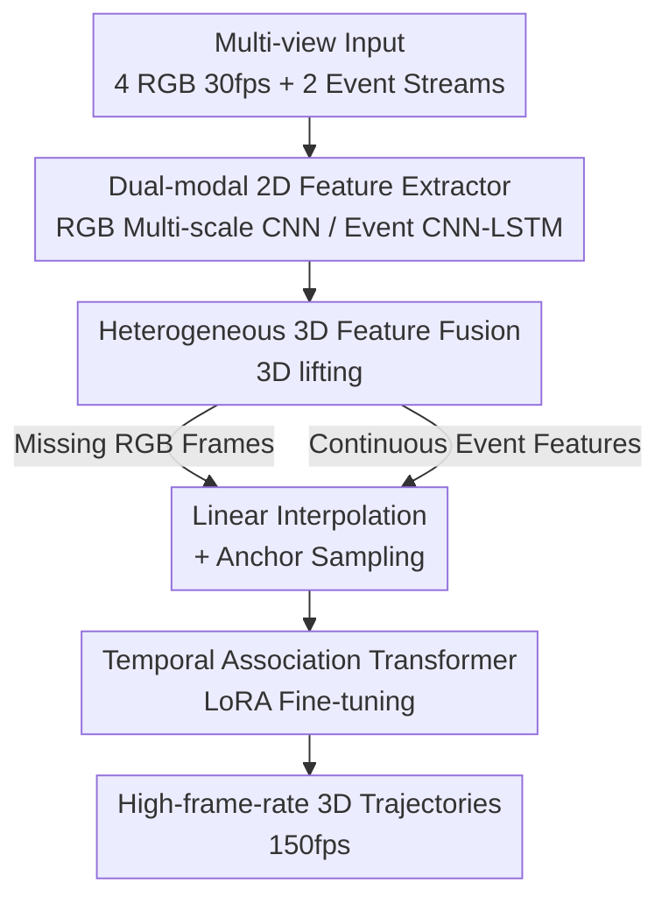

# MER-Tracker: Towards High-Speed 3D Point Tracking via Multi-View Event-RGB Hybrid Cameras

**Conference**: CVPR 2026  
**Paper**: [CVF Open Access](https://openaccess.thecvf.com/content/CVPR2026/html/Chang_MER-Tracker_Towards_High-Speed_3D_Point_Tracking_via_Multi-View_Event-RGB_Hybrid_CVPR_2026_paper.html)  
**Area**: Video Understanding / 3D Vision  
**Keywords**: 3D Point Tracking, Event Camera, Multi-view, High-speed Motion, Multi-modal Fusion

## TL;DR
To address the issues of low frame rates in standard RGB cameras (~30fps), which cause motion blur and missing dynamics in high-speed motion, this paper constructs a cuboid capture rig with "4 RGB + 2 Event cameras" and proposes MER-Tracker. By fusing the texture fidelity of RGB with the microsecond-level temporal resolution of event streams, it outputs accurate high-speed 3D point trajectories at 150fps, representing the first systematic work in high-speed 3D point tracking.

## Background & Motivation
**Background**: 3D point tracking aims to estimate continuous and temporally consistent trajectories of arbitrary points in 3D space from visual observations. Recent monocular methods (e.g., SpatialTracker, TAPIP3D, DELTA) lift 2D points to 3D for tracking, while multi-view methods (e.g., MVTracker, Dynamic 3DGS) utilize fixed viewpoints for complete coverage with fewer occlusions, showing rapid progress.

**Limitations of Prior Work**: Most successes are limited to low-speed motion. Truly high-speed phenomena—running humans, flapping insect wings, or rotating rotors—are difficult to reconstruct faithfully. The bottleneck lies in the **perception side**: commercial RGB sensors operate at ~30fps, leading to motion blur and large inter-frame intervals that miss critical dynamic information.

**Key Challenge**: Increasing frame rates by stacking high-speed RGB cameras incurs massive storage/bandwidth overhead and requires intense lighting, making experimental conditions overly restrictive. Conversely, event cameras (DVS) offer microsecond temporal resolution and high dynamic range but encode temporal derivatives of brightness changes—excelling at capturing edges and motion onset while lacking dense texture and being insensitive to static regions. Both modalities have inherent weaknesses.

**Goal**: (1) Build an Event–RGB fusion rig capable of multi-view, multi-modal spatiotemporal synchronization; (2) Extract complementary 3D motion features from both modalities and fuse them into a precise high-frame-rate spatiotemporal representation; (3) Establish temporally continuous associations between the high-frame-rate representation and each query point, guiding a Transformer to learn generalizable high-speed 3D trajectories.

**Key Insight**: Given RGB's texture fidelity and event streams' temporal sharpness, can the two be fused to recover high-frame-rate 3D point trajectories for high-speed motion?

**Core Idea**: Use "low-frame-rate textured RGB" for spatial structure and "continuous but sparse event streams" for temporal details. Perform heterogeneous fusion in 3D space, and use a LoRA-tuned Temporal Transformer to extend discrete observations into continuous 150fps 3D trajectories.

## Method

### Overall Architecture
MER-Tracker solves the problem of "inputting 4 low-frame-rate (30fps) blurred RGB images + 2 continuous event streams to output high-frame-rate (150fps) 3D point trajectories." The pipeline consists of three sequential stages: first, a **dual-modal 2D feature extractor** extracts motion features from RGB and events at their respective native rates; second, **heterogeneous 3D feature fusion** lifts features from both modalities into a unified 3D space, using linear interpolation to fill missing high-frame-rate RGB features and anchor sampling to balance spatial distribution, resulting in compact spatiotemporal descriptors; finally, a **Temporal Association Transformer (LoRA fine-tuned)** utilizes temporal nearest-neighbor associations to extend query points into complete high-frame-rate 3D trajectories. The rig uses VGGT for initial point clouds (query 3D points) and depth maps, with camera parameters obtained through spatiotemporal calibration.

### Key Designs

**1. Dual-modal 2D Feature Extractor: Leveraging strengths at native rhythms**

RGB provides low-frame-rate discrete images with dense texture, while event cameras provide continuous asynchronous event streams with strong temporal dependence but minimal single-step texture. Forcing them into a single network would be counterproductive. This work performs temporal alignment before extracting features separately. For events, asynchronous events within a window $(t_{start}, t_{end})$ are uniformly distributed into $B=5$ continuous non-overlapping bins to form an event voxel grid; each event contributes to adjacent bins based on time. Due to temporal dependence and sparse texture, a CNN-LSTM (three conv layers + LSTM, hidden dim 256) extracts fine-grained 2D features $\psi(E_m)$ and projects them to the same dimension as RGB. For RGB, a standard CNN $\phi(I_n(t_i))$ extracts dense appearance features at four scales. Thus, RGB handles "appearance" while events handle "motion," allowing each branch to excel without being diluted by the other's weaknesses.

**2. Heterogeneous 3D Feature Fusion: Solving temporal jitters and spatial imbalance**

After lifting multi-view 2D features to 3D using depth and camera parameters, each valid pixel $(u_x, u_y)$ is projected via:

$$x_v = E_t^{v-1}\,(K_t^{v-1}\,(u_x, u_y, 1)^\top \cdot D_t^v[u_y, u_x])$$

into 3D with its corresponding 2D features, forming 3D feature point clouds $X_I^n(t)$ and $X_E^m(t)$ for each camera at each timestamp. However, simply concatenating point clouds from all views at each high-frame-rate timestamp causes two issues: **Q1 Temporal Incoherence**—fusion features suddenly degrade when low-frame-rate RGB frames are absent; **Q2 Spatial Imbalance**—naive merging results in over-dense points in some areas and sparsity in others.

To address Q1, this work assumes strong temporal coherence in high-speed trajectories and approximates the RGB feature space evolution as linear. Missing high-frame-rate features are recovered via linear interpolation: given adjacent low-frame-rate timestamps $t_1, t_2$ and a target high-frame-rate timestamp $t_T \in (t_1, t_2)$, $X_I^n(t_T) = \alpha X_I^n(t_1) + (1-\alpha) X_I^n(t_2)$, where $\alpha = (t_T - t_1)/(t_2 - t_1)$. For Q2, a "merge-then-anchor-sample" approach is used: dual-modal features are aggregated, followed by Farthest Point Sampling (FPS)—$X(t_T) = \mathrm{FPS}(\{X_I^i(t_T)\}_i, \{X_E^j(t_T)\}_j)$. Similar to PointNet++, FPS iteratively selects points by maximizing the minimum distance between sampled points, achieving a balanced distribution while preserving geometric structure. These three steps together ensure smoother temporal transitions and balanced spatial distributions without losing structural detail.

**3. Temporal Association Transformer + LoRA Fine-tuning: Explicitly modeling frame coupling in "slow motion"**

Once 3D features are obtained, they must be associated with query points for trajectory prediction. Instead of relying solely on spatial associations (e.g., triplane projection or kNN), this work introduces **temporal associations** to form a joint spatiotemporal nearest-neighbor association. For each query point at target time $t_T$, $K$ nearest neighbors $C_{t_T}$ are found in the fused 3D feature point clouds of three adjacent frames $t_{T-1}, t_T, t_{T+1}$. The intuition is that at high frame rates, motion is essentially "slow motion," where positions are tightly coupled with immediate neighbors. Modeling this coherence yields stronger representations and preserves trajectory continuity. A relationship token $G_{t_T} = \mathrm{Enc}(C_{t_T})$ is then iteratively fed into the Transformer. To leverage large-scale pre-training while minimizing costs, the Transformer is initialized with MVTracker weights and fine-tuned using LoRA (Low-Rank Adaptation) on synthetic data.

### Loss & Training
The model is trained for 20k steps on 70 custom FMV-Kubric synthetic scenes using 2 NVIDIA A6000 GPUs (60GB VRAM) for approximately 40 hours. Batch size is 2, implemented in PyTorch. Trajectory prediction follows the token construction and Transformer design of MVTracker with an iterative training schedule; the FPS downsampling rate is 0.3.

## Key Experimental Results

### Main Results
Evaluations are conducted on three datasets: synthetic FMV-Kubric (70 train / 30 test, high-altitude free fall), FMV-Panoptic adapted from Panoptic (frame extraction + blurring + v2e event conversion, 6 views, human actions like basketball/throwing), and self-captured Real Object (5 high-speed small objects, no ground truth, using an additional 150fps camera + Depth-Anything reprojection with masked RMSE as a proxy metric). Competitors include two-stage pipelines: either linear interpolation on low-frame-rate trajectories or high-frame-rate video reconstruction via Repeat/Inter(RIFE)/E2V(e2vid) followed by MVTracker/triplane-SpaTracker.

| Dataset | Metric | Prev. SOTA (MVTracker+Frame.Inter+E2V) | Ours | Gain |
|--------|------|------|------|------|
| FMV-Kubric (30) | AJ ↑ | 63.5 | **72.3** | +8.8 |
| FMV-Kubric (30) | δavg ↑ | 75.2 | **82.4** | +7.2 |
| FMV-Kubric (30) | MTE ↓ | 2.0 | **1.2** | −0.8 |
| FMV-Panoptic (6) | AJ ↑ | 65.2 | **76.3** | +11.1 |
| FMV-Panoptic (6) | OA ↑ | 82.6 | **91.5** | +8.9 |
| Real Object (5) | RMSE ↓ | 0.307 | **0.228** | −0.079 |

Notably, all competitors use models trained on the MV-Kub 5K scenes, while Ours is initialized from MVTracker and fine-tuned only on 70 FMV-Kubric scenes, yet it leads across all benchmarks.

### Ablation Study
Incremental module addition (FMV-Kubric, AJ↑):

| Configuration | AJ↑ | Description |
|------|------|------|
| Baseline (RGB only → MVTracker) | 61.9 | Starting point |
| + Direct 3D Merge | 65.8 | Introducing event 3D features, +3.9 |
| + 3D Interpolation | 68.3 | Filling missing high-rate RGB features, +2.5 |
| + 3D Interp. + Anchor Sampl. | 71.2 | Balancing spatial distribution, +2.9 |
| + Interp. + Sampl. + Temp. TF (Full) | 72.3 | Adding Temporal Assoc. Transformer, +1.1 |

Camera count ablation (FMV-Kubric):

| # RGB | # DVS | AJ↑ | δavg↑ | OA↑ | MTE↓ |
|--------|--------|------|------|------|------|
| 4 | 0 | 61.9 | 72.7 | 87.9 | 2.3 |
| 4 | 1 | 68.1 | 78.6 | 89.9 | 1.6 |
| 3 | 2 | 70.6 | 81.1 | 91.0 | 1.4 |
| 4 | 2 | **72.3** | **82.4** | **91.5** | **1.2** |

### Key Findings
- Introducing the event modality itself (direct 3D merge) provides the largest single-step gain (AJ +3.9), confirming that event streams providing temporal detail are the core lever for this task. Interpolation and anchor sampling add ~2.5–2.9 each, with the Temporal Transformer providing the final +1.1.
- Camera count experiments show that once a baseline number of RGB views is reached, **adding event cameras becomes the dominant factor for performance**—moving from `4 RGB + 0 DVS` (61.9) to `4 RGB + 2 DVS` (72.3) yields a 10.4 increase, while `3 RGB + 2 DVS` (70.6) already approaches the 4+2 setup, indicating scalability.
- Cross-dataset generalization is a highlight: despite LoRA fine-tuning on only 70 synthetic scenes, the model outperforms baselines trained on 5K scenes when tested on FMV-Panoptic and real objects, validating the fused representation and LoRA transfer.

## Highlights & Insights
- **Task as Contribution**: Systematically proposes the "high-speed 3D point tracking" task, complete with hardware, methodology, real+synthetic datasets, and an evaluation protocol—opening a new direction with scientific value (capturing physics like insect flight or rotations).
- **Compensating Sensor Weaknesses via Modality Complementarity**: RGB provides texture/spatial structure while events provide microsecond temporal sharpness. Fusing them in 3D solves each other's flaws, requiring less storage/bandwidth than high-speed RGB and lower lighting.
- **"Interpolation + Merge + Sampling" Logic**: Identifies that simple concatenation causes temporal incoherence (Q1) and spatial imbalance (Q2), and addresses them with linear interpolation and FPS anchor sampling. This logic is transferable to any "asynchronous + discrete multi-modal point cloud alignment" scenario.
- **Proxy Evaluation for Real Data**: Lacking high-frame-rate depth ground truth for real scenes, the use of a 150fps camera for a new viewpoint and depth estimation from Depth-Anything for masked RMSE provides a quantifiable indirect metric for real-world high-speed scenarios.

## Limitations & Future Work
- **Dependency on External Modules**: Initial query point clouds and depth maps come from VGGT, and event camera depth is back-projected from RGB. Upstream errors propagate directly to 3D lifting and trajectories. The "ground truth" for real objects is itself a proxy from Depth-Anything.
- **Linear Interpolation Assumption**: Approximating RGB feature space evolution as linear holds only under "strong temporal coherence." For abrupt changes, collisions, or high-deformation motion, linear interpolation may produce incorrect intermediate features.
- **Scale and Rig Restrictions**: The current 6-camera cuboid rig is for lab-scale testing. The lack of high-speed depth cameras prevents standard quantitative benchmarking on real datasets. Scaling to humans or vehicles requires mocap frameworks or outdoor setups.
- **Synthetic Dependency**: Training relies primarily on Kubric free-fall scenes. Performance under complex real-world high-speed motion (multi-object interaction, non-rigid bodies) remains to be further validated.

## Related Work & Insights
- **vs MVTracker**: MVTracker performs online 3D point tracking on synchronized multi-view RGB, but fails in high-speed scenarios due to frame loss and blur. This work reuses its token construction and Transformer backbone while adding event modalities, heterogeneous fusion, and temporal association to push the boundary to high speed.
- **vs SpatialTracker / TAPIP3D / DELTA**: These are monocular 3D trackers (triplane lift, multi-scale features, etc.) assuming low-speed monocular input. This work addresses multi-view + multi-modal + high-speed scenarios.
- **vs Event Reconstruction (E2NeRF / EventNeRF / Evagaussians / E-4DGS)**: These use event streams for 3D reconstruction (mostly static/quasi-static) or deblurring. This work applies event streams to "high-speed 3D point-level correspondence," highlighting the value of point tracking for event-based stereovision.

## Rating
- Novelty: ⭐⭐⭐⭐⭐ First systematic high-speed 3D tracking task, Event-RGB fusion + dedicated rig/dataset/protocol.
- Experimental Thoroughness: ⭐⭐⭐⭐ Three datasets + two ablation sets + cross-domain tests, but lacks real high-rate depth GT and synthetic motion diversity.
- Writing Quality: ⭐⭐⭐⭐ Clear breakdown of Q1/Q2, effective diagrams, though some notation is occasionally dense.
- Value: ⭐⭐⭐⭐⭐ High scientific and application value for high-speed observation in robotics/reconstruction.

<!-- RELATED:START -->

## Related Papers

- [\[CVPR 2026\] MV-TAP: Tracking Any Point in Multi-View Videos](mv-tap_tracking_any_point_in_multi-view_videos.md)
- [\[CVPR 2026\] SpikeTrack: High-performance and Energy-efficient Event-Based Object Tracking with Spiking Neural Network](spiketrack_high-performance_and_energy-efficient_event-based_object_tracking_wit.md)
- [\[CVPR 2026\] SMV-EAR: Bring Spatiotemporal Multi-View Representation Learning into Efficient Event-Based Action Recognition](smv-ear_bring_spatiotemporal_multi-view_representation_learning_into_efficient_e.md)
- [\[CVPR 2026\] SDTrack: A Baseline for Event-based Tracking via Spiking Neural Networks](sdtrack_a_baseline_for_event-based_tracking_via_spiking_neural_networks.md)
- [\[CVPR 2026\] Event6D: Event-based Novel Object 6D Pose Tracking](event6d_event-based_novel_object_6d_pose_tracking.md)

<!-- RELATED:END -->
