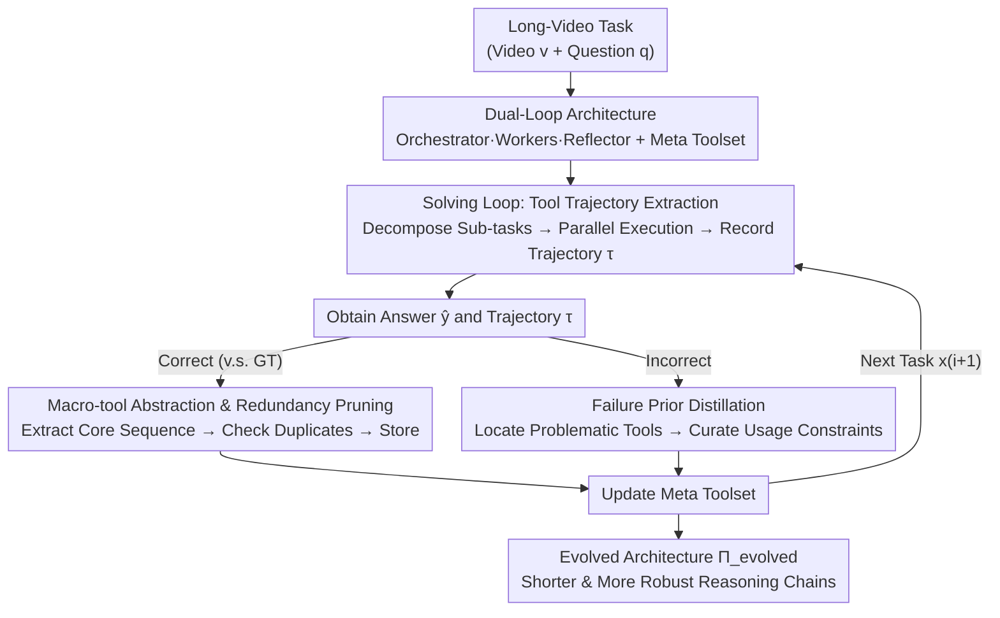

# META: Meta Evolution of Tool Trajectory Adaptation for Long-Video Understanding

**Conference**: CVPR 2026  
**Paper**: [CVF Open Access](https://openaccess.thecvf.com/content/CVPR2026/html/Huang_META_Meta_Evolution_of_Tool_Trajectory_Adaptation_for_Long_Video_Understanding_CVPR_2026_paper.html)  
**Area**: Video Understanding / Agent  
**Keywords**: Long-video understanding, Tool agent, Macro-tool evolution, Tool trajectory, Training-free  

## TL;DR
META enables a training-free video understanding agent to "self-evolve its toolbox" through iterative problem-solving. It condenses recurring multi-step tool combinations from successful trajectories into reusable macro-tools and distills failure trajectories into tool usage constraints. Without updating any parameters, it improves strong VLMs by 4.6%–7.6% across three long-video benchmarks.

## Background & Motivation

**Background**: Long-video understanding (ranging from several minutes to 2 hours) currently follows two paradigms. One is end-to-end MLLMs (e.g., LLaVA-OneVision, Qwen2.5/3-VL) that ingest sampled frames directly. The other is an agentic tool pipeline that decomposes tasks into sub-tasks and calls "micro-tools" (e.g., shot segmentation, object detection, tracking/ReID, OCR) to extract fine-grained visual evidence, followed by an LLM "think–act–reflect" reasoning loop.

**Limitations of Prior Work**: Although the agentic approach captures fine-grained information, the **toolbox remains static**—it does not grow with experience. For every new task, the agent must re-assemble long chains of micro-tools like "shot segmentation → detection → tracking/ReID" from scratch. In long videos, critical evidence often appears for only a few seconds within hours of footage. If a mistake occurs in any step of these dozens of atomic operations, errors accumulate and amplify along the reasoning chain, leading to drift or hallucinations. A qualitative example in the paper is typical: to find "which jewelry she introduced while taking off her coat," a baseline agent calls `frame_query` 10 times to repeatedly confirm "if she is taking off her coat," resulting in total failure until the call limit is reached.

**Key Challenge**: In cross-task long-video scenarios, multi-step tool trajectory patterns like "shot segmentation → object detection → tracking" actually **recur frequently**, essentially representing task-agnostic perceptual skills. However, existing systems treat them as one-off isolated tool calls, lacking any mechanism to abstract, solidify, or reuse these multi-step structures. Consequently, the agent remains a permanent "tool user" rather than a "tool creator."

**Goal**: To enable agents to learn from their own past tool trajectories—elevating recurring multi-step structures into higher-level, reusable capabilities to shorten reasoning chains and suppress long-range error accumulation, all **without modifying any model parameters** (training-free, model-agnostic).

**Key Insight / Core Idea**: The authors treat the "trajectory" itself as a supervisory signal. In short: **using symbolic reflection on its own tool trajectories, the agent abstracts success patterns into macro-tools and distills failure patterns into failure priors**, allowing the toolbox to undergo "meta-evolution" alongside problem-solving experience.

## Method

### Overall Architecture

META is a multi-agent architecture $\Pi_i = (\pi_o, \{\pi_w\}, A_i)$ composed of three roles and an evolving toolbox, where **only the toolbox changes while all agents remain frozen**:

- **Orchestrator $\pi_o$** (Frozen VLM): Responsible for decomposing tasks into sub-tasks, dispatching tools, judging evidence sufficiency, and providing final answers;
- **Workers $\{\pi_w\}$** (Frozen perception/VLM modules): Each Worker executes assigned sub-tasks on the video using specific tools, operating independently and in parallel;
- **Reflector $\pi_r$** (Frozen): Performs symbolic analysis on trajectories after a task is completed to update the toolbox;
- **Meta Toolset $A_i$**: The only evolving component, containing both atomic micro-tools and progressively developed macro-tools.

The system performs a dual-loop "solving–evolving" cycle over a sequence of tasks $Q=\{(x_i,y_i)\}_{i=1}^N$: first, **Solving** to generate an answer and tool trajectory $(\hat{y}_i,\tau_i)=\mathrm{Sol}(\Pi_{i-1},x_i)$; then, **Evolving** to update the architecture using the trajectory and ground truth $\Pi_i=\mathrm{Evo}(\Pi_{i-1},(x_i,y_i),\tau_i)$. Initialized with only micro-tools in $A_0$, the goal is for the final evolved architecture $\Pi_{\text{evolved}}=\Pi_N$ to generalize better on unseen tasks from the same distribution:

$$\max_{\text{META}}\ \mathbb{E}_{(x',y')\sim D}\big[\mathbb{I}(f_{\Pi_{\text{evolved}}}(x')=y')\big]$$

### Key Designs

**1. Dual-Loop Architecture: Frozen Agents + Solely Evolving Toolbox**

To strengthen agents without training, the most direct temptation is to fine-tune the model, but that is costly and breaks model agnosticism. META's trade-off is to **freeze all agents and let evolution happen entirely at the toolbox layer**. Responsibilities are separated between Orchestrator (decision-making), Workers (perception execution), and Reflector (post-hoc refinement). The brilliance of this design is that capability accumulation is externalized into a readable, searchable, and prunable symbolic object (tool list + experience notes) rather than being crammed into model weights. Consequently, the evolved toolbox can be plugged into other agent frameworks (e.g., ReAct, Plan&Execute)—capabilities become "portable skills" rather than "model-specific weights."

**2. Solving Loop: Structural Tool Trajectory Logging**

This loop addresses how to leave a traceable chain of evidence during execution. At round $t$, the Orchestrator uses a decomposition strategy $\pi_o^{dec}$ to map the problem and context $C_t$ into sub-task–tool assignments $\{(s_j,A_j)\}_{j=1}^{n_t}=\pi_o^{dec}(q_i,C_t)$. Each sub-task is executed by a Worker $r_j=\pi_w^j(s_j,v_i,A_j)$. Workers operate independently and thus naturally in parallel, which is crucial for long-video evidence gathering. Results are aggregated into the shared context $C_{t+1}=C_t\cup\{(s_j,r_j)\}_{j=1}^{n_t}$, and the Orchestrator judges if evidence is sufficient: $\text{Proceed}=\neg\pi_o^{judge}(C_{t+1},q_i)$. The process records a structural trajectory $\tau_i=\{(s_j,A_j,r_j)\}_t$, which precisely logs "which micro/macro-tools were called in what combination," serving as the supervision signal for the Evolving loop.

**3. Evolving Loop (Success): Macro-tool Abstraction and Redundancy Pruning**

This is META's primary engine for improvement. When $z_i=1$ (correct), the Reflector extracts the core sub-sequence that actually contributed to the result and solidifies it as a new macro-tool:

$$a_{\text{new}}=\mathrm{abstract}\big(\mathrm{extract\_core}(\tau_i)\big)$$

The function $\mathrm{extract\_core}(\cdot)$ removes redundant, failed, or exploratory steps. Crucially, a **functional duplicate check** is performed before storage; a tool is only added if it is not covered by existing ones:

$$A_{i+1}=\begin{cases}A_i\cup\{a_{\text{new}}\}, & \text{if }\forall a\in A_i,\ a_{\text{new}}\not\sqsubseteq a\\ A_i, & \text{otherwise}\end{cases}$$

This $\not\sqsubseteq$ (not contained) check prevents the toolbox from expanding infinitely. Experiments show macro-tool growth slows and converges, indicating it abstracts "reusable skills" rather than "memorizing task-specific procedures." Macro-tools compress high-frequency multi-step patterns (e.g., `dense_caption ⇒ clip_caption ⇒ slide_window` into `locate_specific_action`), directly shortening subsequent reasoning chains.

**4. Evolving Loop (Failure): Structural Failure Prior Distillation**

An agent must also know when a tool is unreliable. When $z_i=0$ (incorrect), the Reflector identifies problematic tools and distills structural failure priors:

$$(a_{\text{problem}},e_{\text{new}})=\pi_{\text{ref}}^{distill}(\tau_i)$$

The experience library $E$ is then updated **at the tool granularity**:

$$E_{i+1}(a)=\begin{cases}\mathrm{curate}(E_i(a),e_{\text{new}}), & \text{if }a=a_{\text{problem}}\\ E_i(a), & \text{otherwise}\end{cases}$$

These priors are added as "Experience Notes" to tool descriptions (e.g., an OCR note: "setting `extract_all=False` may miss details"). This narrows the usage boundaries of tools. Together, the two paths allow the toolbox to grow new capabilities while adding "instruction manuals" to existing tools, leading to shorter and more stable trajectories.

## Key Experimental Results

### Main Results

Evaluated on three long-video benchmarks: Video-MME (254 hours, 2700 multimodal QAs), MLVU (minutes to 2 hours, 9 task types), and LongVideoBench (up to 1 hour, 6678 MCQs).

| Method | Params | MLVU | Video-MME | LongVideoBench |
|------|------|------|-----------|----------------|
| Qwen2.5-VL-Instruct | 7B | 68.8 | 65.1 | 56.0 |
| Qwen3-VL-Instruct | 8B | 78.1 | 71.4 | 58.0 |
| VideoRAG | 7B | 72.4 | 62.1 | 58.7 |
| Vgent | 7B | 72.1 | 68.9 | 59.7 |
| VideoLucy | 7B | 76.1 | 72.5 | 58.8 |
| **Qwen2.5-VL + META** | 7B | 78.0 | 73.7 | 61.9 |
| **Qwen3-VL + META** | 8B | **83.6** | **77.7** | **63.6** |

Relative to backbones, META brings gains of approximately +4.6% / +5.9% / +7.6% on MLVU/Video-MME/LongVideoBench respectively, with the highest gain on LongVideoBench which requires most stable long-range reasoning.

### Ablation Study

Incremental components added to Qwen3-VL-8B:

| Orch-Worker | Micro-tool Evo | Macro-tool Evo | MLVU | Video-MME |
|:---:|:---:|:---:|------|-----------|
| – | – | – | 78.1 | 71.4 |
| ✓ | – | – | 80.8 | 73.5 |
| ✓ | ✓ | – | 81.9 | 75.7 |
| ✓ | – | ✓ | 83.0 | 76.6 |
| ✓ | ✓ | ✓ | **83.6** | **77.7** |

The Orchestrator-Worker framework provides initial gains; both micro and macro-tool evolution further increase performance, with **macro-tool evolution contributing significantly more**, validating that abstracting multi-step patterns is the core source of gain.

### Key Findings

- **Macro over Micro**: Macro-tool evolution has a larger impact. As macro-tool usage rises, reasoning trajectories shorten by 25.9%.
- **Data Scalability**: Evolution is effective across different sample sizes and larger backbones (e.g., Qwen3-VL-30B).
- **Non-overfitting**: Stability in gains under "no truth evolution" (no GT labels) and strict train-test isolation protocols proves the benefits come from the framework, not dataset memorization.
- **Portability**: Macro-tools evolved via META significantly improved ReAct (+3.3) and Plan&Execute (+2.8) frameworks, proving they are general high-level skills.
- **Macro-tool Progression**: Qualitative analysis shows macro-tools evolve from simple linear micro-tool stitching to complex "cross-validation" patterns that assess answer reliability and detect hallucinations.

## Highlights & Insights

- **Trajectories as First-Class Citizens**: While most agents treat logs as temporary, META uses structural trajectories as core supervision—abstracting successes and distilling failure constraints.
- **Externalized Capabilities**: Growth is captured in a symbolic tool list and experience notes, making it naturally model-agnostic and portable.
- **Redundancy Pruning**: The duplicate check is critical for preventing toolbox inflation and distinguishing "memorization" from "abstraction."
- **Dual-Path Reflection**: The clean separation of adding capabilities (macro-tools) and adding constraints (failure priors) suppresses error accumulation from both ends.

## Limitations & Future Work

- **Tool-Layer Limitation**: Evolution is restricted to the toolbox; future work aims for "structural evolution" where the agent architecture itself adapts.
- **Reflector Dependency**: Weak reflectors significantly degrade performance, indicating that high-level reflection is the bottleneck for continuous evolution.
- **Convergence on Fixed Distributions**: Macro-tool growth plateaus after several iterations, suggesting finite evolution space on static distributions; continuous evolution in open-world settings remains unverified.

## Related Work & Insights

- **vs. Static Tool Agents (VideoAgent, VideoLucy, etc.)**: These use fixed toolsets; META enables growth and pattern solidification to suppress long-range drift.
- **vs. Agent Evolution (Alita, Memento)**: While prior work explored dynamic MCP or memory-based RL, META focuses on the multimodal long-video domain and explicitly models tool usage boundaries via failure priors.
- **vs. End-to-End MLLMs**: META provides an orthogonal and additive performance boost on top of existing backbones by evolving "tool capabilities" rather than "model weights."

## Rating
- Novelty: ⭐⭐⭐⭐⭐ First training-free tool-level meta-evolution framework; the dual-path reflection on trajectories is novel and self-consistent.
- Experimental Thoroughness: ⭐⭐⭐⭐ Solid multi-benchmark evaluation and multi-dimensional ablations; however, verification is primarily within the Qwen family.
- Writing Quality: ⭐⭐⭐⭐ Clear motivation-method-evidence chain with good qualitative examples.
- Value: ⭐⭐⭐⭐⭐ High practical value for long-video agents due to its training-free, model-agnostic, and portable nature.

<!-- RELATED:START -->

<!-- Paper links would go here -->

<!-- RELATED:END -->

## Related Papers

- [\[CVPR 2026\] VideoSeek: Long-Horizon Video Agent with Tool-Guided Seeking](videoseek_long-horizon_video_agent_with_tool-guided_seeking.md)
- [\[CVPR 2026\] Video Panels for Long Video Understanding](video_panels_for_long_video_understanding.md)
- [\[CVPR 2026\] LongVT: Incentivizing "Thinking with Long Videos" via Native Tool Calling](longvt_incentivizing_thinking_with_long_videos_via_native_tool_calling.md)
- [\[CVPR 2026\] TrajTok: Learning Trajectory Tokens Enhances Video Understanding](trajtok_learning_trajectory_tokens_enables_better_video_understanding.md)
- [\[CVPR 2026\] Efficient Frame Selection for Long Video Understanding via Reinforcement Learning](efficient_frame_selection_for_long_video_understanding_via_reinforcement_learnin.md)

<!-- RELATED:END -->
