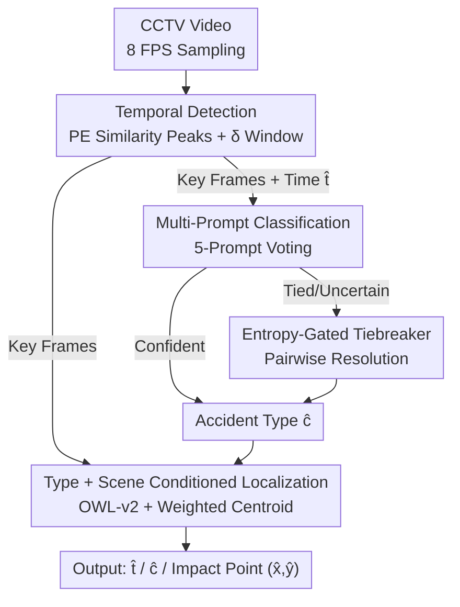

# Metadata-Aware Multi-Prompt Reasoning for Zero-Shot Accident Understanding

**Conference**: CVPR 2026  
**arXiv**: [2606.12047](https://arxiv.org/abs/2606.12047)  
**Code**: None  
**Area**: Video Understanding / Multimodal VLM / Traffic Accident Understanding  
**Keywords**: Zero-Shot Accident Understanding, Task Decomposition, Multi-Prompt Reasoning, Open-Vocabulary Detection, Temporal Localization

## TL;DR
This paper decomposes the task of "understanding traffic accidents from surveillance videos" into three independent sub-tasks: when, what, and where. The pipeline utilizes visual-language similarity to identify the impact moment, employs five complementary prompts with entropy-gating for accident type classification, and applies a type- and scene-conditioned open-vocabulary detector to localize the impact point. The entire framework is zero-shot, requires no fine-tuning, runs on a single 24GB GPU, and improves the harmonic mean score on the ACCIDENT@CVPR 2026 benchmark from a 0.349 baseline to 0.402.

## Background & Motivation
**Background**: Traditional methods for traffic accident analysis in surveillance or dashcam footage (e.g., DSAR-NN, CADP, DoTA, TAD) mainly focus on detecting "if" and "when" an accident occurs. Accident **types** are often treated as auxiliary labels, and the impact **location** is rarely explicitly modeled. The ACCIDENT@CVPR 2026 challenge requires the simultaneous output of three elements: accident time, collision type (rear-end / T-bone / head-on / sideswipe / single), and impact point pixel coordinates.

**Limitations of Prior Work**: Vision-Language Models (VLMs) are naturally suited for interpreting visual evidence via text queries. However, if accident analysis is formulated as a single **end-to-end prompt** requiring the model to answer all questions at once, the model must make multiple complex judgments simultaneously. This results in unstable outputs and a tendency for the model to take "shortcuts"—focusing on prominent vehicles or background cues rather than the specific interacting entities. Since accident categories are visually similar and the decisive impact often occurs in only a few frames, these issues are exacerbated.

**Key Challenge**: A single monolithic prompt forces the VLM to handle temporal localization, classification, and spatial localization simultaneously. These objectives interfere with each other, where a mistake in one component can pollute the entire output. Real CCTV footage, characterized by low resolution, compression artifacts, occlusions, and shallow camera angles, further complicates this "all-in-one" approach.

**Goal**: Under a zero-shot setting without any real-world annotations (using only the CARLA synthetic development set), the goal is to **decouple** the "when, what, and where" of an accident. Each sub-task is addressed independently using the most suitable tools and focused queries.

**Core Idea**: Replace the end-to-end prompt with a three-stage when $\to$ what $\to$ where pipeline. Each stage receives narrower input and more specific questions, leading to more reliable VLM reasoning and allowing for independent component upgrades.

## Method

### Overall Architecture
The system is a three-stage serial pipeline that takes a fixed CCTV video as input and outputs (accident time $\hat{t}$, accident type $\hat{c}$, impact point $(\hat{x}, \hat{y})$). The **when stage** uses Meta's Perception Encoder (a CLIP-like contrastive VLM) to score each frame based on its similarity to the "traffic accident" text query. It selects peak similarity frames and expands a $\delta=2$ second window around them to capture the impact-centric segment; the accident time is the window midpoint. Key frames within this window are passed to the next stages. The **what stage** uses five complementary structured prompts to query Qwen-3.5-VL 9B for a majority vote on the classification, triggered by an entropy/margin gate for tie-breaking. The **where stage** employs the predicted accident type and scene layout to condition an OWL-v2 open-vocabulary detector. Bounding boxes are aggregated across key frames, and the impact point is determined as the score-weighted centroid. The pipeline uses only open-source weights without fine-tuning.

### Key Designs

**1. Temporal Detection: "Boxing" the Accident via Semantic Similarity Peaks + $\delta$-Window**  
Accidents are temporally sparse in surveillance footage; most frames are uninformative for VLMs. Directly feeding the entire clip is computationally expensive and introduces noise. Ours first uses Perception Encoder (PE-Core-G14-448) to encode each 8 FPS frame $f_i$ into $\mathbf{v}_i$ and the text query "traffic accident" into $\mathbf{t}$. The cosine similarity is calculated as $s_i = \frac{\mathbf{v}_i^\top \mathbf{t}}{\|\mathbf{v}_i\| \|\mathbf{t}\|}$. The top-5 peak frames are selected. Instead of relying on a single frame, the earliest $\min_j\tau_j$ and latest $\max_j\tau_j$ timestamps are expanded by $\delta=2$ seconds to form a window $[\min_j\tau_j-\delta, \max_j\tau_j+\delta]$. The accident time is estimated as $\hat{t} = \frac{\min_j\tau_j + \max_j\tau_j}{2}$. This expansion preserves context around the impact while discarding irrelevant frames. Ablations show this $\delta$-window improves the score by 0.039 over using only the top-1 PE frame, indicating that single-frame similarity is a noisy temporal estimator.

**2. Structured Multi-Prompt Classification + Entropy Gating: Complementary Perspectives with Adaptive Compute**  
Accident categories depend on various cues: vehicle motion, contact geometry, impact angle, and entity counts. A single prompt cannot capture all nuances. Ours applies 5 complementary prompts to the same key frames and metadata $M$ (layout, weather, time, quality) using Qwen-3.5-VL 9B: direct classification, temporal motion, geometric contact reasoning, contrastive exclusion, and tiebreaker. Each prompt $p_i$ yields a category $y_i$. To address unreliable majority voting when votes are dispersed (e.g., 2:2:1), **uncertainty-aware aggregation** is used. We calculate the top-2 margin $m = n_{(1)} - n_{(2)}$ and normalized entropy $\tilde{H} = -\frac{1}{\log_2 K} \sum_c \hat{p}_c \log_2 \hat{p}_c$ (where $\hat{p}_c = n_c/|\mathcal{Y}|$ and $K$ is the number of unique classes). If $m > \tau_m$ or $\tilde{H} \le \tau_H$ (defaults $\tau_m=2, \tau_H=0.75$), the majority class is returned. Otherwise, a two-level escalation occurs on a 6-frame subset: (i) a tiebreaker prompt is added for a new vote; (ii) if still tied, a focused **pairwise adjudication** between the top-2 classes $(c_1, c_2)$ is performed based on impact geometry. This gate ensures that clear samples follow a "fast path" while ambiguous ones receive more reasoning.

**3. Type + Scene Conditioned Localization: Shifting the Detector from "Find Cars" to "Find Impact Points"**  
A major difficulty in localization is that generic queries like "car crash" lead open-vocabulary detectors to box every vehicle in the scene (foreground bias), placing the centroid on the most prominent car rather than the contact zone. Ours uses the stage 2 predicted type $\hat{c}$ and scene layout $\ell$ (e.g., highway, signalized intersection) to condition the OWL-v2 query. Base phrases are customized by type (e.g., "car crashing into back of another car" for rear-end) and appended with scene context (e.g., "on a highway"). This directs the detector toward the contact area. For each key frame, OWL-v2 returns boxes with confidence $s_\ell$. Boxes with $s_\ell > \theta = 0.05$ are kept. Across all frames, the top-$K$ ($K=5$) boxes are aggregated, and the impact point is calculated as the score-weighted centroid: $\hat{x} = \frac{\sum_\ell s_\ell c^x_\ell}{\sum_\ell s_\ell}$. This aggregation implicitly enforces temporal consistency, where regions consistently detected across frames dominate the coordinate estimation.

### Loss & Training
The entire pipeline is zero-training and zero-fine-tuning, relying solely on inference from open-source weights. Stage 1 uses PE-Core-G14-448 in half-precision at 8 FPS. Stage 2 uses Qwen-3.5-VL 9B (via Ollama, 4-bit quantization, 12k context, 0.2 temperature) with 8 key frames. Stage 3 uses owlv2-base-patch16-ensemble. All components run on a single NVIDIA L4 (24GB).

## Key Experimental Results

### Main Results
The dataset is the zero-shot ACCIDENT@CVPR 2026 benchmark. The model was developed on CARLA synthetic data and tested on real-world CCTV clips. Evaluation uses three $[0, 1]$ metrics: Temporal score $\mathcal{T}$, Spatial score $\mathcal{S}$ (both Gaussian similarity based on error), and Classification score $\mathcal{C}$ (top-1 accuracy). The final score is the harmonic mean: $\text{score} = \frac{3}{1/\mathcal{T} + 1/\mathcal{S} + 1/\mathcal{C}}$.

| Method | Public LB | Private LB | $\mathcal{C}$ | $\mathcal{T}$ | $\mathcal{S}$ |
| :--- | :--- | :--- | :--- | :--- | :--- |
| Baseline A (Midpoint time + Image center) | 0.2714 | 0.2734 | 0.5807 | 0.1896 | 0.2505 |
| Baseline B (Quartile time + Image center) | 0.3107 | 0.3188 | 0.5807 | 0.2664 | 0.2505 |
| **Ours** | **0.3852** | **0.4015** | 0.5057 | 0.3689 | 0.3498 |

Note: Our classification score $\mathcal{C}$ (0.5057) is **lower** than the baseline (0.5807). This might be because the baseline always predicts a high-frequency class; however, the significant gains in $\mathcal{T}$ (0.19 $\to$ 0.37) and $\mathcal{S}$ (0.25 $\to$ 0.35) drive the overall harmonic mean higher.

### Ablation Study
Ablations modify one component at a time. Only the harmonic mean is reported for the leaderboard.

| Stage | Variant | Public | Private |
| :--- | :--- | :--- | :--- |
| Temporal | Uniform midpoint | 0.3444 | 0.3592 |
| Temporal | PE Top-1 frame | 0.3435 | 0.3627 |
| Temporal | **PE $\delta$-window midpoint (Ours)** | **0.3852** | **0.4015** |
| Classification | 1-prompt structured | 0.3801 | 0.3961 |
| Classification | 3-prompt majority vote | 0.3809 | 0.3978 |
| Classification | 5-prompt + tiebreaker | 0.3849 | 0.4001 |
| Classification | **+ Entropy-gated pairwise (Ours)** | **0.3852** | **0.4015** |
| Spatial | Molmo2 pointing | 0.2589 | 0.2647 |
| Spatial | Image center (0.5, 0.5) | 0.3358 | 0.3487 |
| Spatial | **OWL-v2 Type+Scene Conditioned (Ours)** | **0.3852** | **0.4015** |

### Key Findings
- **Spatial localization is the biggest contributor**: Conditioned OWL-v2 is 0.053 higher than the center baseline. Interestingly, using Molmo2 pointing (0.265) performed worse than the center baseline (0.349), confirming that pointing models suffer from foreground bias (pointing to obvious cars rather than the contact point).
- **Temporal windowing is crucial**: The $\delta$-window is 0.039 better than the PE top-1 frame, showing that single-frame temporal estimates are too noisy and smoothing is required.
- **Classification gains are stable but marginal**: Moving from 1-prompt to the full entropy-gated ensemble only adds 0.0054, suggesting that classification is the most mature but least impactful component for final score improvement in this pipeline.
- **Residual errors focus on two scenarios**: Long-distance collisions (where OWL-v2 misses or picks foreground cars) and harsh conditions (rain, night, occlusions).

## Highlights & Insights
- **Task Decomposition & Tool Specialization**: By transforming an end-to-end task into "Contrastive model for time / Generative VLM for type / Open-vocab detector for location," the system leverages the strengths of each model. This "using the right tool" engineering pattern allows a zero-shot system to outperform baselines on real CCTV.
- **Adaptive Compute via Entropy Gating**: Using margin $m$ and entropy $\tilde{H}$ to gate reasoning allows clear samples to be processed cheaply while reserving extra computation (tiebreakers, pairwise) for ambiguous cases. This is a clean implementation of "uncertainty-aware budget allocation."
- **Conditioned Queries to Help Foreground Bias**: Using the predicted type to condition the downstream detector query turns "find all cars" into "find the contact zone of this collision type." This semantic guidance is a powerful, low-cost way to mitigate foreground bias in grounding tasks.
- **Implicit Temporal Consistency**: Weighted centroids across frames ensure that regions consistently detected with high confidence dominate the output, effectively suppressing transient false positives without explicit smoothing modules.

## Limitations & Future Work
- **Author-Acknowledge Limitations**: Performance degrades significantly in long-distance collisions and harsh weather conditions (rain/night).
- **Classification Regression**: $\mathcal{C}=0.5057$ is lower than the baseline's 0.5807. This indicates the 5-prompt ensemble did not actually outperform a simple frequency-based baseline for classification itself; the final advantage comes from temporal and spatial dimensions.
- **Metadata Dependency**: Both what and where stages rely on metadata (layout, weather). If such metadata is missing, queries revert to generic terms, likely re-introducing foreground bias.
- **Empirical Gate Thresholds**: Thresholds like $\tau_m=2$ and $\tau_H=0.75$ were determined without labels. Their optimality across different accident distributions remains unverified.
- **Future Directions**: A dedicated small-object detection branch could address long-distance accidents. Lightweight calibration using the synthetic CARLA set could optimize gating thresholds.

## Related Work & Insights
- **vs DRAMA**: DRAMA also uses "what/where/why" structured questions for risk object localization. Ours applies a similar principle to **zero-shot accident understanding** (when/what/where) using a specialized model ensemble.
- **vs Thakur & Talele (Concurrent)**: This work used multi-prompt text descriptions with CLIP-based retrieval for accident classification. Ours instead treats multi-prompting as **complementary reasoning perspectives for generative VLMs**, layered with voting and pairwise resolution within a "perception-first" pipeline.
- **vs Standard Prompting (CoT/ToT)**: The multi-prompt voting inherits ideas from chain-of-thought and self-consistency to improve robustness but innovates by grounding it in a pipeline that moves from temporal selection to classification and then spatial grounding.

## Rating
- **Novelty**: ⭐⭐⭐ Components are off-the-shelf; the innovation lies in the when/what/where decomposition and the integration of entropy-gated reasoning with conditioned localization.
- **Experimental Thoroughness**: ⭐⭐⭐ Clear ablation of the three stages, though conducted on a single benchmark with limited feedback from the leaderboard.
- **Writing Quality**: ⭐⭐⭐⭐ Well-structured with clear motivations and consistent mathematical notation.
- **Value**: ⭐⭐⭐⭐ Provides a practical, single-GPU, zero-shot pipeline for accident understanding with modular components suitable for deployment.

<!-- RELATED:START -->

## Related Papers

- [\[CVPR 2026\] SkeletonContext: Skeleton-side Context Prompt Learning for Zero-Shot Skeleton-based Action Recognition](skeletoncontext_skeleton-side_context_prompt_learning_for_zero-shot_skeleton-bas.md)
- [\[CVPR 2026\] Protect to Adapt: Orthogonal Subspace Control with Ranked Negative-Prompt Curriculum for Few-Shot Action Recognition](protect_to_adapt_orthogonal_subspace_control_with_ranked_negative-prompt_curricu.md)
- [\[CVPR 2026\] No Need For Real Anomaly: MLLM Empowered Zero-Shot Video Anomaly Detection](no_need_for_real_anomaly_mllm_empowered_zero-shot_video_anomaly_detection.md)
- [\[CVPR 2026\] TF-CADE: Foreground-Concentrated Text-Video Alignment for Zero-Shot Temporal Action Detection](tf-cade_foreground-concentrated_text-video_alignment_for_zero-shot_temporal_acti.md)
- [\[CVPR 2026\] Memory Matters: Boosting Training-Free Zero-Shot Temporal Action Localization with a Learnable Lookup Table](memory_matters_boosting_training-free_zero-shot_temporal_action_localization_wit.md)

<!-- RELATED:END -->
