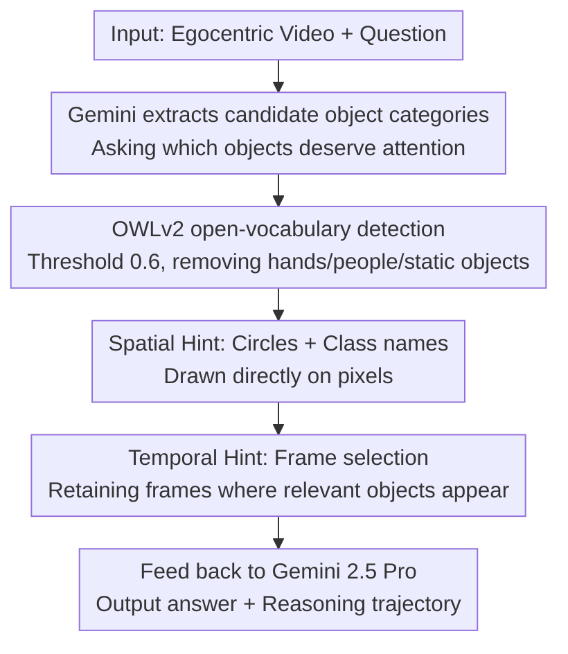

# Minerva-Ego: Spatiotemporal Hints for Egocentric Video Understanding

**Conference**: CVPR 2026  
**Paper**: [CVF Open Access](https://openaccess.thecvf.com/content/CVPR2026/html/Nagrani_Minerva-Ego_Spatiotemporal_Hints_for_Egocentric_Video_Understanding_CVPR_2026_paper.html)  
**Code**: https://github.com/google-deepmind/neptune (Available)  
**Area**: Video Understanding  
**Keywords**: First-person video, Visual reasoning, Benchmark, Spatiotemporal grounding, Visual prompting

## TL;DR
Minerva-Ego is a benchmark for complex reasoning in egocentric long videos, consisting of 1,160 human-annotated five-way multiple-choice questions. Each question is paired with a dense reasoning trajectory that binds "when (timestamp)" to "where (segmentation mask)". The authors reveal that state-of-the-art (SOTA) video models (Gemini 2.5 Pro at 40.1% vs. humans at 91.8%) are primarily bottlenecked by perceptual grounding. They demonstrate that directly prompting the model on pixels regarding "where to look" and "which frames to watch" can improve accuracy by up to approximately 5.8%.

## Background & Motivation

**Background**: Video reasoning models are core components for egocentric assistants and embodied agents. With the rise of multimodal LLMs, models can now process hour-long videos, approaching human levels on benchmarks like VideoMME, Neptune, and LVBench, while further improving through "thinking" (allocating more compute during inference for intermediate steps).

**Limitations of Prior Work**: Existing evaluations almost exclusively focus on the **correctness of the final answer**, failing to assess the intermediate reasoning process, and answers are mostly restricted to the text domain. Even works like EgoTempo, which focus on temporal localization, cannot evaluate "reasoning within long contexts." Furthermore, mainstream reasoning benchmarks (e.g., MINERVA) are largely exocentric (third-person), whereas egocentric videos are filled with close-up, high-frequency object interactions—requiring the model to **continuously track key objects**, a capability not tested by third-person benchmarks.

**Key Challenge**: When an evaluation only provides a success/failure signal for the final answer, it remains unknown **where the model failed**—whether it failed to see the correct object (perception), located the wrong time (temporal grounding), or suffered a break in the logic chain. By conflating these error causes into a single accuracy metric, evaluations lose diagnostic power and fail to guide improvements.

**Goal**: (1) Create a high-quality benchmark for egocentric, long-context videos requiring multi-step reasoning; (2) Enable evaluation decomposed into four dimensions: "perception, time, logic, and completeness"; (3) Validate whether "perceptual grounding" is the true bottleneck without retraining models and provide a viable path for mitigation.

**Key Insight**: The authors observe that since the core of egocentric reasoning is "tracking the right object at the right time," this information can be **explicitly annotated** (reasoning trajectories composed of timestamps and masks). This serves both as a fine-grained diagnostic tool and as a "hint" fed back into the model to verify bottlenecks.

**Core Idea**: Replace "answer-only labels" with "densely grounded spatiotemporal reasoning trajectories," upgrading video reasoning evaluation from a single accuracy metric to **diagnostic evaluation**. The authors propose **spatiotemporal hints**—directly drawing "where to look" on pixels and using frame selection to control "which frames to watch"—as a means to detect and mitigate perceptual grounding defects.

## Method

### Overall Architecture
The paper follows two parallel lines: **Benchmark and Diagnostic Evaluation** (data construction and error decomposition) and **Spatiotemporal Hinting** (feeding "where/which frame" information into frozen SOTA models during inference).

Benchmark Side: Using the high-quality egocentric kitchen dataset HD-EPIC as a base and reusing its object segmentation masks, professional annotators manually authored 1,160 difficult five-way questions. Each question includes a **reasoning trajectory** that binds every step of the derivation to specific timestamps and objects (linked to masks). This trajectory is the foundation: it supports diagnostic evaluation (scoring across perception, time, logic, and completeness, plus object recall) and serves as the source for "hints."

Method Side: The authors treat the annotations as signals for "where to look" and "which frames to watch," **drawing them directly onto the video frame pixels** for frozen models like Gemini. Spatially, key objects are circled with category names; temporally, only frames containing key objects are retained. An oracle (ground truth) is used to verify the upper bound, followed by a **fully automated agentic pipeline** (Gemini extracts categories $\rightarrow$ OWLv2 open-vocabulary detection $\rightarrow$ Highlighting $\rightarrow$ Frame selection $\rightarrow$ Feeding back to Gemini) to verify practical feasibility.

### Key Designs

**1. Spatiotemporally Grounded Reasoning Trajectories: Binding "Where" and "When" into Labels**
To address the "answer-only, no diagnosis" pain point, this work annotates a dense reasoning trajectory for each question. It consists of natural language steps, each **bound to specific timestamps** (e.g., "03:50 rinsing the egg for the second time") and **specific objects** linked to ground truth masks. On average, trajectories are 122 words long, citing 6.3 timestamps and 2.8 objects (up to 20), with video lengths ranging from 10 seconds to 75 minutes. This structure allows the evaluation of whether the model looked at the right object at the right time, rather than just checking the final choice. Unlike works like VideoCoT or VideoEspresso that use frozen models to generate noisy trajectories, this is **purely human-annotated** for maximum reliability.

**2. Three-step Manual Pipeline + Modality Bias Filtering: Quality over Scale**
To avoid model bias and noise from semi-automatic labeling, the authors used a purely human pipeline: (i) **Selection**—Taking videos from HD-EPIC and overlaying existing masks for annotators; (ii) **Annotation & Verification**—Annotators write questions, answers, and trajectories. A separate group of **independent annotators attempts to answer**, and discrepancies are resolved by a third group through **arbitration and revision**; (iii) **Post-processing**—Filtering out questions with **modality bias** (decidable by text-only QA). The scale was kept to ~1,000 questions to manage LLM inference costs.

**3. MiRA Diagnostic Evaluation: Decomposing Errors into Perception, Time, Logic, and Completeness**
Borrowing from the MiRA scoring criteria in MINERVA, an LLM evaluates model-generated trajectories on a 3-level Likert scale across four dimensions: **Perceptual correctness, Temporal grounding, Logical reasoning,** and **Completeness**. Additionally, **object recall** is calculated. Results indicate that while models perform reasonably well in logic and completeness, **perceptual correctness is the weakest link**, with object recall only between 20–50%. This finding—that models often fail to track the correct objects—directly motivated the spatiotemporal hint method.

**4. Spatiotemporal Hint Injection: Telling the Model "Where" and "Which Frame"**
To mitigate perceptual grounding defects without retraining, the authors **modify the visual input**. Spatially: Key objects are highlighted using **red mask outlines/boxes/ellipses** with **category names**. "Circles + category names" performed best—circles feel more natural than boxes or masks, and category names alone provided a 2.6–2.8% gain. Temporally: Under a fixed frame budget, **frames containing relevant objects are prioritized**. This alone provided a ~2.9% gain. In the oracle setting, the combination improved accuracy from 44.5% to 50.3% (+5.8%). This extends "Set-of-Mark" style visual prompting to the **spatiotemporal domain**.

## Key Experimental Results

### Main Results: SOTA Model Evaluation (MCQ Accuracy)
Random baseline for five-way MCQ is 20%. Models were fixed to 64 frames (except Qwen-3 at 1fps and humans at full frame rate).

| Model | Frames | Thinking | MCQ Accuracy |
|------|------|----------|-----------|
| Random | - | - | 20.0% |
| Qwen-3 | Full@1fps | Yes | 29.3% |
| Claude Sonnet 4 | 64 | Yes | 30.5% |
| Gemini 2.5 Flash | 64 | No | 31.7% |
| Gemini 2.5 Flash | 64 | Yes | 35.6% |
| GPT-4.1 | 64 | No | 30.8% |
| GPT-5 | 64 | Yes | 37.6% |
| **Gemini 2.5 Pro** | 64 | Yes | **40.1%** |
| **Human** | Full | Yes | **91.8%** |

Even the strongest model, Gemini 2.5 Pro, reached only 40.1%, trailing humans by ~50 points. Enabling "thinking" significantly helps complex questions (Flash: 31.7% $\rightarrow$ 35.6%).

### Ablation Study: Frame Count (Gemini only)

| Frames | Gemini 2.5 Flash (No thinking) | Gemini 2.5 Pro |
|------|------|------|
| 0 (QA only) | 24.5% | 27.5% |
| 1 | 23.0% | 29.3% |
| 64 | 31.7% | 40.1% |
| 256 | 37.7% | 44.5% |
| 512 | 40.1% | 49.1% |
| 1024 | 40.8% | 49.8% |

Performance steadily increased up to 1024 frames without saturating, indicating high temporal density in the dataset.

### Ablation Study: Spatiotemporal Hints (Oracle, Gemini 2.5 Pro, 256 frames)

| Visualization | No Temporal Selection | With Temporal Selection |
|-----------|-----------|-----------|
| None (Baseline) | 44.5% | 47.4% |
| Masks | 44.8% | 47.3% |
| Boxes | 45.1% | 47.6% |
| Circles | 45.9% | 48.6% |
| Classes | 47.1% | 49.2% |
| **Circles + Classes** | 47.3% | **50.3%** |

The best combination reached 50.3% (+5.8%).

### Key Findings
- **Perceptual grounding is the primary bottleneck, not logic**: Perceptual correctness was the lowest MiRA dimension. Models often fail to track objects or locate times rather than failing the logic.
- **Temporal selection is more robust than spatial highlighting**: In both oracle and deployed versions, "which frame to watch" provided consistent gains (~2–2.9%), whereas spatial highlights can fail if detection is noisy.
- **The gap between oracle and deployment (50.3% vs 47.0%)** stems from the **grounding quality of current open-vocabulary detectors**, rather than the LLM's utilization capacity.
- **Highlights should be "natural"**: Circles outperformed boxes and masks. Semantic category names provided larger gains than pure geometric highlighting.

## Highlights & Insights
- **Dual-use Assets**: The same spatiotemporal trajectories serve as both diagnostic ground truths and oracle hints to verify bottlenecks—a highly efficient use of expensive human annotations.
- **Causal Diagnosis without Retraining**: Drawing hints on pixels allows for fine-grained differentiation between perceptual failure and reasoning failure. Improving perception via hints leads to higher scores, proving that perception is indeed the causal factor.
- **Underrated "When"**: While the community focuses on "where" (spatial grounding), this work shows that **selecting the right frames** (temporal grounding) offers more robust returns under fixed compute budgets.
- **Pixel Hints > Text Coordinate Hints**: Drawing info on frames is more effective than inserting text coordinates, suggesting MLLMs are more sensitive to in-domain visual annotations.

## Limitations & Future Work
- **Scale and Domain**: Limited to ~1,160 questions in kitchen scenes. Generalizability to other egocentric scenarios requires further validation.
- **LLM-as-a-judge**: Scores rely on LLMs, which may introduce specific biases despite consistency checks.
- **Hint vs. Capability**: Spatiotemporal hints are an inference-time trick and do not inherently improve the model's own grounding capabilities.
- **Future Directions**: Using trajectories as supervision signals for training, improving detectors to close the oracle gap, and expanding to audio-visual egocentric scenarios.

## Related Work & Insights
- **vs. MINERVA**: MINERVA is mostly exocentric and saturates at ~256 frames; Minerva-Ego is egocentric and requires up to 1024 frames, offering a 4D diagnostic evaluation.
- **vs. EgoSchema / EgoTempo**: These typically evaluate final answers; this work uniquely provides **human reasoning trajectories** binding "when + where" for every question.
- **vs. Set-of-Mark (SoM)**: SoM is static; this work extend visual prompts to the spatiotemporal domain, addressing object movement, occlusion, and state changes in long videos.

## Rating
- **Novelty**: ⭐⭐⭐⭐ First benchmark to pair dense spatiotemporal grounding with complex egocentric QA; clever "annotation as hint" design.
- **Experimental Thoroughness**: ⭐⭐⭐⭐⭐ Comprehensive coverage of 6 SOTA models, 4D MiRA evaluation, and extensive ablations.
- **Writing Quality**: ⭐⭐⭐⭐ Clear logical loop from motivation to diagnosis to mitigation.
- **Value**: ⭐⭐⭐⭐ Provides a hard diagnostic benchmark for egocentric video reasoning.

<!-- RELATED:START -->

<!-- RELATED:END -->

## Related Papers

- [\[CVPR 2026\] Ego-Grounding for Personalized Question-Answering in Egocentric Videos](ego-grounding_for_personalized_question-answering_in_egocentric_videos.md)
- [\[CVPR 2026\] Mistake Attribution: Fine-Grained Mistake Understanding in Egocentric Videos](mistake_attribution_fine-grained_mistake_understanding_in_egocentric_videos.md)
- [\[CVPR 2026\] MINERVA-Cultural: A Benchmark for Cultural and Multilingual Long Video Reasoning](minerva-cultural_a_benchmark_for_cultural_and_multilingual_long_video_reasoning.md)
- [\[ICCV 2025\] Fine-grained Spatiotemporal Grounding on Egocentric Videos](../../ICCV2025/video_understanding/fine-grained_spatiotemporal_grounding_on_egocentric_videos.md)
- [\[CVPR 2026\] Unified Spatiotemporal Token Compression for Video-LLMs at Ultra-Low Retention](unified_spatiotemporal_token_compression_for_video-llms_at_ultra-low_retention.md)

<!-- RELATED:END -->
