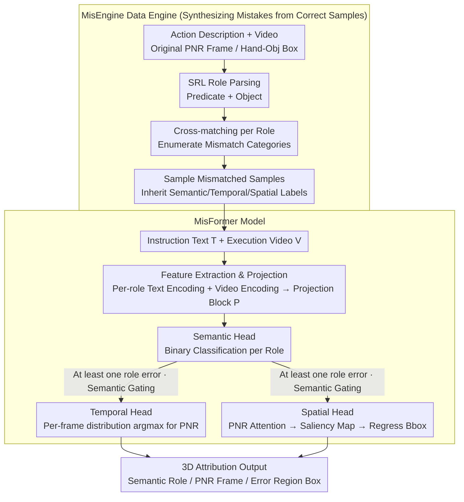

# Mistake Attribution: Fine-Grained Mistake Understanding in Egocentric Videos

**Conference**: CVPR 2026  
**arXiv**: [2511.20525](https://arxiv.org/abs/2511.20525)  
**Code**: [https://yayuanli.github.io/MATT](https://yayuanli.github.io/MATT)  
**Area**: Video Understanding  
**Keywords**: Mistake Attribution, Egocentric Video, Semantic Role Labeling, Spatio-Temporal Localization, Instruction Alignment

## TL;DR

This paper proposes the Mistake Attribution (MATT) task, which attributes execution errors in egocentric videos to three dimensions: semantic (which instruction component was violated), temporal (which frame contains the Point of No Return, PNR), and spatial (where the error region is in the PNR frame). Through the MisEngine data engine, large-scale mistake samples are automatically constructed from existing action datasets. A unified Transformer model, MisFormer, is designed to simultaneously complete three attribution sub-tasks, outperforming specialized SOTA methods across multiple benchmarks.

## Background & Motivation

1. **Background**: AI-assisted systems in physical environments (e.g., cooking or assembly guidance) must understand human errors during instruction execution. Existing methods primarily focus on error detection—judging if a step is wrong—or provide coarse-grained error categories (e.g., "step omitted" or "action deviation").
2. **Limitations of Prior Work**: Coarse-grained detection fails to inform the user "which part of the instruction was not correctly executed" (semantic), "when the error became irreversible" (temporal), and "specifically where the error appears in the PNR frame" (spatial). For example, if the instruction is "pick up the hammer" but the user picks up a bolt, existing methods only report an "error" without identifying the "object" role failure, identifying frame 17, or highlighting the bolt in the PNR frame.
3. **Key Challenge**: Constructing fine-grained error datasets is extremely difficult. Real-world errors become rare as collectors gain experience, while manually injected errors introduce visual biases. Existing error datasets (e.g., EgoPER with 599 samples, Assembly101 with 707 samples) are two orders of magnitude smaller than general action datasets.
4. **Goal**: (a) How to automatically construct large-scale error datasets with semantic-temporal-spatial triplet annotations; (b) How to use a unified model to perform three attribution tasks simultaneously.
5. **Key Insight**: Leverage Semantic Role Labeling (SRL) to structure action descriptions and perform cross-matching within existing action recognition datasets. By pairing the instruction text "pick up the sieve" with a video of "pick up the pan," semantic attribution labels are automatically generated while inheriting the original PNR timestamps and hand/object spatial annotations.
6. **Core Idea**: Automatically construct error samples from large-scale action corpora via semantic role cross-matching, and utilize a unified Transformer for simultaneous 3D attribution across semantic, temporal, and spatial dimensions.

## Method

### Overall Architecture

The objective is to refine the vague judgment of "did the user follow the instruction correctly" into three interpretable questions: Which component of the instruction failed (semantic), from which frame did the error become irreversible (temporal), and where exactly did the error occur in that frame (spatial). Given an instruction text $T$ (e.g., "cut the apple") and a execution video $V$, the model outputs three components: binary labels for each semantic role $\{y_r\}$, the Point of No Return (PNR) frame timestamp $t_{PNR}$, and the bounding box of the error region $B_{t_{PNR}}$.

The system consists of two parts. The first is the MisEngine data engine, which bypasses the difficulty of collecting fine-grained error data by synthesizing error samples from existing action recognition data. The second is the MisFormer model, which processes this data using a unified Transformer to solve the three attribution sub-tasks on a shared set of multi-modal features.

### Key Designs

**1. MisEngine: Synthesizing Mistakes instead of Collecting Them**

Real mistakes are naturally scarce—experts make fewer mistakes, and manually injecting errors introduces visual bias. MisEngine transforms "mistake creation" into a combinatorial problem. Since correct action descriptions already include videos, PNR frames, and hand-object boxes, deliberately mismatching an "instruction text" with a "video of a different action" naturally yields an error sample with complete ground truth.

The process involves three steps. First, AllenNLP's SRL parses each action description into roles, such as splitting "Pick up the sieve" into the predicate "Pick up" and the object "the sieve". Second, roles are compared between pairs of samples to enumerate $C=|\mathcal{R}|^2$ mismatch categories (wrong predicate, wrong object, both wrong, both correct). Third, mismatched instruction-video pairs are sampled as "erroneous attempts." Semantic labels are provided by cross-matching (which role was mismatched), while temporal and spatial labels are inherited from the original video's PNR and bounding box metadata. This yielded 257K and 221K samples from Ego4D and EPIC-KITCHENS respectively.

**2. MisFormer Feature Extraction & Projection: Context-Aware Role Embeddings**

Semantic attribution requires role-level granularity rather than a single sentence-level vector. MisFormer uses the InternVideo2 text encoder to encode each semantic role substring separately, yielding $F_R^T \in \mathbb{R}^{|\mathcal{R}| \times d}$; the video side uses the corresponding video encoder to extract $F^V \in \mathbb{R}^{L \times K \times d}$.

The Projection block $\mathcal{P}$ (a 2-layer Transformer decoder without causal masks) adapts features for mistake understanding. It performs self-attention on role features to exchange information (e.g., checking the "object" relative to the "predicate") and cross-attention with video features to inject visual context into each role, resulting in $F_R^{T'} \in \mathbb{R}^{|\mathcal{R}| \times d}$. This ensures role representations have "seen" the video to capture subtle instruction-execution deviations.

**3. Multi-Head Architecture with Semantic Gating**

Three lightweight heads share the projection features. The **Semantic Head** uses an FFN with sigmoid for binary classification on each role's feature $F_r^{T'}$, trained with BCE loss. The **Temporal Head** downsamples video features $F^V$ to $F^{V'} \in \mathbb{R}^{L \times d}$ via 2-layer self-attention, then uses a 2-layer Transformer decoder (with $F^{V'}$ as query and $F_R^{T'}$ as key/value) to compute a per-frame distribution. The argmax yields the PNR frame, trained with cross-entropy loss. The **Spatial Head** reuses cross-attention weights from the PNR frame in the projection block, generates a saliency map via self-attention, and regresses coordinates using a lightweight CNN and Huber loss.

Notably, **Semantic Gating** is applied: the temporal and spatial heads are only triggered if the semantic head detects at least one error. This mirrors the logic that "where and when" only matter if an error actually occurred, significantly reducing computation.

### Loss & Training

The total loss is $\mathcal{L} = \mathcal{L}_S + \mathcal{L}_T + \mathcal{L}_{spatial}$: $\mathcal{L}_S$ is binary cross-entropy for semantics, $\mathcal{L}_T$ is cross-entropy for temporal (calculated only for mistake samples), and $\mathcal{L}_{spatial}$ is the Huber loss for bounding box regression.

## Key Experimental Results

### Main Results

| Dataset | Task | Metric | MisFormer | Prev. SOTA | Gain |
|--------|------|------|-----------|----------|------|
| EPIC-KITCHENS-M | Semantic Attribution | F1@0.5 | **83.89** | 77.23 (ChatGPT-4o) | +6.66% |
| Ego4D-M | Semantic Attribution | F1@0.5 | **56.24** | 50.95 (ChatGPT-4o) | +5.29% |
| Ego4D-M | Temporal Attribution | MAE(s) | **0.438** | 0.816 (EgoT2) | -21.81% |
| Ego4D-M | Spatial Attribution | mIoU | **59.21** | 49.88 (MediaPipe-U) | +18.70% |
| Ego4D-M | Error Detection | F1@0.5 | **57.55** | 15.62 (EgoPED) | +41.93% |

### Ablation Study

| Configuration | Semantic F1 | Temporal MAE(s) | Spatial mIoU | Detection F1 |
|------|---------|-------------|-----------|---------|
| MisFormer (Full) | 56.24 | 0.438 | 59.21 | 57.55 |
| LaViLa Backbone | 49.16 | 0.561 | 51.37 | 46.05 |
| w/o Projection $\mathcal{P}$ | 51.34 | 0.457 | 55.43 | 52.75 |
| w/o Temporal Training | 51.29 | 0.623 | 57.78 | 57.46 |
| GradCAM vs Attn Map | 55.52 | 0.482 | 55.03 | 57.51 |

### Key Findings
- The InternVideo2 backbone is critical due to its multi-modal pre-training; replacing it with LaViLa significantly degrades performance.
- The Projection block $\mathcal{P}$ is indispensable, as raw text embeddings cannot capture fine-grained instruction-video deviations.
- Attribute-level attribution for "Object" roles is consistently easier than for "Predicate" roles, highlighting the difficulty of fine-grained action understanding.
- Pre-training on large-scale synthesized data (EPIC-KITCHENS-M) is essential for succeeding on small real-world datasets like EgoPER.

## Highlights & Insights
- **Zero-cost logic**: MisEngine's design is clever—it turns an action recognition dataset into a mistake understanding dataset via role-based cross-matching, inheriting all 3D labels.
- **Unified vs. Ensemble**: MisFormer outperforms specialized SOTAs across four tasks with a unified architecture and only 41M+ projection parameters, achieving high efficiency (68.9 FPS for the spatial head).
- **Interpretability**: Formalizing mistake understanding as "instruction-execution deviation" provides actionable feedback for AI assistants.

## Limitations & Future Work
- Currently supports only short instructions (predicate + object); multi-step instructions require richer role sets.
- Spatial attribution is slightly weaker than specialized hand-object detectors (SSDA); integrating object detection priors might help.
- The engine assumes mistakes originate from role mismatches, missing "degree errors" (e.g., cutting too thick).
- Future work could design pre-training objectives specifically tailored for mistake understanding.

## Related Work & Insights
- **vs EgoPED / AMNAR**: These view error detection as OOD detection without error signals, failing in large-scale multi-activity scenarios. MisFormer succeeds via large-scale supervised synthesis.
- **vs MistScene**: MistScene provides natural language explanations but lacks structured attribution and instruction alignment.
- **vs ChatGPT-4o**: MisFormer's task-specific design outperforms closed-source general LLMs by 6.66% in semantic attribution.

## Rating
- Novelty: ⭐⭐⭐⭐⭐ 
- Experimental Thoroughness: ⭐⭐⭐⭐ 
- Writing Quality: ⭐⭐⭐⭐⭐ 
- Value: ⭐⭐⭐⭐ 

<!-- RELATED:START -->

## Related Papers

- [\[ICCV 2025\] Fine-grained Spatiotemporal Grounding on Egocentric Videos](../../ICCV2025/video_understanding/fine-grained_spatiotemporal_grounding_on_egocentric_videos.md)
- [\[CVPR 2026\] UFVideo: Towards Unified Fine-Grained Video Cooperative Understanding with Large Language Models](ufvideo_towards_unified_fine-grained_video_cooperative_understanding_with_large_.md)
- [\[CVPR 2026\] Fine-VAD: Towards Fine-Grained Video Anomaly Detection via Progressive Cross-Granularity Learning](fine-vad_towards_fine-grained_video_anomaly_detection_via_progressive_cross-gran.md)
- [\[CVPR 2026\] Minerva-Ego: Spatiotemporal Hints for Egocentric Video Understanding](minerva-ego_spatiotemporal_hints_for_egocentric_video_understanding.md)
- [\[CVPR 2026\] Text-guided Fine-Grained Video Anomaly Understanding](text-guided_fine-grained_video_anomaly_understanding.md)

<!-- RELATED:END -->
