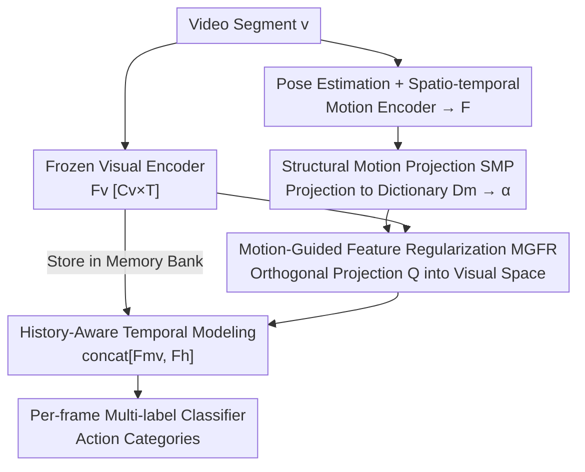

# MoVie: Broaden Your Views with Human Motion for Action Detection

**Conference**: CVPR 2026  
**Paper**: [CVF Open Access](https://openaccess.thecvf.com/content/CVPR2026/html/Yang_MoVie_Broaden_Your_Views_with_Human_Motion_for_Action_Detection_CVPR_2026_paper.html)  
**Area**: Video Understanding  
**Keywords**: Temporal Action Detection, Skeleton Motion, Motion Primitive Dictionary, Orthogonal Feature Regularization, Multimodal Fusion

## TL;DR
MoVie decomposes human skeleton motion into a set of "motion primitives" (a learnable motion dictionary) and utilizes an orthogonal projection to treat these fine-grained motion signals as a "regularizer" to calibrate RGB visual features. This approach moves beyond naive feature concatenation/fusion, achieving a new SOTA in frame-level action detection across four real-world datasets: TSU, Charades, Multi-THUMOS, and PKU-MMD (e.g., an improvement of ~+15.9% mAP over the visual-only baseline on TSU-CS).

## Background & Motivation
**Background**: Temporal action detection in untrimmed videos currently follows a "two-stage" mainstream: frozen video foundation models (e.g., I3D, ViCLIP) extract per-frame visual features, followed by TCN/Transformer-based temporal modeling (e.g., MS-TCT, DualDETR) for per-frame multi-label classification.

**Limitations of Prior Work**: Purely visual methods describe "what is visible in the scene" but fail to capture "how actions physically unfold over time." The same action under different viewpoints, individuals, or lighting conditions may appear similar in RGB space, while the critical differences lie in the motion dynamics. Although skeleton sequences can explicitly provide body structure and motion, directly incorporating them as an additional modality via fusion has yielded limited improvements.

**Key Challenge**: The authors identify two specific obstacles. First, **coarse motion representation**: Existing skeleton encoders (e.g., AGCN) are trained with global action labels, learning "what the action is" rather than the intrinsic structure of the motion itself. This results in motion features that conflate different physical patterns. Furthermore, models pre-trained on controlled environments (NTU-RGB+D) suffer significant performance drops in complex real-world scenarios like TSU or Charades. Second, **heterogeneous feature spaces**: Skeleton motion expresses directional kinetic magnitude, whereas visual embeddings express high-level semantics. Naive concatenation or late fusion can cause mutual interference, polluting the semantic diversity within visual features.

**Key Insight**: Real-world actions are composed of smaller, overlapping "motion primitives" (e.g., lifting a hand, bending over, stepping). If motion can be decomposed into these primitives and used as a "physical prior" to guide vision—rather than as a secondary input for fusion—it can be elevated from an auxiliary modality to a "structural bridge" connecting physical movement with visual perception.

**Core Idea**: Replace "concatenation/late fusion" with a "Motion Primitive Dictionary + Orthogonal Projection Regularization" framework, allowing structured fine-grained motion to calibrate the temporal evolution of visual features without compromising their semantics.

## Method

### Overall Architecture
Given a video segment, MoVie follows two parallel branches: a visual branch using a frozen encoder $E_V$ (I3D or ViCLIP) to extract frame-level features $\mathbf{F_v}\in\mathbb{R}^{C_v\times T}$, and a motion branch using a pose estimator and spatio-temporal encoder to obtain motion features $\mathbf{F}$. In the first stage, **Structural Motion Projection (SMP)** projects motion features onto a pre-trained dictionary to obtain structured activation coefficients $\hat{\boldsymbol{\alpha}}$. In the second stage, **Motion-Guided Feature Regularization (MGFR)** uses an orthogonal transformation to inject these primitives into the visual space, yielding motion-regularized features $\mathbf{F_{mv}}$. Finally, a temporal module with history-aware memory and a per-frame multi-label classifier outputs action categories.

### Key Designs

**1. Structural Motion Projection (SMP): Decomposing Coarse Labels into Fine-grained Primitives**

To address the "coarse representation" issue, SMP abandons global action labels. Instead, it leverages a **motion dictionary** $\mathbf{D_m}\in\mathbb{R}^{K\times C_m}$ from a pre-trained **motion decomposition network** (ViA [59], trained via cross-view motion reconstruction). Each base vector in the dictionary represents a viewpoint-and-physique-invariant primitive direction (e.g., torso bending, leg extension). Given motion features $\mathbf{F}\in\mathbb{R}^{C_m\times T\times M}$ ($T$ frames, $M$ persons), SMP calculates the activation magnitude for each primitive:

$$\boldsymbol{\alpha} = \lVert \mathbf{D_m}\,\mathbf{F} \rVert_2,\quad \boldsymbol{\alpha}\in\mathbb{R}^{K\times T\times M}$$

where $\alpha_k$ denotes the activation intensity of the $k$-th primitive for a specific person at a specific frame. This representation encodes geometric/kinematic dynamics decoupled from static appearance and invariant to camera views. It describes "how the person moves" rather than "which action this is." The signal is refined via a lightweight MLP $\sigma(\cdot)$ as $\tilde{\boldsymbol{\alpha}}=\sigma(\boldsymbol{\alpha})$ and pooled across multiple persons to generate a stable per-frame descriptor $\hat{\boldsymbol{\alpha}}\in\mathbb{R}^{K\times T}$.

**2. Motion-Guided Feature Regularization (MGFR): Calibrating Vision via Orthogonal Projection**

To solve the "inter-modal interference" problem, MGFR treats motion as a **regularizer**. It introduces a learnable **orthogonal transformation** $\mathbf{Q}\in\mathbb{R}^{K\times C_v}$ that defines a "primitive-aligned" coordinate system, allowing motion signals to modulate visual features along decoupled directions. Both branches are normalized via shallow MLPs before computing the regularized features:

$$\mathbf{F_{mv}} = \epsilon(\mathbf{F_v}) + \lambda\,(\mathbf{Q}^\top \hat{\boldsymbol{\alpha}})$$

Here $\lambda$ controls modulation intensity. Crucially, $\mathbf{Q}$ is constrained to be orthogonal ($\langle \mathbf{q_i},\mathbf{q_j}\rangle = 1$ if $i=j$, else $0$), re-orthogonalized via Gram-Schmidt at each iteration. This ensures each primitive adjusts visual features along independent directions, preventing the conflation of visual channels and reducing overfitting.

**3. Consistency Regularization + History-Aware Modeling: Aligning Evolution**

To stabilize the alignment, MGFR employs a **temporal consistency loss**, requiring "motion-induced changes" to align with "visual feature deviations from their temporal mean":

$$\mathcal{L}_{align} = \frac{1}{T}\sum_{t=1}^{T}\left\lVert \mathbf{Q}^\top \hat{\boldsymbol{\alpha}}_t - \big(\epsilon(\mathbf{F}_{\mathbf{v},t}) - \mathbf{F_{mv}}^{mean}\big)\right\rVert_2^2$$

The regularized $\mathbf{F_{mv}}$ is processed by a temporal module (alternating Transformer and TCN blocks). For long videos, visual features are stored in a **memory bank** as history $\mathbf{F_h}$ and concatenated: $\mathbf{F'_{mv}} = \mathrm{TM}(\mathrm{concat}[\mathbf{F_{mv}}, \mathbf{F_h}])$.

### Loss & Training
The motion dictionary is pre-trained via cross-view reconstruction and remains **frozen** during training. Other components are trained end-to-end with the total loss $\mathcal{L} = \mathcal{L}_{det} + \lambda_{align}\mathcal{L}_{align}$, where $\mathcal{L}_{det}$ is per-frame multi-label Binary Cross Entropy (BCE).

## Key Experimental Results

### Main Results
Comparison of frame-level mAP on TSU, Charades, and Multi-THUMOS using I3D and ViCLIP backbones:

| Method | Modality / Feature | TSU-CS | TSU-CV | Charades | Multi-THUMOS |
|------|------------|--------|--------|----------|--------------|
| MS-TCT | Visual / I3D | 33.7 | - | 25.4 | 43.1 |
| DualDETR | Visual / I3D | 34.8 | - | 23.2 | 45.5 |
| LAC | Motion / UNIK | 36.8 | 23.1 | 25.6 | 23.4 |
| Augmented-RGB | Flow&Motion&Visual / I3D | 32.8 | 24.6 | - | 44.6 |
| **MoVie** | **Motion&Visual / I3D** | **49.6** | **28.6** | **29.2** | **46.8** |
| MMFF | Motion&Visual / ViCLIP | 41.6 | 25.7 | 29.2 | 46.3 |
| **MoVie** | **Motion&Visual / ViCLIP** | **50.1** | **30.1** | **33.5** | **48.3** |

Under I3D, MoVie outperforms the previous SOTA (MS-TCT) by +15.9% on TSU-CS and +3.7% on Multi-THUMOS. It also surpasses the pure motion model LAC by +12.8% on TSU-CS, suggesting that "guiding vision" is far more effective than using motion in isolation.

### Ablation Study

| Configuration | TSU-CS (%) | Charades (%) | Description |
|------|-----------|--------------|------|
| Baseline (Visual only) | 35.8 | 16.4 | ViCLIP baseline |
| Late Fusion | 37.1 | 20.8 | Minimal gain |
| Concatenation [Fv, F] | 41.2 | 29.3 | Direct concatenation |
| MGFR only (w/ F) | 44.1 | 29.6 | No decomposition |
| SMP+MGFR, K=64 | 41.4 | 30.4 | Insufficient primitives |
| **SMP+MGFR, K=128** | **50.1** | **33.5** | Optimal config |
| SMP+MGFR w/o Orth. | 47.3 | 31.1 | Without orthogonal constraint |

### Key Findings
- **Fusion mechanism is more critical than additional modalities**: Late fusion/concatenation yields moderate gains, while MGFR pushes performance by +8.3% (TSU-CS), proving motion works better as a structural regulator.
- **Orthogonal constraint is essential**: Replacing it with dense layers drops performance by 2.8% on TSU-CS as the model overfits and confuses visual channels.
- **Motion-intensive actions gain most**: "Standing up" (+46.9%) and "Stirring a pot" (+32.8%) show massive gains, whereas subtle hand-object interactions like "Drinking from a bottle" show slight declines (-4.1%) due to weak motion cues.

## Highlights & Insights
- **Paradigm shift**: Moving from "motion as input" to "motion as regularizer" successfully incorporates physical consistency without polluting visual semantics.
- **Interpretable primitives**: The activation coefficient $\alpha$ provides a natural interface for visualization (e.g., identifying which primitive corresponds to torso bending), adding physical interpretability to action detection.
- **Leveraging pre-trained dictionaries**: Reusing a viewpoint-invariant motion dictionary and keeping it frozen is a lightweight yet effective engineering choice.

## Limitations & Future Work
- **Pose quality dependency**: Skeleton unreliability under heavy occlusion limits performance on fine-grained hand-object interactions.
- **Frozen dictionary**: Since the dictionary is derived from external data, it may not be optimal if the target domain's motion distribution differs significantly.
- **Action boundaries**: The method favors motion-dense actions; its effectiveness for actions primarily distinguished by static semantics is limited.

## Related Work & Insights
- **vs. MS-TCT / DualDETR**: While others focus on stronger Transformer/TCN temporal structures, MoVie improves the underlying feature representation by injecting physical motion priors.
- **vs. MMFF / Augmented-RGB**: Unlike attention-based concatenation, MoVie uses orthogonal subspace alignment for motion primitives, which is more stable and interpretable.

## Rating
- Novelty: ⭐⭐⭐⭐
- Experimental Thoroughness: ⭐⭐⭐⭐
- Writing Quality: ⭐⭐⭐⭐
- Value: ⭐⭐⭐⭐

<!-- RELATED:START -->

## Related Papers

- [\[CVPR 2026\] Your One-Stop Solution for AI-Generated Video Detection](your_one-stop_solution_for_ai-generated_video_detection.md)
- [\[CVPR 2026\] Seeing Motion Through Polarity for Event-based Action Recognition](seeing_motion_through_polarity_for_event-based_action_recognition.md)
- [\[CVPR 2025\] H-MoRe: Learning Human-centric Motion Representation for Action Analysis](../../CVPR2025/video_understanding/h-more_learning_human-centric_motion_representation_for_action_analysis.md)
- [\[CVPR 2026\] Self-Paced and Self-Corrective Masked Prediction for Movie Trailer Generation](self-paced_and_self-corrective_masked_prediction_for_movie_trailer_generation.md)
- [\[CVPR 2026\] TVHighlights: LLM-Guided Human-Free Collaborative Training for Video Highlight Detection in Movies and TV Dramas](tvhighlights_llm-guided_human-free_collaborative_training_for_video_highlight_de.md)

<!-- RELATED:END -->
