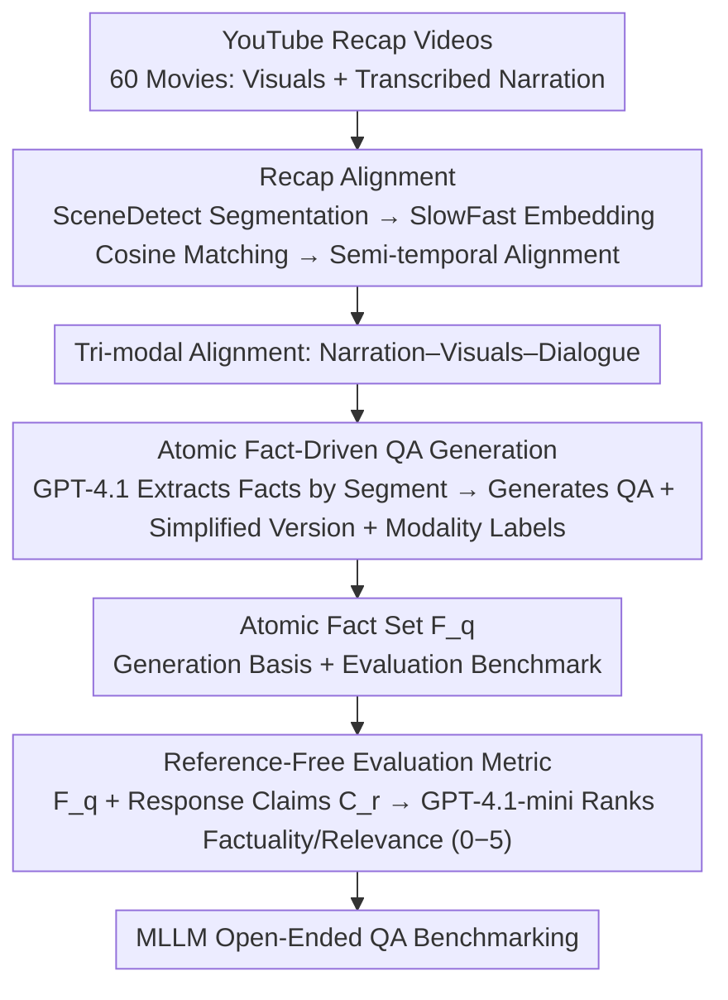

# MovieRecapsQA: A Multimodal Open-Ended Video Question-Answering Benchmark

**Conference**: CVPR 2026  
**arXiv**: [2601.02536](https://arxiv.org/abs/2601.02536)  
**Code**: [MovieRecapsQA](https://github.com/MovieRecapsQA) (Open Sourced)  
**Area**: Video Understanding  
**Keywords**: Video Question Answering, Multimodal Understanding, Open-Ended Evaluation, Movie Understanding, Reference-Free Evaluation

## TL;DR

This paper introduces MovieRecapsQA, a multimodal open-ended video question-answering benchmark constructed from movie recap videos. It contains approximately 8.2K questions covering 60 movies and features a reference-free evaluation metric based on atomic facts, revealing that the primary bottleneck for current MLLMs lies in visual perception rather than reasoning.

## Background & Motivation

1. **Background**: Video Question Answering (VideoQA) serves as a core proxy task for evaluating video understanding capabilities. Existing benchmarks primarily focus on single modalities or short videos and extensively utilize multiple-choice formats to simplify evaluation complexity. Multimodal long-video QA benchmarks that necessitate the integration of visual and conversational cues remain scarce.

2. **Limitations of Prior Work**: (a) Multiple-choice questions provide "shortcuts" where models can answer via elimination without truly understanding the video; (b) Open-ended QA is extremely difficult to evaluate due to non-fixed answer formats; (c) Reference-based evaluation methods (e.g., ROUGE, BERTScore) show low correlation with human judgment; (d) Using LLMs as judges for VideoQA is both expensive and imprecise when providing the full video as context.

3. **Key Challenge**: The contradiction between the authenticity of open-ended evaluation and its measurability—multiple-choice is easy to evaluate but unrealistic, while open-ended is realistic but lacks reliable evaluation.

4. **Goal**: (a) How to construct high-quality multimodal long-video open-ended QA datasets? (b) How to reliably evaluate open-ended responses without depending on reference answers?

5. **Key Insight**: Leverage movie recap videos as a data source—the narration naturally provides a textual summary of visual content, enabling the automatic extraction of atomic facts to support reference-free evaluation.

6. **Core Idea**: Use the narration from movie recaps to extract atomic facts as an intermediate annotation layer. This layer supports the generation of questions requiring multimodal reasoning and enables the evaluation of response factuality and relevance without reference answers.

## Method

### Overall Architecture

This work does not involve model training; instead, it delivers a closed-loop "dataset + evaluation" framework. First, recap videos of 60 movies are collected from YouTube, with narrations aligned to the original movie frames and dialogues. GPT-4.1 then extracts atomic facts from the narrations to generate open-ended QA pairs. Finally, these atomic facts serve as textual anchors for an LLM judge to score model responses across factuality and relevance dimensions. The "atomic fact" intermediate layer is the mechanism that allows long-video open-ended QA to be automatically constructed and reliably evaluated for the first time.

### Key Designs

**1. Recap Alignment: Locking Narration, Visuals, and Dialogue onto a Single Timeline**

To ensure open-ended long-video QA "pins" questions to specific movie segments, one must know which part of the original film corresponds to each narration sentence. This work uses SceneDetect for scene segmentation of both the movie and the recap. SlowFast is used to extract visual embeddings for the start/end frames of each scene, matching recap shots back to original shots via cosine similarity. A statistical alignment step is then applied to enforce semi-temporal ordering. Using recap videos instead of Wikipedia or IMDb summaries ensures narration is tightly coupled with visual segments, providing denser scene-level coverage.

**2. Atomic Fact-Driven QA Generation: Deconstructing Narrations into Verifiable Propositions**

To avoid "leaking" answers in questions or generating questions detached from the video, the method feeds each narration segment to GPT-4.1 to extract atomic facts (concise, independently verifiable propositions). QA pairs are then generated based on these facts, with each question labeled by its required modality—visual-only, dialogue-only, or multimodal. To prevent overly detailed answers from making questions trivial, "simplified question + detailed answer" pairs are also created. Atomic facts serve a triple purpose: forcing multimodal reasoning, providing a precise textual representation for evaluation, and eliminating the need for manual reference answers.

**3. Reference-Free Evaluation Metric: Using Atomic Facts as Anchors to Bypass Video Context**

Standard LLM-as-judge methods for text QA cannot be directly applied to VideoQA because feeding full videos as context is inefficient and unreliable, while reference-based metrics like ROUGE/BERTScore correlate poorly with humans. This work directs the judge to look only at textual anchors: for each question $q$, it retrieves the associated atomic facts $\mathcal{F}_q$ and extracts claims $\mathcal{C}_r$ from the model's response. GPT-4.1-mini then acts as the judge, scoring factuality (0-5) and relevance (0-5) based on the question, atomic facts, and subtitles. Atomic facts provide a compact, verifiable proxy, allowing the judge to evaluate correctness without watching the video.

### Loss & Training

This paper is a dataset/evaluation contribution and does not involve model training. Fact extraction, QA generation, and evaluation judging are performed by GPT-series models (GPT-4.1 for construction, GPT-4.1-mini for cost-effective judging).

## Key Experimental Results

### Main Results

| Model | ROUGE-L | BERTScore | HELMET Correct. | Factuality (Ours) | Relevance (Ours) |
|------|---------|-----------|-----------------|-------------------|-------------------|
| GPT-4o | 0.28 | 0.68 | 1.43 | **3.99** | **3.97** |
| Gemini-2.5-Flash | 0.22 | 0.63 | 1.82 | 3.26 | 3.70 |
| Claude 3.5 Sonnet | 0.22 | 0.63 | 1.35 | 3.76 | 3.92 |
| Amazon Nova Lite | 0.28 | 0.69 | 1.29 | 3.53 | 3.93 |
| Qwen2.5VL | 0.26 | 0.67 | 1.23 | 3.47 | 3.83 |
| MiniCPM-o | 0.24 | 0.65 | 1.27 | 3.21 | 3.61 |
| LLaVA-NeXT-Video | 0.23 | 0.65 | 0.98 | 2.96 | 3.35 |
| Human (Avg.) | 0.16 | 0.88 | 0.98 | 4.01 | 4.01 |
| Human (Best) | 0.19 | 0.87 | 1.26 | 4.59 | 4.53 |

### Ablation Study (By Modality)

| Modality Type | Closed-Source Factuality | Open-Source Factuality | Human Factuality |
|----------|---------------------|---------------------|-----------------|
| Dialogue-based | 3.63 | 3.21 | 4.17 |
| Visual-based | 3.15 | 3.05 | 3.84 |
| Multimodal | 3.55 | 3.11 | 3.84 |

### Key Findings

- **Semantic Metrics Failure**: ROUGE-L (0.22-0.28) and BERTScore (0.63-0.69) fail to distinguish model performance and even rank humans lower than models.
- **Reference-Based Paradox**: HELMET Correctness rates MiniCPM-o (1.27) higher than the human best (1.26), which is counter-intuitive.
- **Ours Offers Best Discriminative Power**: Factuality scores range from 2.96 to 3.99, establishing a reasonable gap between models and human performance (4.01/4.59).
- **Visuals are the Primary Bottleneck**: All models perform worst on visual-based questions. Removing visual input actually improved factuality for closed-source models, suggesting visual signals introduce hallucination.
- **Models "See" but Don't "Understand"**: Relevance scores are stable across modalities, but factuality fluctuates, implying models can locate segments but fail to extract fine-grained visual information.

## Highlights & Insights

- **Atomic Facts as an Intermediate Layer**: This design elegantly solves both question generation quality and answer evaluation flexibility. Atomic facts are more robust than reference answers as they accommodate various phrasing while maintaining factual rigidity.
- **"Removing Visuals Improves Factuality"**: This insightful finding reveals that the bottleneck in current MLLMs is "perception" rather than "reasoning"—if the perceived information is incorrect, the reasoning is inevitably flawed.
- **Recap Videos as Scalable Sources**: The vast availability of recap videos on YouTube, which naturally provide video-text alignment, offers a scalable template for other narrated video genres like educational or sports content.

## Limitations & Future Work

- Data from YouTube recaps may contain subjective biases or omissions from the narrators.
- Limited scale (60 movies), with a missing detailed report on genre distribution.
- Reliance on GPT-4.1 for fact extraction and QA generation may inherit LLM-specific biases.
- Use of GPT-4.1-mini as a judge to control costs might yield lower judging quality compared to larger models.
- Absence of systematic experiments on ultra-long input settings (e.g., full-length movies).

## Related Work & Insights

- **vs MovieQA / TVQA**: Traditional benchmarks use multiple-choice and rely on manual annotation. This work utilizes open-ended QA, automatic construction, and modality-specific labeling.
- **vs CinePile**: While CinePile is a large-scale automated benchmark (303K QA), it remains multiple-choice and lacks modality breakdown. This work, though smaller (8.2K), offers a more advanced evaluation design.
- **vs FactScore / VeriScore**: Inspired by factuality evaluation in text QA, this work extends atomic fact evaluation to the VideoQA domain for the first time.

## Rating

- Novelty: ⭐⭐⭐⭐ Combining recap video construction with reference-free evaluation is innovative, though the underlying LLM techniques are established.
- Experimental Thoroughness: ⭐⭐⭐⭐⭐ Comprehensive testing with 7 models plus human evaluation, across multiple metrics and modality/reasoning breakdowns.
- Writing Quality: ⭐⭐⭐⭐⭐ Logical progression with natural motivation and insightful experimental analysis.
- Value: ⭐⭐⭐⭐ Provides a crucial evaluation tool for long-video multimodal understanding and offers significant insights into perception bottlenecks.

<!-- RELATED:START -->

## Related Papers

- [\[CVPR 2026\] HERBench: A Benchmark for Multi-Evidence Integration in Video Question Answering](herbench_a_benchmark_for_multi-evidence_integration_in_video_question_answering.md)
- [\[CVPR 2026\] CaST-Bench: Benchmarking Causal Chain-Grounded Spatio-Temporal Reasoning for Video Question Answering](cast-bench_benchmarking_causal_chain-grounded_spatio-temporal_reasoning_for_vide.md)
- [\[NeurIPS 2025\] EgoGazeVQA: Egocentric Gaze-Guided Video Question Answering Benchmark](../../NeurIPS2025/video_understanding/egogazevqa_egocentric_gaze_guided_video_question_answering.md)
- [\[CVPR 2026\] Ego-Grounding for Personalized Question-Answering in Egocentric Videos](ego-grounding_for_personalized_question-answering_in_egocentric_videos.md)
- [\[CVPR 2026\] Do You See What I Am Pointing At? Gesture-Based Egocentric Video Question Answering](do_you_see_what_i_am_pointing_at_gesture-based_egocentric_video_question_answeri.md)

<!-- RELATED:END -->
