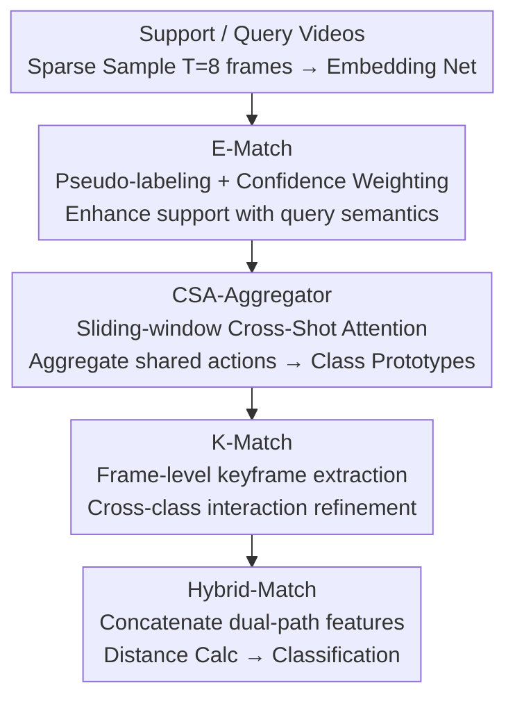

# MPL: Match-guided Prototype Learning for Few-shot Action Recognition

**Conference**: CVPR 2026  
**Paper**: [CVF Open Access](https://openaccess.thecvf.com/content/CVPR2026/html/Yang_MPL_Match-guided_Prototype_Learning_for_Few-shot_Action_Recognition_CVPR_2026_paper.html)  
**Code**: https://github.com/jayzh-research/MPL-FSAR (Available)  
**Area**: Video Understanding  
**Keywords**: Few-shot action recognition, prototype learning, video matching, cross-sample attention, keyframes

## TL;DR
Addressing the issue where prototype learning and video matching operate independently and incompatibly in few-shot action recognition, MPL utilizes matching results as guidance signals for prototype construction. By sequentially applying sample-level E-Match for query-semantic enhancement, cross-sample attention for shared action pattern aggregation, and frame-level K-Match for refinement, the method generates discriminative prototypes that are inherently compatible with the matching mechanism. SOTA results are achieved across four datasets.

## Background & Motivation

**Background**: The mainstream paradigm for few-shot action recognition is metric-based: videos are mapped to a feature space, and classification is performed by measuring similarity between a query and class prototypes using a distance/matching function. Prior work has focused on two directions: **prototype learning** (e.g., HyRSM's task-dependent prototypes, MoLo's motion-based prototypes) and **video matching** (e.g., OTAM's DTW alignment, HyRSM's Bi-MHM for flexible frame-set matching).

**Limitations of Prior Work**: The authors identify two long-overlooked issues. First, prototypes are learned through "implicit interaction" among all samples within an episode without semantic guidance—a query interacts identically with support samples from **different classes**, resulting in class-agnostic embeddings that lack clear semantic correspondence and discriminative power. Furthermore, this enhancement is performed at the **sample level** for the entire video, lacking frame-level refinement. Second, prototype learning and matching mechanisms are designed as **two independent modules**, leading to potential **incompatibility** between the learned prototype representation and the actual matching method (Table 6 empirically demonstrates performance drops when E-Match and Hybrid-Match use different functions).

**Key Challenge**: The ideal structure of a prototype essentially depends on "how it will be matched"; however, existing pipelines construct prototypes first and select matching methods later, causing a structural disconnect.

**Core Idea**: Instead of decoupling prototype learning and matching, MPL **embeds matching into the prototype learning process**. It uses pre-matching results between the query and support as semantic guidance to construct prototypes from coarse (sample-level) to fine (frame-level). This injects explicit class semantics into prototypes and ensures they are naturally compatible with downstream matching.

## Method

### Overall Architecture
MPL tackles "N-way K-shot" classification: given a support set with N classes and K samples each, and a query video $q$, it identifies the category of $q$. Each video is sparsely sampled into $T=8$ snippets and passed through an embedding network (ResNet-50 / CLIP visual encoder) to obtain support features $F_S=\{f_{s_1},\dots,f_{s_{N\times K}}\}$ and query features $f_q$, where each feature is a sequence of $T$ frames.

The pipeline is a four-stage serial process categorized as "coarse-to-fine match-guided": **E-Match** enhances support features at the sample level using query semantics; **CSA-Aggregator** aggregates adjacent frames across K shots into class prototypes using cross-sample attention; **K-Match** extracts frame-level keyframes for refinement; and **Hybrid-Match** combines E-Match and K-Match outputs to calculate the final classification score. The entire network is trained end-to-end.

### Key Designs

**1. E-Match: Explicit Sample-level Support Enhancement using Query Semantics**

To address the "class-agnostic prototype" issue, E-Match does not allow a query to interact equally with all support classes. Instead, it matches the query to the most similar class and **directionally** injects query semantics into the corresponding support features. First, a distance metric $D_e(\cdot,\cdot)$ (BiMHM is used) calculates a pseudo-label—finding the nearest support sample index $\hat{i}=\arg\min_{i}D_e(f_{s_i},f_q)$, assuming $q$ belongs to the same class as $f_{s_{\hat i}}$.

To handle unreliable pseudo-labels, enhancement is performed with **confidence weighting** based on similarity:

$$\tilde{f}_{s_i}=f_{s_i}+\frac{\exp(-D_e(f_{s_i},f_q))\,\omega_{i,\hat i}}{\sum_{i'=1}^{N\times K}\exp(-D_e(f_{s_{i'}},f_q))}\cdot f_q,\qquad \omega_{i,j}=\begin{cases}1,&i=j\\0,&\text{otherwise}\end{cases}$$

The gating indicator $\omega_{i,\hat i}$ ensures only the class matched by the pseudo-label receives query injection. This enhances $\tilde f_{s_i}$ with rich query semantics while maintaining its shape. E-Match is effective because it uses "matching results" as guidance signals to ensure prototypes are optimized for matching from the start.

**2. CSA-Aggregator: Sliding-window Cross-Shot Attention for Shared Action Patterns**

Most methods average K shots at the **same frame indices** to create prototypes. However, key actions may occur at **different timestamps** across samples, leading to misalignment. The CSA-Aggregator uses attention to extract shared behaviors cross-sample. For K enhanced features of a class, a sliding operator $O_t^{t+w-1}(\cdot)$ extracts sub-sequences of window length $w$ and stride 1: $O_t^{t+w-1}(\tilde f_{s_i})=\{\tilde f_{s_i}^{t},\dots,\tilde f_{s_i}^{t+w-1}\}$.

Sub-sequences from K samples starting at the same frame $t$ are concatenated into a $K\times w$ window for multi-head self-attention:

$$X_t=M\big(\text{concat}[O_t^{t+w-1}(\tilde f_{s_1}),\dots,O_t^{t+w-1}(\tilde f_{s_K})]\big)$$

The outputs are averaged at each frame position to form the final prototype $f_p=\text{Aggregate}([X_1,\dots,X_{T-w+1}])$. The window size $w$ is typically set to the number of shots. This allows features within a local temporal window to interact across samples, capturing shared spatio-temporal patterns even if the actions are temporally misaligned.

**3. K-Match: Frame-level Keyframe Extraction for Refined Alignment**

Relying only on sample-level enhancement may lead to misclassification between similar categories. K-Match performs fine-grained alignment between support and query frames. For a query $f_q$ and prototype $f_p$, it finds the nearest prototype frame for every query frame to compute support key features:

$$f_p^{key}=\frac{1}{T}\sum_{b=1}^{T}\arg\min_{f_p^a\in f_p}\lVert f_p^a-f_q^b\rVert,\qquad f_q^{key}=\frac{1}{T}\sum_{b=1}^{T}f_q^b$$

Cosine distance is used for $\lVert\cdot\rVert$. Support keyframes are selected based on "frame-to-frame matching results," ensuring compatibility. The query and N-way prototypes then undergo cross-class interaction via MSA: $\hat f_q^{key},\hat F_P^{key}=M(\text{concat}[f_q^{key},F_P^{key}])$. K-Match filters redundant content and retains only discriminative frames.

**4. Hybrid-Match: Final Distance Calculation via Feature Concatenation**

The interaction-refined key features are concatenated with the prototype $f_p$ for a final hybrid matching stage:

$$d_{p,q}=D_h(\text{concat}[\hat f_p^{key},f_p],\,\text{concat}[\hat f_q^{key},f_q])$$

$D_h$ uses the same frame-level metric as $D_e$. This integrates sample-level enhancement, cross-sample aggregation, and frame-level refinement into a single distance score, providing multi-grained evidence for classification.

### Loss & Training
The model is trained end-to-end, treating negative distances as logits. The total loss is:

$$L=L_H+\lambda_1 L_E+\lambda_2 L_{CE}$$

Where $L_H$ and $L_E$ are cross-entropy losses based on distances from Hybrid-Match and E-Match, respectively, and $L_{CE}$ is the cross-entropy loss on ground-truth action labels for training stability. $\lambda_1,\lambda_2\in[0,1]$ are balancing factors. Training utilizes the Adam optimizer with standard data augmentations; inference results are averaged over 10,000 random tasks.

## Key Experimental Results

Experiments were conducted on Kinetics, SSv2, UCF101, and HMDB51, using ResNet-50 or CLIP visual encoders.

### Main Results

Comparison with leading methods under 5-way 1/3/5-shot settings (Units: %):

| Dataset / Setting | Prev. SOTA | MPL (RN-50) | MPL (CLIP-RN50†) |
|--------------|---------|-------------|------------------|
| UCF101 1-shot | 86.6 (HM²) | **90.1** | **93.0** |
| HMDB51 1-shot | 61.8 (HM²) | **63.3** | **68.0** |
| Kinetics 5-shot | 88.9 (EGME) | **89.5** | 93.8 |
| SSv2 3-shot | 52.9 (MoLo) | **53.6** | 49.8 |

Using ResNet-50, MPL achieves state-of-the-art across most settings: UCF101 1-shot increases from 86.6% to 90.1% (+3.5), with gains of +2.3 on Kinetics 3-shot and +1.2 on SSv2 3-shot. With CLIP visual encoders, it outperforms CLIP-FSAR (which uses additional text modalities) by significant margins, such as +4.9% on HMDB51 5-shot.

### Ablation Study

| Configuration | Kinetics 1-shot | SSv2 1-shot | UCF101 1-shot | HMDB51 1-shot | Description |
|------|----------------|-------------|---------------|---------------|------|
| Baseline (BiMHM) | 71.8 | 38.1 | 82.7 | 37.9 | Starting Point |
| + E-Match | 75.8 | 41.6 | 87.2 | 40.0 | Sample-level |
| + K-Match | 72.4 | 40.2 | 83.6 | 38.7 | Frame-level |
| + Both | 77.1 | 43.5 | 90.1 | 41.5 | Full Pipeline |

| Dimension | Comparison | Conclusion |
|------|------|------|
| Prototype Agg. (Table 4) | Mean vs CSA-A | CSA-A outperforms Mean (Kinetics 3-shot: 86.2 vs 84.7; SSv2 3-shot: 53.6 vs 51.8). |
| Compatibility (Table 6) | E/Hybrid Metric Same vs Diff | Matching metrics must be **consistent** (Bi-MHM/Bi-MHM yields 43.5 on SSv2 1-shot); mixing metrics causes drops. |
| Window $w$ (Table 5) | $w=1\to7$ | Slight monotonic improvement; $w=7$ is best. Consensus is more important than capacity. |

### Key Findings
- **E-Match is the primary contributor**: Adding only E-Match increases UCF101 performance from 82.7% to 87.2% (+4.5), significantly higher than K-Match's +0.9 gain.
- **Compatibility is empirically validated**: Table 6 shows optimal results only when E-Match and Hybrid-Match share the same metric, supporting the "compatibility" motivation.
- **Sliding window benefits**: CSA-Aggregator gains come from the mechanism itself rather than parameter count.
- **t-SNE Visualization**: MPL prototypes exhibit tighter intra-class distribution and wider inter-class margins compared to TRX and HyRSM.

## Highlights & Insights
- **Repurposing "matching" from a downstream evaluator to an upstream guidance signal** is a major contribution. By back-propagating matching results into prototype construction, MPL solves the "prototype-matching gap" systematically.
- **CSA-Aggregator replaces frame-averaging with windowed attention**, capturing cross-sample consensus without adding learnable parameters. This concept is transferable to other few-shot tasks such as detection.
- **Confidence-weighted pseudo-labeling** provides a robust engineering detail, ensuring that unreliable query injections are automatically attenuated using softmax weights.

## Limitations & Future Work
- **Dependency on pseudo-label quality**: E-Match relies on the "nearest support class" assumption. Despite weighting, errors in initial matching may still propagate noise into the prototypes.
- **Performance on SSv2**: On the temporal-heavy SSv2 dataset, MPL's margin is narrower or slightly behind specialized methods in some settings, suggesting that sample-level semantic injection may be less effective for "weak-appearance, strong-temporal" actions.
- **Future Directions**: Iterative pseudo-label refinement, frame-level (rather than sample-level) matching guidance for temporal-heavy data, and the inclusion of text modalities for matching guidance.

## Related Work & Insights
- **vs HyRSM / HyRSM++**: Unlike their implicit class-agnostic interactions, MPL uses explicit matching results to guide construction, yielding more discriminative prototypes.
- **vs OTAM / TRX**: While OTAM and TRX treat matching as a separate scoring phase, MPL integrates matching into prototype generation to ensure structural compatibility.
- **vs MoLo / MTFAN**: Instead of complex motion modeling, MPL uses the lighter CSA-Aggregator to capture shared spatio-temporal patterns without increasing model complexity.

## Rating
- Novelty: ⭐⭐⭐⭐ (Novel perspective on match-guided learning)
- Experimental Thoroughness: ⭐⭐⭐⭐ (Extensive ablation and cross-backbone testing)
- Writing Quality: ⭐⭐⭐⭐ (Strong logical flow and clear visual aids)
- Value: ⭐⭐⭐⭐ (Solid SOTA performance with transferable architectural insights)

<!-- RELATED:START -->

## Related Papers

- [\[ICCV 2025\] Beyond Label Semantics: Language-Guided Action Anatomy for Few-shot Action Recognition](../../ICCV2025/video_understanding/beyond_label_semantics_language-guided_action_anatomy_for_few-shot_action_recogn.md)
- [\[AAAI 2026\] Task-Specific Distance Correlation Matching for Few-Shot Action Recognition](../../AAAI2026/video_understanding/task-specific_distance_correlation_matching_for_few-shot_action_recognition.md)
- [\[CVPR 2026\] SkeletonContext: Skeleton-side Context Prompt Learning for Zero-Shot Skeleton-based Action Recognition](skeletoncontext_skeleton-side_context_prompt_learning_for_zero-shot_skeleton-bas.md)
- [\[CVPR 2025\] Temporal Alignment-Free Video Matching for Few-Shot Action Recognition](../../CVPR2025/video_understanding/temporal_alignment-free_video_matching_for_few-shot_action_recognition.md)
- [\[ECCV 2024\] Efficient Few-Shot Action Recognition via Multi-Level Post-Reasoning](../../ECCV2024/video_understanding/efficient_few-shot_action_recognition_via_multi-level_post-reasoning.md)

<!-- RELATED:END -->
