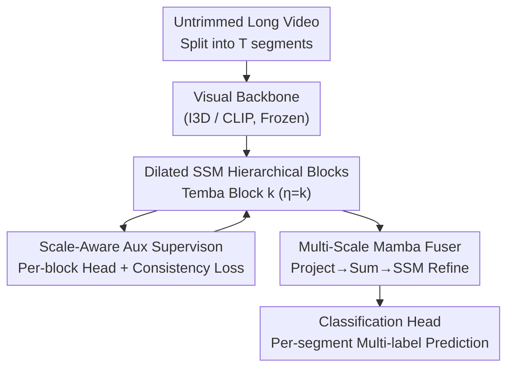

# MS-Temba: Multi-Scale Temporal Mamba for Understanding Long Untrimmed Videos

**Conference**: CVPR 2026  
**Paper**: [CVF Open Access](https://openaccess.thecvf.com/content/CVPR2026/html/Sinha_MS-Temba_Multi-Scale_Temporal_Mamba_for_Understanding_Long_Untrimmed_Videos_CVPR_2026_paper.html)  
**Code**: https://mstemba.github.io (Project Page)

**Area**: Video Understanding  
**Keywords**: Temporal Action Detection, State Space Models, Mamba, Multi-scale Modeling, Long Video

## TL;DR
MS-Temba transforms the Mamba State Space Model into a "Multi-Scale Dilated SSM" by stacking parallel branches with varying temporal dilation rates into a hierarchical structure, then uses a lightweight Mamba fuser to unify multi-scale features. With only 17M parameters, it achieves SOTA in Temporal Action Detection (TAD) on 40-minute-long, densely annotated daily activity videos, reducing parameters by 5x compared to Transformer-based solutions.

## Background & Motivation

**Background**: Temporal Action Detection (TAD) in long untrimmed videos requires a model to identify "which actions are occurring + when they start and end" at every timestep. Activities of Daily Living (ADL, e.g., home care, smart homes) are particularly challenging; a video can reach 40 minutes, where atomic actions lasting seconds (e.g., "drinking water") are interleaved with activities lasting tens of minutes (e.g., "using a laptop"), often with multiple concurrent actions (e.g., "walking while using a phone").

**Limitations of Prior Work**: Mainstream TAD frameworks based on Temporal CNNs or Transformers face bottlenecks. Temporal convolutions (PDAN, TGM) have limited receptive fields and struggle to capture long-range dependencies across whole videos even with dilated kernels. Transformers (MS-TCT, MLAD) model long-range dependencies via global self-attention, but their quadratic complexity is prohibitive for ultra-long sequences, and large models often reach 87M parameters. State Space Models (SSMs) like Mamba offer linear complexity but typically scan at a single temporal scale, mixing instantaneous fine-grained actions with background noise and losing fine temporal structure.

**Key Challenge**: A single-scale scan with a fixed receptive field cannot simultaneously handle "precision for short actions" and "breadth for long actions," which is critical for dense, overlapping ADL scenarios. Models are either too granular to see long-range structure or too broad to distinguish short action boundaries.

**Goal**: Restore sensitivity to multiple temporal scales while retaining the linear efficiency of Mamba, addressing three challenges: long-range dependencies (Challenge 1), cross-scale actions and intra-class temporal variance (Challenge 2), and dense overlapping actions (Challenge 3).

**Key Insight**: Instead of scanning the video with a fixed receptive field, allow multiple SSM branches to scan at different temporal dilation rates ($\eta$). Short-stride branches focus on instantaneous fine-grained actions, while long-stride branches capture long-range dependencies. This brings the concept of "dilation" from dilated convolutions into the SSM scanning process for the first time.

**Core Idea**: Replace single-scale scanning with "Dilated SSMs," stacked into hierarchical Temba blocks with increasing dilation, followed by a Mamba fuser for additive fusion and SSM refinement, maintaining linear efficiency while restoring temporal resolution.

## Method

### Overall Architecture
MS-Temba takes a long untrimmed video and outputs multi-label action predictions for each segment. The pipeline consists of four steps: first, a **frozen visual backbone** extracts a token sequence; second, a stack of **Temba Blocks** uses parallel dilated SSMs to learn representations across different temporal scales, with deeper blocks having larger dilation and wider feature dimensions; third, a **Multi-Scale Mamba Fuser (MS-Fuser)** projects multi-scale features to a common dimension for additive fusion and SSM refinement; finally, a **Classification Head** generates multi-label predictions per segment.

### Key Designs

**1. Dilated SSM: Parallel Multi-scale Receptive Fields in One Block**

The Dilated SSM addresses the mixing of short actions and long backgrounds. Given an input sequence $x_k \in \mathbb{R}^{B\times T\times D_k}$, a **non-parametric, invertible mapping** $\Phi_\eta$ splits the time axis into $\eta$ non-overlapping sub-sequences based on stride $\eta$. The $i$-th sub-sequence takes tokens at positions $t = i + j\eta$ ($0\le j < \lceil T/\eta\rceil$). This splits the video into $\eta$ temporal streams with different "dilation phases."

Each sub-sequence is processed by an independently parameterized SSM branch $(A^{(i)}, B^{(i)}, C^{(i)})$:

$$h_t^{(i)} = A^{(i)} h_{t-1}^{(i)} + B^{(i)} X_t^{(i)}, \quad y_t^{(i)} = C^{(i)} h_t^{(i)}$$

These branches learn complementary receptive fields. The outputs are reassembled into the original order via $\Phi_\eta^{-1}$. Since $\Phi_\eta^{-1}(\Phi_\eta(x))=x$, this step is bijective and preserves temporal fidelity, embedding multi-scale receptive fields into the linear Mamba scan.

**2. Projection Consistency Alignment: Preventing Semantic Drift**

As branches scan asynchronously with independent parameters, "scale drift" (inconsistent activation patterns for the same action across branches) may occur. The authors propose that if an action activates at time $t_s$ in one branch, adjacent segments $t_{s-1}, t_{s+1}$ in adjacent branches should have similar patterns. A pairwise consistency loss is applied to the **output projection matrices** $C_i$:

$$\mathcal{L}_{cons} = 1 - \mathrm{sim}(\hat{C}_i, \hat{C}_j), \quad i \neq j$$

where $\hat{C}_i, \hat{C}_j$ are flattened and $\ell_2$-normalized projection matrices, and $\mathrm{sim}$ is cosine similarity. This encourages semantic alignment across scales while preserving temporal diversity.

**3. Scale-Aware Auxiliary Supervision + Hierarchy: Forcing Scale Specialization**

Multiple Temba blocks are stacked with increasing dilation: the $k$-th block uses $\eta = k$, where $z_k = \mathrm{Temba}_{\eta=k}(z_{k-1})$. Feature dimensions expand by ratio $\gamma$ ($x_k = W_k z_{k-1} + \beta_k$) in deeper blocks. To ensure each block focuses on its assigned scale, each block includes a lightweight head producing a block-level prediction $\hat{Y}_k$, supervised by a binary cross-entropy auxiliary loss:

$$\mathcal{L}_{aux} = \mathrm{BCE}(\hat{Y}_k, Y)$$

This explicit supervision maintains the inductive bias of each block towards its specific dilation rate.

**4. Multi-Scale Mamba Fuser (MS-Fuser): Additive Fusion and SSM Refinement**

The MS-Fuser projects block outputs $z_k$ to a unified dimension $E$ ($\tilde{z}_k = W_k^f z_k + \beta_k^f$) and performs **direct summation**: $z_f = \sum_{k=1}^{K} \tilde{z}_k$. The fused feature passes through an SSM for cross-scale refinement:

$$h_t^f = A^f h_{t-1}^f + B^f z_t^f, \quad y_t^f = C^f h_t^f$$

This combines fine-grained cues from early blocks with coarse-grained background from later blocks. Ablations show "Summation + SSM" outperforms "Concatenation + Projection" by aligning features in the same space.

### Loss & Training
The total objective weights three losses:

$$\mathcal{L} = \mathcal{L}_{BCE} + \alpha \mathcal{L}_{cons} + \frac{\beta}{K}\sum_{k=1}^{K}\mathcal{L}_{aux}$$

where $\mathcal{L}_{BCE}$ is the main loss, $\alpha=100.0$, and $\beta=1$. Training uses $K=3$ Temba blocks, expansion ratio $\gamma=1.5$, and a state dimension of 16. Backbones (I3D or CLIP-L/14) remain frozen.

## Key Experimental Results

### Main Results
Performance on TSU (51 classes, dense concurrency, 21 min avg) and Charades (157 classes):

| Dataset | Backbone | Method | Params (M) | mAP |
|---------|----------|--------|------------|-----|
| TSU | I3D | MS-TCT | 87 | 33.7 |
| TSU | I3D | DualDETR | 21 | 34.8 |
| TSU | I3D | **Ours** | **17** | **36.1** |
| TSU | CLIP | MS-TCT | 87 | 40.6 |
| TSU | CLIP | **Ours** | **17** | **44.0** |
| Charades | I3D | MS-TCT | 87 | 25.4 |
| Charades | I3D | **Ours** | **17** | **25.4** |
| Charades | CLIP | MS-TCT | 87 | 31.9 |
| Charades | CLIP | **Ours** | **17** | **33.6** |

**Gain**: Using a CLIP backbone, MS-Temba reaches 44.0 mAP on TSU (vs 40.6 for MS-TCT) with 5x fewer parameters. Localization accuracy is higher across all tIoU thresholds, indicating superior boundary alignment.

### Ablation Study

| Configuration | TSU mAP | Charades mAP | Description |
|---------------|---------|--------------|-------------|
| No temporal modeling | 24.7 | 22.9 | CLIP baseline |
| + Mamba encoder | 40.2 | 32.4 | Massive gain |
| + Dilated SSM | 42.5 | 32.5 | TSU +2.3% |
| + MS-Fuser (Full) | 44.0 | 33.6 | Final gain |

| $\mathcal{L}_{cons}$ | $\mathcal{L}_{aux}$ | Avg mAP | Description |
|------|------|---------|------|
| ✗ | ✗ | 41.9 | BCE only |
| ✓ | ✗ | 41.9 | Consistency alone lacks impact |
| ✗ | ✓ | 42.8 | Aux supervision is primary driver |
| ✓ | ✓ | 43.8 | Best combined (+1.9%) |

### Key Findings
- **Dilated SSM role specialization**: Temba Block 1 (small dilation) is stronger for actions <10s, while Block 3 (large dilation) is stronger for actions >20s.
- **Auxiliary loss importance**: $\mathcal{L}_{aux}$ improves performance by ensuring intermediate representations align with temporal semantics.
- **Optimal depth**: 3 blocks provide the best trade-off. A 4th block leads to performance degradation.
- **No temporal scaling**: Pooling or strided convolutions hurt performance. Maintaining native temporal resolution in every block is optimal.
- **Summation > Concatenation**: Summation aligns multi-scale features in a unified space for better SSM refinement.

## Highlights & Insights
- **Clean migration of "Dilation" to SSM**: The "rearrange-scan-restore" pattern using $\Phi_\eta$ allows multi-scale receptive fields without breaking Mamba's linear scanning logic. This can be adapted to any SSM-based multi-scale task.
- **Parameter Efficiency**: 17M vs 87M parameters shows that TAD's bottleneck is often the "temporal inductive bias" rather than raw parameter count.
- **Effective Auxiliary Supervision**: Direct supervision on intermediate blocks forces each scale to learn specialized features, a strategy broadly applicable to hierarchical networks.
- **Generalization**: MS-Temba achieves SOTA on video summarization (SumMe, TVSum), proving it is a general framework for long video understanding.

## Limitations & Future Work
- **Heuristic Dilation**: Setting $\eta=k$ is simple but may not be optimal for all datasets compared to learnable dilation.
- **Depth Constraints**: Performance drops beyond 3 blocks, which may limit long-range coverage for extremely long sequences.
- **Frozen Backbone**: The two-stage training prevents joint optimization of visual features and temporal modeling.
- **Hyperparameter Sensitivity**: The high weight of $\alpha=100.0$ suggests the consistency loss might be sensitive and requires careful tuning across datasets.

## Related Work & Insights
- **vs MS-TCT**: MS-TCT uses CNNs and attention. MS-Temba matches or exceeds it with much higher parameter efficiency and better scalability for ultra-long videos.
- **vs Video Mamba Suite**: Existing video SSMs usually focus on short 3-minute clips with global classification. MS-Temba is the first to apply Mamba to 40-minute untrimmed videos for dense temporal localization.
- **vs Temporal Convolutions**: Unlike dilated CNNs that have local kernels, Dilated SSMs propagate information across the entire sequence within the state space, improving long-action modeling.

## Rating
- Novelty: ⭐⭐⭐⭐ 
- Experimental Thoroughness: ⭐⭐⭐⭐ 
- Writing Quality: ⭐⭐⭐⭐ 
- Value: ⭐⭐⭐⭐ 

<!-- RELATED:START -->

## Related Papers

- [\[CVPR 2026\] HieraMamba: Video Temporal Grounding via Hierarchical Anchor-Mamba Pooling](hieramamba_video_temporal_grounding_via_hierarchical_anchor-mamba_pooling.md)
- [\[CVPR 2026\] Gamba: Mamba-based Graph Convolutional Network with Dynamic Graph Topology Learning for Action Recognition](gamba_mamba-based_graph_convolutional_network_with_dynamic_graph_topology_learni.md)
- [\[ICCV 2025\] Vamba: Understanding Hour-Long Videos with Hybrid Mamba-Transformers](../../ICCV2025/video_understanding/vamba_understanding_hour-long_videos_with_hybrid_mamba-transformers.md)
- [\[CVPR 2026\] OmniVTG: A Large-Scale Dataset and Training Paradigm for Open-World Video Temporal Grounding](omnivtg_a_large-scale_dataset_and_training_paradigm_for_open-world_video_tempora.md)
- [\[CVPR 2026\] Thinking with Drafts: Speculative Temporal Reasoning for Efficient Long Video Understanding](thinking_with_drafts_speculative_temporal_reasoning_for_efficient_long_video_und.md)

<!-- RELATED:END -->
