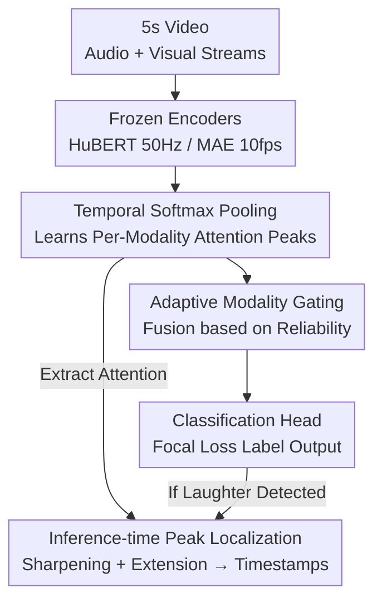

# MTLLFM: Multimodal-Temporal Laughter Localization

**Conference**: CVPR 2026  
**arXiv**: [2605.25409](https://arxiv.org/abs/2605.25409)  
**Code**: https://github.com/WSCSports/MTLLFM-temporal-laughter-localization (Yes)  
**Area**: Video Understanding / Multimodal Affective Computing  
**Keywords**: Laughter Localization, Weakly-supervised Temporal Localization, Multimodal Fusion, Modality Gating, Temporal Softmax Pooling

## TL;DR
This work upgrades "laughter detection" from coarse clip-level classification to sub-second temporal localization. By utilizing frozen HuBERT and MAE encoders combined with a lightweight "Temporal Softmax Pooling + Adaptive Modality Gating" module, the model learns precise start and end boundaries of laughter events using only clip-level labels (weakly-supervised). It achieves a 99% classification F1 and 68.1% localization precision on sports broadcast data, outperforming multimodal large language models such as Gemini 1.5 Flash. Additionally, it introduces the UR-FUNNY-Temporal and SMILE-Temporal datasets with temporal annotations for 11,053 video segments.

## Background & Motivation

**Background**: Automatic laughter detection is a critical capability for affective computing and narrative understanding. Predominant approaches (e.g., UR-FUNNY, SMILE benchmarks) treat this as **clip-level binary classification**—assigning a "humor/no-humor" label to an entire video segment and predicting it via multimodal fusion of text, audio, and visual streams.

**Limitations of Prior Work**: In practice, laughter consists of **brief, sporadic, transient events embedded within neutral speech** (this study reports an average duration of only 1.70–2.16 seconds, often occurring in sub-second bursts). Training on clip-level labels results in a severe mismatch between annotation granularity and event duration, introducing significant label noise. Consequently, models fail to learn precise temporal representations or determine exactly when the laughter occurs.

**Key Challenge**: Precise localization typically requires frame-level (onset/offset) annotations, which are prohibitively expensive and missing from existing datasets. Furthermore, general cross-attention fusion, while expressive, has $O(T^2)$ complexity and requires vast amounts of data to learn sparse sub-second structures under weak supervision, making it unsuitable for large-scale continuous video analysis.

**Goal**: (1) Achieve precise onset/offset localization of laughter under a **weakly-supervised setting with only clip-level labels**; (2) Provide a fine-grained temporal localization benchmark that distinguishes between speakers and audience, dominant modalities, and intensities.

**Key Insight**: The authors observe that laughter serves as a "short affective peak." Rather than modeling all-to-all interactions across all time steps, it is more effective for the model to learn a **saliency-driven temporal attention distribution** that concentrates mass on these peaks. Moreover, since the dominant modality (audio, visual, or both) varies significantly across samples, the model must dynamically determine which modality to trust per instance.

**Core Idea**: Use "per-modality Temporal Softmax Pooling (saliency aggregation) + Adaptive Modality Gating" instead of heavy cross-attention. The attention distribution learned under weak supervision is utilized during **inference** as an implicit temporal localization signal to resolve event boundaries from clip-level labels.

## Method

### Overall Architecture
The model takes the audio and visual streams of a 5-second video as input and outputs a binary laughter label $\hat{y}$, along with temporal attention distributions $\boldsymbol{\alpha}^a, \boldsymbol{\alpha}^v$ and modality weights $w_a, w_v$ for each stream. The pipeline consists of four stages: **Frozen Encoders** extract features $\rightarrow$ Each modality undergoes **Temporal Softmax Pooling** to obtain fixed-dimensional representations $\rightarrow$ **Adaptive Modality Gating** fuses the streams based on reliability $\rightarrow$ A classification head generates the label. Training is performed using only clip-level labels. During **inference**, the learned attention distributions are sharpened and peak-extended to resolve laughter intervals into continuous timestamps. The architecture is intentionally lightweight: frozen foundation encoders handle semantics, while trainable components are limited to projection layers, pooling parameters, and gating layers.

### Key Designs

**1. Temporal Softmax Pooling: Concentrating Mass on Sub-second Affective Peaks**

The primary difficulty in weak supervision is identifying short laughter bursts embedded in neutral speech using only clip labels. Conventional mean/max pooling either treats all time steps equally or selects only one extreme feature, both of which fail to capture the temporal structure of transient emotions. For each modality $m$ at time step $t$, the model learns a scalar importance score $e_m^t = \tanh(\mathbf{w}^\top f_m^t + b)$, which is normalized via softmax to a temporal probability distribution $\alpha_m^t = \frac{\exp(e_m^t)}{\sum_j \exp(e_m^j)}$. The final representation is $\mathbf{f}_m = \sum_t \alpha_m^t f_m^t$. Two key adaptations are made: **independent pooling per modality** (performed before fusion) to preserve modality-specific localization, and an **added $\tanh$ gating before softmax** to restrict scores to $[-1, 1]$, preventing attention saturation at high temporal resolutions. This mechanism maintains $O(T)$ complexity and naturally produces interpretable temporal attention, which serves as the localization signal during inference.

**2. Adaptive Modality Gating: Dynamic Instance-level Trust Allocation**

The dominant modality of laughter varies by context—ranging from audible laughter (audio-dominant) to silent smirks (visual-dominant). In sports broadcasts, audio often contains high-energy commentary noise (mimicking emotional intensity) while the visual subject may remain expressionless if the laughter originates off-camera. Fixed-weight fusion cannot handle such modality conflicts. This work uses independent linear layers to compute gating logits $g_a = \mathbf{w}_a^\top \mathbf{f}_a$ and $g_v = \mathbf{w}_v^\top \mathbf{f}_v$, which are converted to complementary weights $[w_a, w_v] = \mathrm{softmax}([g_a, g_v])$ such that $w_a + w_v = 1$. The fused representation is $\mathbf{f}_{\text{fused}} = w_a \mathbf{f}_a + w_v \mathbf{f}_v$. This allows the model to select the more reliable modality per instance. Statistics show that while 79%–92% of laughter is audio-dominant, the gating mechanism successfully recovers instances requiring visual or bimodal evidence.

**3. Inference-time Peak Localization: Resolving Attention into Continuous Timestamps**

No localization head is trained; instead, the attention distribution is repurposed for **post-processing localization**. For clips predicted as containing laughter ($\hat{y}=1$), temperature sharpening $\tilde{\alpha}_m^t = \frac{(\alpha_m^t)^{1/\tau}}{\sum_j (\alpha_m^j)^{1/\tau}}$ is applied with $\tau=0.5$ to highlight peaks. The two streams are aligned to $N$ unified time bins (audio via max-pooling, visual via linear interpolation) and combined using modality weights $\beta_n = w_a \tilde{\alpha}_a^{(n)} + w_v \tilde{\alpha}_v^{(n)}$. The peak bin $n^* = \arg\max_n \beta_n$ is identified and extended to adjacent bins where $\beta_n$ exceeds the mean $\bar\beta$. These bin indices are then mapped back to continuous timestamps. This step transforms saliency learned during classification into usable localization output at zero additional training cost.

### Loss & Training
Training is conducted using only clip-level binary labels. The classification head employs **Focal Loss** to address the imbalance between negative and positive (laughter-containing) samples. Class weights are set based on the filtered data distribution. The model is optimized using Adam with a learning rate of $10^{-4}$, a batch size of 32, a hidden dimension of 1024, and dropout of 0.5. Training continues for up to 50 epochs with early stopping based on validation loss. Features are pre-extracted and cached using the frozen encoders.

## Key Experimental Results

### Main Results
Performance comparison on three datasets (SportsPress, UR-FUNNY-Temporal, SMILE-Temporal) against multimodal foundation models. Metrics include F1 for classification, and Precision@IoU=0.5 (P@.5) and Mean IoU (mIoU) for localization (localization is calculated only on true positives):

| Dataset | Method | Cls.F1 | P@.5 | Mean IoU |
|--------|------|--------|--------|----------|
| SportsPress | Qwen2.5 Omni 7B | 0.997 | 0.208 | 0.301 |
| SportsPress | Gemini 1.5 Flash | 0.885 | 0.542 | 0.546 |
| SportsPress | **MTLLFM (Ours)** | 0.990 | **0.681** | **0.580** |
| UR-FUNNY | Gemini 1.5 Flash | 0.775 | 0.393 | 0.405 |
| UR-FUNNY | **MTLLFM (Ours)** | **0.849** | **0.497** | **0.466** |
| SMILE | Gemini 1.5 Flash | 0.724 | 0.579 | 0.540 |
| SMILE | **MTLLFM (Ours)** | **0.803** | 0.567 | 0.511 |

**Key Finding**: While Qwen2.5 Omni achieves a near-perfect classification F1 of 99.7% on SportsPress, its localization precision is only 20.8%. This highlights that **strong semantic understanding does not equate to precise temporal localization**. Ours leads in both classification and localization on SportsPress and UR-FUNNY. On SMILE, Gemini shows slightly higher localization (57.9% vs 56.7%) due to the dataset's clear audience laughter, which favors semantic models, though Ours maintains a higher F1 with significantly lower computational overhead.

### Ablation Study
Ablation results on SportsPress (keeping other hyperparameters consistent):

| Configuration | F1 | P@.5 | IoU | Description |
|------|----|------|-----|------|
| Full Model (Ours) | 0.990 | 0.681 | 0.580 | Full model |
| Mean Pool | 0.968 | 0.160 | 0.347 | No localization; falls back to clip-level |
| Max Pool | 0.946 | 0.160 | 0.347 | Same as above |
| Self-Attention Pool | 0.653 | 0.188 | 0.274 | Standard attention fails to learn sparse structure |
| w/o Tanh Gating | 0.979 | 0.639 | 0.562 | 4.2 point drop in P@.5 without gating |
| Concat (no gate) | 0.976 | 0.618 | 0.535 | Concatenation without dynamic weighting |
| Sigmoid Gate | 0.986 | 0.625 | 0.555 | Softmax gate outperforms sigmoid |
| Cross-Attention Fusion | 0.677 | 0.248 | 0.324 | Cross-modal attention fails under weak supervision |
| Audio Only | 0.979 | 0.604 | 0.552 | Audio stream only |
| Vision Only | 0.675 | 0.257 | 0.322 | Visual stream only; significantly underperforms |

### Key Findings
- **Softmax pooling is the source of localization capability**: Mean/max pooling mechanisms lack localization ability (P@.5 ≈ 0.160). Switching to Temporal Softmax Pooling yields a 4x improvement to 68.1% without sacrificing classification accuracy.
- **Tanh gating prevents attention saturation**: Removing it drops P@.5 from 68.1% to 63.9%.
- **Softmax gating > Concat/Sigmoid**: It improves P@.5 by 3–7 points. While audio is the dominant modality (60.4% P@.5), the full model's improvement over audio-only (+7.7 points) suggests the gating successfully integrates complementary visual cues.
- **Significant downstream gains**: Inserting `<LAUGHTER>` tokens using the predicted timestamps into subtitles for an LLM results in a **+227.2%** surge in CIDEr (0.262 $\rightarrow$ 0.858) for Video Laugh Reasoning. Remarkably, **GPT-3.5 with these temporal tags outperforms GPT-4o without them**, demonstrating that precise temporal grounding can bridge the performance gap between model generations.

## Highlights & Insights
- **Zero-cost loop for "Localization via Classification"**: The model never sees frame-level labels during training but resolves sub-second boundaries via learned attention distributions. This provides "free" localization under weak supervision, drastically reducing annotation costs.
- **Specialized Lightweight > General Foundation Models**: For sub-second transient events, $O(T)$ saliency pooling outperforms general multimodal reasoning systems like Gemini/Qwen, providing evidence for "task-specific temporal modeling."
- **The "Aha!" Downstream Validation**: Localization precision is more than just a benchmark metric. Feeding laughter timestamps to an LLM allows a weaker model (GPT-3.5) to surpass a stronger one (GPT-4o), suggesting that precise temporal grounding is a more efficient path than simply scaling model parameters.
- **Transferability**: This framework (per-modality pooling + adaptive gating + attention-based localization) is naturally applicable to other transient affective signals, such as excitement bursts or micro-expressions, establishing a general paradigm for weakly-supervised temporal grounding.

## Limitations & Future Work
- **SportsPress Non-disclosure**: The core SportsPress dataset cannot be released due to broadcasting rights, meaning the 68.1% precision figure cannot be independently replicated on that specific domain (only UR-FUNNY/SMILE annotations are public).
- **Sub-optimal Performance on SMILE**: Localization precision was slightly lower than Gemini (56.7% vs 57.9%). In scenarios with very distinct, clear audience laughter, general semantic models remain competitive.
- **Heavy Reliance on Acoustic Dominance**: Approximately 79%–92% of laughter is audio-dominant. In noisy audio environments or scenarios with purely visual laughter (silent smirks), the method's reliability may decrease.
- **Post-processing Dependency**: Localization depends on heuristic hyperparameters like temperature $\tau$ and bin count $N$ rather than end-to-end optimization.
- **Future Directions**: The released frame-level annotations can be used to train fully-supervised or semi-supervised TAL models or to study how sparse temporal labels can bootstrap weakly-supervised methods.

## Related Work & Insights
- **vs. Clip-level Humor Recognition**: Conventional tasks focus on "humor/no-humor" classification. This work provides onset/offset timestamps and metadata (speaker/audience, modality dominance), shifting the focus from clip-level recognition to sub-second localization.
- **vs. Multimodal Foundation Models**: LLMs rely on general reasoning but struggle with sub-second localization. This work proves that semantic understanding does not inherently provide temporal precision.
- **vs. Weakly-supervised Action Localization (UntrimmedNets)**: This work adapts Softmax Pooling for affective signals by introducing per-modality pooling and tanh gating to handle the brief, subtle nature of laughter compared to human actions.
- **vs. Heavy Cross-Attention Fusion**: Cross-attention fails to learn sparse structures under weak supervision. This lightweight gating fusion is better suited for sparse transient events in large-scale video.

## Rating
- Novelty: ⭐⭐⭐⭐ Upgrading laughter detection to weakly-supervised sub-second localization and the "localization via classification" loop are significant contributions.
- Experimental Thoroughness: ⭐⭐⭐⭐ Comprehensive comparisons across three datasets and downstream reasoning gains (CIDEr +227%) provide a strong evidence chain.
- Writing Quality: ⭐⭐⭐⭐ Clear motivation, complete mathematical formulations, and detailed annotation statistics.
- Value: ⭐⭐⭐⭐ Releasing fine-grained temporal labels for 11k+ videos serves the affective computing and grounding communities well.

## Related Papers

- [\[CVPR 2026\] VideoITG: Multimodal Video Understanding with Instructed Temporal Grounding](videoitg_multimodal_video_understanding_with_instructed_temporal_grounding.md)
- [\[CVPR 2026\] Memory Matters: Boosting Training-Free Zero-Shot Temporal Action Localization with a Learnable Lookup Table](memory_matters_boosting_training-free_zero-shot_temporal_action_localization_wit.md)
- [\[CVPR 2026\] CLCR: Cross-Level Semantic Collaborative Representation for Multimodal Learning](clcr_cross-level_semantic_collaborative_representation_for_multimodal_learning.md)
- [\[ECCV 2024\] Online Temporal Action Localization with Memory-Augmented Transformer](../../ECCV2024/video_understanding/online_temporal_action_localization_with_memory-augmented_transformer.md)
- [\[CVPR 2026\] OpenMarcie: Dataset for Multimodal Action Recognition in Industrial Environments](openmarcie_dataset_for_multimodal_action_recognition_in_industrial_environments.md)

<!-- RELATED:END -->

<!-- RELATED:START -->

## Related Papers

- [\[CVPR 2026\] VideoITG: Multimodal Video Understanding with Instructed Temporal Grounding](videoitg_multimodal_video_understanding_with_instructed_temporal_grounding.md)
- [\[CVPR 2026\] OpenMarcie: Dataset for Multimodal Action Recognition in Industrial Environments](openmarcie_dataset_for_multimodal_action_recognition_in_industrial_environments.md)
- [\[CVPR 2026\] MovieRecapsQA: A Multimodal Open-Ended Video Question-Answering Benchmark](movierecapsqa_a_multimodal_open-ended_video_question-answering_benchmark.md)
- [\[CVPR 2026\] CLCR: Cross-Level Semantic Collaborative Representation for Multimodal Learning](clcr_cross-level_semantic_collaborative_representation_for_multimodal_learning.md)
- [\[CVPR 2026\] T2SGrid: Temporal-to-Spatial Gridification for Video Temporal Grounding](t2sgrid_temporal-to-spatial_gridification_for_video_temporal_grounding.md)

<!-- RELATED:END -->
