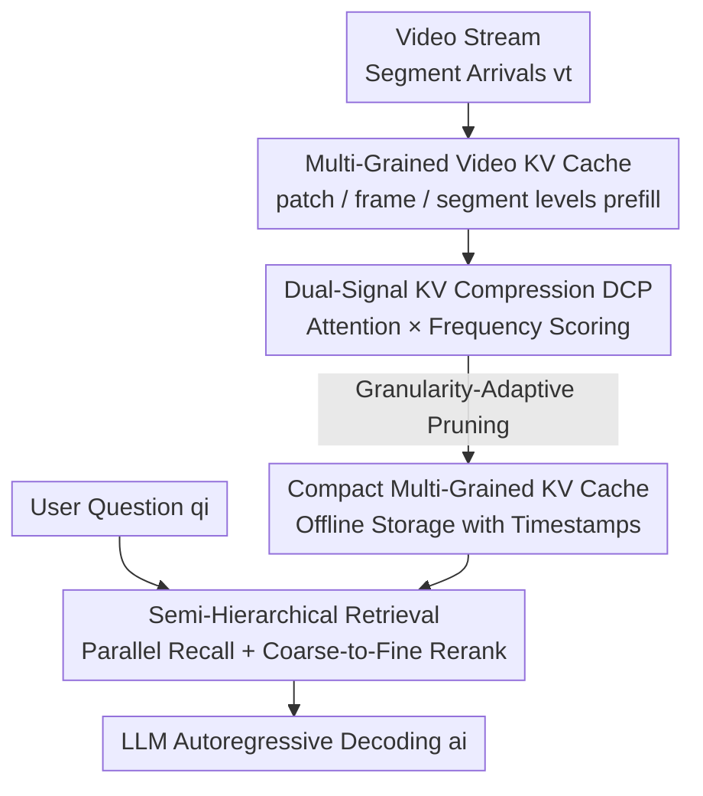

# MuKV: Multi-Grained KV Cache Compression for Long Streaming Video Question-Answering

**Conference**: CVPR 2026  
**Paper**: [CVF Open Access](https://openaccess.thecvf.com/content/CVPR2026/html/Xiao_MuKV_Multi-Grained_KV_Cache_Compression_for_Long_Streaming_Video_Question-Answering_CVPR_2026_paper.html)  
**Code**: To be confirmed  
**Area**: Video Understanding  
**Keywords**: Streaming VideoQA, KV Cache Compression, Multi-Grained Representation, Frequency Domain Signal, Hierarchical Retrieval

## TL;DR
MuKV simultaneously stores the historical KV cache of long streaming videos at patch, frame, and segment granularities. It employs "self-attention + frequency" dual-signal pruning to compress redundancy and utilizes "semi-hierarchical retrieval" for online recall. This approach significantly improves long streaming VideoQA accuracy without increasing memory footprint or online latency.

## Background & Motivation

**Background**: Streaming Video Question Answering (Streaming VideoQA) requires answering questions as video frames arrive continuously. Since visual tokens grow linearly over time and quickly exceed the context window of LLMs, three main approaches exist: end-to-end MLLMs (compressing tokens into long contexts), Socratic/agentic schemes (storing visual descriptions or embeddings offline for online retrieval), and recent KV-cache based methods (e.g., ReKV). The latter stores the Key-Value cache of historical frames directly to avoid re-prefilling, offering a training-free and efficient compromise.

**Limitations of Prior Work**: Existing KV-cache methods like ReKV only perform **per-frame granularity caching**. A single frame-level representation fails to encode region-level spatial details within frames or capture temporal context across frames. Furthermore, the cache volume expands linearly over time, introducing significant storage redundancy which interferes with retrieval and degrades QA accuracy.

**Key Challenge**: The tug-of-war between fidelity and efficiency—maintaining fine-grained spatial/temporal information requires storing more tokens (increasing memory and retrieval noise), whereas saving memory necessitates coarse-grained caching (losing details). Single-granularity caching cannot satisfy both requirements simultaneously.

**Goal**: Within the KV-cache framework, the goal is to preserve multi-grained spatial/temporal fidelity while compressing the cache to sub-linear growth and ensuring efficient online retrieval. This is decomposed into three sub-problems: multi-grained storage, redundancy compression, and accurate recall.

**Key Insight**: The authors observe that different granularities serve different semantic roles (segments provide narrative-level temporal context; patches capture regional changes). Furthermore, the **frequency distribution** of tokens reflects content variability—static/redundant content has low frequency, while dynamic content has high frequency—and FFT is computationally efficient. Thus, frequency is used as a task-agnostic, low-overhead redundancy metric to complement self-attention scores.

**Core Idea**: Replace single-frame caching with "Multi-grained Caching + Dual-signal (Attention $\times$ Frequency) Pruning + Semi-hierarchical Retrieval" to achieve both fidelity and efficiency. This approach is training-free and model-agnostic.

## Method

### Overall Architecture
MuKV follows the streaming VideoQA framework with **offline memory** and **online retrieval** phases. During the offline phase, video arrives incrementally in "segments." For each segment, three granularities (segment / middle-frame / middle-frame patches) are extracted and independently prefilled into the LLM to obtain three sets of KV caches and attention weights. The DCP module then utilizes dual signals to score token importance and prunes them according to granularity-adaptive ratios. During the online phase, a question triggers parallel retrieval of top blocks across the three granularities, followed by a coarse-to-fine reranking using segment-level representations before final autoregressive decoding.

### Key Designs

**1. Multi-Grained Video KV Cache: Simultaneous Contextual Encoding**

To address the lack of detail in frame-level caching, MuKV extracts representations at three levels per segment (e.g., 4 frames, ~8 seconds): the full segment $v_t$, the middle frame $f_t$, and the super-patches $p_{f_t}$ of the middle frame. In MLLMs like LLaVA-OV, since each visual token corresponds to an original frame patch, these three levels are obtained by **grouping visual tokens at different scales** without additional vision encoder passes. Let each segment have $F$ frames, each frame $P$ patches, partitioned into $S$ super-patches ($S<P$); then $v_t=\{x_i\}_{i=1}^{O}$ ($O=P\times F$), $f_t=\{x_i\}_{i=1}^{P}$, and $p_{f_t}=\{x_i\}_{i=1}^{\lfloor P/S\rfloor}$ represent the segment, middle frame, and super-patch levels, respectively. Each token is independently fed into the LLM with previous KVs to obtain the current KV cache $\{(K_{f_t}^{(\ell)},V_{f_t}^{(\ell)})\}_{\ell=1}^{L}$ and attention weights $A_{f_t}^{(\ell)}$.

**2. Dual-Signal KV Compression (DCP): Attention + Frequency for Redundancy Removal**

DCP prunes each granularity independently using two complementary indicators. First, the **Attention Indicator**: Self-attention naturally reflects token importance and is obtained during prefill with zero overhead. The authors aggregate attention from the **last layer** across multiple heads and tokens:

$$I_{att}=\frac{1}{H\cdot P}\sum_{h=1}^{H}\sum_{i=1}^{P}A_{h,i}^{(L)},\quad I_{att}\in\mathbb{R}^{P\times1}$$

Second, the **Frequency Indicator**: To address potential task-overfitting of attention scores, FFT is used to transform the key vectors into the frequency domain $Z_{fft}=\mathrm{FFT}(k_{P\times D})$, and importance is derived via mean pooling: $I_{fft}=\mathrm{Mean}(Z_{fft}^{P\times D})$. Static content typically exhibits lower frequency characteristics. The two signals are fused after min-max normalization:

$$I_{f_t}=\alpha_{f_t}\hat{I}_{att}+(1-\alpha_{f_t})\hat{I}_{fft},\quad I_{f_t}\in\mathbb{R}^{P\times1}$$

The study finds that **retaining high-frequency tokens** is optimal for this task (improving RVSEgo by 3.7% over low-frequency retention).

**3. Granularity-Adaptive Compression: Specific Ratios for Different Levels**

DCP retains the top $\kappa=\lfloor\rho\cdot|\cdot|\rfloor$ tokens based on the fused score $I$. Adaptive ratios $\rho_{v_t}, \rho_{f_t}, \rho_{p_{f_t}}$ are used (e.g., $\rho=\{0.1, 0.1, 0.8\}$), where segment and frame levels are heavily compressed while more patch-level details are kept. This reduces the total cache to approximately 1/3 of ReKV's size while maintaining higher precision.

**4. Semi-Hierarchical KV Retrieval: Parallel Recall + Coarse-to-Fine Reranking**

To avoid noise from purely parallel retrieval and error propagation from strictly hierarchical retrieval, MuKV uses a two-stage process. **Stage 1 (Parallel Retrieval)**: Block representations $k_{f_t}$ and global query $q$ are generated via mean pooling. The top-$2k_g$ blocks are recalled based on cosine similarity $s_{f_t}$. **Stage 2 (Hierarchical Reranking)**: Recalled segment-level representations are used to calculate a consistency score $\gamma_j$ for low-granularity candidates, updating the similarity:

$$\tilde{s}_j=(1-\lambda_g)s_j+\lambda_g\gamma_j$$

$\lambda_g$ acts as a coherency factor (set to 0.3 for patch/frame, 0 for segment). This anchors low-granularity details to the global temporal context.

## Key Experimental Results

### Main Results
Evaluated on RVSEgo, RVSMovie (VStream-QA), and StreamingBench using LLaVA-OV (0.5B/7B). Efficiency is measured by the number of tokens during inference and in memory.

| Model | Scale | #Inf. Tok↓ | #Mem. Tok↓ | RVSEgo | RVSMovie | StreamingBench(All) |
|------|------|-----------|-----------|--------|----------|---------------------|
| ReKV | 0.5B | 12.5K | 59K | 51.5 | 42.3 | 52.7 |
| MuKV | 0.5B | **8.3K** | 59K | **57.9** | **45.2** | **56.8** |
| ReKV | 7B | 12.5K | 59K | 56.2 | 48.2 | 62.3 |
| MuKV | 7B | **8.3K** | 59K | **59.5** | 48.5 | **64.4** |

MuKV consistently outperforms ReKV with **fewer inference tokens (8.3K vs 12.5K)** and comparable memory usage.

### Ablation Study

| Configuration | Acc@Ego | Acc@Movie | Description |
|------|---------|-----------|------|
| Patch only | 51.6 | 44.1 | Single fine-granularity |
| Frame only | 53.1 | 45.2 | Single frame-level |
| Segment only | 54.9 | 44.8 | Single segment-level |
| Patch+Frame+Segment | **56.5** | **46.0** | Multi-grained optimal |

| Compression Config | #Inf. Tok↓ | #Mem. Tok↓ | Acc@Ego | Acc@Movie |
|----------|-----------|-----------|---------|-----------|
| MuKV Uncompressed | 12.5K | 177K | 53.7 | 44.3 |
| MuKV Attn Only | 8.3K | 59K | 55.9 | 45.1 |
| MuKV Freq Only | 8.3K | 59K | 56.6 | 45.3 |
| MuKV DCP (67%) | 8.3K | 59K | **57.3** | **45.6** |
| ReKV DCP (50%) | 6.3K | 29K | 56.1 | 44.9 |

### Key Findings
- **Granularity Complementarity**: Segment-level leads among single granularities, but the combination of all three is best.
- **Informed Compression**: DCP is "informative compression." While random pruning drops accuracy by 4.8%, DCP often improves it by removing redundancy.
- **Dual-Signal Synergy**: Frequency signals correct the "positional bias" of attention where earlier tokens receive higher scores.
- **Semi-Hierarchical Retrieval**: Achieves the best balance between denoising and preventing error propagation.
- **High-Frequency Importance**: Retaining high frequencies is superior to retaining low frequencies in videos, as they capture motion and foreground details.

## Highlights & Insights
- **Clever Reuse of Visual Tokens**: By recognizing that visual tokens already correspond to frame patches, MuKV achieves multi-grained representation by grouping existing tokens, entailing zero additional vision encoding cost.
- **Frequency-Domain Discovery**: In contrast to NLP (which often discards high-frequency tokens), video compression benefits from retaining high frequencies.
- **Positional Bias Correction**: Using frequency to balance temporal attention bias is a robust strategy for "de-biasing" pruning.
- **General Applicability**: The method is training-free and model-agnostic, showing consistent gains across different backbones and frame rates.

## Limitations & Future Work
- **Counting Tasks**: Accuracy on counting-related questions is lower, as compression tends to preserve global semantics at the expense of fine-grained frame-by-frame changes.
- **Hyperparameter Sensitivity**: Parameters like $\alpha$, $\rho$, $\lambda$ are currently found via greedy search; an adaptive selection mechanism is lacking.
- **Segment Definition**: A fixed segment size (e.g., 4 frames) may result in information loss for scenes with rapid transitions.
- **Retrieval Overhead**: Semi-hierarchical retrieval adds a reranking step, slightly impacting efficiency compared to purely parallel methods.

## Related Work & Insights
- **Comparison with ReKV**: ReKV caches frames indiscriminately. MuKV introduces multi-grained compact representations, achieving sub-linear memory growth and higher fidelity.
- **Comparison with InfiniPot-V**: InfiniPot-V uses Value Norm but focuses on spatial domains. MuKV's DCP outperforms it by considering temporal cross-frame patterns.
- **Comparison with FreqKV**: While FreqKV discards high-frequency text tokens in NLP, MuKV identifies high frequencies as critical for video understanding.
- **Inspiration**: The "Semi-hierarchical" retrieval approach provides a template for balancing noise reduction and error propagation in multi-level retrieval systems.

## Rating
- Novelty: ⭐⭐⭐⭐ (Multi-grained KV + dual-signal frequency compression is a novel combination).
- Experimental Thoroughness: ⭐⭐⭐⭐ (Extensive ablations across granularities, signals, and backbones).
- Writing Quality: ⭐⭐⭐⭐ (Clear logic and well-explained intuition).
- Value: ⭐⭐⭐⭐ (Training-free and plug-and-play for existing KV-cache streaming systems).

<!-- RELATED:START -->

## Related Papers

- [\[CVPR 2026\] HERBench: A Benchmark for Multi-Evidence Integration in Video Question Answering](herbench_a_benchmark_for_multi-evidence_integration_in_video_question_answering.md)
- [\[NeurIPS 2025\] InfiniPot-V: Memory-Constrained KV Cache Compression for Streaming Video Understanding](../../NeurIPS2025/video_understanding/infinipot-v_memory-constrained_kv_cache_compression_for_streaming_video_understa.md)
- [\[ACL 2026\] HERMES: KV Cache as Hierarchical Memory for Efficient Streaming Video Understanding](../../ACL2026/video_understanding/hermes_kv_cache_as_hierarchical_memory_for_efficient_streaming_video_understandi.md)
- [\[CVPR 2026\] MovieRecapsQA: A Multimodal Open-Ended Video Question-Answering Benchmark](movierecapsqa_a_multimodal_open-ended_video_question-answering_benchmark.md)
- [\[CVPR 2026\] Ego-Grounding for Personalized Question-Answering in Egocentric Videos](ego-grounding_for_personalized_question-answering_in_egocentric_videos.md)

<!-- RELATED:END -->
