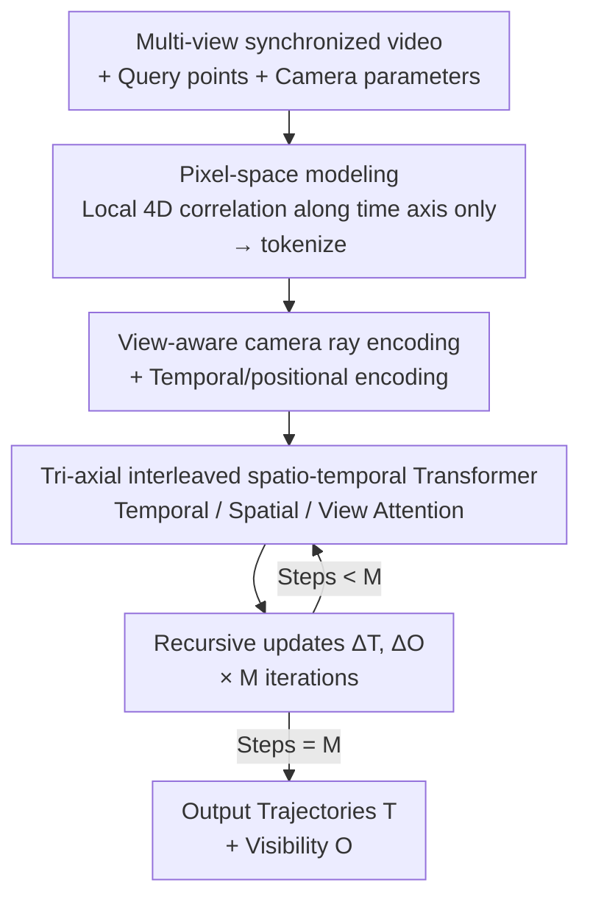

# MV-TAP: Tracking Any Point in Multi-View Videos

**Conference**: CVPR 2026  
**Paper**: [CVF Open Access](https://openaccess.thecvf.com/content/CVPR2026/html/Koo_MV-TAP_Tracking_Any_Point_in_Multi-View_Videos_CVPR_2026_paper.html)  
**Area**: Video Understanding / Point Tracking / Multi-view Geometry  
**Keywords**: Track Any Point (TAP), Multi-view, View Attention, Camera Ray Encoding, Occlusion

## TL;DR
MV-TAP extends "Track Any Point" (TAP) from single-view to multi-view synchronized videos by modeling directly in 2D pixel space. It utilizes camera ray encoding to inject geometric context and a view attention layer to exchange information across viewpoints. This allows for trajectory completion in the presence of occlusion or motion blur in a single view by leveraging other views, significantly outperforming single-view SOTA methods processed independently on DexYCB, Panoptic Studio, Kubric, and Harmony4D.

## Background & Motivation
**Background**: Point tracking (TAP) is a fundamental tool for understanding dynamic scenes. Given a query point, the goal is to predict its 2-D trajectory and visibility across a video sequence, supporting downstream tasks such as 4D reconstruction, robotic manipulation, embodied AI, and video editing. Recent methods like CoTracker, TAPIR, LocoTrack, and TAPNext have achieved excellent spatio-temporal consistency in single-view videos.

**Limitations of Prior Work**: However, these methods **operate only within a single view**. Monocular videos inherently possess geometric ambiguities—frequent occlusions, rapid/non-rigid motion, and depth uncertainty. Once a point is occluded or becomes motion-blurred, single-view trackers often lose the trajectory or produce fragmented results. Many real-world scenarios (motion capture, robotic arms, autonomous driving) are naturally captured by multiple synchronized cameras, yet existing methods fail to exploit these cross-view cues.

**Key Challenge**: A point occluded in one view is often clearly visible in another. If single-view trackers are applied **independently** to each view without exchanging information, this complementarity is wasted. Existing attempts either rely on multi-view matching (assuming static/rigid scenes and requiring geometric priors, which are unsuitable for dynamic point tracking) or like MVTracker, lift points to 3D world coordinates for tracking—making them heavily dependent on the quality of pre-estimated depth and introducing errors when re-projecting 3D points back to 2D pixels.

**Goal**: Given **only multi-view videos and camera parameters without relying on depth input**, the objective is to track a set of query points across multiple synchronized videos in 2D pixel space, maintaining strong spatio-temporal consistency while utilizing complementary multi-view information.

**Key Insight**: The authors’ core intuition is that multi-view observations provide **complementary cues** for a dynamic scene; joint cross-view reasoning can resolve monocular ambiguities. Instead of lifting to 3D world space and risking depth estimation uncertainty, it is preferable to remain in pixel space and implement "cross-view" interaction as an attention mechanism within the network.

**Core Idea**: Build upon a strong 2D tracking backbone (CoTracker3) by adding two components: **camera ray encoding** to feed geometric context of each tracked point to the model, and **view attention** to allow tokens from different views to exchange information. This upgrades single-view tracking to multi-view tracking in pixel space.

## Method

### Overall Architecture
The input consists of $V$ **time-synchronized** view videos $I=\{I_{v,t}\in\mathbb{R}^{H\times W\times3}\}$, query points defined independently for each view $Q=\{q_{v,n}\}$ (where each query $q=(t_q,x_q,y_q)$ is the pixel coordinate $(x_q,y_q)$ at frame $t_q$), and camera intrinsic and extrinsic parameters $G=\{G_{v,t}=K[R_{v,t}|t_{v,t}]\}$. The output is the 2D trajectories $\mathcal{T}\in\mathbb{R}^{V\times T\times N\times2}$ and visibility $\mathcal{O}\in\mathbb{R}^{V\times T\times N\times1}$ for all points across all views and timesteps. Note: although query points are defined independently, they often point to the **same 3D scene points**, visualized from different starting times in each view.

The pipeline follows a cycle of "feature extraction → geometric/temporal encoding → tri-axial attention refinement": A CNN encoder extracts features from each view, and for each query point, a local 4D correlation volume is computed along the **temporal axis** to obtain matching costs. The costs and current trajectory positions are tokenized into $X\in\mathbb{R}^{V\times T\times N\times d}$, followed by camera ray encoding and temporal position encoding. Tokens enter a Transformer that interleaves "temporal attention / spatial attention / view attention." At each step, it predicts increments $\Delta\mathcal{T},\Delta\mathcal{O}$ for trajectory and occlusion, which are added back to the current estimate, iterating $M=4$ times.

### Key Designs

**1. Pixel-space modeling + Temporal-only 4D correlation: Avoiding depth dependency and large-baseline correlation noise**

The authors deliberately avoid lifting points to 3D world coordinates (unlike MVTracker / TAPIP3D) because lifting depends heavily on depth estimation quality, and re-projection accumulates errors. MV-TAP predicts trajectories directly in 2D pixel space, with geometric information "softly injected" via camera parameters. The matching representation adopts the single-view tracker's local 4D correlation: given a query point $q$ and a hypothetical match $p$, normalized correlation is calculated in the neighborhood of radii $r_p, r_q$:
$$\mathcal{L}_t(i,j;p,q)=\frac{F_t(i)\cdot F_{t_q}(j)}{\lVert F_t(i)\rVert_2\,\lVert F_{t_q}(j)\rVert_2},$$
where $i\in N(p,r_p),\,j\in N(q,r_q)$. A key design choice is that the correlation volume is **only constructed along the temporal dimension, not the view dimension**. This is because as the baseline between views increases, the appearance similarity of local patches drops sharply, making cross-view correlation unreliable and noisy. Thus, information exchange across views is left to the subsequent view attention mechanism rather than appearance matching.

**2. View-aware camera ray encoding: Feeding cross-view geometric context via Plücker rays**

To inform the network of the relative geometry between views, the authors encode camera parameters into rays corresponding to each tracked point. Each ray $r_{v,t,n}\in\mathbb{R}^6$ is represented using direction + moment (Plücker coordinates):
$$r=\begin{bmatrix}\mathbf{d}\\ \mathbf{m}\end{bmatrix},\quad \mathbf{m}=\mathbf{o}\times\mathbf{d},$$
where the direction and origin are derived from camera parameters: $\mathbf{d}=R^\top K^{-1}\mathbf{x}$ and $\mathbf{o}=-R^\top t$ (with $\mathbf{x}=(u,v,1)^\top$ as homogeneous pixel coordinates). The direction $\mathbf{d}$ is normalized to unit length for scale invariance. The coordinates for all trajectories are expanded to $R\in\mathbb{R}^{V\times T\times N\times6}$, projected to the feature dimension via an MLP, and added to the input tokens along with sinusoidal positional encodings. Consequently, each token carries not just "what it looks like" (correlation) but also the geometric context of "which view/ray it is observed from," paving the way for cross-view alignment.

**3. Tri-axial interleaved spatio-temporal Transformer: View attention for resolving occlusion ambiguity**

The encoded tokens enter a Transformer that applies attention interleaved along three axes—fixing the feature dimension $d$ while folding other axes into the batch dimension. **Temporal attention** aggregates along the frame axis $T$, $\mathrm{Attn}_{\text{temp}}(X)=\mathrm{Softmax}(Q_TK_T^\top/\sqrt{d})V_T$, ensuring temporal smoothness. **Spatial attention** aggregates along the point axis $N$ within the same frame, linking points with consistent motion patterns to implicitly capture rigidity. However, these only model **intra-view** relationships. The critical component is **view attention**, performed along the view axis $V$ as $\mathrm{Attn}_{\text{view}}(X)=\mathrm{Softmax}(Q_VK_V^\top/\sqrt{d})V_V$. This explicitly aligns representations across views and exchanges information—a point occluded or blurred in one view can "borrow" evidence from a clearly visible token in another view, overcoming viewpoint-dependent ambiguities.

### Loss & Training
The iterative updates for trajectory and occlusion are predicted via $\Delta\mathcal{T},\Delta\mathcal{O}=\mathrm{Transformer}(X)$ and added to the previous estimates $\mathcal{T}^{(m+1)}=\mathcal{T}^{(m)}+\Delta\mathcal{T}$ and $\mathcal{O}^{(m+1)}=\mathcal{O}^{(m)}+\Delta\mathcal{O}$ for $M$ steps. Training supervises both branches: a Huber loss with iterative weighting for trajectories
$$\mathcal{L}_{\mathrm{track}}=\sum_{m=1}^{M}\gamma^{M-m}\,\ell_{\mathrm{Huber}}\big(\mathcal{T}^{(m)},\mathcal{T}^*\big),$$
and BCE for occlusion status after passing logits through a sigmoid, also with iterative weighting
$$\mathcal{L}_{\mathrm{occ}}=\sum_{m=1}^{M}\gamma^{M-m}\,\mathrm{BCE}\big(\sigma(\mathcal{O}^{(m)}),\mathcal{O}^*\big).$$
Since existing point tracking datasets are single-view, the authors created a **synthetic multi-view dataset with 5,000 scenes** using the Kubric engine (including trajectories, occlusion, and camera labels). The model is initialized from CoTracker3 weights, with the feature extractor frozen and the rest updated. Training was conducted on 4×A6000 for 50K steps, batch=1/GPU, using AdamW (lr=1e-4, weight decay=1e-4) + Cosine scheduler + 1000 step warm-up + gradient clipping 1.0. During training, the number of input views was randomized between 1 and 4, at 384×512 resolution, with 384 trajectories and $M=4$. Due to the attention mechanism, the model handles an arbitrary number of views during inference.

## Key Experimental Results

### Main Results
Evaluations were conducted across DexYCB, Panoptic Studio, Kubric, and Harmony4D datasets using a unified 8-view setup. AJ is the combined score of position and occlusion, $<\delta^x_{avg}$ is positional accuracy (PCK), and OA is occlusion accuracy.

| Dataset | Metric | MV-TAP | CoTracker3 (SOTA Single-view) | CoTracker3 + Tri. (Triangulation) | CoTracker3 + Flat. (Flattened) |
|---|---|---|---|---|---|
| DexYCB | AJ / $<\delta^x_{avg}$ / OA | **44.2 / 61.9 / 78.3** | 41.5 / 59.6 / 76.4 | 39.2 / 57.1 / 76.4 | 2.7 / 7.1 / 35.7 |
| Panoptic Studio | AJ / $<\delta^x_{avg}$ / OA | **40.3 / 62.8 / 73.1** | 39.6 / 61.4 / 72.3 | 37.9 / 59.5 / 72.3 | 1.0 / 12.7 / 38.8 |
| Kubric | AJ / $<\delta^x_{avg}$ / OA | **87.8 / 94.0 / 96.3** | 83.5 / 90.7 / 94.1 | 70.2 / 82.6 / 94.3 | 19.6 / 29.3 / 34.6 |
| Harmony4D | AJ / $<\delta^x_{avg}$ / OA | **42.6 / 74.9 / 65.8** | 41.4 / 73.5 / 63.2 | 39.2 / 70.4 / 63.2 | 2.1 / 20.7 / 46.4 |

MV-TAP leads across almost all metrics. 3D-based methods requiring depth (SpatialTracker, TAPIP3D) and MVTracker failed significantly on certain datasets (e.g., TAPIP3D AJ was only 5.0 on Harmony4D), demonstrating that depth-lifting is fragile in complex real-world human scenes. The "Flattened" baseline (CoTracker3+Flat., treating views and time as a single sequence) collapsed almost entirely, showing that simply treating multi-view data as a long sequence is detrimental.

### Ablation Study

| Configuration | DexYCB (AJ / $<\delta^x_{avg}$ / OA) | Panoptic (AJ / $<\delta^x_{avg}$ / OA) | Description |
|---|---|---|---|
| CoTracker3 (Baseline) | 41.5 / 59.6 / 76.4 | 39.6 / 61.4 / 72.3 | Independent single-view |
| + View Attention | 43.6 / 61.5 / 77.4 | 38.6 / 61.6 / 69.4 | Only cross-view interaction |
| + Camera Encoding | 42.2 / 60.6 / 78.0 | 39.9 / 60.9 / 73.0 | Only geometric context |
| MV-TAP (Both) | **44.2 / 61.9 / 78.3** | **40.3 / 62.8 / 73.1** | Full model |

View count ablation (DexYCB): MV-TAP AJ steadily rose from 39.2 to 44.2 as views increased from 2 to 8. CoTracker3 showed minimal gains (37.5 to 41.5), while the flattened baseline performed worse with more views.

### Key Findings
- **View attention is the main contributor, camera encoding is reinforcing**: Adding only view attention improved AJ on DexYCB by +2.1, but occlusion accuracy (OA) on Panoptic declined slightly without camera encoding. The combination is stable because geometric encoding provides the "correspondence basis," while attention performs the alignment.
- **Resolving occlusion via multiple views**: Evaluating position accuracy on occluded points ($<\delta^x_{occ}$), MV-TAP scored 38.4 vs CoTracker3’s 33.9 on DexYCB. On high-occlusion trajectories, AJ was 29.7 vs 26.2, verifying that cross-view cues effectively rescue points lost in single views.
- **Gain from architecture, not just more training**: Initialized from the same weights and controlling for training volume, MV-TAP consistently outperformed CoTracker3, indicating the improvements stem from design.
- **Multi-view should not be blindly flattened**: The "Flat" baseline failure proves that multi-view data requires an explicit independent attention axis to avoid destroying the temporal structure of individual views.

## Highlights & Insights
- **"Cross-view exchange via attention, not correlation"**: A core insight is that as appearance correlation becomes unreliable across large baselines, restricting correlation to the temporal axis and delegating cross-view interaction to attention is more effective.
- **Utility of Camera Rays (Plücker coordinates)**: Encoding parameters into rays as a "soft geometric injection" is a versatile approach that can be migrated to other tasks requiring multi-view consistency.
- **Axial Attention Scalability**: Training with 1-4 views but inferring with any number of views shows the flexibility and engineering friendliness of "axis-to-batch" designs.
- **Filling the Dataset Gap**: By synthesis of 5,000 multi-view scenes and establishing evaluation benchmarks, the authors provided the necessary infrastructure for the "multi-view 2-D point tracking" task.

## Limitations & Future Work
- **Dependency on synchronization and camera parameters**: The method assumes perfect time synchronization and accurate intrinsics/extrinsics; it cannot yet be used for non-calibrated or unsynchronized "casual" videos.
- **Reliance on synthetic data**: Diverse real-world multi-view data is scarce; the generalization limits from synthetic to real domains require further large-scale verification.
- **SOTA baselines in specific metrics**: TAPIP3D or TAPNext still outperform in certain niche metrics, showing pixel-space solutions aren't dominant in every dimension.
- **Abandoning cross-view appearance correlation**: In small baseline cases where appearance is reliable, ignoring cross-view correlation might waste cues. An adaptive mechanism could be beneficial.
- **Computational cost of view attention**: As the number of views grows, all-to-all view attention cost increases; the paper does not deeply analyze efficiency at very high view counts.

## Related Work & Insights
- **vs CoTracker3 [20]**: MV-TAP builds on it by adding camera ray encoding and view attention, upgrading it from "independent run and aggregate" to "cross-view communication," specifically improving robustness to occlusion.
- **vs MVTracker [29]**: MVTracker operates in 3D coordinates and depends on depth; MV-TAP remains in 2D, requires no depth, and provides per-view visibility, proving much more stable in complex scenes like Harmony4D.
- **vs Multi-view Matching [7,27,30,31,34]**: These methods focus on static/rigid correspondence and ignore temporal consistency when used for tracking; MV-TAP jointly models view and time.
- **vs Triangulation/Flattening**: Explicit geometry (Triangulation) is hampered by monocular noise, while Flattening destroys temporal structure; both reinforce the necessity of the tri-axial attention approach.

## Rating
- Novelty: ⭐⭐⭐⭐ First paradigm to perform TAP in 2D pixel space using only multi-view videos and camera parameters. The "temporal correlation + view attention" division is clear, though Ray Encoding and Axial Attention are existing concepts.
- Experimental Thoroughness: ⭐⭐⭐⭐⭐ Comprehensive cross-dataset comparisons, ablations on view count/occlusion/architecture, and strong coverage of diverse baselines (Triangulation, 3D methods).
- Writing Quality: ⭐⭐⭐⭐ The motivation and design choices are well-explained. Some ablation values require careful cross-referencing with tables.
- Value: ⭐⭐⭐⭐ Defines a needed task (MoCap/Robotics Multi-cam) and provides a dataset and strong baseline for future research.

<!-- RELATED:START -->

## Related Papers

- [\[CVPR 2026\] MER-Tracker: Towards High-Speed 3D Point Tracking via Multi-View Event-RGB Hybrid Cameras](mer-tracker_towards_high-speed_3d_point_tracking_via_multi-view_event-rgb_hybrid.md)
- [\[NeurIPS 2025\] TAPVid-360: Tracking Any Point in 360 from Narrow Field of View Video](../../NeurIPS2025/video_understanding/tapvid-360_tracking_any_point_in_360_from_narrow_field_of_view_video.md)
- [\[CVPR 2026\] Generative Point Tracking and Forecasting](generative_point_tracking_and_forecasting.md)
- [\[CVPR 2025\] ETAP: Event-based Tracking of Any Point](../../CVPR2025/video_understanding/etap_event-based_tracking_of_any_point.md)
- [\[CVPR 2026\] Real-World Point Tracking with Verifier-Guided Pseudo-Labeling](realworld_point_tracking_with_verifierguided_pseud.md)

<!-- RELATED:END -->
