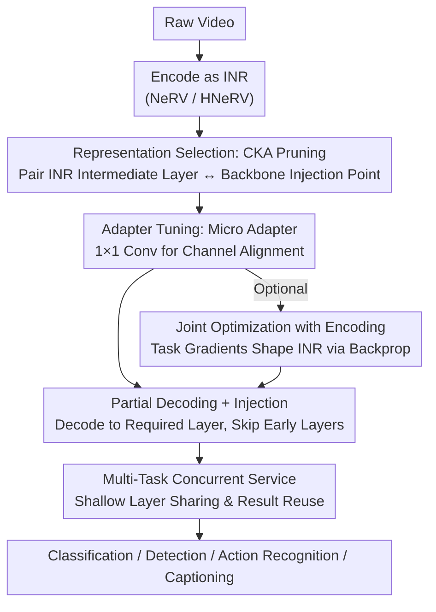

# Neural-Centric Video Processing Pipeline for Unified Multi-Task Inference

**Conference**: CVPR 2026  
**Paper**: [CVF Open Access](https://openaccess.thecvf.com/content/CVPR2026/html/Lee_Neural-Centric_Video_Processing_Pipeline_for_Unified_Multi-Task_Inference_CVPR_2026_paper.html)  
**Area**: Video Understanding / Video Coding / Inference Efficiency  
**Keywords**: Implicit Neural Representation, Video Coding, Multi-Task Inference, Partial Decoding, Feature Adapter

## TL;DR
This work encodes videos directly into Implicit Neural Representations (INR/NeRV). It utilizes Centered Kernel Alignment (CKA) to identify optimal "INR intermediate layer ↔ downstream backbone injection point" pairs and trains ultra-lightweight 1×1 convolutional Micro Adapters for feature conversion. During inference, it **only decodes up to the required intermediate layer**, skipping pixel reconstruction and early backbone layers. This unified representation serves multiple tasks (classification, detection, action recognition, captioning) simultaneously, reducing end-to-end latency by up to 89.5% and inference FLOPs by up to 29.9%.

## Background & Motivation
**Background**: Videos are increasingly used as inputs for machine learning systems. Real-world deployments (VOD, surveillance, content moderation) typically follow a **Write-Once-Read-Many (WORM)** pattern—videos are encoded once on a server and then repeatedly queried by various tasks, models, time intervals, and resolutions. In such workloads, the dominant cost is not one-time encoding but **repeated decoding and inference**.

**Limitations of Prior Work**: Current pipelines rely on "traditional codecs (H.264/HEVC) storage → on-demand decoding to pixels → preprocessing → feature extraction by early backbone layers." This paradigm is designed for human perception (PSNR/SSIM). For machine vision, every step performs redundant work: neural networks discard over 50% of pixel-level details during feature extraction, yet are forced to reconstruct them entirely first. Furthermore, running $N$ tasks on the same video results in redundant decode→preprocess→extract cycles.

**Key Challenge**: Existing approaches fail to provide a "unified representation." **Compressed Domain Inference (CDI)** performs inference on codec artifacts (motion vectors, residuals) to bypass decoding but is tightly coupled to specific codec structures and requires redesign for new tasks. **Video Coding for Machines (VCM)** replaces pixel encoding with task-optimized learned features but requires custom encoders and retraining for each domain, failing to reuse pre-trained RGB backbones and often lacking human-viewable visualization. Neither supports "one representation for any downstream task without re-encoding."

**Key Insight**: The authors observe that INRs (e.g., NeRV) are inherently composed of CNN hierarchies. **The direction of their video decoding hierarchy is exactly the reverse of the abstract feature direction in downstream vision models.** NeRV's early layers generate coarse-grained global semantics while deep layers refine spatial details, whereas models like YOLO/ResNet move from details to abstractions. Consequently, NeRV intermediate activations **are themselves semantic features at multiple abstraction levels** existing in "neural feature space" (CNN activations rather than pixels), allowing them to be fed directly into downstream networks without pixel restoration.

**Core Idea**: Videos are stored as INRs, serving as continuous functions capable of outputting features at arbitrary abstraction levels. During inference, decoding proceeds only to the layer required by the task, using lightweight adapters to bridge to the corresponding backbone position. This unified representation integrates compression, storage, visualization, and multi-task inference.

## Method

### Overall Architecture
The Neural-Centric Video Pipeline (NVP) operates in two stages. **Encoding Stage (Offline, One-time)**: Given a video encoded as an INR (trained to convergence or a PSNR ≥ 33dB threshold) and a set of downstream task models, it produces three components for each task: (1) the optimal feature extraction layer in the INR hierarchy, (2) the corresponding injection point in the task backbone, and (3) a trained adapter to align the two representation spaces. **Representation Selection (CKA pruning)** determines the optimal pairing, while **Adapter Tuning** trains Micro Adapters for numerical mapping. Optionally, INR weights and task losses can be **jointly optimized** to shape the representation by downstream objectives. **Inference Stage (Online)**: Upon a task request, the system retrieves stored routing information, performs **partial decoding** to the specified intermediate layer → passes it through the Micro Adapter → and injects it directly into the backbone's intermediate layer. When handling concurrent tasks, shallow features are computed once and reused by deeper tasks.

### Key Designs

**1. Representation Selection: CKA Pruning of the Search Space**

The search space for "INR layer × backbone layer" combinations is exponentially large, making exhaustive training and evaluation of adapters for every video and task prohibitive. NVP employs **Centered Kernel Alignment (CKA)**—a metric for similarity between two sets of neural activation representations—to measure alignment in **kernel space** rather than raw feature distance, ensuring robustness to scale changes and partial overlaps. For each candidate pair, the system calculates:

$$\mathrm{CKA}(F_{\text{INR}}, F_{\text{backbone}}) = \frac{\lVert F_{\text{backbone}}^{\top} F_{\text{INR}}\rVert_F^2}{\lVert F_{\text{backbone}}^{\top} F_{\text{backbone}}\rVert_F \,\lVert F_{\text{INR}}^{\top} F_{\text{INR}}\rVert_F}$$

where $\lVert\cdot\rVert_F$ denotes the Frobenius norm. Pairs are ranked by CKA similarity, and only the top-K (e.g., top 10%) are selected for adapter training. Ablation results show that training only the top 5-20% of candidates yields optimal accuracy (within 2% error) while saving 68.8% of computation, confirming that CKA ranking effectively captures viable pairings.

**2. Micro Adapter: Decoupling Spatial and Channel Transformations**

To feed features into downstream models, NVP uses a minimalistic adapter: **bilinear interpolation resizes INR intermediate features to the expected spatial dimensions of the backbone, followed by a 1×1 convolution for channel transformation.** By decoupling spatial and channel operations, it avoids complex feature transfer methods involving kernel size, stride, or pooling adjustments. The overhead is negligible, with adapters accounting for only 0.02%–0.96% of backbone parameters (e.g., 0.02% for ResNet-50). This decoupling separates "video representation" from "task modeling," allowing new tasks to be added by training a lightweight adapter in under 5 minutes without altering the stored video representation or the large backbone.

**3. Feature Transfer Composite Loss: Stable Alignment**

Using only MSE for adapter training can lead to instability and slow convergence when feature scales differ significantly. NVP employs a three-part composite loss:

$$\mathcal{L}_{\text{feat}}(\hat{F}, F) = \alpha\,\lVert \hat{F} - F\rVert_2^2 + \beta\left(1 - \frac{\hat{F}\cdot F}{\lVert\hat{F}\rVert\,\lVert F\rVert}\right) + \gamma\,\mathrm{SmoothL1}(\hat{F}, F)$$

MSE provides the primary signal for value reconstruction, Cosine Distance ensures the **orientation** of features in latent space is aligned, and the Huber (SmoothL1) term robustly handles outliers between INR and backbone features. Weights are set to $(\alpha,\beta,\gamma)=(1.0,0.2,0.1)$. Compared to pure MSE, this approach achieves **60% faster convergence** and higher top-1 accuracy by smoothing the adaptation process.

**4. Joint Optimization + Multi-Task Shared Inference**

Since the video representation is itself a neural network, gradients can propagate from task predictions back to INR weights. This enables **task-aware video coding**, where the representation is shaped by downstream goals given a fixed bitrate budget. The joint objective is:

$$\mathcal{L}_{\text{multi}} = \lambda_{\text{recon}}\mathcal{L}_{\text{recon}} + \sum_{i=1}^{T} w_i\big(\lambda^{(i)}_{\text{task}}\mathcal{L}^{(i)}_{\text{task}} + \lambda^{(i)}_{\text{feat}}\mathcal{L}^{(i)}_{\text{feat}}\big)$$

With weights $(\lambda_{\text{recon}}=1.0, \lambda_{\text{task}}=0.5, \lambda_{\text{feat}}=0.2)$, the system maintains visual fidelity for visualization while shaping features via task gradients. During inference, INR decoding is limited to the required depth, and **early backbone layers (which account for significant computation in CNNs) are skipped**, with adapters injecting features directly into intermediate layers.

### Loss & Training
Two training modes are utilized: (a) **Frozen INR, Adapter Training Only**: 30 epochs, early stopping, lr 1e-4; (b) **Joint Optimization**: 100-epoch INR warm-up followed by 100-epoch joint training (INR lr 1e-5, adapter lr 1e-4). Batch size is 4, and CKA pruning uses top-K=10. The INR architecture follows NeRV/HNeRV, containing 3–6 hierarchical decoding blocks (convolution + pixel-shuffle for resolution upscaling).

## Key Experimental Results

Evaluations were performed across four tasks: Classification (ResNet-50 / CLIP-RN50 / ViT-B/16), Action Recognition (SlowFast / I3D), Detection (DETR), and Captioning (BLIP). Datasets included ImageNet-VID 2015, UCF101, and MSR-VTT using standard pre-trained models.

### Main Results

Total Latency and Computation Comparison (Table 1 excerpts, reductions relative to CPU codec / INR full decoding):

| Model/Task | Path | Total Latency (ms) | Total Comp (GFLOPs) | Accuracy |
|--------|------|------|------|------|
| ResNet-50 Class. | CPU/GPU Codec | 60.59/17.17 | — | 74.59% |
| ResNet-50 Class. | NVP(HNeRV) | 7.81 (87.1%↓/47.9%↓) | 5.11 (90.0%↓) | **76.74%** |
| CLIP-RN50 Class. | CPU/GPU Codec | 65.17/18.45 | — | 89.65% |
| CLIP-RN50 Class. | NVP(HNeRV) | 6.87 (89.5%↓/52.3%↓) | 7.07 (86.6%↓) | **90.86%** |
| SlowFast Action | NeRV Full Decode | 130.08/86.66 | 1668.99/511.8 | 62.0% |
| SlowFast Action | NVP(NeRV) | 34.61 (—/73.4%↓) | 176.93 (89.4%↓) | 61.72% |
| DETR Detection | CPU/GPU Codec | 108.72/42.05 | — | 0.4436 mAP |
| DETR Detection | NVP(HNeRV) | 34.99 (67.8%↓/9.4%↓) | 97.66 (25.8%↓) | 0.4395 mAP |

Rate-Accuracy Advantage at Low Bitrates (Table 2 excerpts):

| Task | Bitrate (bpp) | H.264 | NVP |
|------|------|------|------|
| CLIP-RN50 Class. | 0.025 | 82.60% | **90.12%** (+7.52) |
| SlowFast Action | 0.02 | 52.89% | **63.38%** (+10.49) |
| DETR Detection | 0.05 | 0.4005 | **0.4283** |

### Ablation Study

| Config | Key Metric | Insight |
|------|---------|------|
| CKA top-5/10/20% | Optimal or ≤2% error | Saves 68.8% computation vs exhaustive search |
| Feat Transfer vs MSE | 60% faster convergence | Cosine+Huber stabilizes orientation alignment |
| Adapter Params | 0.02%(ResNet)~0.96%(SlowFast) | Ultra-lightweight; BLIP only 0.20% |
| Joint Opt vs Adapter Only | ResNet 83.27% / DETR 0.4438 | Task gradients further improve performance |

Comparison with machine-centric methods: NVP parameters (0.42M/0.48M) are far lower than DeepSVC (59.3M). It achieves 833/564 FPS for action recognition/detection while supporting visualization. Adding tasks takes < 5 minutes, whereas methods like Compressed Vision require days to retrain S3D on Kinetics-600.

### Key Findings
- **Latency Gains**: Reductions stem from reduced decoding (on-demand partial decoding), zero preprocessing (adapters handle resize/normalize), and skipping early backbone layers (vital for CNNs where early layers are computationally heavy). Total FLOPs reduction peaks at 89.98%.
- **Neural Superiority**: NVP achieves 76.74% on ResNet-50 vs 74.59% for H.264 without task labels during encoding. The continuous representation improves temporal consistency, yielding 4.8% higher per-frame consistency.
- **Bitrate-Accuracy Decoupling**: The choice of INR layer for partial decoding determines the bitrate but does not strictly limit downstream accuracy, allowing flexible adjustment based on bandwidth.
- **Detection Limitation**: Pure feature mapping slightly degrades performance on pixel-sensitive tasks like detection; incorporating regression losses into adapter training is suggested as a remedy.

## Highlights & Insights
- **The "Hierarchy Reversal" Insight**: Recognizing that NeRV decodes coarse-to-fine while visual models extract fine-to-coarse is the paper's strongest contribution. It reframes INRs from simple codec replacements into neural-native representations for downstream tasks.
- **CKA as a Cheap Proxy**: Using CKA to rank pairs instead of training hundreds of adapters successfully reduces an exponential search space to a manageable subset with minimal performance loss.
- **Decoupled 1×1 Conv Adapters**: By splitting the problem into bilinear spatial resizing and 1×1 channel convolution, the authors achieve extreme efficiency (0.02% parameters), making the "new task = tiny adapter" workflow feasible.
- **Honest Cost-Amortization Analysis**: The authors directly address the high cost of INR encoding (e.g., 30 mins for 10s of 1080p video) by calculating break-even query numbers (60K-150K), justifying the approach for large-scale WORM scenarios.

## Limitations & Future Work
- **Pixel-Sensitive Task Drop**: Accuracy on detection tasks slightly decreases, requiring better integration of task-specific losses into the adapter.
- **Transformer Sub-optimality**: Acceleration for ViT (59-70% FLOPs reduction) is less dramatic than for CNNs (86-90%) because ViT lacks the heavy early convolution layers that NVP bypasses. Backbone-aware INR architectures are needed.
- **Encoding Cost**: The 12-30 minute encoding time per video restricts the approach to WORM/high-query scenarios, making it unsuitable for one-time analysis.
- **Future Improvements**: Potential exists in meta-learning for faster INR fitting (e.g., MetaNeRV) and exploring synergistic gains from multi-task joint training.

## Related Work & Insights
- **vs. CDI (CoViAR / DMC-Net)**: While CDI is deployment-friendly, it is limited by fixed codec structures and non-semantic representations. NVP operates in neural feature space and supports end-to-end optimization.
- **vs. VCM (Compressed Vision / DeepSVC)**: VCM requires custom encoders and lacks pre-trained backbone reuse. NVP reuses existing backbones and supports visualization with significantly fewer parameters (0.42M vs 59.3M).
- **vs. INR as Codec (NeRV series)**: Previous works treated INRs as pixel-reconstruction tools. NVP treats INR intermediate layers as direct neural-native representations for multi-tasking.

## Rating
- Novelty: ⭐⭐⭐⭐⭐ The "Hierarchy Reversal" observation and framing of INRs as neural-native multi-task representations are highly original.
- Experimental Thoroughness: ⭐⭐⭐⭐ Broad coverage of tasks and models; however, datasets are relatively small (3K clips), and the drop on Transformers isn't fully addressed.
- Writing Quality: ⭐⭐⭐⭐⭐ Clear motivation, intuitive diagrams, and honest discussion of limitations.
- Value: ⭐⭐⭐⭐ High value for large-scale video analysis systems; engineering-friendly due to plug-and-play adapters.

<!-- RELATED:START -->

## Related Papers

- [\[CVPR 2026\] SDTrack: A Baseline for Event-based Tracking via Spiking Neural Networks](sdtrack_a_baseline_for_event-based_tracking_via_spiking_neural_networks.md)
- [\[CVPR 2026\] Scene-Centric Unsupervised Video Panoptic Segmentation](scene-centric_unsupervised_video_panoptic_segmentation.md)
- [\[CVPR 2026\] VecAttention: Vector-wise Sparse Attention for Accelerating Long Context Inference](vecattention_vector-wise_sparse_attention_for_accelerating_long_context_inferenc.md)
- [\[CVPR 2026\] UniVBench: Towards Unified Evaluation for Video Foundation Models](univbench_towards_unified_evaluation_for_video_foundation_models.md)
- [\[CVPR 2025\] MLVU: Benchmarking Multi-task Long Video Understanding](../../CVPR2025/video_understanding/mlvu_benchmarking_multi-task_long_video_understanding.md)

<!-- RELATED:END -->
