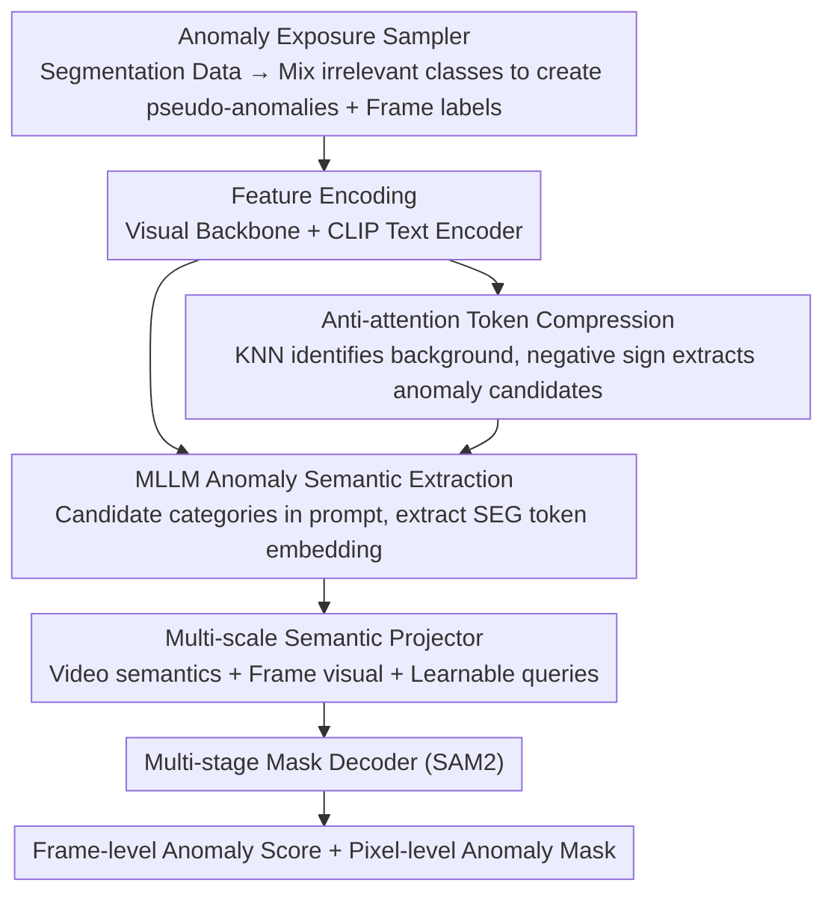

# No Need For Real Anomaly: MLLM Empowered Zero-Shot Video Anomaly Detection

**Conference**: CVPR 2026  
**arXiv**: [2602.19248](https://arxiv.org/abs/2602.19248)  
**Code**: [https://github.com/VitaminCreed/LAVIDA](https://github.com/VitaminCreed/LAVIDA)  
**Area**: Video Understanding  
**Keywords**: Video Anomaly Detection, Zero-shot, MLLM, Pseudo-anomaly, Token Compression

## TL;DR
The paper proposes LAVIDA, an end-to-end zero-shot Video Anomaly Detection (VAD) framework. By utilizing an Anomaly Exposure Sampler, semantic segmentation datasets are transformed into pseudo-anomalies for training. Combining MLLM for deep anomaly semantic extraction and anti-attention token compression to handle spatio-temporal sparsity, it achieves SOTA results at both frame and pixel levels without using any real VAD data.

## Background & Motivation

**Background**: Video Anomaly Detection (VAD) faces challenges from data scarcity and diverse scenarios. Traditional methods are categorized into unsupervised (learning normal patterns) and weakly supervised (video-level labels), both limited by training scenes and anomaly types. Recent open-set/open-vocabulary VAD attempts to handle unseen anomalies, while training-free MLLM-based methods directly use LLMs for scoring but suffer from high inference costs and lack of localization due to frame-by-frame text outputs.

**Limitations of Prior Work**: (1) Existing VAD datasets have limited scenes and anomaly types, leading to poor generalization. (2) Anomaly semantics are context-dependent (the same behavior may be normal or abnormal in different scenes), which current methods lack deep semantic understanding of. (3) Anomalies are extremely sparse in space and time, where massive background tokens increase computation and interfere with detection.

**Key Challenge**: Scarcity of real anomaly data vs. the requirement for models to see sufficient diverse anomalies to generalize.

**Goal**: Achieve cross-scene, cross-anomaly zero-shot frame-level and pixel-level detection without using any real VAD data for training.

**Key Insight**: Semantic segmentation datasets possess rich scene semantics and pixel-level annotations. Segmentation targets can be redefined as "anomalies" for training.

**Core Idea**: Transform segmentation datasets into a pseudo-anomaly training set via an Anomaly Exposure Sampler + utilize MLLM for understanding anomaly semantics + apply anti-attention to compress background tokens.

## Method

### Overall Architecture
LAVIDA seeks to answer a counter-intuitive question: can a cross-scene, cross-anomaly video anomaly detector be trained without ever touching real anomaly videos? The answer lies in leveraging semantic segmentation datasets—where massive scene semantics and pixel-level labels exist—and reinterpreting "segmentation targets" as "anomalies" to generate training signals. The pipeline works as follows: the **Anomaly Exposure Sampler** first reorganizes a video and its segmentation labels into a pseudo-anomaly sample with frame-level positive/negative labels. This is fed into a vision backbone and a CLIP text encoder for **feature encoding**. The encoded visual tokens pass through **anti-attention token compression** to filter out dense background and retain anomaly candidates. These, along with descriptions of "possible anomaly categories," are sent to the **MLLM for anomaly semantic extraction**, yielding a context-relevant video-level anomaly semantic feature. To address the lack of frame-level granularity, the **multi-scale semantic projector** fuses this with frame-wise visual features and learnable queries into frame-specific features. Finally, a **multi-stage mask decoder** initialized by SAM2 outputs frame-level anomaly scores and pixel-level anomaly masks simultaneously. Each module serves a specific purpose: the sampler solves the lack of real data, token compression handles sparsity and background noise, MLLM provides context-dependent semantics, and the projector bridges video-level semantics to frame/pixel-level granularity.

### Key Designs

**1. Anomaly Exposure Sampler: Creating Pseudo-anomaly Training Sets from Segmentation Data**

Real VAD datasets are too limited in scenes and anomaly types for effective generalization. The sampler defines the "appearance of unexpected categories" as an anomaly. This involves two steps: first, randomly sampling $K_E - 1$ categories irrelevant to the current sample to form an anomaly category set $c_i$; then, deciding with probability $p$ whether the sample is abnormal or normal. Abnormal samples contain both real categories and mixed irrelevant categories (labeled positive), while normal samples contain only irrelevant categories that do not actually appear (labeled negative). This forces the model to judge which categories actually appear among a set of candidates, effectively simulating the sparsity of real-world anomalies. $K_E$ is randomized to adapt the model to open-set settings with arbitrary numbers of anomaly types.

**2. Anti-attention Token Compression: Locking Anomalies by "Recognizing Background"**

Anomalies are spatio-temporally sparse, but visual tokens are saturated with dense background, increasing MLLM overhead and interference. While directly identifying anomalies is hard, background is easy to recognize due to its high frequency and similarity in feature space. The sampler uses KNN density estimation to find high-density regions as the background token set $Z^b$. It then performs "anti-attention" on each background token, where the crucial step is using a negative sign for weights:

$$Z_i' = \mathrm{Softmax}\!\left(-\frac{Z_i^b Z_{\mathcal{N}_i}^T}{\sqrt{D_z}}\right) \cdot Z_{\mathcal{N}_i}$$

The negative sign biases the aggregation weights toward the **least similar** neighbors, thereby extracting anomaly candidate features hidden in background neighborhoods. This compresses $L_z$ tokens into $L_r$, absorbing the background while preserving anomaly candidates.

**3. MLLM Anomaly Semantic Extraction: Dynamic Context-aware Anomaly Judgment**

The same behavior can be normal or abnormal depending on the scene. LAVIDA leverages the open-world understanding of MLLMs by adding a special `<SEG>` token to the vocabulary and constructing the prompt: "Find the anomaly in this video. Anomaly types may contain {c_i}". The `<SEG>` embedding $f_{sem}$ from the last layer serves as the anomaly semantic feature. This allows detection targets to adjust dynamically based on scene descriptions and candidates rather than being hard-coded.

**4. Multi-scale Semantic Projector: Aligning Video Semantics to Frame-level for the Mask Decoder**

The $f_{sem}$ provided by MLLM is a shared semantic feature for the entire video lacking frame-level granularity. The multi-scale semantic projector fuses $f_{sem}$, frame-wise visual features $f_v$, and learnable query vectors. These are projected into frame-level semantic features $f_a\in\mathbb{R}^{T\times K\times D_a}$ and then into frame-specific features $f_{proj}\in\mathbb{R}^{T\times D_m}$. The multi-stage mask decoder (SAM2) uses $f_{proj}$ as a sparse prompt to output frame-level anomaly scores and pixel-level masks.

### A Complete Example: Identifying Anomaly in a "Street Fight" Video

1.  **Sampling**: A street view segmentation video contains `person / road / car`. The sampler picks $K_E-1$ irrelevant categories like `fire / explosion / fight`. If labeled as an anomaly sample, $c_i = \{fire, explosion, fight, \dots\}$. Since a fight actually occurs, the frame label is positive.
2.  **Encoding & Compression**: The visual encoder generates tokens. Background tokens (road, sky) are identified via KNN. Anti-attention aggregates "least similar" tokens, preserving the fight region in the compressed set $L_r$.
3.  **MLLM Semantics**: The prompt asks to find anomalies among $\{fire, explosion, fight\}$. MLLM identifies `fight` is present. The `<SEG>` token $f_{sem}$ encodes the "anomaly = fight" semantic.
4.  **Results**: The projector fuses $f_{sem}$ with queries. The decoder gives a high anomaly score for frames where the fight occurs and localizes the fighting individuals at the pixel level.

### Loss & Training
- Trained only on the Anomaly Exposure dataset; no real VAD data is used.
- Simultaneous supervision for both frame-level and pixel-level paths.
- Randomized $K_E$ to force adaptation to any number of candidate anomaly types.

## Key Experimental Results

### Frame-level Zero-shot Performance

| Dataset | Metric | Best Unsupervised | Best Weakly Supervised | LAVIDA (Zero-shot) |
| :--- | :--- | :--- | :--- | :--- |
| UBnormal | AUC | 72.8 (MULDE) | - | **76.45** |
| ShanghaiTech | AUC | 81.3 (MULDE) | - | **85.28** |
| UCF-Crime | AUC | 78.5 (MULDE) | 90.33 (PI-VAD) | 82.18 |
| XD-Violence | AP | - | 88.96 (Holmes) | **90.62** |

### Pixel-level Zero-shot Performance

| Dataset | Metric | LAVIDA |
| :--- | :--- | :--- |
| UCSD Ped2 | pixel-AUC | **87.68** |

### Key Findings
- Zero-shot performance exceeds all unsupervised methods (no scene-specific training required).
- Surpasses weakly supervised methods on XD-Violence (90.62 vs 88.96 AP).
- Improves by 1.36% over training-free MLLM methods (LAVAD) on UCF-Crime.

### Ablation Study
- Removing Anomaly Exposure Sampler: Significant performance degradation.
- Removing token compression: Increased computational cost and decreased accuracy due to background noise.
- Removing MLLM semantic extraction: Drastic drop in cross-scene generalization.
- Replacing multi-scale semantic projector with MLP / Q-Former: Drop in both frame and pixel-level performance, proving its effectiveness in capturing temporal cues and sparse spatial regions.

## Highlights
- A true zero-shot framework requiring no real VAD data for training.
- Innovative Anomaly Exposure Sampler that repurposes rich segmentation data by redefining targets as anomalies.
- Anti-attention token compression simultaneously reduces computation and background interference.
- High deployment value by supporting both frame-level and pixel-level detection.
- Zero-shot performance superior to some supervised methods across multiple benchmarks.

## Limitations & Future Work
- Distribution shift between pseudo-anomalies and real-world anomalies may affect accuracy in specific scenarios.
- MLLM inference still maintains a computational overhead, limiting real-time performance.
- Currently only uses segmentation objects as pseudo-anomalies; synthetic anomalies (e.g., video perturbations) could be introduced.
- Exploration of extending anti-attention compression to other video understanding tasks.

<!-- RELATED:START -->

## Related Papers

- [\[AAAI 2026\] HeadHunt-VAD: Hunting Robust Anomaly-Sensitive Heads in MLLM for Tuning-Free Video Anomaly Detection](../../AAAI2026/video_understanding/headhunt-vad_hunting_robust_anomaly-sensitive_heads_in_mllm_.md)
- [\[NeurIPS 2025\] A Unified Reasoning Framework for Holistic Zero-Shot Video Anomaly Analysis](../../NeurIPS2025/video_understanding/a_unified_reasoning_framework_for_holistic_zeroshot_video_an.md)
- [\[CVPR 2026\] Weakly Supervised Video Anomaly Detection with Anomaly-Connected Components and Intention Reasoning](weakly_supervised_video_anomaly_detection_with_anomaly-connected_components_and_.md)
- [\[CVPR 2026\] Alert-CLIP: Abnormality-aware Latent-Enhanced Representation Tuning of CLIP for Video Anomaly Detection](alert-clip_abnormality-aware_latent-enhanced_representation_tuning_of_clip_for_v.md)
- [\[CVPR 2026\] TLMA: Mitigating the Impact of Weakly Labeled Information for Video Anomaly Detection](tlma_mitigating_the_impact_of_weakly_labeled_information_for_video_anomaly_detec.md)

<!-- RELATED:END -->
