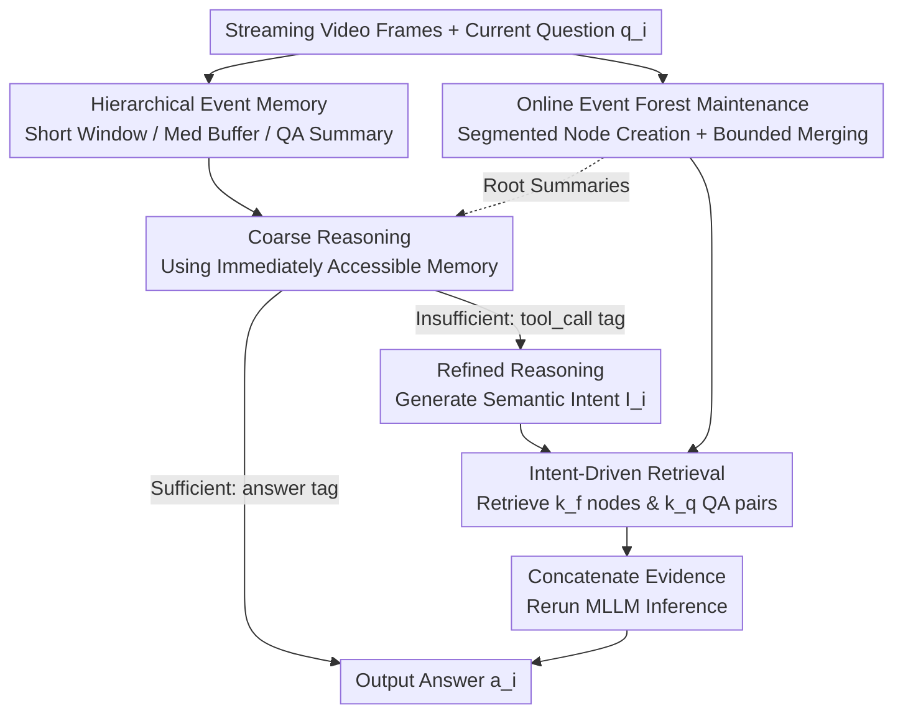

# OASIS: On-Demand Hierarchical Event Memory for Streaming Video Reasoning

**Conference**: CVPR 2026  
**arXiv**: [2604.17052](https://arxiv.org/abs/2604.17052)  
**Code**: https://github.com/Solus-sano/OASIS (Available)  
**Area**: Video Understanding  
**Keywords**: Streaming Video Reasoning, Hierarchical Event Memory, On-Demand Retrieval, Two-Stage Reasoning, Training-Free

## TL;DR
OASIS redefines streaming video reasoning as a "temporal routing" problem. It employs an online-maintained hierarchical event forest as long-term memory, coupled with a two-stage strategy of "coarse reasoning on short context, followed by refined retrieval based on semantic intent when uncertain." Without altering the MLLM or requiring training, it significantly enhances long-range accuracy and compositional reasoning for multiple streaming MLLM backbones while maintaining constant token costs.

## Background & Motivation
**Background**: Streaming video reasoning (e.g., autonomous driving, security, AR glasses, embodied AI) requires models to answer questions at any time as video arrives continuously, without the possibility of playback. Prevailing approaches follow two categories: Full Context stacking, which fits all history into the MLLM, and external memory with RAG, which concatenates retrieved fragments with the current frame.

**Limitations of Prior Work**: The fundamental contradiction in streaming video is that history grows boundlessly, yet the evidence useful for a specific query is extremely sparse. Full Context stacking causes attention to drown in a "desert of redundancy," leading to attention collapse (where the model is distracted by a salient but irrelevant historical event). Conversely, aggressive compression permanently erases small but decisive evidence. Existing RAG methods use fixed top-k strategies based on embedding similarity, failing to adapt to tasks and polluting reasoning by hard-concatenating retrieval results with current frames.

**Key Challenge**: Simply increasing token budgets or compression ratios shifts the failure point from storage to retrieval without solving the core issue—most long video content is redundant, while queries often depend on highly localized past regions. The critical operation is not storage or compression, but **on-demand localization of the correct region in long-term experience**.

**Key Insight**: Inspired by human memory, which operates on a short working window and only actively recalls specific historical fragments when uncertainty arises. "We do not carry the entire desert; we find an oasis only when needed."

**Core Idea**: Model streaming video reasoning as **temporal routing**—identifying the unique historical event that decides the query. A hierarchical event memory paired with a two-stage refinement protocol enables on-demand, event-level retrieval driven by high-level intent rather than simple embedding similarity.

## Method

### Overall Architecture
OASIS is a training-free agent system that processes streaming video and answers interleaved questions at any timestamp. It consists of two pillars: a **hierarchical dynamic memory** (compressing the stream into a compact, navigable representation) and a **two-stage reasoning strategy** (defaulting to coarse reasoning on a short context, and entering refined reasoning to retrieve evidence from the event forest only when uncertain). This mechanism acts as a wrapper for MLLMs, requiring no backbone changes or training.

Memory is organized into four resolutions: a high-fidelity **short window** $\mathbf{W}_s$ (capturing the present), a medium-resolution **buffer** $\mathbf{W}_m$ (retaining recent structures), a **multi-resolution event hierarchy** (Event Forest, summarizing long-term history), and **QA summaries** (recording historical interactions). As the stream progresses, the Event Forest is updated via online segmentation and structural merging. During reasoning, the system first performs **coarse reasoning** using immediately accessible memory; if information is insufficient, it infers the required evidence to form a semantic hypothesis, which serves as a retrieval intent to extract evidence from the forest for the final answer.

### Key Designs

**1. Hierarchical Event Memory: Four-Resolution Task Allocation**

To resolve the trade-hardship between "drowning in full context" and "erasing evidence via compression," OASIS splits memory into four layers across time scales. The short window $\mathbf{W}_s=\{\mathbf{X}_t\}_{t=t_i-\tau_s}^{t_i}$ preserves the last $\tau_s$ seconds at high frame rate $r_s$ for fine-grained details. The medium buffer $\mathbf{W}_m$ covers a wider $\tau_m$ range at $r_m<r_s$. The **multi-resolution event hierarchy** (Event Forest) manages unbounded growth: the stream is sliced into non-overlapping windows, each abstracted into an event node

$$\mathbf{R}_j=\big([t^{(j)}_s,t^{(j)}_e],\mathbf{F}_j,s_j,\mathbf{e}_j,d_j\big)$$

where $\mathbf{F}_j$ is a 4D tensor of $n_f$ keyframes, $s_j$ is a text summary of observable facts, $\mathbf{e}_j=\mathbf{E}(s_j)$ is the embedding, and $d_j$ is the hierarchy level.

**2. Bounded Online Node Merging: Hierarchy-Aware Scoring**

To prevent retrieval explosion from root node growth, OASIS triggers merging when root count $|\mathcal{R}|$ exceeds threshold $n_r$. It greedily merges adjacent root node pairs with the highest score:

$$\text{score}(\mathbf{R}_j,\mathbf{R}_k)=\cos(\mathbf{e}_j,\mathbf{e}_k)-\lambda(d_j+d_k)$$

The cosine similarity encourages merging semantically coherent events, while the $\lambda$ term penalizes high-level nodes ($d_j, d_k$) to **avoid over-abstraction**, preserving memory granularity. Merged parents $\mathbf{R}_l$ inherit a combined time interval, sampled keyframes $\mathbf{F}_l$, and a LLM-fused summary $s_l$, with level $d_l=\max(d_j,d_k)+1$.

**3. Two-Stage Reasoning: Managed Coarse-to-Fine Routing**

OASIS performs coarse reasoning using immediately accessible memory $\mathbf{C}_{\text{coarse}}$ (short window, medium buffer, root summaries $\{s_j\}$, and QA summary $s_{\text{qa}}$). The prompt forces the MLLM to return a final answer within `<answer></answer>` tags if facts are sufficient, or issue a `<tool_call>` if information is missing or concerns distant details. This **prevents guessing** and forces the model to prioritize high-resolution recent information, mitigating attention collapse.

**4. Intent-Driven Refined Retrieval: Evidence Acquisition via Hypotheses**

Instead of using the raw question for RAG (which often matches visually similar but semantically irrelevant frames), OASIS uses a **semantic retrieval intent** $I_i$ inferred by the model. $I_i$ is a task-oriented query that provides precise clues (e.g., if $q_i$ is "Was anyone there?" and the view is a living room, $I_i$ becomes "Person in the living room"). Retrieval targets $k_f$ event nodes and $k_q$ QA pairs. During node retrieval, ancestors/descendants of selected nodes are pruned to ensure information diversity.

### Loss & Training
OASIS is **entirely training-free**. It functions as a structured memory strategy atop any MLLM backbone. A single MLLM instance handles management tasks (summarization, merging, QA updates) and inference. Key hyperparameters include: $\tau_s=8$s @ $r_s=2$ fps, $\tau_m=32$s @ $r_m=1$ fps, $n_f=16$ keyframes per node, root bound $n_r=4$, and $\lambda=0.1$. Embedding uses Qwen3-Embedding-0.6B.

## Key Experimental Results

### Main Results
Evaluations on OVO-Bench, StreamingBench, and StreamBench using Qwen3-VL-8B, Qwen2.5-VL-7B, and GLM-4.6V backbones.

| Benchmark | Backbone | Metric | Baseline | + OASIS | Gain |
|-----------|----------|--------|----------|---------|------|
| OVO-Bench | Qwen3-VL-8B | Perception Avg | 66.79 | **78.14** | +11.35 |
| OVO-Bench | Qwen3-VL-8B | Backward Avg | 51.19 | **57.21** | +6.02 |
| OVO-Bench | Qwen2.5-VL-7B | Perception Avg | 60.93 | 67.26 | +6.33 |
| OVO-Bench | GLM-4.6V | Perception Avg | 54.96 | 68.39 | +13.43 |
| StreamingBench | Qwen3-VL-8B | MCU | 35.74 | **49.60** | +13.86 |

The substantial +11.35 gain in Perception for Qwen3-VL-8B validates that forced focusing on high-resolution short windows effectively solves attention collapse. The +13.86 gain in MCU (Multi-Choice Understanding, where similar frames induce collapse) further confirms this.

### Ablation Study
**Memory Components** (OVO-Bench / Qwen3-VL-8B):

| Medium Buffer | Event Forest | Short Window | Perception Avg | Backward Avg |
|:---:|:---:|:---:|:---:|:---:|
| ✓ | ✗ | ✗ | 74.31 | 54.00 |
| ✓ | ✓ | ✓ | **78.14** | **57.21** |

**Reasoning Strategy**:
"Flatten Memory" (no root bound) and "Naïve RAG" (retrieval with raw queries) both underperform compared to OASIS, proving the value of hierarchy and intent-driven retrieval.

### Key Findings
- **Resolution Trade-off**: Short windows favor perception, while medium buffers/event forests favor backward tracing. Combining all three provides the best of both worlds.
- **Intent > Question**: Generating semantic hypotheses for retrieval avoids the "visually similar but semantically irrelevant" trap of naïve RAG.
- **Token Efficiency**: While baseline tokens grow linearly with time, OASIS remains stable at approximately 10k tokens across datasets.

## Highlights & Insights
- **Refining the Problem**: Reframing streaming reasoning as "temporal routing" shifts focus from capacity to access structure.
- **Adaptive Gating**: Using special tokens (`<answer>` vs `<tool_call>`) allows the MLLM to judge its own certainty, saving tokens and prioritizing high-res current data.
- **Hierarchy Penalty**: The $-\lambda(d_j+d_k)$ term elegantly prevents over-abstraction while allowing semantic merging.
- **Backbone Agnostic**: Success across Qwen and GLM families proves the strategy's robustness.

## Limitations & Future Work
- **Instruction Following**: Gains depend heavily on the base LLM's ability to follow complex agentic instructions; weaker models see reduced benefits.
- **End-to-End Latency**: Two-stage MLLM inference increases per-query latency by approx. 57%, which may impact real-time applications like autonomous driving.
- **Retrieval Budget**: Small budgets ($k_f=2$) may be insufficient for queries requiring synthesis of many scattered historical events.

## Related Work & Insights
Unlike **VideoTree**, which requires reprocessing full sequences as they grow, OASIS maintains an online bounded forest. Compared to **Flash-VStream**, OASIS avoids irreversible detail loss through on-demand retrieval. While standard **RAG** uses raw queries, OASIS adopts agentic, intent-driven retrieval specifically for the temporal dynamics of video.

## Rating
- Novelty: ⭐⭐⭐⭐⭐ New paradigm for streaming reasoning via temporal routing.
- Experimental Thoroughness: ⭐⭐⭐⭐ Comprehensive across backbones; however, gains on weaker backbones are less pronounced.
- Writing Quality: ⭐⭐⭐⭐⭐ Excellent metaphors and clear motivation.
- Value: ⭐⭐⭐⭐⭐ High potential for deployment due to training-free nature and constant token costs.

<!-- RELATED:START -->

## Related Papers

- [\[CVPR 2026\] FluxMem: Adaptive Hierarchical Memory for Streaming Video Understanding](fluxmem_adaptive_hierarchical_memory_for_streaming_video_understanding.md)
- [\[CVPR 2026\] VideoARM: Agentic Reasoning over Hierarchical Memory for Long-Form Video Understanding](videoarm_agentic_reasoning_over_hierarchical_memory_for_long-form_video_understa.md)
- [\[ACL 2026\] HERMES: KV Cache as Hierarchical Memory for Efficient Streaming Video Understanding](../../ACL2026/video_understanding/hermes_kv_cache_as_hierarchical_memory_for_efficient_streaming_video_understandi.md)
- [\[CVPR 2026\] Streaming Video Crime Anticipation with Spatio-Temporal Causal Reasoning](streaming_video_crime_anticipation_with_spatio-temporal_causal_reasoning.md)
- [\[ICCV 2025\] Hierarchical Event Memory for Accurate and Low-latency Online Video Temporal Grounding](../../ICCV2025/video_understanding/hierarchical_event_memory_for_accurate_and_low-latency_online_video_temporal_gro.md)

<!-- RELATED:END -->
