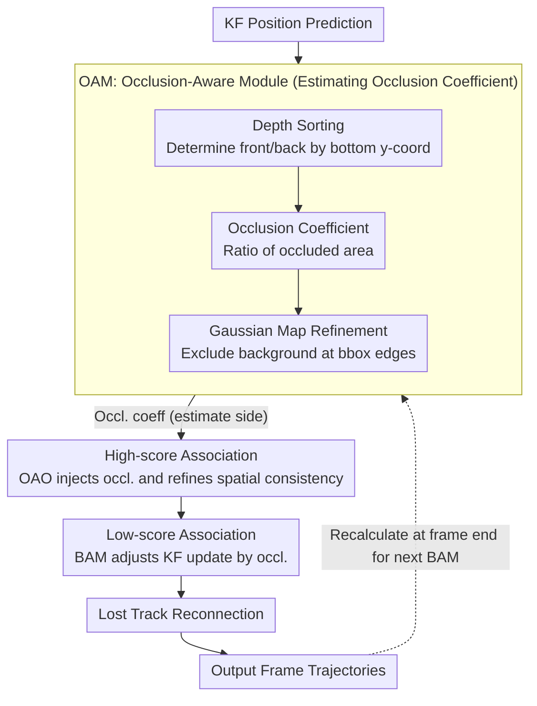

# Occlusion-Aware SORT: Observing Occlusion for Robust Multi-Object Tracking

**Conference**: CVPR 2026  
**arXiv**: [2603.06034](https://arxiv.org/abs/2603.06034)  
**Code**: None  
**Area**: Video Understanding  
**Keywords**: Multi-Object Tracking, Occlusion-Aware, Kalman Filter, Data Association, Plug-and-Play

## TL;DR

The authors propose OA-SORT, an occlusion-aware tracking framework that explicitly models the occlusion states of objects to mitigate position cost confusion and Kalman Filter estimation instability. It achieves SOTA-level improvements on DanceTrack, SportsMOT, and MOT17, with components that can be integrated into various trackers in a plug-and-play manner.

## Background & Motivation

**Occlusion in 2D MOT causes position cost confusion**: When objects of the same category are partially occluded, detectors struggle to distinguish between foreground and background, leading to inaccurate detections. This creates ambiguity in the IoU cost matrix, triggering identity switches (ID switches).

**Kalman Filter is sensitive to inaccurate detections**: Discrete linear Kalman Filters (KF) accumulate errors after frequently receiving inaccurate detections caused by occlusion, leading to unstable estimation, which is further exacerbated in scenes with non-linear pose changes.

**Existing auxiliary cues remain fragile under occlusion**: The reliability of appearance features decreases under occlusion (contaminated by features of the foreground object); while motion direction helps reduce matching failures, cost confusion persists; detection confidence is also sensitive to occlusion.

**Lack of explicit modeling of occlusion states**: Existing methods either model occlusion indirectly (e.g., using active/inactive states) or use motion compensation to recover lost objects, but they do not directly estimate the severity of occlusion or utilize it to refine association costs.

**Insufficient utilization of depth information**: Although methods like PD-SORT and SparseTrack use pseudo-depth to design association strategies, they are still affected by cost confusion caused by occlusion.

**Need for a generic, training-free occlusion-aware framework**: The goal is to design plug-and-play, training-free components that can be easily integrated into various tracker architectures to enhance robustness.

## Method

### Overall Architecture

The core problem OA-SORT addresses is the inaccuracy of detection boxes when objects of the same class occlude each other, which leads to IoU association cost confusion and Kalman Filter (KF) estimation divergence, resulting in identity switches. Built upon the three-stage association of Hybrid-SORT (High-score association → Low-score association → Lost track reconnection), it appends three "occlusion-aware" components: the Occlusion-Aware Module (OAM) calculates the occlusion degree for each object, the Occlusion-Aware Offset (OAO) injects this degree into association costs, and the Bias-Aware Momentum (BAM) injects it into KF updates. The entire framework is plug-and-play and training-free. Specifically, OAM consists of three sub-steps: "Depth Sorting → Occlusion Coefficient → Gaussian Map Refinement" (corresponding to the first three points of Key Designs). OAO and BAM are independent components.

The data flow for a single frame is as follows: The KF first provides position predictions, based on which OAM calculates the occlusion coefficients. During high-score detection association, OAO uses the occlusion coefficient from the KF estimation side to refine the spatial consistency metric. Tracks associated with low-score detections then have their KF motion parameters adjusted via BAM. Finally, at the end of the frame, OAM recalculates the occlusion coefficients based on the latest observations for use by BAM in the next frame.

### Key Designs

**1. Depth Sorting: Determining who occludes whom**

To calculate occlusion, one must first determine which of two overlapping objects is in front. OA-SORT utilizes the imaging principle of top-down cameras: the closer an object is to the camera, the smaller the y-coordinate of its bounding box's bottom edge. This is used to infer depth order. To reduce misjudgment caused by jitter, a 5-pixel threshold is set; if the difference in bottom edges is within this range, no occlusion is determined.

**2. Occlusion Coefficient: Quantifying occlusion severity as a ratio**

With depth order established, the occlusion degree of the occluded object $i$ is defined as the ratio of the occluded area to its own area: $Oc_i = A(\mathcal{O}_i) / A(\mathcal{D}_i)$, where $\mathcal{O}_i$ is the region covered by foreground objects and $\mathcal{D}_i$ is its own detection box. The union area is taken if multiple objects cause occlusion. This scalar is fed directly into association and KF update stages, serving as the central value of the framework.

**3. Gaussian Map Refinement: Excluding background at bbox edges**

Using simple area ratios tends to overestimate occlusion because bounding box edges often contain background pixels; covering these background areas does not represent true object occlusion. Thus, a 2D Gaussian weight map $GM$ is introduced, assigning higher weights to pixels near the object center and lower weights to edge pixels. The refined coefficient is $\hat{Oc}_i = \sum_{(x,y) \in \mathcal{O}_i} GM_{x,y} / A(\mathcal{D}_i)$. The Gaussian parameters $\sigma^x, \sigma^y$ are tuned based on dataset motion patterns (see Training Strategy). This step provides the largest single gain in the ablation study.

**4. OAO: Injecting occlusion coefficients into association costs on the estimate side**

Since occlusion makes detections unreliable, OAO applies the occlusion coefficient to the KF estimate $X$ (rather than the jittery detection) and combines it with the IoU cost as a weighted spatial consistency score: $S = \tau \cdot (1 - \hat{Oc}^X) + (1-\tau) \cdot C_{IoU}(\mathcal{D}, X)$. Here, $\tau$ controls the weight of the occlusion term (DanceTrack 0.15 / SportsMOT 0.2 / MOT17 0.1), and it is only triggered during the first-stage high-score detection association, which is the most prone to identity mismatches due to occlusion.

**5. BAM: Adjusting KF updates based on occlusion severity**

For low-score detections, OA-SORT uses adaptive momentum to adjust the KF update strength: $BAM = C_{IoU}(X_{t|t-1}, Z_t) \cdot (1 - \hat{Oc}^{Z_{t-1}})$. The current observation is then weighted as $\hat{Z}_t = BAM \cdot Z_t + (1-BAM) \cdot H_t X_{t|t-1}$. The intuition is straightforward: when an observation is heavily occluded (large $\hat{Oc}$) or has a large deviation from the prediction (low IoU), $BAM$ decreases, making the update rely more on the KF's own prediction, thereby preventing inaccurate occluded detections from biasing the filter.

### Loss & Training

This method is a **training-free** framework, requiring no additional training or fine-tuning. All hyperparameters are set empirically: $GM$ parameters $\sigma^x, \sigma^y$ are adjusted by dataset motion patterns (DanceTrack: $w/3\sqrt{2}, h/3$; SportsMOT: $w/4, h/3$; MOT17: $w/2, h/2$), the OAO balance coefficient $\tau$ is between 0.1–0.2, and BAM consistently uses HMIoU as the spatial consistency metric.

## Key Experimental Results

### Main Results

**DanceTrack test set (Non-linear motion + frequent occlusion)**

| Method | HOTA | AssA | MOTA | IDF1 |
|------|------|------|------|------|
| Hybrid-SORT | 62.2 | 47.4 | 91.6 | 63.0 |
| **OA-SORT** | **63.1** | **48.5** | **91.7** | **64.2** |
| OA-Byte (ByteTrack+OA) | 49.0 | 33.7 | 89.6 | 55.9 |
| OA-OC (OC-SORT+OA) | 56.5 | 39.6 | 91.2 | 57.6 |
| OA-Sparse (SparseTrack+OA) | 57.8 | 41.8 | 91.5 | 60.2 |
| OA-PD (PD-SORT+OA) | 60.4 | 44.9 | 91.4 | 60.8 |

**SportsMOT test set (Variable speed + camera motion)**

| Method | HOTA | AssA | MOTA | IDF1 |
|------|------|------|------|------|
| Hybrid-SORT | 73.0 | 61.6 | 94.3 | 73.3 |
| **OA-SORT** | **73.4** | **62.3** | **94.4** | **74.1** |
| Hybrid-SORT* | 74.8 | 63.2 | 96.2 | 75.1 |
| **OA-SORT*** | **75.2** | **63.8** | **96.3** | **75.8** |

**MOT17 test set (Linear motion + long-term occlusion)**

| Method | HOTA | AssA | MOTA | IDF1 |
|------|------|------|------|------|
| Hybrid-SORT | 63.6 | 63.2 | 80.6 | 78.4 |
| **OA-SORT** | **64.2** | **64.0** | 79.6 | **79.1** |
| Hybrid-SORT-REID | 64.0 | 63.5 | 79.9 | 78.7 |

### Ablation Study

**Component Ablation (DanceTrack-val)**

| OAO | BAM | GM | HOTA | AssA | IDF1 | Inference Latency $\Delta$ |
|-----|-----|----|------|------|------|----------|
| - | - | - | 59.4 | 44.9 | 60.7 | 9.57ms |
| ✓ | - | - | 59.9 | 45.6 | 60.9 | +1.96ms |
| - | ✓ | - | 60.5 | 46.5 | 62.2 | +3.81ms |
| ✓ | ✓ | - | 60.6 | 46.7 | 62.0 | +9.25ms |
| ✓ | ✓ | ✓ | **61.5** | **48.0** | **63.7** | +14.99ms |

**Generalization across Trackers (DanceTrack-val with OAO+BAM+GM)**

| Tracker | Org HOTA→New HOTA | Org IDF1→New IDF1 |
|--------|-------------------|-------------------|
| SORT | 48.4→50.4 (+2.0) | 49.6→53.3 (+3.7) |
| ByteTrack | 47.1→49.3 (+2.2) | 52.7→55.7 (+3.0) |
| OC-SORT | 52.3→53.8 (+1.5) | 52.0→53.9 (+1.9) |
| TrackTrack | 59.3→59.9 (+0.6) | 61.1→62.0 (+0.9) |

### Key Findings

- GM is the most critical component, providing a +2.1 HOTA gain alone because it effectively suppresses background noise in occlusion estimation.
- BAM alone performs better than OAO alone (+1.1 vs +0.5 HOTA), suggesting that optimizing the KF estimate is more important than refining association costs.
- Performance drops when $\tau$ exceeds ~0.2, as excessively large occlusion offsets disrupt the spatial consistency representation.
- OA-SORT without ReID outperforms Hybrid-SORT-REID (+0.5 AssA, +0.3 IDF1), suggesting that occlusion-awareness can partially substitute for appearance features.
- The more severe the occlusion in a video sequence, the greater the performance gain (see Fig. 1).

## Highlights & Insights

- **Direct modeling of occlusion severity**: Unlike indirect occlusion handling, OAM explicitly calculates an occlusion coefficient and injects it into both association and KF update steps.
- **Gaussian Map refined occlusion estimation**: Innovatively uses 2D Gaussian weights to reduce the impact of background pixels at bbox edges, providing the most significant gain.
- **Fully plug-and-play and training-free**: All three modules can be used independently and have been verified effective across seven trackers including SORT, ByteTrack, OC-SORT, and others.
- **Clear problem analysis**: Section 3 provides a rigorous analysis of how occlusion causes cost confusion through detection and estimation error accumulation, offering a solid theoretical foundation.

## Limitations

- **Restricted depth sorting assumption**: When the lower half of an object is occluded or the object is airborne (e.g., jumping), the bottom-edge position fails to reflect true depth relative to others.
- **Lack of long-term occlusion modeling**: Occlusion is a continuous process; current methods use only instantaneous occlusion information without modeling temporal evolution.
- **GM computational overhead**: Introducing GM increases average tracking time by ~15ms per frame, which, while still real-time, may become a bottleneck in massive-scale scenes.
- **Dataset-specific hyperparameters**: Parameters like $\sigma^x, \sigma^y, \tau$ require empirical tuning per scene, which may limit out-of-the-box generalization.

## Related Work & Insights

- **Position-Association series**: Follows the lineage of SORT → OC-SORT → Hybrid-SORT → PD-SORT/SparseTrack (using pseudo-depth). OA-SORT introduces explicit occlusion modeling to this chain.
- **Feature-Association series**: Methods like StrongSORT++ and BOT-SORT-REID use appearance features, but feature reliability also suffers under occlusion. OA-SORT proves occlusion-awareness can be a competitive alternative.
- **Occlusion handling methods**: Compares against Stadler (indirect active/inactive modeling), Hibo (motion compensation for recovery), and DiffMOT (diffusion-based prediction), none of which directly estimate occlusion severity.

## Rating

- Novelty: ⭐⭐⭐⭐ — Explicit occlusion coefficient + Gaussian refinement + dual-path injection is a novel combined approach.
- Experimental Thoroughness: ⭐⭐⭐⭐⭐ — Three datasets + seven tracker integrations + detailed ablation + parameter analysis.
- Writing Quality: ⭐⭐⭐⭐ — Sound problem analysis, clear mathematical derivations, and professional charts.
- Value: ⭐⭐⭐⭐ — Practical plug-and-play design with consistent and reasonable improvements.

<!-- RELATED:START -->

## Related Papers

- [\[CVPR 2026\] Rethinking Occlusion Modeling for UAV Tracking](rethinking_occlusion_modeling_for_uav_tracking.md)
- [\[CVPR 2026\] Tracking through Severe Occlusion via Event-Derived Transient Cues](tracking_through_severe_occlusion_via_event-derived_transient_cues.md)
- [\[AAAI 2026\] PlugTrack: Multi-Perceptive Motion Analysis for Adaptive Fusion in Multi-Object Tracking](../../AAAI2026/video_understanding/plugtrack_multi-perceptive_motion_analysis_for_adaptive_fusion_in_multi-object_t.md)
- [\[CVPR 2026\] Hypergraph-State Collaborative Reasoning for Multi-Object Tracking](hypergraph-state_collaborative_reasoning_for_multi-object_tracking.md)
- [\[CVPR 2026\] ProgTrack: A Multi-Object Tracking Algorithm with Progressive Matching Strategy](progtrack_a_multi-object_tracking_algorithm_with_progressive_matching_strategy.md)

<!-- RELATED:END -->
