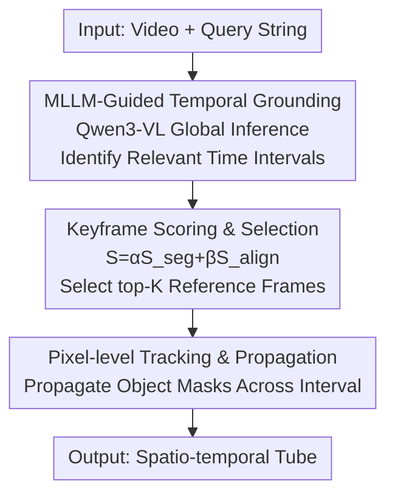

# OmniGround: A Comprehensive Spatio-Temporal Grounding Benchmark for Real-World Complex Scenarios

**Conference**: CVPR 2026  
**Paper**: [CVF Open Access](https://openaccess.thecvf.com/content/CVPR2026/html/Gao_OmniGround_A_Comprehensive_Spatio-Temporal_Grounding_Benchmark_for_Real-World_Complex_Scenarios_CVPR_2026_paper.html)  
**Code**: None  
**Area**: Video Understanding  
**Keywords**: Spatio-Temporal Video Grounding, STVG benchmark, Multimodal Large Language Models, Annotation Pipeline, Training-free Baseline

## TL;DR
To address the issues of narrow categories and oversimplified scenarios in existing Spatio-Temporal Video Grounding (STVG) datasets, this paper constructs the OmniGround benchmark, covering 81 categories across 3,475 real-world complex videos. The study introduces a Forward-Backward-Refine (FBR) annotation pipeline, a four-dimensional data quality evaluation framework (DeepSTG), and a training-free two-stage baseline (PG-TAF). PG-TAF improves state-of-the-art (SOTA) grounding accuracy on OmniGround by 25.6% and 35.6% (relative m_tIoU/m_vIoU gains), respectively.

## Background & Motivation
**Background**: Spatio-Temporal Video Grounding (STVG) requires simultaneously localizing the **temporal interval** and **per-frame spatial bounding boxes** (i.e., a spatio-temporal tube) of a target object based on a natural language description. With the rise of Multimodal Large Language Models (MLLMs), this task has seen significant improvements over traditional lightweight methods due to MLLMs' cross-modal semantic understanding and structured spatial reasoning.

**Limitations of Prior Work**: Despite model advancements, frequent failures occur in real-world complex scenarios—such as failing to localize uncommon objects ("kite," "scissors"), distinguishing between multiple similar targets ("the man in red on the right among three people"), or understanding long sentences with nested spatial relations. The authors attribute this to the **narrowness of existing benchmarks**: HC-STVG almost exclusively annotates "person," while VidSTG features simple scenes and limited object diversity. This prevents STVG-MLLMs from being effectively deployed in complex reality.

**Key Challenge**: Existing evaluations rely on surface-level statistics like "video duration" and "number of clips," which fail to capture the actual difficulty and diversity of a dataset—such as class balance, foreground confusion, the balance between temporal and spatial linguistic cues, and the alignment between annotations and text. While statistical metrics may appear impressive, model performance often drops by over 10% in real-world scenarios, indicating that existing data fails to "test" true capabilities.

**Goal**: This work aims to achieve three objectives: ① Create an STVG benchmark that is class-balanced, query-complex, and realistic; ② Provide an evaluation system capable of quantifying "deep quality" beyond mere clip counts; ③ Offer a baseline method that performs well on this challenging benchmark and suggests future directions.

**Key Insight**: The authors observe that model performance drops by an average of 10.4% in complex scenes, with drops concentrated in three specific difficulties: class bias (8.42% drop), oversimplified reasoning (13.1% drop), and poor linguistic robustness (9.42% drop). This suggests that the problem can be structurally decomposed, targeted, measured, and mitigated.

**Core Idea**: By integrating a "balanced and complex dataset (OmniGround) + deep quality metrics (DeepSTG) + a training-free baseline decoupling time/space (PG-TAF)," the study moves STVG evaluation from "looking at statistics" to "looking at real difficulty."

## Method
This paper is a tripartite work consisting of a benchmark, an evaluation system, and a baseline. It details the dataset construction, annotation pipeline, quality assessment design, and the training-free two-stage baseline method.

### Overall Architecture
The construction of OmniGround involves four steps: ① Data collection (Pexels copyright-free videos + supplemented rare classes from RVOS); ② Data cleaning and filtering (video length $\ge$ 3s, event length $\ge$ 1s); ③ High-quality spatio-temporal tube annotation using the FBR pipeline; ④ External data augmentation and manual verification (synthesizing negative sample clips for RVOS videos to supplement temporal boundaries). This results in 3,475 videos with an average duration of 18.2s, 81 balanced categories, and captions averaging 16.2 words.

The authors layer two additional components: DeepSTG, which quantifies data quality across four dimensions to prove OmniGround's superior difficulty and balance, and PG-TAF, a two-stage baseline. PG-TAF decomposes STVG into a pipeline of "coarse temporal localization followed by fine-grained spatial localization," as illustrated below:

### Key Designs

**1. OmniGround Dataset: Exposing Model Weaknesses via Class Balance + Complex Queries**

Addressing the limitations where "HC-STVG only labels people and VidSTG is too clean," OmniGround emphasizes "difficulty" and "balance." It covers 81 balanced categories (twice that of VidSTG and six times that of ST-Align). Data collection prioritizes videos with "natural lighting + camera motion, multi-object interaction, and complex backgrounds." Queries feature captions rich in spatial relations and diverse action predicates, achieving a sentence-level linguistic evenness (NEI 0.918) significantly higher than VidSTG's 0.659. Rare categories (e.g., "keyboard") were integrated from RVOS datasets and converted to STVG format. This intentional difficulty allows the benchmark to differentiate model performance across uncommon categories, similar targets, and deep syntax—factors existing benchmarks fail to measure.

**2. FBR (Forward-Backward-Refine) Annotation Pipeline: High-Quality Tubes via Bidirectional Tracking + Correction**

Manual frame-by-frame annotation is costly and prone to tracking drift or error accumulation due to occlusion and motion blur. FBR solves this in three steps: **Step 1: Multi-point Initialization**—annotators label boxes only at the start frame $F_{start}$ and end frame $F_{end}$, then a DAM4SAM tracker generates a forward trajectory $T_f$ and a backward trajectory $T_b$; **Step 2: Adaptive Refinement**—the frame $F_{mid}$ with the largest IoU discrepancy between $T_f$ and $T_b$ is automatically identified as the likely point of failure, where an annotator adds a correction box to generate a middle trajectory $T_m$; **Step 3: Fusion & Smoothing**—the three trajectories are clustered by per-frame IoU (IoU $\ge$ 0.5), taking the cluster mean as the fused result. Short gaps ($\le$ 3 frames) are filled via Kalman filtering to maintain continuity through brief occlusions. FBR improves IoU consistency by 16.8% over unidirectional tracking, maintaining $\ge$ 0.8 IoU even at 50% occlusion. It essentially focuses human effort on the points of maximum disagreement.

**3. DeepSTG Four-Dimensional Data Quality Assessment: Quantifying Annotation, Vision, Language, and Distribution**

To objectively demonstrate OmniGround's superiority, DeepSTG designs four complementary metrics:

-   **CMA (Cross-Modal Alignment Score)**—Measures annotation reliability. For video-caption-tube triplets, $N$ keyframes are sampled, and GPT-4o scores each frame on three aspects: object presence ($S_{obj}$), action accuracy ($S_{act}$), and context/spatial consistency ($S_{ctx}$). The mean is calculated as: $CMA = \frac{1}{N}\sum_{i=1}^{N}\frac{S_{obj}(f_i)+S_{act}(f_i)+S_{ctx}(f_i)}{3}$.
-   **FCI (Foreground Complexity Index)**—Measures the difficulty of distinguishing similar objects. Frames are sampled at 1 FPS, and YOLOv11 detects foreground objects. The intra-class cosine similarity mean $S_{in}(C)$ is averaged across classes: $FCI = \frac{1}{|C|}\sum_{C\in\mathcal{C}}S_{in}(C)$. Higher values indicate higher inter-object similarity and grounding difficulty.
-   **VSBI (Verb-Spatial Balance Index)**—Measures linguistic cue bias. Words are categorized into Action (A), Spatial (S), and Mixed (M). The distance between the actual distribution $P_{actual}$ and the ideal distribution $P_{ideal}=[1/4, 1/4, 1/2]$ is measured: $VSBI = 1 - \frac{\lVert P_{actual}-P_{ideal}\rVert_2}{\sqrt{7/8}}$.
-   **NEI (Normalized Entropy Index)**—Measures distribution uniformity across categories, durations, and sentence lengths, normalized by Shannon entropy: $NEI = \frac{H}{\log N}$, where $H = -\sum_{i=1}^{N} p_i \log p_i$.

These four dimensions transform the claim "OmniGround is harder and more balanced" into reproducible data.

**4. PG-TAF Training-Free Two-Stage Baseline: Decoupling Temporal Reasoning and Spatial Localization**

The authors observe a core trade-off: MLLMs excel at global temporal reasoning but provide coarse spatial localization, while specialized trackers provide precise spatial data but lack semantic understanding. PG-TAF decouples STVG into two non-trained stages. **Stage 1: Temporal Grounding**—Qwen3-VL-8B performs global reasoning on the video to identify coarse query-related time intervals and filter out irrelevant frames. **Stage 2: Spatial Propagation**—Fine-grained localization occurs within these intervals. A multimodal scoring mechanism selects reference frames by fusing segmentation scores from EVF-SAM ($S_{seg}$) and text-image alignment scores from Alpha-CLIP ($S_{align}$): $S_{frame} = \alpha S_{seg} + \beta S_{align}$ (with $\alpha=0.6, \beta=0.4$ via grid search). After selecting the top-K=3 frames, a pixel-level tracker propagates the object masks across the full segment to generate the final tube. This combination outperforms specialized models without requiring fine-tuning.

## Key Experimental Results

### Dataset Quality Comparison (DeepSTG Dimensions)
OmniGround leads across all dimensions compared to existing STVG and RVOS benchmarks (selected):

| Benchmark | #Classes | NEI | FCI | VSBI | CMA |
| :--- | :--- | :--- | :--- | :--- | :--- |
| HC-STVG | 1 | - | - | 0.778 | 0.754 |
| VidSTG | 40 | 0.569 | 0.780 | 0.659 | 0.720 |
| ST-Align | 14 | 0.628 | 0.731 | 0.757 | 0.718 |
| Ref-YT-VOS | 38 | 0.900 | - | 0.859 | 0.719 |
| **OmniGround** | **81** | **0.992** | **0.807** | **0.918** | **0.770** |

The NEI (category balance) is nearly perfect (0.992 vs. VidSTG's 0.569), with the highest FCI (hardest foreground) and VSBI (most balanced linguistic cues), and highest CMA (confirming FBR's annotation quality).

### Global and Scenario-Specific Performance on OmniGround
Existing SOTA models generally perform poorly on OmniGround, with significant collapse in difficult scenarios (m_tIoU/m_vIoU, selected):

| Model | Overall m_tIoU | Overall m_vIoU | Uncommon Classes m_tIoU | Multiple Similar Targets m_vIoU | Deep Syntax m_tIoU |
| :--- | :--- | :--- | :--- | :--- | :--- |
| CG-STVG (Task-Specific) | 47.5 | 30.4 | 29.5 | 14.2 | 20.6 |
| Qwen2.5-VL (7B MLLM) | 36.6 | 23.2 | 21.4 | 13.5 | 13.9 |
| VideoMolmo (7B MLLM) | 30.2 | 15.7 | 21.2 | 13.5 | 11.1 |
| LLaVA-ST (7B MLLM) | 19.7 | 8.7 | 17.8 | 6.6 | 14.7 |

While the task-specific CG-STVG outperforms MLLMs overall, all models show poor spatial precision at high thresholds (best CG-STVG is only 23.4%@0.5). Performance drops are most severe in "Multiple Similar Targets" and "Deep Syntax" scenarios (e.g., CG-STVG drops 26.9 points in m_tIoU for deep syntax).

### PG-TAF Performance Comparison

| Model | HC-STVG m_vIoU | VidSTG(Decl.) m_vIoU | OmniGround m_tIoU | OmniGround m_vIoU | Avg m_vIoU |
| :--- | :--- | :--- | :--- | :--- | :--- |
| LLaVA-ST | 7.6 | 14.2 | 19.7 | 8.7 | 9.5 |
| Qwen2.5-VL | 13.0 | 10.9 | 36.6 | 23.3 | 13.9 |
| VideoMoLMO | 26.8 | 15.6 | 30.2 | 11.7 | 16.5 |
| **PG-TAF (Ours)** | **34.0** | **28.1** | **49.2** | **36.2** | **28.2** |

PG-TAF, despite being training-free, achieves top results on OmniGround (49.2/36.2), a 25.6%/35.6% relative improvement over previous SOTA, and consistent leadership across all four benchmarks.

### Key Findings
-   **High inter-model variance**: Qwen2.5-VL (36.6% m_tIoU) far exceeds LLaVA-ST (19.7%), indicating STVG capability depends heavily on architecture and training data rather than emerging naturally with scale.
-   **Temporal success often lacks spatial precision**: All models struggle with vIoU@0.5, primarily due to OmniGround's high FCI (foreground confusion).
-   **MLLMs are more linguistically robust**: In deep syntax scenarios, task-specific models drop more sharply than MLLMs, reflecting the MLLM advantage in global language understanding—supporting the design of PG-TAF.
-   **Decoupling is effective**: PG-TAF's training-free performance validates the approach of separating temporal reasoning (MLLM strength) and spatial localization (tracker strength).

## Highlights & Insights
-   **Strategic FBR Refinement**: Instead of full manual labor, FBR uses IoU discrepancies between forward/backward tracks to automatically identify frames needing correction—a transferable method for any temporal annotation task.
-   **DeepSTG as a Rigorous Health Check**: The CMA/FCI/VSBI/NEI metrics move "dataset quality" from slogans to metrics, providing a template for other grounding or retrieval datasets.
-   **Temporal Boundary Completion via Negative Synthesis**: The authors use LLMs to rewrite captions and generative models (WAN) to create negative clips, allowing RVOS data to be effectively utilized for STVG—a practical paradigm for data augmentation.
-   **Practical Value of Training-Free Baselines**: PG-TAF indicates that modularly combining existing MLLM, segmentation, and tracking components can exceed specialized end-to-end models, which is highly beneficial for deployment.

## Limitations & Future Work
-   **Limited Benchmark Scale**: 3,475 videos serve better as an evaluation set than a training set for large-scale models.
-   **Dependency on Closed/Heavy Models**: Use of GPT-4o for CMA, WAN for generation, and Qwen3-VL/SAM for PG-TAF impacts reproducibility costs and creates a "models evaluating models" circularity risk.
-   **Grid Search Dependency**: PG-TAF weights ($\alpha=0.6, \beta=0.4$) were optimized on a validation set; cross-benchmark optimality is not fully verified.
-   **Future Directions**: Integrating FBR and DeepSTG into training objectives (e.g., curriculum learning based on FCI) or end-to-end PG-TAF refinement to reduce cascade errors.

## Related Work & Insights
-   **vs HC-STVG**: HC-STVG is foundational but limited to "person" (NEI=0) and uses simplistic metrics; OmniGround covers 81 balanced classes and uses deep quality metrics.
-   **vs VidSTG / ST-Align**: VidSTG has limited diversity and imbalanced distributions; ST-Align improves VidSTG text but remains limited in categories. OmniGround is superior across all four DeepSTG dimensions.
-   **vs LLaVA-ST / SpaceVLLM**: These MLLMs attempt simultaneous spatio-temporal modeling but struggle with target confusion and complex syntax. PG-TAF's **decoupling** strategy, despite being training-free, proves more effective.
-   **Insights**: Evolving "dataset quality" into task-aware multi-dimensional metrics is a scalable methodology. Direct human labeling focused on model disagreement and generative filler for data gaps are key takeaways for data engineering.

## Rating
-   Novelty: ⭐⭐⭐⭐ The combination of benchmark, evaluation framework, and baseline is robust. DeepSTG and FBR are innovative, though individual components are engineering-heavy.
-   Experimental Thoroughness: ⭐⭐⭐⭐ Extensive cross-benchmark comparison and scenario-specific diagnostics; lacks large-scale training set verification.
-   Writing Quality: ⭐⭐⭐⭐ Clear logic across motivation, data, metrics, and baseline; minor typos present.
-   Value: ⭐⭐⭐⭐ Provides the STVG community with a realistic, comparable evaluation standard and a ready-to-use baseline.

<!-- RELATED:START -->

## Related Papers

- [\[CVPR 2026\] VISTA: Video Interaction Spatio-Temporal Analysis Benchmark](vista_video_interaction_spatio-temporal_analysis_benchmark.md)
- [\[CVPR 2026\] Towards Spatio-Temporal World Scene Graph Generation from Monocular Videos](towards_spatio-temporal_world_scene_graph_generation_from_monocular_videos.md)
- [\[AAAI 2026\] R-AVST: Empowering Video-LLMs with Fine-Grained Spatio-Temporal Reasoning in Complex Audio-Visual Scenarios](../../AAAI2026/video_understanding/r-avst_empowering_video-llms_with_fine-grained_spatio-temporal_reasoning_in_comp.md)
- [\[CVPR 2026\] Real-World Point Tracking with Verifier-Guided Pseudo-Labeling](realworld_point_tracking_with_verifierguided_pseud.md)
- [\[CVPR 2026\] OmniVTG: A Large-Scale Dataset and Training Paradigm for Open-World Video Temporal Grounding](omnivtg_a_large-scale_dataset_and_training_paradigm_for_open-world_video_tempora.md)

<!-- RELATED:END -->
