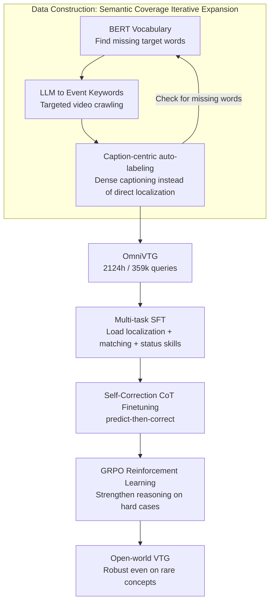

# OmniVTG: A Large-Scale Dataset and Training Paradigm for Open-World Video Temporal Grounding

**Conference**: CVPR 2026  
**arXiv**: [2604.25276](https://arxiv.org/abs/2604.25276)  
**Code**: https://github.com/oceanflowlab/OmniVTG  
**Area**: Video Understanding / Video Temporal Grounding  
**Keywords**: Video Temporal Grounding, Open-World, Rare Concepts, Self-Correction CoT, MLLM

## TL;DR
Addressing the bottleneck where Video Temporal Grounding (VTG) fails to accurately locate "rare concepts" in open-world scenarios, the authors constructed OmniVTG—a large-scale dataset featuring 2,124 hours, 350,000 queries, and a vocabulary far exceeding the sum of existing datasets—using a "Semantic Coverage Iterative Expansion" pipeline. They further proposed a three-stage training paradigm (SFT→CoT→RL) based on "predict-then-self-correct," enabling Qwen2.5-VL-7B to achieve zero-shot SOTA on four public VTG benchmarks while maintaining nearly consistent performance on rare concepts.

## Background & Motivation

**Background**: The goal of Video Temporal Grounding (VTG) is to predict the start and end timestamps $[t_s, t_e]$ of an event given an untrimmed long video and a natural language query. Recent mainstream approaches utilize Multimodal Large Language Models (MLLMs) to leverage their strong cross-modal understanding for localization, represented by works such as TimeChat, UniTime, and Time-R1.

**Limitations of Prior Work**: In open-world scenarios, real-world videos contain extremely diverse events—ranging from common daily actions to rare, abstract, and domain-specific concepts. However, existing methods suffer significant performance drops when encountering rare concepts (Fig 1a). The root cause lies in the data: ① **Narrow semantic coverage**: Charades-STA is limited to indoor activities, TACoS to cooking, and QVHighlights to vlogs/news, all featuring small vocabularies. ② **Difficulty in balancing scale and quality**: Manual annotation (ActivityNet, Charades-STA) is expensive and hard to scale, while automated pipelines often rely on ASR (Automatic Speech Recognition) where queries derived from subtitles cannot be guaranteed to align precisely with visual content.

**Key Challenge**: Open-world requirements demand that models recognize a vast array of rare concepts, yet the vocabularies of existing datasets fail to cover them. If a model hasn't seen a concept, it cannot locate it accurately. Even with SFT on existing data, a localization gap remains between common and rare concepts.

**Key Insight**: The authors made two critical observations. First (Data side): Modern MLLMs (Gemini-2.5-Pro) provide much more accurate timestamps when performing **dense captioning than when performing direct grounding** (Fig 1c)—suggesting the annotation task should be "reversed" using a caption-centric approach. Second (Model side): **MLLM video understanding capabilities (judging if a clip matches a query or determining if an event at a certain time is "not started/in progress/ended") are significantly stronger than their direct localization capabilities, and the performance gap in understanding between rare and common concepts is much smaller** (Fig 1b).

**Core Idea**: For data, an iterative expansion pipeline is used: "identify missing words → targeted video search → auto-annotation via dense captioning" to build a large-scale, high-coverage dataset. For the model, the paradigm is "coarse localization followed by self-reflection and correction" using more robust understanding capabilities, effectively transferring understanding strength to compensate for localization weakness.

## Method

### Overall Architecture

OmniVTG consists of two pipelines: **one for data construction and one for model training**.

The data pipeline (Semantic Coverage Iterative Expansion) involves three steps: first, identifying **target words missing** from existing VTG datasets relative to the BERT vocabulary; second, using an LLM to translate these words into "localizable event" search keywords for **targeted web crawling**; third, using a caption-centric engine to **automatically generate timestamped annotations**, where dense captioning replaces direct localization. The process iterates based on remaining vocabulary gaps. The final dataset comprises 2,124 hours and 359,000 queries, with 10,000+ manually verified sequences as a test set.

The training pipeline (Self-Correction CoT) also follows three stages: **SFT** uses multi-task learning to embed basic localization and the understanding skills required for self-correction (matching and status classification); **CoT Finetuning** teaches the model an explicit reasoning path of "predict a coarse result A, then zoom in to correct to precise answer B"; **RL** (GRPO) further reinforces this temporal reasoning on hard cases. The stages are sequential, with capabilities building upon each other.

### Key Designs

**1. Semantic Coverage Iterative Expansion: Turning "missing words" into "searched videos"**

Existing datasets have narrow vocabularies, and random crawling fails to cover rare concepts. This step actively fills the gap. The authors used the BERT tokenizer vocabulary as a "universal set" (cleaned of obscure/useless words) and calculated the difference with vocabularies of mainstream VTG datasets to find "uncovered target words." Since searching target words directly is inefficient (e.g., searching "candle" might return a video with a static candle but no event), the authors used Gemini-2.5-Pro to translate target words into **event-based search keywords**: 'candle' → 'birthday vlog', 'meticulous' → 'watchmaker meticulous assembly movement'. This ensures crawled videos likely contain clear, localizable events. Results show OmniVTG covers 95% of target words compared to 48% for ActivityNet Captions, with unique noun/verb/adjective counts exceeding all other datasets combined.

**2. Caption-centric Auto-labeling: Using models' superior dense captioning for timestamps**

To obtain high-quality temporal annotations for 46,000 videos, manual work is unscalable and ASR is misaligned. The key observation is that Gemini-2.5-Pro **outputs significantly more accurate timestamps during dense captioning than during direct grounding** (Fig 1c). Thus, the task is reversed: instead of asking the MLLM to locate a query, the MLLM **generates multiple timestamped dense captions for the video, with explicit encouragement to use target rare words**. This ensures scalability while harvesting high-quality timestamps. In manual verification of 10,871 segments, **93.82% of automated timestamps achieved IoU > 0.5 with human-corrected results**.

**3. Multi-task SFT: Pre-loading skills for "Self-Correction"**

Direct SFT still leaves a localization gap for rare concepts. The authors trained four tasks during SFT to prepare the model for subsequent correction: ① **Temporal Grounding** (predicting $[t_s, t_e]$ for a query); ② **Event Captioning** (generating descriptions for time intervals to learn event understanding); ③ **Query-Clip Matching** (judging match / partial match / mismatch based on IoU thresholds $>0.7$, $0.3\le \text{IoU}\le 0.7$, and $<0.3$); ④ **Event Status Classification** (judging if an event at time $t$ is Not Started / In Progress / Ended). The latter two are the "understanding skills" called during the correction stage, which are more stable across rare concepts.

**4. Self-Correction CoT + RL: Coarse localization followed by refinement**

This implements the observation that understanding is stronger than localization. OmniVTG data is rearranged into an explicit "predict-then-correct" CoT template: for a target event $B$ ($t_s^B$ to $t_e^B$), a **visually similar but wider** negative event $A$ is identified such that $A$ encloses $B$. The CoT is written as: "I found $A$ from $t_s^A$ to $t_e^A$; looking closer, event $B$ happens from $t_s^B$ to $t_e^B$." Finetuning on this teaches the model to **verify and correct its initial localization**. Finally, RL (GRPO) reinforces this, sampling hard cases (mean IoU ≈ 0.3) and using a timestamp-aware reward:
$$r(o) = r_{tIoU}(o) + r_{format}(o), \quad r_{tIoU}(o) = IoU \cdot \left(1 - \frac{|t_s - t_s'|}{t}\right)\cdot\left(1 - \frac{|t_e - t_e'|}{t}\right)$$
Where $t$ is video duration, and $t_s', t_e'$ are GT timestamps. Unlike Time-R1, which often regresses to merely repeating the query in its "think" block, this CoT explicitly structures the "check-and-correct" logic.

### Loss & Training
The base model is Qwen2.5-VL-7B with the vision encoder frozen. SFT and CoT finetuning use LoRA (rank=8, $\alpha=8$) with a 2e-4 learning rate. RL uses GRPO for full-parameter finetuning of the LLM with a 1e-6 learning rate.

## Key Experimental Results

### Main Results

Zero-shot performance on four public benchmarks (model trained only on OmniVTG), metric R1@IoU:

| Dataset | Metric | OmniVTG (Ours) | Time-R1 | Qwen2.5-VL-7B |
|--------|------|------|---------|---------------|
| Charades-STA | R1@0.5 / @0.7 | **63.2 / 37.0** | 60.8 / 35.3 | 53.6 / 28.5 |
| ActivityNet | R1@0.5 / @0.7 | **39.8 / 21.4** | 39.0 / 21.4 | 13.6 / 6.7 |
| QVHighlights | R1@0.5 / @0.7 | **67.0 / 47.3** | 66.2 / 44.8 | 7.10 / 4.19 |
| TVGBench | R1@0.3 / @0.5 | **54.5 / 37.6** | 41.8 / 29.4 | 35.3 / 20.0 |

The largest Gain is on TVGBench (R1@0.3 from 41.8 → 54.5), indicating strong generalization.

Rare Concept Comparison (OmniVTG Test + ActivityNet, R1@IoU; "Rare" defined as queries with word frequency < 1e-7):

| Dataset | Subset | Metric | OmniVTG (Ours) | Time-R1 | Qwen2.5-VL |
|--------|------|------|------|---------|------------|
| OmniVTG Test | Full | R1@0.5 | **63.3** | 33.9 | 34.5 |
| OmniVTG Test | Rare | R1@0.5 | **62.4** | 29.4 | 31.5 |
| ActivityNet | Full | R1@0.5 | **39.8** | 39.0 | 13.6 |
| ActivityNet | Rare | R1@0.5 | **39.5** | 36.1 | 12.9 |

The performance drop from Full to Rare is negligible for Ours (63.3 → 62.4), while Time-R1 drops significantly (33.9 → 29.4).

### Ablation Study
(OmniVTG Test + ActivityNet, metric R1@0.5)

| Configuration | OmniVTG Full | OmniVTG Rare | ActivityNet |
|------|------|------|------|
| Qwen2.5-VL-7B (Base) | 34.5 | 31.5 | 13.6 |
| + SFT | 62.3 | 59.6 | 25.6 |
| + SFT + CoT | 62.4 | 61.3 | 32.5 |
| + SFT + RL | 62.8 | 60.6 | 37.2 |
| + SFT + CoT + RL (Full) | **63.3** | **62.4** | **39.8** |
| SFT 10% Data | 41.9 | 37.8 | 15.3 |
| SFT 50% Data | 58.7 | 55.4 | 21.9 |
| SFT 100% Data | 62.3 | 59.6 | 25.6 |
| w/o Reasoning | 62.3 | 59.6 | 25.6 |
| Rule-base reflection | 62.4 | 61.0 | 37.9 |
| Content-aware reflection (Ours) | **63.3** | **62.4** | **39.8** |

### Key Findings
- **Multi-task SFT provides the largest gain**: It drives the jump from 13.6 → 25.6 on ActivityNet; CoT primarily bridges the gap for rare concepts and unseen datasets (Rare 59.6 → 61.3).
- **CoT is indispensable**: SFT + RL (skipping CoT) performs worse on OmniVTG Rare and ActivityNet, showing that the explicit "predict-then-correct" structure provides a better reasoning path that RL alone cannot easily discover.
- **Data scale is crucial**: Increasing SFT data from 10% → 50% → 100% results in consistent R1@0.5 improvements.
- **Content-aware reflection is superior**: Using "visually similar segments" for initial predictions (content-aware) outperforms "randomly shifted GT boundaries" (rule-base).

## Highlights & Insights
- **"Task Inversion" for Annotation**: Leveraging the fact that MLLM dense captioning timestamps are more accurate than grounding allows for an automated, high-quality data engineering trick.
- **"Strong Understanding, Weak Localization" Transfer**: The core insight is that MLLM video understanding is more robust across rare concepts. The method "borrows" this capability to correct localization, a strategy applicable to other "easy to verify, hard to generate" tasks.
- **Enclosing-Negative CoT Construction**: Using visually similar but temporally wider segments to create "zoom-in" data makes the self-correction process more controllable than letting RL explore reasoning structures from scratch.
- **Keyword Translation for Targeted Crawling**: Translating target words into "event-based keywords" solves the retrieval challenge of finding localizable clips for rare concepts.

## Limitations & Future Work
- **Annotation Cap from Gemini**: Automated labeling depends on Gemini-2.5-Pro; while spot checks show 93.82% accuracy, the training set might inherit systematic biases from the teacher model.
- **Distribution Overlap**: The OmniVTG test set shares the same distribution as the training data; however, cross-validation on the unseen ActivityNet Rare subset mitigates this concern.
- **Mechanical Definition of Rare Concepts**: Defining "rare" strictly by word frequency might not perfectly align with human semantic difficulty.
- **Future Directions**: Exploring manual validation for portions of training data or multi-teacher cross-verification to reduce bias.

## Related Work & Insights
- **vs. Time-R1**: Both use RL + CoT, but Time-R1's reasoning often regresses to repeating the query. Ours explicitly structures the "predict-then-correct" logic, leading to superior rare concept performance (62.4 vs 29.4).
- **vs. UniTime / TimeChat / TRACE**: These rely on explicit timestamp encoding or multi-stage SFT but remain constrained by closed-domain data. Ours achieves zero-shot SOTA through superior data coverage and reasoning.
- **vs. MAD Dataset**: While MAD has a similar scale, its annotations from audio descriptions are biased toward very short events (avg. 4.1s). OmniVTG provides raw video and more balanced event durations (avg. 10.7s).

## Rating
- Novelty: ⭐⭐⭐⭐ "Task inversion" and "understanding-to-localization correction" are well-grounded insights.
- Experimental Thoroughness: ⭐⭐⭐⭐⭐ Zero-shot on four benchmarks + Rare subset analysis + extensive ablations.
- Writing Quality: ⭐⭐⭐⭐ Clear logical chain from observation to method.
- Value: ⭐⭐⭐⭐⭐ Large-scale open-world VTG dataset and a plug-and-play self-correction paradigm.

<!-- RELATED:START -->

## Related Papers

- [\[CVPR 2026\] VideoNet: A Large-Scale Dataset for Domain-Specific Action Recognition](videonet_a_large-scale_dataset_for_domain-specific_action_recognition.md)
- [\[CVPR 2026\] T2SGrid: Temporal-to-Spatial Gridification for Video Temporal Grounding](t2sgrid_temporal-to-spatial_gridification_for_video_temporal_grounding.md)
- [\[CVPR 2026\] CineSRD: Leveraging Visual, Acoustic, and Linguistic Cues for Open-World Visual Media Speaker Diarization](cinesrd_leveraging_visual_acoustic_and_linguistic_cues_for_open-world_visual_med.md)
- [\[CVPR 2026\] HERO: Hierarchical Embedding-Refinement for Open-Vocabulary Temporal Sentence Grounding in Videos](hero_hierarchical_embedding-refinement_for_open-vocabulary_temporal_sentence_gro.md)
- [\[CVPR 2026\] OmniGround: A Comprehensive Spatio-Temporal Grounding Benchmark for Real-World Complex Scenarios](omniground_a_comprehensive_spatio-temporal_grounding_benchmark_for_real-world_co.md)

<!-- RELATED:END -->
