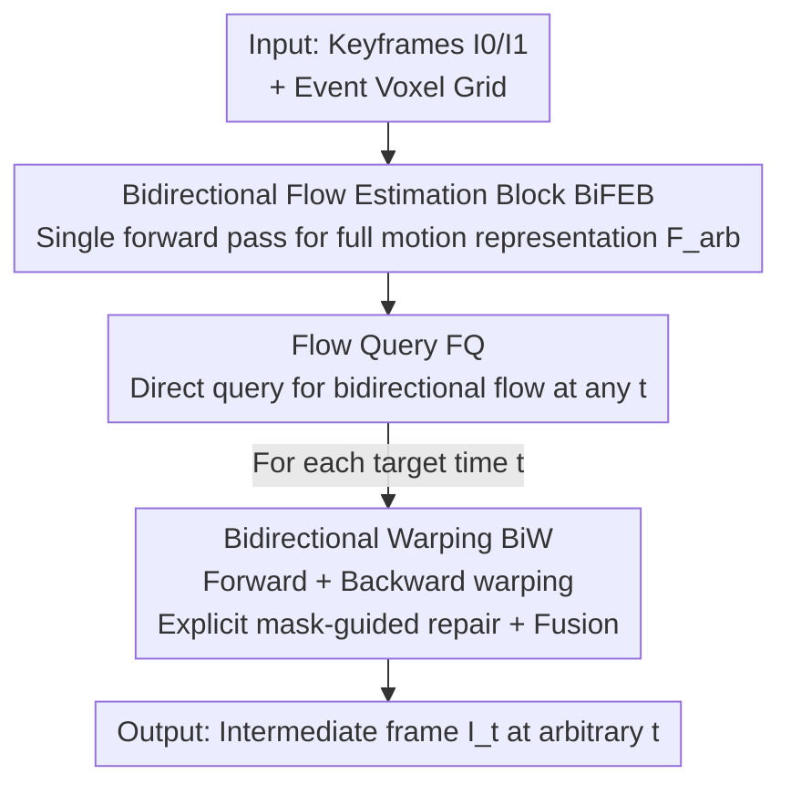

# One-Shot Flow, Any-Time Frame: A Bidirectional Warping Framework for Event-Based Video Frame Interpolation

**Conference**: CVPR 2026  
**Paper**: [CVF Open Access](https://openaccess.thecvf.com/content/CVPR2026/html/Fu_One-Shot_Flow_Any-Time_Frame_A_Bidirectional_Warping_Framework_for_Event-Based_CVPR_2026_paper.html)  
**Code**: https://github.com/Sudadaaaa/OF-AF (Available)  
**Area**: Video Frame Interpolation / Event Camera / Image Restoration  
**Keywords**: Event Camera, Video Frame Interpolation, Optical Flow, Forward/Backward Warping, Any-time Interpolation

## TL;DR
Addressing the dilemma in Event-based Video Frame Interpolation (E-VFI) where "forward warping is fast but suffers from holes, while backward warping yields high quality but requires recomputation for every frame," this paper proposes "One-Shot Flow, Any-Time Frame." By computing a bidirectional motion representation covering the entire duration once, optical flow at any time can be queried directly. A bidirectional warping mechanism with explicit repair masks is then used to fuse the strengths of both directions, refreshing both reconstruction quality and inference efficiency on synthetic and real-world datasets (PSNR 36.90 for GOPRO Skip 15, with only 7.27GB VRAM for 127-frame interpolation, while TLXNet directly encounters OOM).

## Background & Motivation
**Background**: The mainstream of Video Frame Interpolation (VFI) is flow-based methods—estimating motion between keyframes and warping existing pixels to intermediate timestamps to synthesize new frames. This is divided into two paths: forward methods estimate flow from $I_0\rightarrow I_1$ only once and scale it linearly by $t$ for fast generation; backward methods perform reverse sampling $I_1\rightarrow I_0$ for each target frame to ensure every target pixel has a source, resulting in higher quality. Event cameras record per-pixel intensity changes with microsecond precision, providing dense, continuous motion clues between keyframes, which has catalyzed Event-based VFI (E-VFI).

**Limitations of Prior Work**: Linear motion assumptions in forward methods fail to handle complex movements, and warped regions often lack source pixel coverage, leaving holes and degrading quality. While backward methods provide full coverage and better quality, they require predicting optical flow separately for **every** interpolated frame, causing computational costs to explode as the number of frames increases. Even when events are introduced or iterative strategies are used to reuse some computation, existing E-VFI methods are essentially built on backward warping—intermediate variables in iterative methods expand linearly with frame count, leading to sharp increases in memory overhead (e.g., TLXNet suffers from OOM when interpolating 63 frames).

**Key Challenge**: There is a structural trade-off between efficiency and quality—one-shot flow estimation (forward) saves computation but results in poor quality, while frame-by-frame estimation (backward) provides high quality but consumes excessive resources. No existing method has truly unified the two.

**Goal**: To allow a single motion estimation to serve any number of frames at any timestamp, maintaining quality (fixing holes) without memory explosions.

**Key Insight**: The authors make two key observations: (1) although linear assumptions in forward flow accumulate errors, dense event streams provide continuous, non-linear motion clues that can correct them; (2) holes generated by forward warping can be filled using information from backward flow.

**Core Idea**: Encode the bidirectional motion of the entire time interval into a "global motion trajectory representation" $F_{arb}$ **once**. Bidirectional optical flow at any time $t$ can be queried as needed (no per-frame recomputation). Finally, a bidirectional warping module with explicit repair masks fuses the advantages of both forward and backward warping.

## Method

### Overall Architecture
The inputs are two keyframes $I_0$ and $I_1$ plus the event stream between them, and the output consists of an arbitrary number of intermediate frames at time $t\in(0,1)$. The entire process consists of two major stages: **Bidirectional Flow Estimation** and **Bidirectional Warping**. Original events are first processed into voxel grids, and two independent feature extractors extract 1/4 scale features from the keyframes and the voxel grid.

In the first stage, the Bidirectional Flow Estimation Block (BiFEB) processes keyframe and event features jointly. It **runs only once** to produce the bidirectional optical flow representation $F_{arb}$ covering the entire duration—the cost of this step is fixed regardless of the number of frames to be interpolated. In the second stage, for a given target time $t$, the Flow Query (FQ) module instantaneously retrieves two sets of bidirectional optical flow $(F_{0\rightarrow t}, F_{t\rightarrow 0})$ and $(F_{1\rightarrow t}, F_{t\rightarrow 1})$ from $F_{arb}$. The Bidirectional Warping (BiW) module performs forward and backward warping using these flows and generates explicit repair masks to guide the network in patching, finally fusing them into a high-quality intermediate frame.

### Key Designs

**1. BiFEB: Segmenting the full motion into n short intervals to estimate precise non-linear bidirectional flow using events**

Forward methods are fast because they estimate flow once and extrapolate linearly; however, they assume motion is linear and constant between keyframes, failing for curved or varying-speed motion. BiFEB adopts "one-shot estimation" but does **not** use linear assumptions: it divides the motion over the entire duration into $n$ continuous intervals (fixed at $n=16$ in experiments, regardless of the final number of interpolated frames $N$). Each interval uses only the events within that segment to estimate local flow. This relies on a reasonable motion assumption—over an **extremely short** time interval, object motion can be approximated as linear and constant. By decomposing curved motion into many short straight lines, the true non-linear trajectory can be approximated.

Specifically, when processing the $t$-th interval, BiFEB aggregates the current event features $E_t$ with context features $\theta_{t-1}$ and motion information $V_{t-1}$ from the previous segment to update $\theta_t$ and $V_t$. It then estimates bidirectional flow starting from keyframe $I_0$:

$$\theta^0_t = \mathrm{RES}(\theta^0_{t-1}, E_t),\quad V^0_t = \mathrm{RES}(V^0_{t-1}, E_t, \theta^0_t)$$
$$F_{0\rightarrow t} = \mathrm{FFE}(V^0_t, \theta^0_t),\quad F_{t\rightarrow 0} = \mathrm{BFE}(V^0_t, \theta^0_t, D^0_{t-1}, F_{t-1\rightarrow 0})$$

Here, $\mathrm{RES}$ is a residual block, the Forward Flow Estimator (FFE) uses a GRU to recursively estimate $F_{0\rightarrow t}$, and the Backward Flow Estimator (BFE) estimates $F_{t\rightarrow 0}$. By processing events in **reverse order** starting from $I_1$, $F_{1\rightarrow t}$ and $F_{t\rightarrow 1}$ are obtained. After concatenating all intervals, the bidirectional flow representation $F_{arb}$ covering arbitrary timestamps is obtained. It balances the "single calculation" efficiency of forward methods with the non-linear precision provided by events—ablation showing PSNR rising from 29.75→35.24→36.96 as $n$ increases from 4→8→16 confirms that finer segmentation yields more accurate non-linear approximation.

**2. Flow Query: Retrieving flow via linear interpolation from the global representation, reducing "estimation" to "lookup"**

With $F_{arb}$, optical flow at any time $t$ no longer needs to be re-estimated; it is **queried**. FQ first localizes the interval $t$ falls into—identifying its start $t_l$ and end $t_r$—and retrieves the bidirectional flow and context features from $F_{arb}$ and $\theta$ at these points:

$$F_{0\rightarrow t_l}, F_{t_l\rightarrow t_r} = Q(F_{arb}, 0\rightarrow t),\quad \theta^0_{t_l}, \theta^0_{t_r} = Q(\theta, 0, t)$$

Then, linear blending is performed within the segment based on the relative position $\lambda = \dfrac{t - t_l}{t_r - t_l}$ to obtain the final flow and context:

$$F_{0\rightarrow t} = F_{0\rightarrow t_l} + \lambda \cdot F_{t_l\rightarrow t_r},\quad F_{t\rightarrow 0} = (1-\lambda)\cdot F_{t_r\rightarrow t_l} + F_{t_l\rightarrow 0}$$
$$\theta^0_t = (1-\lambda)\cdot\theta^0_{t_l} + \lambda\cdot\theta^0_{t_r}$$

The key is that linear interpolation only occurs **within a very short interval**, while the non-linearity between segments is already encoded by BiFEB into $F_{arb}$. Thus, querying is computationally cheap without sacrificing non-linear accuracy. This is how "one-shot estimation, any-time, any-frame" is achieved—backward methods cannot perform continuous interpolation at arbitrary times (e.g., $t=0.51$, $t=0.88$), whereas this method can be infinitely subdivided.

**3. Bidirectional Warping: Using explicit hole/discrepancy masks to direct the network where to fix, then weighting bidirectional results**

Optical flow is never perfect, and warped intermediate frames always have flaws. Previous methods typically feed the warped frame directly into a Refinement Network, hoping the network **implicitly** finds and fixes erroneous regions—but identifying "where it's wrong" is difficult for a network. The core of BiW is to make this **explicit**: it performs forward warping with $F_{0\rightarrow t}$ and $F_{t\rightarrow 0}$ to get $I^f_t$ and $I^b_t$ respectively, then calculates two masks—the hole mask $R^0_h = \mathrm{where}(I^f_t = 0)$ (holes not covered by forward warping) and the discrepancy mask $R^0_d = \mathrm{where}(|I^f_t - I^b_t| > Y)$ (suspicious areas with large differences between forward and backward results, where $Y$ is a threshold):

$$R^0, I^0_t = \mathrm{MG}(R^0_h, R^0_d, \theta^0_t, \theta^1_t)$$

Since holes often represent occlusion zones where backward warping is also prone to error, the authors choose **not to fix the holes in the forward map**, but rather use these masks to **correct the backward warped map $I^b_t$**. The Mask-guided (MG) network first uses $R^0_h$ to guide a Reference block to extract reference information from corresponding regions in $\theta^0_t$ and $\theta^1_t$ (updating $R^0_h$ as inaccurate flow makes the mask itself noisy). Then, $R^0_h$ and $R^0_d$ are added to create the repair mask $R^0$, which is multiplied with $I^b_t$ to lock onto pixels needing repair. Note that $R^0_d$ is **not** sent to the Reference block—because $I^b_t$ isn't necessarily wrong in discrepancy zones; the goal is just to make the network pay more attention.

The same process is run from the $I_1$ side to obtain $I^1_t$ and mask $R^1$, with final fusion based on temporal distance and reliability:

$$M = \mathrm{softmax}\big((1-R^0)\cdot(1-t),\ (1-R^1)\cdot t\big),\quad I_t = I^0_t\cdot M^0 + I^1_t\cdot M^1$$

Intuition: as $t$ decreases (approaching $I_0$), $I^0_t$ is given more weight; simultaneously, $(1-R^0)$ and $(1-R^1)$ suppress weights for regions needing repair—unproblematic areas are more trustworthy. Ablations removing $R_h$ (Variant F) dropped PSNR from 36.96 to 36.01, and removing $R_d$ (Variant G) dropped it to 36.74, proving both explicit masks are effective.

### Loss & Training
The model is trained end-to-end on GOPRO using L1 + LPIPS losses. 20 epochs, Adam optimizer, learning rate cosine annealed from $10^{-4}$ to $10^{-6}$. Images and events are randomly cropped to $256\times256$. BiFEB uses $n=16$. Events are synthesized from videos using V2E. All experiments were conducted on a single RTX 3090.

## Key Experimental Results

### Main Results
Synthetic datasets (GOPRO + SNU-FILM); Ours achieved optimal results in all settings (F&B refers to bidirectional fusion):

| Dataset / Setting | Metric | Ours | Prev. SOTA (TimeTracker*) | Notes |
|--------------|------|------|--------------------|------|
| GOPRO Skip 7 | PSNR | **37.66** | 37.13 | Gain: +0.53 |
| GOPRO Skip 15 | PSNR | **36.90** | 36.54 | Gain: +0.36, advantage more obvious in multi-frame |
| SNU-FILM hard | PSNR | **38.32** | 37.92 | Gain: +0.40 |
| SNU-FILM extreme | PSNR | **36.96** | 36.47 | Gain: +0.49, gap widens under extreme motion |

On real-world datasets (BS-ERGB + HS-ERGB), Ours is optimal in all HS-ERGB settings and top-two in BS-ERGB:

| Dataset / Setting | Metric | Ours | Next Best | Notes |
|--------------|------|------|------|------|
| HS-ERGB Skip 5 | PSNR | **34.63** | 33.59 | Gain: +1.04, significant lead |
| HS-ERGB Skip 7 | PSNR | **34.19** | 32.68 | Gain: +1.51, gap increases with difficulty |
| BS-ERGB Skip 1 | PSNR | 29.76 | 29.85 | Second, slightly lower than TimeTracker* |
| BS-ERGB Skip 3 | SSIM | **0.815** | 0.807 | SSIM improves |

Computational Cost (GOPRO, for different frame counts)—the core selling point of Ours:

| Method | Type | VRAM (127f) | MACs/f (127f) | Time/f (127f) |
|------|------|------------|---------------|---------------|
| TimeLens | Backward | 1.93GB | 1535.28G | 1.126s |
| CBM-Net | Backward | 10.77GB | 3732.99G | 2.959s |
| TLXNet | Backward | **OOM(>24GB)** | - | - |
| Ours | F&B | **7.27GB** | **665.35G** | **0.108s** |

Crucially, the cost of Ours is **amortized** over the frames: flow is estimated once, and as the number of frames increases, the per-frame cost decreases (MACs/f drops from 887→665 when moving from 31→127 frames). In contrast, backward methods re-estimate flow per frame, keeping the cost constant, with TLXNet hitting OOM at 63 frames.

### Ablation Study

| Variant | Flow Estimator | Interpolation | PSNR | SSIM |
|------|---------|---------|------|------|
| A | RAFT+TimeLens | BiW | 36.27 | 0.962 |
| B | BiFEB (n=4) | BiW | 29.75 | 0.892 |
| C | BiFEB (n=8) | BiW | 35.24 | 0.954 |
| D | BiFEB (n=16) | Forward Only | 30.54 | 0.912 |
| E | BiFEB (n=16) | Backward Only | 35.78 | 0.959 |
| F | BiFEB (n=16) | BiW (w/o R_h) | 36.01 | 0.961 |
| G | BiFEB (n=16) | BiW (w/o R_d) | 36.74 | 0.966 |
| H (Ours) | BiFEB (n=16) | BiW | **36.96** | **0.967** |

### Key Findings
- **Interval count $n$ is critical for BiFEB**: As $n$ goes from 4→8→16, PSNR climbs from 29.75→35.24→36.96. Finer segmentation makes the "linear within short interval" assumption more valid, enabling better non-linear approximation.
- **Bidirectional fusion significantly outperforms unidirectional**: Forward-only (D, 30.54) is much worse than backward-only (E, 35.78), but BiW fusion (H, 36.96) beats both, proving backward information fills forward holes and bidirectional checks correct mutual errors.
- **Both explicit masks are effective**: Removing $R_h$ drops PSNR by 0.95 (→36.01) and removing $R_d$ drops it by 0.22 (→36.74), showing that "explicitly telling the network where to fix" is more efficient than letting the network search implicitly.
- **Stronger in difficult scenarios**: In SNU-FILM extreme, HS-ERGB Skip 7, and scenes with thin structures or occlusions, the lead is even larger, demonstrating BiFEB's ability to characterize complex motion trajectories.

## Highlights & Insights
- **"One-shot estimation + On-demand query" decouples efficiency and quality**: Accuracy is handled by BiFEB's piecewise non-linear modeling, while efficiency is handled by FQ's lookup-style retrieval. Serving any number of frames at any time with one-time computation is a paradigm shift from the "recompute per frame" backward methods.
- **Leveraging event temporal resolution to break linear assumptions is clever**: Slicing "global curved motion" into "many short linear segments" using per-segment events uses event density for motion modeling precision. This "piecewise linear approximation of non-linear" approach is transferable to any task requiring continuous motion representation (e.g., event deblurring, continuous flow).
- **Explicit mask-guided repair is worth reusing**: Instead of letting a refinement network find errors implicitly, using the physical properties of warping (holes = uncovered, discrepancy = suspicious) to compute explicit masks is more effective. This "explicitizing priors to guide network attention" practice is applicable to any warping/alignment task.

## Limitations & Future Work
- **Residual issues**: If $I^f_t$ and $I^b_t$ make the **same** error in a region without holes, $R_d$ won't catch it. These error zones aren't captured by repair masks, leaving artifacts. The authors use an extra Refine module to catch these, but it is essentially a patch.
- **Reliance on event quality and synthesis**: Synthetic events are via V2E; real events have complex noise and threshold drift. Performance on BS-ERGB was slightly lower than TimeTracker, indicating inconsistent advantages across all real-world distributions.
- **Fixed $n$**: $n=16$ is fixed, but motion intensity varies. Adaptive allocation of interval counts based on local motion complexity could potentially improve quality further within the same computational budget.
- **Comparison caveat**: TimeTracker is unreleased; the study uses reported values, and an attempt to reproduce it (marked *) failed to reach reported performance.

## Related Work & Insights
- **vs. Forward methods (M2M, UPR-Net, IQ-VFI)**: These also prioritize efficiency through one-shot estimation but rely on linear extrapolation and leave holes. Ours maintains efficiency while using events for non-linear modeling and backward flow for hole filling, reaching backward-level quality.
- **vs. Backward E-VFI (TimeLens, CBM-Net, TLXNet, TimeTracker)**: These estimate reverse flow per frame, yielding quality but high costs and OOM issues. Ours reduces "estimation" to "lookup," amortizing costs and supporting continuous any-time interpolation (which backward methods cannot naturally do).
- **vs. Direct refinement methods (RIFE, TLXNet refinement)**: These feed warped frames directly to refinement networks. Ours uses explicit hole/discrepancy masks to guide the network on "where to look and what to fix," shown to be more effective by ablation studies.

## Rating
- Novelty: ⭐⭐⭐⭐⭐ "One-shot bidirectional estimation + Query + Explicit mask BiW" is a paradigm reconstruction of the E-VFI efficiency-quality dilemma.
- Experimental Thoroughness: ⭐⭐⭐⭐ 4 datasets (synthetic + real), both quality and budget dimensions, thorough ablation of n and masks. Minor point deduction for BS-ERGB not being a clean sweep and comparison with non-open-source work.
- Writing Quality: ⭐⭐⭐⭐ Clear insights, effective diagrammatic comparisons. Formulas in the original PDF are dense; some symbols require cross-referencing with figures.
- Value: ⭐⭐⭐⭐⭐ Achieving high-quality 127-frame interpolation on a single card with much lower VRAM than backward methods is highly practical for applications like slow-motion, video compression, and view synthesis.

<!-- RELATED:START -->

## Related Papers

- [\[CVPR 2026\] Time-Specialized Event-Image Alignment for Blur-to-Video Decomposition](time-specialized_event-image_alignment_for_blur-to-video_decomposition.md)
- [\[CVPR 2026\] AE2VID: Event-based Video Reconstruction via Aperture Modulation](ae2vid_event-based_video_reconstruction_via_aperture_modulation.md)
- [\[CVPR 2026\] From Events to Clarity: The Event-Guided Diffusion Framework for Dehazing](from_events_to_clarity_the_event-guided_diffusion_framework_for_dehazing.md)
- [\[ECCV 2024\] Exploiting Dual-Correlation for Multi-frame Time-of-Flight Denoising](../../ECCV2024/image_restoration/exploiting_dual-correlation_for_multi-frame_time-of-flight_denoising.md)
- [\[CVPR 2026\] Event-Based Motion Deblurring Using Task-Oriented 3D Gaussian Event Representations](event-based_motion_deblurring_using_task-oriented_3d_gaussian_event_representati.md)

<!-- RELATED:END -->
