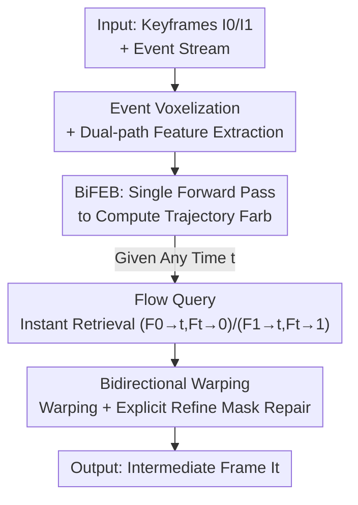

# One-Shot Flow, Any-Time Frame: A Bidirectional Warping Framework for Event-Based Video Frame Interpolation

**Conference**: CVPR 2026  
**Paper**: [CVF Open Access](https://openaccess.thecvf.com/content/CVPR2026/html/Fu_One-Shot_Flow_Any-Time_Frame_A_Bidirectional_Warping_Framework_for_Event-Based_CVPR_2026_paper.html)  
**Code**: https://github.com/Sudadaaaa/OF-AF  
**Area**: Video Understanding / Event Camera / Video Frame Interpolation  
**Keywords**: Event-based VFI, Bidirectional Optical Flow, Forward/Backward Warping, Any-time Interpolation, Motion Trajectory Representation

## TL;DR
To address the dilemma in Event-Based Video Frame Interpolation (E-VFI)—where forward warping is fast but leaves holes, and backward warping offers high quality but requires redundant flow recalculation for every frame—this paper proposes a framework that computes a bidirectional motion trajectory (BiFEB) for the entire interval in a single forward pass. It then uses Flow Query to instantly retrieve bidirectional flow for any time $t$ and employs Bidirectional Warping to explicitly locate and repair erroneous regions. This achieves any-time, low-cost, high-quality interpolation, outperforming existing methods in both quality and efficiency on GOPRO, SNU-FILM, BS-ERGB, and HS-ERGB datasets.

## Background & Motivation

**Background**: In Video Frame Interpolation (VFI), flow-based methods are dominant; they estimate intermediate flow and warp existing frames to the target time, resulting in sharper and geometrically consistent frames compared to kernel or diffusion-based synthesis. Event cameras capture pixel-level intensity changes with microsecond precision, providing dense, continuous motion cues that mitigate the sparsity of motion information between keyframes in standard VFI, thus giving rise to the E-VFI research line.

**Limitations of Prior Work**: Flow-based interpolation follows two paradigms, each with critical flaws. **Forward methods** estimate flow once (e.g., $I_0 \to I_1$) and linearly scale it to $t$, which is fast even for many frames; however, the linear assumption fails under complex motion, and forward warping leaves uncovered regions (holes), degrading image quality. **Backward methods** sample from source frames using backward flow (e.g., $I_t \to I_0$) for every target pixel, ensuring full coverage and high quality; however, they must predict flow for **every** interpolated frame, leading to exploding computational costs for multi-frame interpolation.

**Key Challenge**: There is a structural trade-off between efficiency and quality. Existing E-VFI methods (CBM-Net, TLXNet, TimeTracker, etc.) are fundamentally based on backward warping. While some use iterative strategies to speed up process, they suffer from memory overhead that expands rapidly with the number of interpolated frames—TLXNet, for instance, hits OOM (>24GB) when interpolating 63 frames. As long as the framework is constrained to the backward warping paradigm, it cannot truly unify efficiency and quality.

**Key Insight & Core Idea**: The authors make two observations: (1) While linear motion assumptions in forward flow accumulate errors, dense event streams provide continuous non-linear motion cues to correct them; (2) Holes in forward warping can be filled using information from backward flow. Consequently, they propose **"One-Shot Flow, Any-Time Frame"**: using one forward pass to obtain a **bidirectional** motion trajectory representation covering the entire interval, retrieving flow for any time on demand, and using bidirectional warping to combine the strengths of both. In short: **integrate "single trajectory calculation + any-time query + bidirectional complementary repair" to achieve forward-level efficiency and backward-level fidelity.**

## Method

### Overall Architecture
The input consists of two keyframes $I_0, I_1$ and the intermediate event stream; the output is any number of intermediate frames at arbitrary times. The pipeline consists of two stages: **Bidirectional Flow Estimation** and **Bidirectional Warping**.

Original events are processed into a voxel grid, and two independent feature extractors extract 1/4 scale features from the keyframes and the voxel grid. The **BiFEB** (Bidirectional Flow Estimation Block) predicts dense bidirectional flow for any time $t$ between the keyframes—crucially, this step **runs only once**, regardless of the number of frames to be interpolated. Given a target time $t$, the **Flow Query** module instantly retrieves two sets of bidirectional flows $(F_{0\to t}, F_{t\to 0})$ and $(F_{1\to t}, F_{t\to 1})$. Finally, **BiW** (Bidirectional Warping) performs forward and backward warping once each, explicitly calculating regions requiring repair to guide the network in synthesizing high-fidelity intermediate frames.

### Key Designs

**1. BiFEB: Single Forward Pass for Entire Bidirectional Motion Trajectory**

This design targets the bottleneck of forward methods. To avoid repeating flow estimation for every $t$, BiFEB estimates the bidirectional flow for any time within the interval in **one** pass. Unlike standard forward methods that assume linear motion, BiFEB leverages the high temporal resolution of events by dividing the motion into $n$ continuous time slices (independent of the number of target frames $N$). Each slice uses local events to estimate flow, based on the reasonable assumption that **motion is approximately linear within extremely short intervals**, allowing complex curves to be approximated by $n$ segments.

For the $t$-th slice, BiFEB aggregates current event features $E_t$ with context features $\theta_{t-1}$ and motion info $V_{t-1}$ from the previous slice to update $\theta_t$ and $V_t$, then estimates bidirectional flow starting from $I_0$:

$$\theta^0_t = \text{Res}(\theta^0_{t-1}, E_t),\quad V^0_t = \text{Res}(V^0_{t-1}, E_t, \theta^0_t)$$
$$F_{0\to t} = \text{FFE}(V^0_t, \theta^0_t),\quad F_{t\to 0} = \text{BFE}(V^0_t, \theta^0_t, D^0_{t-1}, F_{t-1\to 0})$$

Where Res is a residual block, FFE uses a GRU to estimate $F_{0\to t}$, and BFE estimates $F_{t\to 0}$. Inputting events in reverse order while initializing with $I_1$ features yields $F_{1\to t}$ and $F_{t\to 1}$. This "intra-slice recursive residual + bidirectional" design allows one pass to capture a full non-linear trajectory.

**2. Flow Query: On-Demand Retrieval of Flow via Linear Interpolation**

BiFEB outputs trajectories at discrete time slices, but the requested $t \in (0,1)$ may fall between slices. Flow Query maps the continuous time query to discrete slices and performs intra-slice interpolation, avoiding per-frame prediction. It identifies the start $t_l$ and end $t_r$ of the slice containing $t$, and retrieves the bidirectional flow and context at these endpoints from $F_{arb}$ and $\theta$:

$$F_{0\to t_l}, F_{t_l\to t_r} = Q(F_{arb}, 0\to t),\quad F_{t_r\to t_l}, F_{t_l\to 0} = Q(F_{arb}, t\to 0),\quad \theta^0_{t_l}, \theta^0_{t_r} = Q(\theta, 0, t)$$

It then uses normalized weights $\lambda = \frac{t - t_l}{t_r - t_l}$ to linearly blend the quantities for the final flow and context at $t$:

$$F_{0\to t} = F_{0\to t_l} + \lambda \cdot F_{t_l\to t_r},\quad F_{t\to 0} = (1-\lambda)\cdot F_{t_r\to t_l} + F_{t_l\to 0},\quad \theta^0_t = (1-\lambda)\cdot\theta^0_{t_l} + \lambda\cdot\theta^0_{t_r}$$

Since this is merely a table lookup and lightweight interpolation, the cost remains $O(1)$ regardless of frame count.

**3. BiW: Explicit Refine Masks for Targeted Repair**

Warped frames often contain artifacts. Prior works (Fig. 4a) feed warped frames directly into a refinement network, expecting it to **implicitly** find and fix errors. BiW instead explicitly calculates "where things went wrong." It uses $F_{0\to t}$ and $F_{t\to 0}$ for forward and backward warping to obtain low-quality frames $I^f_t, I^b_t$, and computes two masks:

$$R^0_h = \text{where}(I^f_t = 0),\quad R^0_d = \text{where}(|I^f_t - I^b_t| > Y)$$

$R^0_h$ is the **hole mask** from forward warping, and $R^0_d$ is the **difference mask** between paradigms. The key strategy is using $R^0_h$ and $R^0_d$ to refine the **backward** warped frame $I^b_t$, as hole regions are typically occluded areas where backward warping also tends to fail. The Mask Guide network $\text{MG}(\cdot)$ uses these masks to produce a refined frame and a refine mask: $R^0, I^0_t = \text{MG}(R^0_h, R^0_d, \theta^0_t, \theta^1_t)$.

Final fusion is performed between the refined frames from both ends ($I^0_t, I^1_t$):

$$M = \text{softmax}\big((1-R^0)\cdot(1-t),\ (1-R^1)\cdot t\big),\quad I_t = I^0_t \cdot M^0 + I^1_t \cdot M^1$$

This gives higher weight to frames closer in time and lower weight to regions identified as needing repair (where $R$ is high).

### Loss & Training
The model is trained end-to-end on GOPRO using $L_1$ + LPIPS loss. It uses the Adam optimizer with a learning rate of $10^{-4}$ (cosine annealing to $10^{-6}$), training for 20 epochs on random $256\times256$ crops. BiFEB uses $n=16$ time slices.

## Key Experimental Results

### Main Results

The method leads across synthetic datasets (GOPRO / SNU-FILM). It is the only "F&B" (Forward & Backward) framework:

| Dataset / Setting | Metric | Ours (F&B) | TimeTracker (CVPR'25, B) | TLXNet (ECCV'24, B) |
|--------------|------|-----------|--------------------------|---------------------|
| GOPRO Skip 7 | PSNR / SSIM | **37.66 / 0.976** | 37.13 / 0.962 | 37.06 / 0.970 |
| GOPRO Skip 15 | PSNR / SSIM | **36.90 / 0.970** | 36.54 / 0.958 | 36.43 / 0.968 |
| SNU-FILM extreme | PSNR / SSIM | **36.96 / 0.967** | 36.47 / 0.959 | 36.10 / 0.962 |

On real datasets (BS-ERGB / HS-ERGB), the method ranks first on HS-ERGB and consistently second on BS-ERGB.

Computational Cost (GOPRO, varying frame counts):

| Method | 31-frame Mem / Time/f | 63-frame Mem / Time/f | 127-frame Mem / MACs/f |
|------|--------------------|--------------------|---------------------|
| Timelens (Backward) | 1.93GB / 1.065s | 1.93GB / 1.031s | 1.93GB / 1535.28G |
| TLXNet (Backward) | 11.70GB / 0.079s | **OOM** | **OOM** |
| **Ours** | 5.29GB / 0.137s | 5.95GB / 0.117s | 7.27GB / **665.35G** |

TLXNet achieves speed through high memory usage but crashes at 63 frames. Ours maintains stable memory and its per-frame MACs actually **decrease** as interpolation density increases (887G $\to$ 738G $\to$ 665G).

### Ablation Study

| Variant | Flow Estimator | Warping Type | PSNR / SSIM | Note |
|------|-----------|---------|-------------|------|
| A | RAFT + Timelens | BiW | 36.27 / 0.962 | Linear flow error |
| B | BiFEB (n=4) | BiW | 29.75 / 0.892 | Poor non-linear approx. |
| C | BiFEB (n=16) | Forward Only | 30.54 / 0.912 | Severe holes |
| D | BiFEB (n=16) | Backward Only | 35.78 / 0.959 | Missing hole guidance |
| **Ours** | **BiFEB (n=16)** | **BiW** | **36.96 / 0.967** | Full model |

### Key Findings
- **Slice count $n$ is critical**: Increasing $n$ from 4 to 16 improves PSNR from 29.75 to 36.96, validating that dividing curved motion into finer linear segments is effective.
- **BiW complementarity is essential**: Forward-only (30.54) and backward-only (35.78) are both inferior to the combined approach (36.96).
- **Advantages in extreme motion**: The framework better handles thin structures and fast human motion where other methods produce breakages or artifacts.

## Highlights & Insights
- **Unified Warping Strategy**: Using the weakness of forward warping (holes) as an explicit "error locator" to guide the repair of backward warping is an elegant use of complementary information.
- **Decoupled Motion Estimation**: Lowering the motion estimation cost to $O(1)$ relative to the number of frames is a fundamental shift from the backward paradigm, making it highly suitable for high-frame-rate or continuous rendering tasks.
- **Explicit vs. Implicit Refinement**: Targeted repair via masks proves more effective than letting a network "blindly guess" corrupted regions.

## Limitations & Future Work
- **Intra-slice Linear Assumption**: Although $n=16$ works well, extremely non-linear or jittery motion might still have residuals; however, increasing $n$ further increases BiFEB recursion overhead.
- **Dependence on Event Quality**: The performance impact of noise or bandwidth bottlenecks in real event sensors vs. simulated data remains to be fully explored.
- **Mask Blind Spots**: If forward and backward frames make the **same** error in a non-hole region, the difference mask $R_d$ will fail to catch it.

## Related Work & Insights
- **vs. Forward Methods**: Unlike linear scaling methods (UPR-Net), this approach uses events for non-linear trajectories and fills holes via backward warping.
- **vs. Backward E-VFI**: Unlike TLXNet, which predicts flow per frame, this approach uses Flow Query to replace per-frame estimation with table-lookup interpolation, avoiding OOM and high costs.

## Rating
- Novelty: ⭐⭐⭐⭐⭐ 
- Experimental Thoroughness: ⭐⭐⭐⭐⭐ 
- Writing Quality: ⭐⭐⭐⭐ 
- Value: ⭐⭐⭐⭐⭐ 

<!-- RELATED:START -->

## Related Papers

- [\[CVPR 2026\] From Contrast to Consistency: Rethinking Event-based Continuous-Time Optical Flow Estimation](from_contrast_to_consistency_rethinking_event-based_continuous-time_optical_flow.md)
- [\[AAAI 2026\] VTinker: Guided Flow Upsampling and Texture Mapping for High-Resolution Video Frame Interpolation](../../AAAI2026/video_understanding/vtinker_guided_flow_upsampling_and_texture_mapping_for_high-resolution_video_fra.md)
- [\[CVPR 2026\] Envisioning the Future, One Step at a Time](envisioning_the_future_one_step_at_a_time.md)
- [\[ECCV 2024\] IAM-VFI: Interpolate Any Motion for Video Frame Interpolation with Motion Complexity Map](../../ECCV2024/video_understanding/iam-vfi_interpolate_any_motion_for_video_frame_interpolation_with_motion_complex.md)
- [\[CVPR 2026\] GIFT: Global Irreplaceability Frame Targeting for Efficient Video Understanding](gift_global_irreplaceability_frame_targeting_for_efficient_video_understanding.md)

<!-- RELATED:END -->
