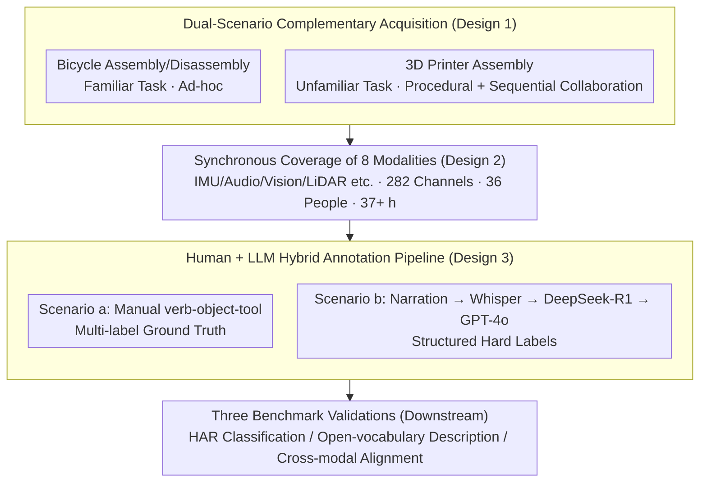

# OpenMarcie: Dataset for Multimodal Action Recognition in Industrial Environments

**Conference**: CVPR 2026  
**arXiv**: [2603.02390](https://arxiv.org/abs/2603.02390)  
**Code**: Available (Dataset and code provided on the OpenMarcie official website)  
**Area**: Video Understanding  
**Keywords**: Multimodal dataset, Human action recognition, Industrial manufacturing, Wearable sensors, Cross-modal alignment

## TL;DR

Ours proposes OpenMarcie, the largest multimodal action recognition dataset for industrial scenarios to date, integrating 8 sensing modalities from wearable sensors and vision data with 200+ channels and 37+ hours of recording. The superiority of inertial + vision fusion is validated across three benchmarks: HAR classification, open-vocabulary description, and cross-modal alignment.

## Background & Motivation

### 1. Background
Smart factories rely on Human Activity Recognition (HAR) to quantify worker performance, improve efficiency, and ensure safety. Video data has long been the primary information source for HAR; however, a single visual modality faces risks of privacy breaches and technical leaks in industrial settings. While several industrial HAR datasets have emerged recently (InHARD, LARa, OpenPack, Assembly101, IKEA-ASM, etc.), they exhibit significant shortcomings.

### 2. Limitations of Prior Work
Existing industrial HAR datasets face three major limitations:
- **Lack of true multimodal synchronous data**: Most datasets cover only vision or IMU modalities, lacking the collaborative acquisition of wearable sensors, vision, and audio.
- **Overly restricted tasks**: They rely on highly controlled, protocol-driven tasks that fail to reflect the open-ended and procedural workflows of real industries.
- **Insufficient demographic diversity and task complexity**: Most datasets only capture short-term isolated actions and fail to capture long-duration, multi-step continuous activities in manufacturing.

### 3. Key Challenge
Human actions are inherently multimodal—integrating vision, hearing, touch, and cognitive/emotional states—but existing datasets are either unimodal or lack natural variability and real industrial noise. To enable AI systems to truly understand human activities in industrial scenarios, a comprehensive dataset covering multiple sensors, multi-view videos, and natural language narratives is required.

### 4. Goal
The goal is to construct a unified large-scale industrial multimodal benchmark that simultaneously supports three tasks: activity classification, open-vocabulary description generation, and cross-modal alignment, filling the gaps in modality richness, task diversity, and annotation granularity.

### 5. Key Insight
Ours designs two complementary experimental scenarios—bicycle assembly/disassembly (open-ended ad-hoc) and 3D printer assembly (procedural based on manuals)—to capture free goal-oriented behavior and procedural knowledge acquisition processes, respectively. Real manufacturing dynamics are introduced through sequential collaborative assembly.

### 6. Core Idea
OpenMarcie is the first comprehensive industrial scenario dataset that simultaneously covers wearable sensors, ego-centric/exo-centric multi-view video, and overlapping multi-action annotations. Through 8 sensing modalities, 282 raw channels, 36 participants, and over 37 hours of data, it provides the most comprehensive multimodal benchmark for industrial HAR.

## Method

### Overall Architecture

OpenMarcie is essentially a **collection-annotation-validation** data pipeline aimed at recording motion, sound, vision, and distance signals in industrial sites as completely as possible, paired with ready-to-train labels. The pipeline consists of three segments: the front end synchronously collects signals from 8 modalities and 282 raw channels in two real assembly scenarios, covering 36 participants and 37+ hours; the middle segment converts recorded videos/narratives into structured action labels (human + LLM hybrid); the back end establishes baselines for HAR classification, open-vocabulary description, and cross-modal alignment to verify the utility of the multimodal data.

### Key Designs

**1. Complementary dual-scenario acquisition: Covering two behavioral patterns in industry with a familiar task and an unfamiliar task**

Existing industrial HAR datasets mostly rely on highly controlled protocol tasks where workers follow fixed scripts, failing to capture the natural variability of experienced workers' ad-hoc operations or novices' manual-driven exploration. OpenMarcie designs two control scenarios: bicycle assembly/disassembly (familiar task encouraging free decision-making) and 3D printer assembly (unfamiliar task requiring procedural knowledge acquisition from manuals). Furthermore, the 3D printer scenario introduces **sequential collaborative assembly**, where a participant continues from where the predecessor left off, reflecting the "station handoff" dynamics of real production lines.

**2. Synchronous coverage of eight sensing modalities: Using complementary signals to fill unimodal blind spots**

Industrial actions are naturally multimodal, but single modalities have blind spots: vision alone might not distinguish "tightening" from "loosening," and IMUs alone do not reflect the object being manipulated. OpenMarcie deploys IMUs (wrist, forehead), magnetometers, barometers, temperature sensors, spectrometers, thermal imaging, RGB-LiDAR, and stereo microphones on each participant, plus 3 ZED X AI stereo cameras for exo-centric RGB-D views. These modalities provide complementary information—IMUs capture motion dynamics, vision captures spatial context, audio captures tool usage sounds, and LiDAR provides distance—which together fully characterize an action.

**3. Human + LLM hybrid annotation pipeline: Using LLMs as "structured translators" for 37 hours of narration**

Manually annotating 37 hours of multimodal data frame-by-frame is prohibitively expensive. Scenario (a) uses manual verb-object-tool annotations on the best exo-centric view with multi-label support to ensure precise ground truth. Scenario (b) utilizes real-time verbal narrations from external observers, transcribed by Whisper large-v3, and processed through a two-stage LLM pipeline (DeepSeek-R1 for extraction and GPT-4o for structuring) to generate hard labels. Bi-directional consistency checks confirmed that the LLM-generated labels are of sufficient quality to support downstream training.

### Training Strategies for Three Benchmarks

- **HAR Classification**: Each modality is independently trained using specific encoders—ViT for video, DeepConvLSTM for IMU, and EnCodec with a temporal classifier for audio—followed by a late-fusion transformer for feature integration across 12 action categories.
- **Open-vocabulary Description**: Based on the OV-HAR approach, modality-specific encoders directly regress to sentence embeddings of the narrations, followed by Vec2Text for embedding retrieval and decoding.
- **Cross-modal Alignment**: Inspired by ImageBind, multimodal contrastive learning (InfoNCE loss) is used to pull video, IMU, audio, and language into a shared embedding space to support cross-modal retrieval.

## Key Experimental Results

### Main Results

**Table 1: HAR Classification Macro F1 ($\uparrow$)**

| Modality | Scenario (a) No Null | Scenario (a) Null | Scenario (b) No Null | Scenario (b) Null |
|----------|---------------------|-------------------|---------------------|-------------------|
| Inertial (I) | 0.834 | 0.811 | 0.750 | 0.674 |
| Acoustic (A) | 0.489 | 0.469 | 0.425 | 0.432 |
| Vision (V) | 0.757 | 0.729 | 0.705 | 0.655 |
| I + A | 0.803 | 0.782 | 0.744 | 0.666 |
| A + V | 0.739 | 0.714 | 0.695 | 0.646 |
| **I + V** | **0.882** | **0.851** | **0.773** | **0.685** |
| I + A + V | 0.859 | 0.831 | 0.763 | 0.676 |

**Table 2: Cross-modal Alignment Recall and Top-1 Accuracy**

| Modality Combination | Scenario (a) R@1 | R@5 | Top-1 | Scenario (b) R@1 | R@5 | Top-1 |
|----------------------|-----------------|-----|-------|-----------------|-----|-------|
| I + T | 0.324 | 0.655 | 0.481 | 0.312 | 0.642 | 0.468 |
| A + T | 0.241 | 0.583 | 0.342 | 0.227 | 0.567 | 0.329 |
| V + T | 0.437 | 0.768 | 0.556 | 0.421 | 0.751 | 0.541 |
| I + A + T | 0.347 | 0.679 | 0.495 | 0.334 | 0.663 | 0.479 |
| A + V + T | 0.412 | 0.740 | 0.533 | 0.395 | 0.723 | 0.517 |
| **I + V + T** | **0.485** | **0.803** | **0.587** | **0.467** | **0.787** | **0.570** |
| I + A + V + T | 0.470 | 0.795 | 0.579 | 0.453 | 0.779 | 0.563 |

### Ablation Study

Cosine Similarity results for open-vocabulary description further validate modality complementarity:
- **I + V is optimal**: Scenario (a) 0.561 and Scenario (b) 0.655, consistently exceeding tri-modal fusion (I+A+V = 0.547 / 0.647).
- **Acoustic alone is weakest**: Only 0.361 in Scenario (a), significantly lower than Inertial (0.518) and Vision (0.479).
- **Limited gain from Acoustic**: I+A (0.512) is slightly lower than I alone (0.518), suggesting audio may introduce noise in the current setup.
- Metrics improve across the board after removing the Null category, indicating null activity segments are a major source of difficulty.

### Key Findings

1. **Inertial + Vision is the golden combination**: Consistent best performance across HAR, description, and alignment tasks suggests that motion dynamics and visual-spatial information are highly complementary.
2. **Tri-modal fusion can underperform bi-modal fusion**: I+A+V frequently performed worse than I+V, suggesting that the noisy acoustic modality might dilute effective signals in late fusion.
3. **Ad-hoc scenario generally outperforms the Procedural scenario**: HAR F1 for bicycle assembly (0.882) is much higher than for the 3D printer (0.773), as the latter involves more unfamiliar small component manipulations and cognitive challenges.
4. **Acoustic modality has limited performance but marginal value**: Poor independent performance is largely due to collection in a lab rather than a real factory. However, it still offers marginal contributions in fusion.

## Highlights & Insights

- **Comprehensive Scale and Coverage**: 8 modalities, 282 channels, 37+ hours, and 36 participants make it the largest known multimodal industrial HAR dataset.
- **High Ecological Validity**: The sequential collaborative assembly design accurately reflects station handoff scenarios in production lines.
- **Annotation Innovation**: The manual + LLM two-stage pipeline with consistency checks balances annotation cost and quality.
- **Multi-label Action Support**: The unique verb-object-tool scheme allows for overlapping annotations (e.g., carrying while walking), which is more realistic for industrial environments.
- **Three Complementary Benchmarks**: The combination of HAR, description, and alignment comprehensively evaluates the dataset's multi-faceted value.

## Limitations & Future Work

1. **Limited Participant Diversity**: Primarily composed of right-handed engineers (72% engineers, 86% right-handed), limiting demographic generalization.
2. **Weak Audio Performance**: Lab environments lack real industrial noise, so performance in actual factories remains to be verified.
3. **Incomplete Annotation Coverage**: Current annotations only exploit part of the dataset's potential; multi-view recordings could support richer labels for objects, interactions, and poses.
4. **Inconsistent Sensor Configurations**: Wearable device placement varied across scenarios, complicating cross-scenario comparisons.
5. **Basic Baseline Methods**: HAR uses simple late fusion; advanced early fusion or attention-based strategies have not been explored.

## Related Work & Insights

- **Complementary to Ego-Exo4D**: While Ego-Exo4D is larger (1200h), industrial data is only ~6%; OpenMarcie is 100% industrial and includes wearable sensors.
- **Extension of OpenPack**: While OpenPack focuses on logistics with IMU/IoT, it lacks vision; OpenMarcie adds vision and ego-centric perspectives.
- **Practical Application of ImageBind**: Migrates the multimodal alignment concept from internet-scale data to structured industrial sensor data.
- **Inspiration for Future Research**: Prompts exploration of early fusion strategies for audio signals and sequential collaboration designs for human-robot interaction datasets.

## Rating

⭐⭐⭐⭐ High-quality contribution of an industrial multimodal dataset. The modality coverage and scenario design are the most comprehensive in the field, with systematic validation benchmarks. The main drawbacks are the unverified utility of the audio modality and the basic baseline methods, but as a dataset paper, the overall contribution is outstanding.

<!-- RELATED:START -->

## Related Papers

- [\[CVPR 2026\] DarkAct: A RGB-Thermal Dataset and Fusion Framework for Multimodal Low-Light Action Recognition](darkact_a_rgb-thermal_dataset_and_fusion_framework_for_multimodal_low-light_acti.md)
- [\[CVPR 2026\] VideoNet: A Large-Scale Dataset for Domain-Specific Action Recognition](videonet_a_large-scale_dataset_for_domain-specific_action_recognition.md)
- [\[CVPR 2026\] Seeing Motion Through Polarity for Event-based Action Recognition](seeing_motion_through_polarity_for_event-based_action_recognition.md)
- [\[CVPR 2026\] SkeletonContext: Skeleton-side Context Prompt Learning for Zero-Shot Skeleton-based Action Recognition](skeletoncontext_skeleton-side_context_prompt_learning_for_zero-shot_skeleton-bas.md)
- [\[CVPR 2026\] SHANDS: A Multi-View Dataset and Benchmark for Surgical Hand-Gesture and Error Recognition Toward Medical Training](shands_a_multi-view_dataset_and_benchmark_for_surgical_hand-gesture_and_error_re.md)

<!-- RELATED:END -->
## Related Papers

- [\[CVPR 2026\] DarkAct: A RGB-Thermal Dataset and Fusion Framework for Multimodal Low-Light Action Recognition](darkact_a_rgb-thermal_dataset_and_fusion_framework_for_multimodal_low-light_acti.md)
- [\[CVPR 2026\] VideoNet: A Large-Scale Dataset for Domain-Specific Action Recognition](videonet_a_large-scale_dataset_for_domain-specific_action_recognition.md)
- [\[CVPR 2026\] Seeing Motion Through Polarity for Event-based Action Recognition](seeing_motion_through_polarity_for_event-based_action_recognition.md)
- [\[CVPR 2026\] SkeletonContext: Skeleton-side Context Prompt Learning for Zero-Shot Skeleton-based Action Recognition](skeletoncontext_skeleton-side_context_prompt_learning_for_zero-shot_skeleton-bas.md)
- [\[CVPR 2026\] SHANDS: A Multi-View Dataset and Benchmark for Surgical Hand-Gesture and Error Recognition Toward Medical Training](shands_a_multi-view_dataset_and_benchmark_for_surgical_hand-gesture_and_error_re.md)

<!-- RELATED:END -->
