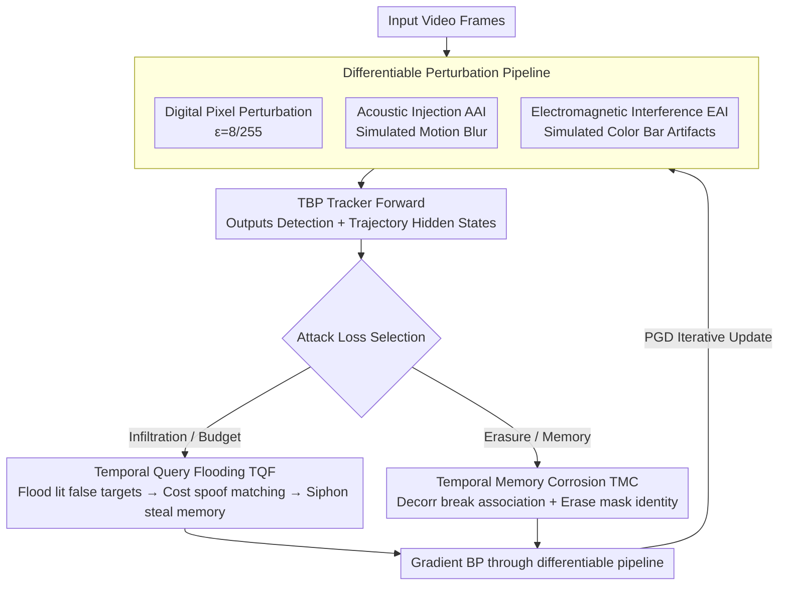

# Out of Sight, Out of Track: Adversarial Attacks on Propagation-based Multi-Object Trackers via Query State Manipulation

**Conference**: CVPR 2026  
**arXiv**: [2604.00452](https://arxiv.org/abs/2604.00452)  
**Code**: None  
**Area**: Video Understanding / Multi-Object Tracking / Adversarial Attacks  
**Keywords**: Multi-Object Tracking, Adversarial Attacks, Query Propagation, Temporal Memory Erosion, Physical Attacks

## TL;DR

This work provides the first systematic analysis of the adversarial vulnerability of Tracking-by-Query-Propagation (TBP) trackers. It proposes the FADE attack framework, utilizing Temporal Query Flooding (TQF) to exhaust fixed query budgets and Temporal Memory Corrosion (TMC) to disrupt hidden state propagation. On MOT17/MOT20, it achieves up to a 30-point HOTA decrease and over a 10x increase in ID switches against MOTR, MOTRv2, MeMOTR, Samba, and CO-MOT.

## Background & Motivation

1. **Background**: Multi-Object Tracking (MOT) has evolved from the traditional Tracking-by-Detection (TBD) paradigm to the advanced Tracking-by-Propagation (TBP) paradigm. TBP trackers (e.g., MOTR, MOTRv2, MeMOTR, Samba, CO-MOT) achieve end-to-end detection and association through the autoregressive propagation of track queries, bypassing heuristic associations like Kalman filtering.

2. **Limitations of Prior Work**: Existing MOT adversarial attacks (Daedalus, Hijacking, F&F, BankTweak) are designed for TBD architectures—targeting NMS thresholds, Kalman filter predictions, or independent re-identification feature banks—components that do not exist in end-to-end TBP trackers.

3. **Key Challenge**: TBP trackers introduce entirely new structural vulnerabilities: (1) **Fixed query budgets** create a zero-sum game—queries allocated to false trajectories necessarily reduce the capacity for legitimate ones; (2) **Recurrent hidden state propagation** creates a temporal dependency chain where state corruption propagates across frames; (3) **Built-in temporal memory** amplifies attack persistence.

4. **Goal**: To design specialized attack methods targeting the unique query budget and temporal memory mechanisms of TBP.

5. **Key Insight**: Starting from the core mechanisms of TBP (query budget allocation and memory propagation in the query updater), two complementary attacks are designed: one for "infiltration" (generating false trajectories to occupy the budget) and one for "erasure" (disrupting the memory of true trajectories).

6. **Core Idea**: Collapse tracking from within the TBP architecture by flooding false queries to exhaust the budget or by corroding temporal memory.

## Method

### Overall Architecture

The objective of FADE is straightforward: it avoids attacking visible detection boxes and instead targets the internal states of TBP trackers—the set of track queries and hidden states propagated autoregressively between frames. The pipeline follows a standard PGD optimization loop: first, a perturbation (digital pixel perturbation or physical sensor spoofing) is superimposed on the input frame and fed into the target tracker. The tracker produces detection predictions and hidden states for each trajectory as usual. FADE then applies an attack loss to these intermediate variables (budget-exhausting $\mathcal{L}_{TQF}$ or memory-destroying $\mathcal{L}_{TMC}$). Gradients backpropagate through the differentiable tracking pipeline to the perturbation parameters to iteratively update the perturbation. Essentially, the attacker leverages the TBP's own query matching and memory propagation mechanisms to turn its structural advantages into vulnerabilities.

### Key Designs

**1. Temporal Query Flooding (TQF): Exhausting Fixed Budgets with Persistent False Trajectories**

The query budget of a TBP tracker is fixed—there is an upper limit on the number of track queries sustained in a frame. Every query allocated to a false trajectory is capacity stolen from legitimate ones. Therefore, the attack focus is not just "detecting more boxes," but "creating persistent false trajectories" to occupy slots. The difficulty lies in the fact that single-frame false positives are eliminated by the next frame's matching; false trajectories must be integrated into the query propagation state. TQF uses three joint losses: $\mathcal{L}_{Flood}$ maximizes detection confidence for unmatched queries to "light up" high-confidence false targets; $\mathcal{L}_{Cost}$ ensures these adversarial queries present extremely low matching costs to true targets, deceiving bipartite matching into assigning true identities to false queries; $\mathcal{L}_{Siphon}$ aligns the hidden state of the current adversarial query with the hidden state of a legitimate trajectory from the previous frame, effectively "stealing" historical memory to ensure the false trajectory persists cross-frame. Together, these allow false trajectories to survive over time with stolen identities, effectively draining the budget.

**2. Temporal Memory Corrosion (TMC): Severing and Erasing Hidden States of True Trajectories**

While TQF is "infiltration," TMC is a complementary "erasure" strategy—it does not create new trajectories but breaks the memory chain of existing legitimate ones. TBP relies on query updaters to maintain hidden states for re-associating the same target; TMC attacks this propagation chain. $\mathcal{L}_{Decorr}$ minimizes the cosine similarity between the current hidden state $\mathcal{H}^t$ and the previous state $\mathcal{H}^{t-1}$, severing the temporal association so the updater fails to recognize the trajectory. $\mathcal{L}_{Erase}$ minimizes the L2 norm of matched query hidden states, pushing them toward zero vectors to erase the feature identity. The former causes identity drifting while the latter causes trajectory disappearance, simultaneously corroding memory at both the "association" and "representation" levels.

**3. Differentiable Physical Attack Pipeline: Integrating Sensor Spoofing into PGD Optimization**

Digital pixel perturbations are difficult to deploy in the real world, and traditional physical attacks (like patches) often target single objects. FADE models two types of sensor-level spoofing as differentiable simulators to share the PGD optimization framework: Acoustic Injection (AAI) simulates motion blur caused by resonant excitation of camera stabilizers, and Electromagnetic Interference (EAI) simulates color bar artifacts from ADC conversion interference. Since these simulators are differentiable with respect to their physical parameters $\theta_{AAI}$ and $\theta_{EAI}$, attackers can compute gradients directly. Sensor-level attacks operate on the imaging pipeline, allowing a single perturbation to contaminate all targets in a scene globally.

### Loss & Training

- TQF: $\mathcal{L}_{TQF} = \lambda_{Flood}\mathcal{L}_{Flood} + \lambda_c\mathcal{L}_{Cost} + \lambda_s\mathcal{L}_{Siphon}$
- TMC: $\mathcal{L}_{TMC} = \lambda_{Decorr}\mathcal{L}_{Decorr} + \lambda_{Erase}\mathcal{L}_{Erase}$
- Digital Attack: ε=8/255, α=1/255, 50 PGD iterations, applied per frame.
- Physical Attack: α=8/255, 100 iterations, applied over 3 consecutive frames.

## Key Experimental Results

### Main Results

MOT17 Digital Attack Results:

| Tracker | Attack | HOTA ↓ | AssA ↓ | IDSW ↑ |
|---------|------|--------|--------|--------|
| MeMOTR | Clean | 67.35 | 79.60 | 0.81 |
| MeMOTR | Daedalus | 42.41 | 51.94 | 4.09 |
| MeMOTR | FADE_TMC | 41.56 | 49.18 | **4.63** |
| MeMOTR | FADE_TQF | 41.41 | 50.03 | 4.31 |
| CO-MOT | Clean | 58.16 | 74.87 | 1.83 |
| CO-MOT | FADE_TMC | 41.73 | 55.89 | **10.94** |
| CO-MOT | FADE_TQF | 37.26 | 51.93 | 9.50 |

MOT20 High-Density Scenarios (~150 targets/frame):

| Tracker | Attack | HOTA ↓ | IDSW ↑ |
|---------|------|--------|--------|
| MeMOTR | Clean | 69.61 | 0.46 |
| MeMOTR | FADE_TMC | 37.70 | 4.90 |
| MeMOTR | FADE_TQF | 57.67 | 1.51 |
| MOTRv2 | Clean | 59.56 | 0.73 |
| MOTRv2 | FADE_TQF | 29.64 | 5.10 |

### Ablation Study

Comparison of attack strategies (MOT17 CO-MOT, Clean HOTA=58.16):

| Method | HOTA | Relative Gain | Description |
|---------|------|---------|------|
| Daedalus (Detection Evasion) | 40.01 | -18.15 | Direct TBD attack application |
| F&F (Association Perturbation) | 52.78 | -5.38 | Limited effect of TBD attack |
| FADE_TMC | 41.73 | -16.43 | Memory corrosion effective |
| FADE_TQF | **37.26** | **-20.90** | Query flooding is strongest |

### Key Findings

- **TQF is most effective against models with tight query budgets**: HOTA on CO-MOT dropped from 58.16 to 37.26 (-20.90), as its label assignment strategy is more susceptible to flooding.
- **TMC excels at generating identity switches**: IDSW on CO-MOT surged from 1.83 to 10.94 (~6x increase); direct memory corrosion leads to frequent re-identification.
- **High-density scenes amplify attack effects**: On MOT20, MeMOTR's HOTA dropped by 31.91 under TMC, exceeding the drop seen in MOT17.
- **Existing TBD attacks partially fail on TBP**: Hijacking and F&F had negligible impact on MOTRv2 (HOTA drops of ~1-4 points), confirming the need for TBP-specific attacks.

## Highlights & Insights

- **Identification of three TBP vulnerabilities**: Zero-sum query budget games, recurrent state propagation, and persistence amplification of temporal memory. These findings guide future secure TBP architecture design.
- **The "Identity Theft" design in TQF is ingenious**: Instead of simply creating false targets, it aligns false trajectories with true ones in the hidden state space to steal identities, exploiting TBP's own propagation mechanisms.
- **Differentiable Physical Attack Pipeline**: Modeling acoustic and electromagnetic sensor spoofing as differentiable functions within PGD optimization provides a general paradigm for converting digital attacks into physical ones.

## Limitations & Future Work

- Physical attacks remain in simulation; validation on real sensors is required.
- Optimization requires white-box access to tracker weights; transferability in black-box scenarios is unexplored.
- Defensive methods against these attacks were not proposed.
- For MOTRv2, which uses external detector enhancement, TQF was less effective, suggesting the need for improved robustness against architectural variants.

## Related Work & Insights

- **vs Daedalus/Hijacking/F&F**: These are TBD-specific attacks relying on NMS/Kalman/Re-ID banks, which are ineffective against TBP. FADE directly attacks query propagation and temporal memory.
- **vs BankTweak**: BankTweak assumes direct access to the inference pipeline to inject noise into Re-ID features, which is impractical. FADE attacks via image-level perturbations.
- This work opens a new direction for TBP tracker robustness, potentially inspiring defenses like dynamic query budget adjustment and hidden state validation.

## Rating

- Novelty: ⭐⭐⭐⭐⭐ First dedicated attack for TBP trackers; TQF/TMC are cleverly designed.
- Experimental Thoroughness: ⭐⭐⭐⭐⭐ 5 SOTA trackers × 2 datasets × digital/physical attacks; comprehensive comparison.
- Writing Quality: ⭐⭐⭐⭐ Clear structure, though notation density requires careful reading.
- Value: ⭐⭐⭐⭐ Provides critical warnings regarding TBP tracker vulnerabilities in safety-critical applications.

<!-- RELATED:START -->

## Related Papers

- [\[CVPR 2026\] Hypergraph-State Collaborative Reasoning for Multi-Object Tracking](hypergraph-state_collaborative_reasoning_for_multi-object_tracking.md)
- [\[AAAI 2026\] Rethinking Progression of Memory State in Robotic Manipulation: An Object-Centric Perspective](../../AAAI2026/video_understanding/rethinking_progression_of_memory_state_in_robotic_manipulation_an_object-centric.md)
- [\[CVPR 2026\] ProgTrack: A Multi-Object Tracking Algorithm with Progressive Matching Strategy](progtrack_a_multi-object_tracking_algorithm_with_progressive_matching_strategy.md)
- [\[CVPR 2026\] Occlusion-Aware SORT: Observing Occlusion for Robust Multi-Object Tracking](occlusion-aware_sort_observing_occlusion_for_robust_multi-object_tracking.md)
- [\[CVPR 2026\] Dual-level Adaptation for Multi-Object Tracking: Building Test-Time Calibration from Experience and Intuition](tcei_test_time_calibration_experience_intuition_mot.md)

<!-- RELATED:END -->
