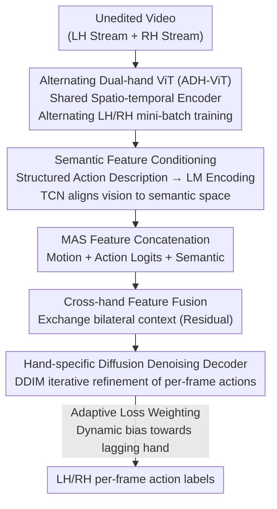

# Polyphony: Diffusion-based Dual-Hand Action Segmentation with Alternating Vision Transformer and Semantic Conditioning

**Conference**: CVPR 2026  
**arXiv**: [2605.31115](https://arxiv.org/abs/2605.31115)  
**Code**: https://github.com/x-labs-xyz/Polyphony-Dual-hand-Action-Segmentation (Available)  
**Area**: Video Understanding / Temporal Action Segmentation  
**Keywords**: Bimanual Action Segmentation, Temporal Action Segmentation, Diffusion Models, Alternating Training, Semantic Conditioning

## TL;DR
Addressing the bimanual action segmentation task of simultaneously labeling per-frame actions for left and right hands in unedited videos, this paper proposes Polyphony—a three-stage method. It utilizes a shared ViT with alternating training to resolve dominant hand gradient monopoly, structured semantic conditioning to eliminate fine-grained action ambiguity, and a diffusion segmenter with cross-hand feature fusion to model bimanual coordination. It achieves up to 16.8 points improvement on HA-ViD/ATTACH datasets and outperforms SOTA on the single-stream Breakfast dataset with a $12\times$ smaller backbone.

## Background & Motivation

**Background**: Temporal Action Segmentation (TAS) aims to provide per-frame action labels for long unedited videos, serving as the foundation for understanding procedural activities (assembly, cooking, surgery). Dominant approaches range from temporal convolutions in MS-TCN to self-attention in ASFormer, and recently, modeling segmentation as conditional denoising generation in DiffAct. However, nearly all these methods model human activities as a **single action stream**.

**Limitations of Prior Work**: Real-world bimanual activities involve two distinct action streams for each hand, constantly switching between "coordinated, cooperative, or independent" modes, which is impossible to represent via single-stream paradigms. Existing bimanual methods like DuHa or DuCAS target assembly scenarios but **rely heavily on ground-truth object detection bounding boxes** as input, limiting their generalizability.

**Key Challenge**: Integrating both hands into a unified model encounters four unique difficulties: ① **Complex inter-hand dependencies** (variable temporal relationships); ② **Visual asymmetry** (the same action has different appearance/motion patterns for left vs. right hands); ③ **Representation conflict** (the dominant hand monopolizes gradient updates in unified models, leading to poorly learned features for the non-dominant hand); ④ **Semantic ambiguity** (purely visual features struggle to distinguish between visually similar but semantically distinct fine-grained actions like "screw nut onto bolt" and "screw nut onto shaft").

**Goal**: To predict per-frame actions for both hands simultaneously using a **unified model and a shared visual backbone** without relying on object annotations, while systematically addressing the aforementioned four challenges.

**Key Insight**: The authors employ the metaphor of "Polyphony"—multiple independent melodies playing harmoniously together—corresponding to the need for hands to be understood both individually and collaboratively. The shared encoder represents the global perception of bimanual activity, while diffusion-based iterative denoising mimics the human progressive "prediction-correction" process of action understanding.

**Core Idea**: Decompose "preventing dominant hand gradient monopoly" (alternating training), "supplementing semantic discriminability" (semantic conditioning), and "modeling inter-hand coordination" (diffusion segmentation with cross-hand fusion) into three independently optimizable stages to form an end-to-end bimanual segmentation pipeline.

## Method

### Overall Architecture
Polyphony decomposes bimanual action segmentation into **three sequentially trained stages**: **Stage 1 (Bimanual Feature Extraction)** uses a shared spatio-temporal ViT (ADH-ViT) with two hand-specific classification heads to extract features from short video clips; the key lies in **alternating training** of LH/RH mini-batches to balance gradients. **Stage 2 (Semantic Feature Conditioning)** parses each action category into a structured description of "verb-manipulated object-target object-tool," encodes it into a semantic vector using a language model, aligns visual features to the semantic space via TCN, and concatenates "motion features + action logits + semantic features" into MAS features. **Stage 3 (Diffusion Bimanual Segmentation)** processes MAS features with a shared encoder, exchanges information via cross-hand feature fusion, and iteratively refines per-frame actions using two hand-specific denoising decoders in a diffusion manner, with adaptive loss weighting during training to dynamically balance both hands. The modular design allows ADH-ViT to be used independently as an action recognition model, and the pipeline can degrade to single-stream scenarios.

### Key Designs

**1. Alternating Bimanual ViT (ADH-ViT): Resolving Gradient Monopoly via "Taking Turns"**

To address representation conflict and visual asymmetry: if LH and RH data are mixed in a single batch for joint training, gradients are dominated by the more active dominant hand (usually the right hand), leaving the non-dominant hand (left hand) features under-trained. The authors share a **spatio-temporal encoder** $\mathcal{E}_\phi$ (VideoMAE V2 ViT-Base with tubelet embedding and sinusoidal positional encoding) but equip it with two independent linear classification heads $\hat{y}^h=\text{softmax}(\mathbf{W}_h e^h + b_h)$. During training, the task **switches between hands every $\Delta$ steps**: at step $j$, the active task $\tau(j)=\text{LH if }\lfloor j/\Delta\rfloor\bmod 2=0\text{, else RH}$. Only mini-batches from the active hand are sampled, and cross-entropy loss $\mathcal{L}^{(j)}=\frac{1}{B}\sum_i \mathcal{L}_{CE}(\hat{y}_i^{\tau(j)}, y_i^{\tau(j)})$ is computed for the active head, though gradients update both the shared backbone and the active head. This "alternately" balances gradient contributions, preventing one hand from suppressing the other. Ablations confirm that the weaker left hand benefits most from alternating training (Recognition +2.5%, Segmentation +3.9%, far exceeding the RH gains of +1.0%/+0.3%). Data sampling also complements "segmental sampling" with "random clip sampling" to enhance temporal diversity.

**2. Structured Semantic Feature Conditioning: Boosting Discriminability with "Verb-Object-Tool" Decomposition**

To address semantic ambiguity: purely visual features often confuse visually similar but semantically different fine-grained actions. The authors parse each category $c$ into a structured description $D_c=$ "Action verb is $av_c$; manipulated object is $mo_c$; target object is $to_c$; tool is $tl_c$." (e.g., "screw nut onto bolt" → verb: screw, manipulated: nut, target: bolt, tool: null). A pre-trained language model (MiniLM-L6) encodes this into a semantic vector $e_c=\text{LM}(D_c)$. A multi-layer TCN (with exponential dilation $d_m=2^m$) takes shared backbone features as input to model temporal context, projects the output $e_t^{h,\text{sem}}$ into the semantic space, and pulls it toward the ground-truth semantic vector using an adaptive alignment loss. **Crucially, these descriptions are used as supervision during training only** and are not required during inference, avoiding label leakage. Ablations show structured descriptions significantly outperform naive ones, yielding a 3.6 point average gain on visually similar actions. Counter-intuitively, the smaller MiniLM-L6 (384-dim) performed better than MPNet-base (768-dim), suggesting a necessary balance between semantic expressiveness and compatibility with visual features.

**3. Diffusion Segmentation with Cross-hand Fusion + Adaptive Loss Weighting: Coordination and Balancing**

To address complex inter-hand dependencies: Stage 3 uses a shared encoder $\mathcal{E}_{seg}$ (mixed convolution-attention layers) to process MAS features, generating initial logits $Z^h$ and hierarchical features $H^h$. **Cross-hand feature fusion** allows hands to exchange information after hand-specific encoding: $H^{LH}=\mathcal{F}^{LH}([H^{LH};H^{RH}])+H^{LH}$ (symmetrically for RH). $\mathcal{F}^h$ consists of two-layer $1\times1$ convolutions that project the concatenated $2D'$ dimensions back to $D'$. Residual connections preserve hand-specific information while selectively absorbing contralateral context; **independent** fusion networks for each hand allow for asymmetric information flow. The segmentation follows the DiffAct diffusion paradigm: the forward process adds Gaussian noise to the ground-truth action distribution (normalized to $[-s_{de}, s_{de}]$), and hand-specific denoising decoders $\mathcal{De}^h(\tilde{P}_k^h, k, \tilde{H}^h)$ predict the clean action $\hat{P}_0^h$ conditioned on the diffusion timestep and fused features. Inference uses 5-step deterministic DDIM. **Adaptive Loss Weighting** addresses asynchronous training progress: a sliding window of validation accuracy $\bar{\mathcal{W}}^h$ over recent $w$ epochs is maintained. If a hand lags (performance ratio below $\Delta_{gap}$), a boost factor $\beta^h=\min(\beta_{max}, \max(\beta_{min}, \bar{\mathcal{W}}^{\text{contralateral}}/\bar{\mathcal{W}}^h))$ is applied; otherwise, $\beta^h=1.0$. The total loss $\mathcal{L}_{total}=\sum_h \beta^h(\lambda_{enc}^h \mathcal{L}_{enc}^h + \lambda_{dec}^h \mathcal{L}_{dec}^h)$ automatically weights the lagging hand.

### Loss & Training
Sequential training across three stages. Stage 1 trains ADH-ViT for 50 epochs ($\Delta=50$ steps, AdamW + Cosine Annealing, lr 1e-3). Stage 2 trains TCN for 100 epochs (lr 3e-4) with alignment loss $\mathcal{L}_{align}=\alpha\mathcal{L}_{cosine}+(1-\alpha)\mathcal{L}_{MSE}$ ($\alpha=0.7$). Stage 3 trains for 1000 epochs (Adam, lr 1e-3) with diffusion steps $K=1000$ and 5-step DDIM inference. Encoder loss $\mathcal{L}_{enc}^h=\mathcal{L}_{CE}+\lambda_{sm}\mathcal{L}_{smooth}$ and decoder loss includes boundary BCE loss $\lambda_{bd}\mathcal{L}_{boundary}$. Smoothing $\mathcal{L}_{smooth}(p_t)=\text{MSE}(\log p_{t+1},\log p_t)$ enforces temporal consistency. Hyperparameters: $\lambda_{sm}=0.05$, $\lambda_{bd}=0.2$, window $w=5$, $\Delta_{gap}=0.95$, $[\beta_{min},\beta_{max}]=[1,2]$. Cross-entropy uses hand-specific class weights.

## Key Experimental Results

### Main Results
Testing on bimanual datasets HA-ViD (75 classes/hand) and ATTACH (24 classes/hand), and single-stream Breakfast (48 classes).

| Dataset | Metric (Hand) | Ours (MAS) | Prev. SOTA | Gain |
|---------|---------------|------------|------------|------|
| HA-ViD  | LH Acc        | 57.1       | 45.1 (FACT) | +12.0 |
| HA-ViD  | RH Acc        | 60.6       | 43.8 (FACT) | +16.8 |
| ATTACH  | LH Acc        | 52.8       | 47.5 (DiffAct) | +5.3  |
| ATTACH  | RH Acc        | 47.3       | 42.5 (DiffAct) | +4.8  |
| Breakfast | Acc         | 82.5       | 82.2 (EAST) | +0.3* |

\* On Breakfast, EAST uses ViT-Giant (1B+ parameters, 1408-dim) while Ours uses only ViT-Base (86M parameters, 768-dim) to surpass it, indicating gains from architectural design rather than model scaling. Notably, the unified model with a shared backbone outperforms baselines that train independent models for each hand.

### Ablation Study
Ablation on HA-ViD (average over three views) for incremental components (MF=Motion, AF=Action Logits, SF=Semantic, FF=Cross-hand Fusion, AW=Adaptive Weighting):

| Configuration | LH Acc | RH Acc | Gap | Note |
|---------------|--------|--------|-----|------|
| MF            | 56.0   | 58.0   | 2.0 | Shared ViT Baseline |
| MF+AF         | 55.8   | 58.3   | 2.5 | Added Action Logits, improves Edit score |
| MF+AF+SF (Full)| 57.1   | 60.6   | 3.5 | Added Semantic, RH gain is higher (+2.3) |
| Full w/o FF   | 55.5   | 59.5   | 4.0 | No fusion, gap widens, LH drops more |
| Full w/o FF&AW| 55.3   | 59.6   | 4.3 | No weighting, gap widens further |

### Key Findings
- **Semantic features benefit the dominant hand (RH) more** (RH Acc +2.3 vs LH marginal): RH performs more diverse fine-grained operations, benefiting more from semantic grounding.
- **Cross-hand Fusion + Adaptive Weighting act as "Balancers"**: Removing them increased the accuracy gap between hands from 3.5% to 4.3%, with the non-dominant LH always suffering more.
- **Alternating training solves gradient monopoly**: Joint training always favors RH; alternating training not only improves overall performance but **reverses** this imbalance, with the LH gaining the most (Recognition +2.5%, Segmentation +3.9%).
- **Random clip sampling is crucial**: ADH-ViT (both) outperforms (seg) sampling by 13.1 and 15.2 points for LH and RH respectively in Top-1.
- **Smaller LMs are better**: MiniLM-L6 (384-dim) outperformed MPNet-base (768-dim), likely because high-dimensional semantics dilute the visual contribution.

## Highlights & Insights
- **Alternating training is a low-cost, effective trick**: It balances gradient contributions in multi-task scenarios where a strong task suppresses a weak one without adding parameters. This is applicable to any shared backbone serving asymmetric sub-tasks.
- **Semantic features: Train-time supervision, inference-time removal**: Using structured descriptions as alignment signals rather than inputs provides discriminative power without semantic leakage.
- **Adaptive loss weighting via validation feedback**: Using the ratio of recent validation performance as a dynamic boost factor is more aligned with training dynamics than fixed weights.
- **Independent fusion networks for each hand**: Mirroring the bimanual nature by allowing asymmetric information flow (LH absorbing RH context $\neq$ RH absorbing LH).

## Limitations & Future Work
- **Non-end-to-end, three-stage pipeline**: Sequential training (50/100/1000 epochs) is heavy and prone to error accumulation across stages.
- **High training cost of diffusion**: 1000 diffusion steps over 1000 epochs is computationally expensive, though 5-step DDIM mitigates inference cost.
- **Dependency on structured label parsing**: Semantic conditioning assumes labels can be decomposed into "verb-object-tool," which may not hold for all activity types.
- **Marginal gains on single-stream Breakfast**: Accuracy improvement is small (82.5 vs 82.2); the core value remains in bimanual coordination.

## Related Work & Insights
- **vs. DiffAct**: Polyphony extends the diffusion TAS paradigm to bimanual settings with cross-hand fusion and adaptive weighting, outperforming DiffAct by ~5 points on ATTACH.
- **vs. FACT**: FACT uses action-level tokens from frame labels, but the semantics are coarse. Polyphony uses structured combinations, leading to a 16.8 point gain on HA-ViD RH.
- **vs. DuHa / DuCAS**: Unlike these methods, Polyphony does not require ground-truth object bounding boxes, significantly improving generalizability.
- **vs. EAST**: Polyphony achieves superior results on Breakfast using ViT-Base compared to EAST's ViT-Giant, demonstrating the efficiency of semantic conditioning.

## Rating
- Novelty: ⭐⭐⭐⭐ Combines alternating training, structured semantic conditioning, and cross-hand diffusion fusion into a unified, annotation-efficient bimanual framework.
- Experimental Thoroughness: ⭐⭐⭐⭐⭐ Comprehensive evaluation across three datasets, progressive ablations, and detailed analysis of ভারসাম্য indicators.
- Writing Quality: ⭐⭐⭐⭐ Clear "Polyphony" metaphor and logical mapping between challenges and designs.
- Value: ⭐⭐⭐⭐ Strong practical value for embodied AI and operational scenarios like assembly or surgery.

<!-- RELATED:START -->

## Related Papers

- [\[CVPR 2026\] MotionEnhancer: Leveraging Video Diffusion for Motion-Enhanced Vision-Language Models](motionenhancer_leveraging_video_diffusion_for_motion-enhanced_vision-language_mo.md)
- [\[CVPR 2026\] Hierarchical Action Learning for Weakly-Supervised Action Segmentation](hierarchical_action_learning_for_weakly-supervised_action_segmentation.md)
- [\[CVPR 2026\] Beyond Static Frames: Temporal Aggregate-and-Restore Vision Transformer for Human Pose Estimation](beyond_static_frames_temporal_aggregate-and-restore_vision_transformer_for_human.md)
- [\[CVPR 2026\] Bootstrapping Video Semantic Segmentation Model via Distillation-assisted Test-Time Adaptation](bootstrapping_video_semantic_segmentation_model_via_distillation-assisted_test-t.md)
- [\[CVPR 2026\] Spectral Scalpel: Amplifying Adjacent Action Discrepancy via Frequency-Selective Filtering for Skeleton-Based Action Segmentation](spectral_scalpel_amplifying_adjacent_action_discrepancy_via_frequency-selective_.md)

<!-- RELATED:END -->
