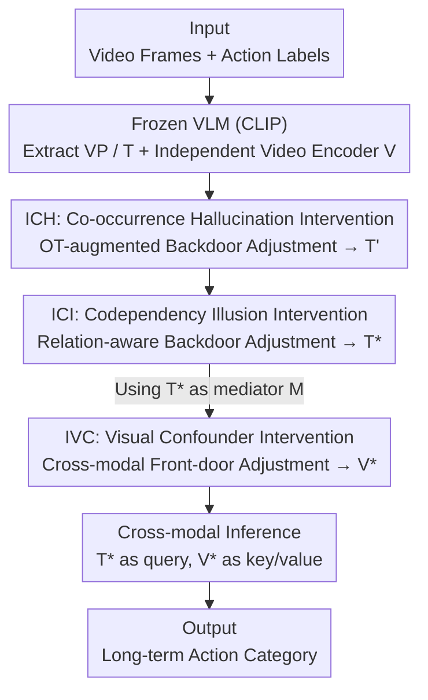

# Progressive Cross-Modal Causal Intervention for Long-Term Action Recognition

**Conference**: CVPR 2026  
**Paper**: [CVF Open Access](https://openaccess.thecvf.com/content/CVPR2026/html/Xu_Progressive_Cross-Modal_Causal_Intervention_for_Long-Term_Action_Recognition_CVPR_2026_paper.html)  
**Code**: https://github.com/xushaowu/PCMCI  
**Area**: Video Understanding  
**Keywords**: Long-term Action Recognition, Causal Intervention, Vision-Language Models, Optimal Transport, Front-door/Back-door Adjustment

## TL;DR
PCMCI decomposes three types of "spurious correlations" relied upon by Vision-Language Models (VLMs) in long-term action recognition—co-occurrence hallucination, codependency illusion, and visual confounders—into a three-stage progressive causal intervention pipeline (OT-augmented backdoor adjustment → relation-aware backdoor adjustment → cross-modal front-door adjustment). By deconfounding step-by-step to obtain robust text/video representations, it significantly improves mAP on Breakfast, COIN, and Charades (e.g., Breakfast mAP from 76.32 to 90.51).

## Background & Motivation
**Background**: Long-term actions consist of a sequence of atomic actions, often lasting several minutes. Current mainstream approaches leverage VLMs like CLIP, using action label text to supervise video features—labels are concise and semantically complete, theoretically helping the model resist visual confounders such as background or clothing.

**Limitations of Prior Work**: The authors point out that VLMs learn statistical correlations rather than causal mechanisms, exposing three risks. First, **co-occurrence hallucination**: objects frequently co-occurring but causally irrelevant to the action (e.g., a chef's apron) are incorrectly bound to text-video matching. A sharp counter-example in the paper shows that masking the causal region (the stove) while leaving the apron increases the matching score for "frying eggs," indicating reliance on confounders. Second, **codependency illusion**: existing VLM methods process label texts in isolation and fail to model relationships between atomic actions—shared actions like "cracking an egg" or "spreading butter" are weakly discriminative in isolation, whereas their temporal order (e.g., in "fried eggs" vs. "pancakes") is the key cue. Third, **visual confounder**: background, clothing, and personal habits persist throughout long videos. When text embeddings are contaminated by the first two errors, their supervisory power decreases, making the model more susceptible to visual bias.

**Key Challenge**: These three issues correspond to three different **backdoor paths** in a Structural Causal Model (SCM): co-occurrence hallucination $H$ contaminates both text $T$ and video $V$, codependency illusion $I$ contaminates $T$, and visual confounder $C$ contaminates $V$. Existing causal methods either only handle cross-modal confusion while ignoring text-side codependency, or vice-versa; no framework cuts all three paths simultaneously.

**Core Idea**: A **progressive** causal intervention pipeline is proposed to cut the three backdoors in the order of "cross-modal first, then text-side, finally visual-side." The deconfounded text embeddings from the previous stages satisfy the d-separation condition required for front-door adjustment in the subsequent stage, allowing unobservable confounders to be proxied and eliminated step-by-step.

## Method

### Overall Architecture
PCMCI establishes an SCM for VLM-based LTAR: ideally $Y \leftarrow T \rightarrow V \rightarrow Y$ (deconfounded text represents the essence of the action and determines the label), but actual encoders introduce backdoor paths via $H$, $I$, and $C$. The method evolves the confounded SCM into a clean, deconfounded SCM through three stages of intervention.

Inputs consist of video frames and a set of action labels. CLIP serves as a frozen VLM to extract visual prompts $VP$ and text features $T$, while a VLM-independent video encoder (TimeSformer) extracts $V$ directly from raw video. These pass through three serial intervention stages: ICH refines $T$ into $T'$, ICI refines $T'$ into deconfounded text $T^*$, and IVC uses $T^*$ as a mediator to refine $V$ into deconfounded video $V^*$. Finally, a cross-modal reasoning module uses $T^*$ as the query and $V^*$ as the key/value for attention to output the action class. The order is non-trivial: front-door adjustment (IVC) depends on the mediator being d-separated from the visual confounder $C$, requiring the text to be cleaned by ICH and ICI first.

### Key Designs

**1. ICH — OT-augmented Backdoor Adjustment: Cutting the cross-modal co-occurrence hallucination backdoor**

The co-occurrence hallucination $H$ is a cross-modal confounder inherited from pre-trained VLMs, opening backdoors on both $H\rightarrow V$ and $H\rightarrow T$. ICH applies a two-pronged approach: it uses a **VLM-independent video encoder** to extract $V$, physically cutting $H\rightarrow V$; and it applies backdoor adjustment to $T$ to cut $H\rightarrow T$. The intervention distribution is $P(Y\mid V, do(T)) \approx \sum_{h\in H} P(Y\mid V, do(T), h)P(h)$. The challenge is that $H$ is unobservable. The authors use **Optimal Transport (OT)** as a proxy: they calculate the cross-modal similarity matrix $S=\langle T, VP\rangle$ between visual prompts $VP$ and text $T$, then solve an OT plan with entropic regularization:

$$P^* = \arg\min_{P\in U}\ \langle P, -\log S\rangle + \lambda H(P).$$

By minimizing transport cost, "overly aligned" cross-modal features are exposed as the proxy for co-occurrence hallucination $H = S\,VP$. Finally, a learnable weight $W_H$ encodes the influence of $H$, and Normalized Weighted Geometric Mean (NWGM) approximates the deconfounded prediction: $P(Y\mid V, T')$, yielding refined text $T'$. OT is more reliable than simple thresholding as it matches distributions to find "disproportionately aligned" features.

**2. ICI — Relation-aware Backdoor Adjustment: Modeling action relationships to eliminate codependency illusion**

The codependency illusion $I$ arises because VLMs process labels in isolation, failing to encode relationships between atomic actions ($T\leftarrow I\rightarrow Y$). ICI follows ICH, refining $T'$ into $T^*$ via $P(Y\mid V, do(T)) \approx \sum_{i\in I} P(Y\mid V, do(T'), i)P(i)$. The core is a **relation-aware transformer** $R$ that explicitly models multi-group codependency using $K$ relationship bases:

$$R(T') = \Big(\bigodot_{k=1}^{K} G_k(T';\Theta_k)\Big) W_R,$$

where $G_k$ captures an independent latent relationship through pairwise interactions of text features. These $K$ bases serve as the proxy for $I$. Using NWGM, $P(Y\mid V, do(T)) \approx P(Y\mid V, T^*)$ is obtained. This explicitly encodes the sequence and pairing of actions like "cracking an egg" and "spreading butter" into $T^*$. $K=8$ relationship bases were found to be optimal.

**3. IVC — Cross-modal Front-door Adjustment: Using cleaned text as a mediator to isolate visual confounders**

Visual confounders $C$ (clothing, background, habits) are coarse-grained and difficult to locate in visual representations, making backdoor adjustments ineffective. IVC employs **front-door adjustment** using a mediator $M$ that is d-separated from $C$ but has a direct causal effect on $Y$. The deconfounded text $T^*$ satisfies this—it is free from $H$ and $I$ and represents the semantic essence of the action. Setting $M=T^*$, the front-door intervention distribution is:

$$P(Y\mid do(V), T) = \sum_{m\in T^*}\sum_{v'\in V'} P(Y\mid m, v', T)\,P(m\mid V)\,P(v').$$

The visual-enhanced feature $V'$ is generated by a conditional transformation operator $\mathcal{T}(V, M)$ using a hierarchical relation encoder $\mathcal{F}$ (isomorphic to $R(\cdot)$ in ICI) to align visual relationship structures with the text side. This makes $V'$ conditionally independent of $C$. NWGM approximation yields the deconfounded video embedding $V^*$.

### Loss & Training
After obtaining $V^*$ and $T^*$, the cross-modal inference operator $\mathcal{I}$ applies attention with $T^*$ as the query and $V^*$ as the key/value. Training uses a cross-entropy inference loss:

$$\mathcal{L} = -\sum_{y\in Y}\mathbb{1}_{\{Y=y\}}\log\big(\mathcal{I}(V^*, T^*;\Theta_\mathcal{I})_y\big).$$

The VLM (CLIP) backbone is frozen; only the independent video encoder and the three intervention modules are trained using Adam (lr=1e-5) with cosine decay for 100 epochs on an RTX 4090D.

## Key Experimental Results

### Main Results
Comparison with SOTA on Breakfast and COIN (Acc / mAP in %) and inference costs:

| Dataset | Method | Acc | mAP | FLOPs (G) | Params (M) |
| :--- | :--- | :---: | :---: | :---: | :---: |
| Breakfast | HierarQ (CVPR'25) | 97.18 | 76.32 | 37877 | 7881 |
| Breakfast | MA-LMM (CVPR'24) | 93.00 | 71.84 | 29063 | 7526 |
| Breakfast | **PCMCI (Ours)** | **97.46** | **90.51** | **650** | **211** |
| COIN | HierarQ (CVPR'25) | **94.78** | 70.10 | 37877 | 7881 |
| COIN | **PCMCI (Ours)** | 94.53 | **86.54** | **650** | **211** |

The mAP improvement is significant: +14.2 on Breakfast and +16.4 on COIN. Without calling an LLM for generation, parameters (211M) and FLOPs (650G) are one to two orders of magnitude smaller than MA-LMM/HierarQ.

### Ablation Study
Ablation of intervention stages (Breakfast / COIN):

| Config | ICH | ICI | IVC | Breakfast Acc | Breakfast mAP | COIN Acc | COIN mAP |
| :--- | :---: | :---: | :---: | :---: | :---: | :---: | :---: |
| Variant 1 | ✗ | ✗ | ✗ | 91.55 | 80.23 | 87.77 | 76.93 |
| Variant 2 | ✓ | ✗ | ✗ | 94.93 | 84.17 | 92.56 | 80.38 |
| Variant 4 | ✓ | ✓ | ✗ | 95.77 | 85.59 | 93.60 | 82.25 |
| Variant 5 | ✗ | ✗ | ✓ | 93.24 | 88.31 | 90.38 | 84.13 |
| **PCMCI** | ✓ | ✓ | ✓ | **97.46** | **90.51** | **94.53** | **86.54** |

Ablation of intervention order (Breakfast):

| Order | Acc | mAP |
| :--- | :---: | :---: |
| IVC→ICH→ICI | 92.96 | 81.76 |
| ICI→ICH→IVC | 95.49 | 87.43 |
| **ICH→ICI→IVC (PCMCI)** | **97.46** | **90.51** |

### Key Findings
- **ICH is more critical than ICI**: Variant 2 consistently outperforms Variant 3, indicating cross-modal co-occurrence hallucination has a larger impact on accuracy than text codependency modeling.
- **Acc vs. mAP roles**: Refining text improves overall understanding (Acc), whereas IVC mitigates spatio-temporal confusion (mAP). Only using all three stages achieves combined optimality.
- **Order is mandatory**: Placing IVC first significantly degrades performance because front-door adjustment strictly requires a mediator that is d-separated from $C$, which is only possible after text cleaning by ICH and ICI.
- **Mediator choice**: Using deconfounded text as a mediator $T^*$ is superior to using visual memory banks or multi-scale attention. PCMCI's structural alignment between visual and text relations further boosts performance.

## Highlights & Insights
- **Mapping errors to SCM backdoors**: The authors don't just state "VLMs have bias" but precisely map co-occurrence hallucination, codependency illusion, and visual confounders to three distinct SCM backdoor paths. This provides a theoretical basis for intervention choice and order.
- **Proxying unobservables with OT**: A major difficulty in backdoor adjustment is the unobservability of confounders. Identifying "overly aligned features" via OT as a proxy for hallucination is a transferable trick for other cross-modal de-biasing tasks.
- **Progressive order as constraint satisfaction**: The order is not just empirical; earlier stages facilitate the legal mediator required for the final front-door adjustment.
- **Lightweight yet efficient**: Outperforming LLM-based methods (MA-LMM/HierarQ) with 35x fewer parameters suggests the bottleneck in LTAR is "spurious correlation removal" rather than model scaling.

## Limitations & Future Work
- SCMs cannot exhaustive list all potential confounders; the method only targets primary sources.
- Front-door adjustment effectiveness depends on $T^*$ quality; failure in early stages cascades to IVC.
- Relationship bases $G_k$ and aggregation $\bigodot$ are somewhat abstractly described; implementation details require code verification.
- Generalization to open-world or multi-person interaction scenarios remains to be validated.

## Related Work & Insights
- **vs. Explicit Interaction (BIKE / Text4Vis)**: These use text supervision to enhance visual features. They mitigate visual confounders but fail to model action dynamics or handle co-occurrence hallucinations. PCMCI's causal intervention leads by substantial margins in mAP.
- **vs. Implicit Interaction (MA-LMM / HierarQ)**: These feed visual tokens to LLMs for shared-space modeling. While they address codependency, they are sensitive to visual confounders and are computationally expensive.
- **vs. Video Causal Methods (CMCIR, etc.)**: Existing causal methods usually overlook one side of the coin (text codependency or cross-modal confusion). PCMCI's multi-stage intervention covers more ground.

## Rating
- Novelty: ⭐⭐⭐⭐⭐ Precise SCM mapping and progressive intervention pipeline; OT proxy idea is valuable.
- Experimental Thoroughness: ⭐⭐⭐⭐⭐ Three datasets, plus ablation of stages, order, mediators, and visualization.
- Writing Quality: ⭐⭐⭐⭐ Clear causal derivation-module mapping, though some implementation details are abstract.
- Value: ⭐⭐⭐⭐⭐ Significant mAP gains with a lightweight model; high impact on the de-biasing research direction.

<!-- RELATED:START -->

## Related Papers

- [\[CVPR 2026\] SVAgent: Storyline-Guided Long Video Understanding via Cross-Modal Multi-Agent Collaboration](svagent_storyline_guided_long_video_understanding_via_cross_modal_multi_agent_collaboration.md)
- [\[CVPR 2026\] Fine-VAD: Towards Fine-Grained Video Anomaly Detection via Progressive Cross-Granularity Learning](fine-vad_towards_fine-grained_video_anomaly_detection_via_progressive_cross-gran.md)
- [\[CVPR 2025\] Cross-modal Causal Relation Alignment for Video Question Grounding](../../CVPR2025/video_understanding/cross-modal_causal_relation_alignment_for_video_question_grounding.md)
- [\[CVPR 2026\] Streaming Video Crime Anticipation with Spatio-Temporal Causal Reasoning](streaming_video_crime_anticipation_with_spatio-temporal_causal_reasoning.md)
- [\[CVPR 2026\] Understanding Temporal Logic Consistency in Video-Language Models through Cross-Modal Attention Discriminability](understanding_temporal_logic_consistency_in_video-language_models_through_cross-.md)

<!-- RELATED:END -->
