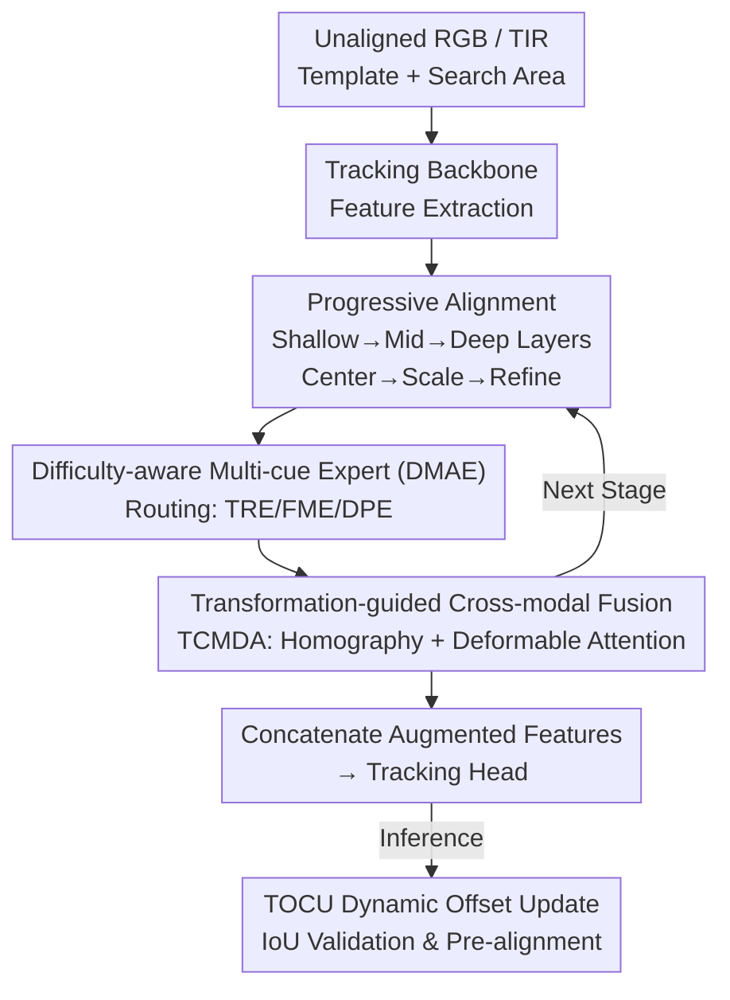

# Progressive Multi-cue Alignment for Unaligned RGBT Tracking

**Conference**: CVPR 2026  
**Paper**: [CVF Open Access](https://openaccess.thecvf.com/content/CVPR2026/html/Jin_Progressive_Multi-cue_Alignment_for_Unaligned_RGBT_Tracking_CVPR_2026_paper.html)  
**Code**: https://github.com/NOP1224/Unaligned_RGBT_Tracking  
**Area**: Video Understanding  
**Keywords**: RGBT Tracking, Cross-modal Alignment, Progressive Estimation, Difficulty-aware Expert, Deformable Attention

## TL;DR
PMATrack decomposes the "one-time regression" of cross-modal alignment parameters in unaligned RGBT tracking into a three-stage progressive estimation: "center offset → scale transformation → global refinement." By employing difficulty-aware routing to select the most cost-effective expert from three alignment cues at each stage, it sets new SOTA records on benchmarks like the newly created MUART244 with reduced computational overhead.

## Background & Motivation
**Background**: RGBT tracking relies on complementary information from RGB and Thermal Infrared (TIR) for robust object localization. However, mainstream datasets (e.g., LasHeR) undergo expensive manual alignment, leading existing trackers to assume "perfect pixel-level cross-modal alignment."

**Limitations of Prior Work**: In real-world multi-sensor systems, significant spatial misalignment exists due to installation offsets and field-of-view differences. Furthermore, cross-modal correspondence changes dynamically with target or camera motion, making fixed transformation matrices ineffective. Existing unaligned tracking methods (e.g., NAT using iterative homography or Zhang et al. using deformable convolutions) suffer from two main issues: first, **all alignment parameters (translation, scale) are regressed simultaneously**, failing to adapt to fluctuating misalignment difficulty; second, **static alignment architectures often utilize heavy models** to cover difficult scenes, wasting computation on simple frames and hindering real-time performance.

**Key Challenge**: Regressing strongly coupled alignment parameters within a single homography matrix is both difficult to optimize and hard to scale according to scene difficulty—accuracy and efficiency remain locked together.

**Goal**: (1) Decouple cross-modal alignment parameters into step-by-step estimable items; (2) Enable the model to dynamically allocate computation based on the misalignment difficulty of the current frame.

**Key Insight**: Ours draws inspiration from the human cross-modal perception mechanism of "coarse localization → scale adjustment → detail refinement"—shallow geometric cues handle global displacement, mid-level geometric+semantic cues handle scale, and deep high-level semantics compensate for residual errors.

**Core Idea**: Replace "one-time large model homography regression" with "divide-and-conquer progressive alignment + difficulty-aware multi-cue expert selection" to achieve both superior alignment precision and computational efficiency.

## Method

### Overall Architecture
PMATrack receives a pair of **unaligned** RGB/TIR templates and search regions and outputs the target's bounding box. Its core involves decomposing cross-modal alignment into three **sequential** sub-tasks: center alignment, scale transformation, and global refinement. These are estimated progressively from shallow to deep layers of the tracking backbone rather than being regressed at once in a single layer.

Workflow: The backbone (initialized with OSTrack/DropMAE) extracts template and search features. At shallow layers, a Difficulty-aware Multi-cue Alignment Expert (DMAE) predicts the center offset $P_{center}=[dx,dy]$, which guides bi-directional cross-modal fusion via TCMDA before features proceed deeper. Middle layers estimate scale transformation and refine the center offset $P_{scale}=[\Delta dx,\Delta dy,s_x,s_y]$. Deep layers estimate the global residual $P_{refine}$, with each stage followed by a TCMDA fusion. Finally, augmented multimodal features are concatenated and fed into the tracking head. During inference, a temporal dynamic homography matrix (TOCU) is maintained for inter-frame pre-alignment to prevent target loss in the search area due to large offsets.

### Key Designs

**1. Cross-modal Progressive Alignment: Decomposing Homography into Three Stages**

To address the issue where "all parameters are regressed at once, failing to adapt to different difficulties," PMATrack explicitly decomposes cross-modal alignment into center offset, scale transformation, and residual refinement. These are assigned to shallow, middle, and deep layers for coarse-to-fine correction. Shallow features preserve geometry for center offset prediction; middle features aggregate global context for scale; and deep semantics compensate for residuals caused by occlusion or modal disparities. Each stage uses an expert $E(\cdot)$ to predict $P_k=E([Z^V_i,X^V_i],[Z^I_i,X^I_i]),\ k\in\{center,scale,refine\}$, where scale and refine stages predict $\Delta$ residuals.

**2. Difficulty-aware Multi-cue Alignment Expert (DMAE): Dynamic Selection**

To resolve "redundant computation on simple frames," DMAE juxtaposes three complementary experts at each level, using a router to pick one based on difficulty:
- **Target Response Expert (TRE)**: Calculates modal-specific response maps $R^M=\phi((Z^MW^M)\cdot(X^MW^M)^T)$ and models the overall offset via Optimal Transport—constructing a cost matrix $C_{ij}=\|p_i-p_j\|_2^2$ and solving $T^*=\arg\min_{T\geq0,\,T\mathbf{1}=a,\,T^\top\mathbf{1}=b}\langle T,C\rangle$. This is the least expensive expert, suitable for coarse localization.
- **Feature Matching Expert (FME)**: Activated when targets are occluded or distracted. It performs frequency decomposition $X^M_l=A^k_l(X^M),\ X^M_h=X^M-A^k_h(X^M)$ and fuses high/low-frequency correlations via a pyramid head for refined offset $P_c$.
- **Detail-aware Expert (DPE)**: Utilizes a Tiny U-Net to extract multi-scale fine-grained information for offset $P_d$. It is the most expensive but most robust.

The router $R(\cdot)$ outputs selection probabilities $r_e=R([X^V;X^I])$, with the final offset $P=\sum_e r_e P_e,\ e\in\{t,c,d\}$. Efficiency is enforced via **Cost-Penalty Expert Selection Loss (CPESL)**: $L_{CPESL}=\sum_e r_e\ell_e+\lambda_{cost}\sum_e r_e c_e$, where $\ell_e$ is regression error and $c_e$ is computational cost, forcing the router toward cheaper experts for simple frames.

**3. Transformation-guided Cross-modal Deformable Attention (TCMDA)**

Instead of "hard alignment during fusion," TCMDA uses predicted offsets to convert into a $3\times3$ homography $H$ to generate an initial sampling grid $p_t$. Target points are projected via $p_s=H_{t\to s}p_t$, and the coordinate difference $\Delta H=p_s-p_t$ serves as a geometric prior. A small MLP then learns local offsets $\Delta L$ and weights to compute final sampling positions $G_{h,k}=p_t+\Delta H_h+\Delta L_{h,k}$, aggregating features via $\hat v_h=\sum_k A_{h,k}S(G_{h,k})$.

### Loss & Training
Ours follows a two-stage training: first, the tracking backbone is trained using $L_{track}$; second, the backbone is frozen while alignment networks and TCMDA are trained. Every expert at each stage is supervised via smooth L1 loss $L_p=L_1(P,\Delta_{gt})$ (where $\Delta_{gt}$ is the ground-truth displacement). TRE is additionally supervised with a mask-based BCE loss $L_r=BCE(\sigma(R^M),M_t)$. Total loss: $L_{total}=L_{track}+\lambda_p L_p+\lambda_r L_r+L_{CPESL}$. During inference, **TOCU (Template-Offset Contrastive Update)** is used: history and current offsets are compared via IoU of templates on the initial search area to decide whether to update the dynamic homography.

## Key Experimental Results

Evaluated on LasHeR-Unaligned and the new MUART244 benchmark against 11 SOTA trackers using PR / NPR / SR metrics.

### Main Results

LasHeR-Unaligned (PR/NPR/SR↑, FPS):

| Tracker | Venue | PR | NPR | SR | FPS |
|---------|-------|----|-----|----|-----|
| OSTrack | ECCV22 | 59.2 | 53.8 | 46.7 | 44.4 |
| TBSI | CVPR23 | 60.3 | 55.2 | 47.7 | 36.2 |
| CAFormer | AAAI25 | 59.0 | 53.8 | 46.7 | 86.3 |
| AINet (Prev. SOTA) | AAAI25 | 61.4 | 55.7 | 48.3 | 38.1 |
| NAT (Alignment) | CISE24 | 58.1 | 52.3 | 44.8 | 19.0 |
| **PMATrack (Ours)** | - | **64.4** | **58.7** | **50.6** | 28.0 |

MUART244 (New benchmark with larger offsets, PR/NPR/SR↑):

| Tracker | Venue | PR | NPR | SR |
|---------|-------|----|-----|----|
| UnTrack | CVPR24 | 54.1 | 47.9 | 39.9 |
| SUTrack | AAAI25 | 49.5 | 40.9 | 33.5 |
| AINet | AAAI25 | 57.3 | 50.4 | 41.1 |
| **PMATrack (Ours)** | - | **62.7** | **55.9** | **45.8** |

Compared to Prev. SOTA AINet, Ours gains +3.0/+3.0/+2.3 on LasHeR-Unaligned. On the large-offset MUART244, it outperforms SUTrack by +13.2 PR and UnTrack by +8.6 PR.

### Ablation Study

Component analysis (PR/NPR/SR and FLOPs):

| Config | LasHeR PR/NPR/SR | MUART244 PR/NPR/SR | FLOPs(G) |
|--------|------------------|--------------------|----------|
| Baseline | 61.5 / 56.4 / 48.5 | 58.7 / 51.1 / 42.1 | 56.4 |
| +TRE | 61.9 / 56.4 / 48.8 | 59.3 / 51.6 / 42.5 | 60.6 |
| +FME | 62.5 / 56.9 / 49.0 | 59.9 / 53.1 / 43.6 | 71.4 |
| +DPE | 63.2 / 57.4 / 49.5 | 60.9 / 54.4 / 44.5 | 81.4 |
| Full (+TOCU) | **64.4 / 58.7 / 50.6** | **62.7 / 55.9 / 45.8** | 72.6 |

Progressive strategy (LasHeR-Unaligned):

| Strategy | PR | NPR | SR |
|----------|----|-----|----|
| Baseline | 61.5 | 56.4 | 48.5 |
| Only Center | 63.2 | 57.8 | 49.4 |
| Center+Scale | 63.6 | 58.3 | 49.4 |
| Center+Scale+Refinement | **64.4** | **58.7** | **50.6** |

### Key Findings
- **Clear Cost-Accuracy Gradient**: TRE adds only +4.2G FLOPs for significant gains on MUART244. The full model (72.6G) is more efficient and accurate than using only DPE (81.4G), proving that CPESL successfully restricts heavy experts to difficult frames.
- **Progressive > One-time**: Metrics steadily improve from "Only Center" to "Refinement," verifying the "divide-and-conquer" approach.
- **Superiority in Large Offsets**: The +13.2 PR Gain over SUTrack on MUART244 demonstrates that progressive alignment is particularly effective for real-world unaligned scenarios.

## Highlights & Insights
- **Alignment Difficulty as an Explicit Resource**: CPESL incorporates computational cost into the loss, teaching the model to "save resources on simple frames and deploy heavy weapons on difficult ones."
- **Decoupled yet Guided Alignment/Fusion**: Using alignment results as geometric priors for TCMDA prevents the noise associated with hard alignment during fusion.
- **TOCU Self-validation**: The use of IoU contrast to decide inter-frame updates is a lightweight yet practical trick to prevent drift.

## Limitations & Future Work
- The two-stage training pipeline is relatively heavy. Details on obtaining $\Delta_{gt}$ ground truth for displaced modalities require further clarification (refer to the original text/appendix).
- The "difficulty" routing is learned implicitly; a more interpretable analysis of why specific experts are chosen for certain frames is lacking.
- Performance on extreme modal failures (e.g., target completely disappearing in TIR) needs more granular reporting.

## Related Work & Insights
- **vs. Aligned Trackers (AINet, TBSI)**: These rely on perfect alignment; Ours directly handles unaligned inputs with explicit parameter estimation.
- **vs. Unaligned Methods (NAT, Zhang et al.)**: These regress parameters at once; Ours decouples them into shallow-to-deep stages, better adapting to dynamic misalignment.
- **vs. General Cross-modal Alignment**: General methods use heavy models for all frames; Ours scales computation via difficulty-aware routing for real-time tracking needs.

## Rating
- Novelty: ⭐⭐⭐⭐ Progressive decoupling + cost-aware routing is a novel and self-consistent approach for unaligned tracking.
- Experimental Thoroughness: ⭐⭐⭐⭐ Two datasets, 11 SOTAs, and thorough dual-ablation studies.
- Writing Quality: ⭐⭐⭐⭐ Logical flow from motivation to experimental validation.
- Value: ⭐⭐⭐⭐ Addresses real-world multi-sensor deployment pain points with an open-source contribution.

<!-- RELATED:START -->

## Related Papers

- [\[CVPR 2026\] ProgTrack: A Multi-Object Tracking Algorithm with Progressive Matching Strategy](progtrack_a_multi-object_tracking_algorithm_with_progressive_matching_strategy.md)
- [\[CVPR 2026\] Spatio-Temporal Conditional Denoising Transformer for Modality-Missing RGBT Tracking](spatio-temporal_conditional_denoising_transformer_for_modality-missing_rgbt_trac.md)
- [\[CVPR 2026\] RAGTrack: Language-aware RGBT Tracking with Retrieval-Augmented Generation](ragtrack_language-aware_rgbt_tracking_with_retrieval-augmented_generation.md)
- [\[CVPR 2026\] Hypergraph-State Collaborative Reasoning for Multi-Object Tracking](hypergraph-state_collaborative_reasoning_for_multi-object_tracking.md)
- [\[CVPR 2026\] DETACH: Decomposed Spatio-Temporal Alignment for Exocentric Video and Ambient Sensors with Staged Learning](detach_decomposed_spatio-temporal_alignment_for_exocentric_video_and_ambient_sen.md)

<!-- RELATED:END -->
