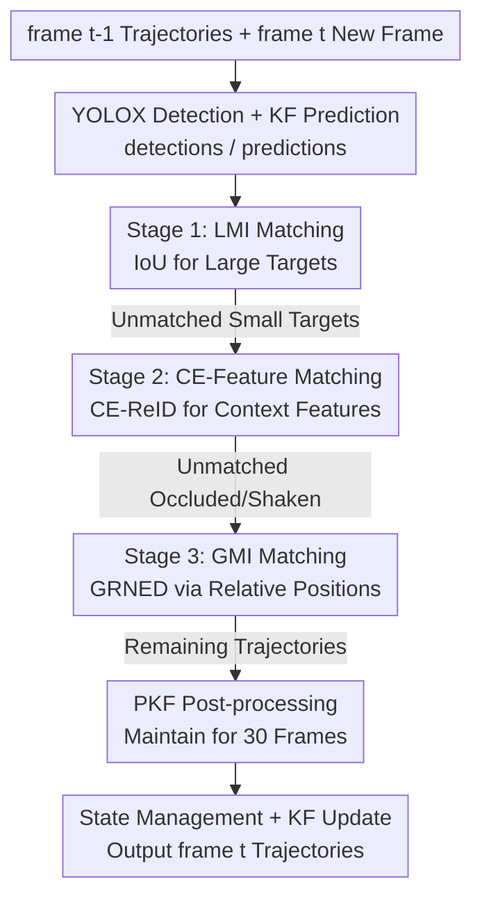

# ProgTrack: A Multi-Object Tracking Algorithm with Progressive Matching Strategy

**Conference**: CVPR 2026  
**Paper**: [CVF Open Access](https://openaccess.thecvf.com/content/CVPR2026/html/Zhang_ProgTrack_A_Multi-Object_Tracking_Algorithm_with_Progressive_Matching_Strategy_CVPR_2026_paper.html)  
**Code**: None  
**Area**: Video Understanding / Multi-Object Tracking  
**Keywords**: Multi-object tracking, UAV, Progressive matching, Context-enhanced ReID, Global motion information

## TL;DR
ProgTrack mimics the human eye's tracking habit of "large first, small later, then fill gaps" by decomposing UAV multi-object tracking into a three-stage progressive matching process: "large objects use IoU, small objects use Context-Enhanced ReID, and remaining hard-to-match targets use relative inter-object positions." Coupled with a Pure Kalman Filter (PKF) that handles occlusions and missed detections, it achieves SOTA MOTP/IDF1 results on VisDrone2019 and MDMT.

## Background & Motivation
**Background**: Current UAV Multi-Object Tracking (UAV-MOT) primarily follows the Track-by-Detection paradigm—extracting bounding boxes frame-by-frame using a detector (e.g., YOLOX), predicting positions via Kalman filtering, and pairing trajectories with detections using the Hungarian algorithm. Matching cues typically fall into two categories: motion information (represented by IoU) and appearance information (represented by ReID).

**Limitations of Prior Work**: Traditional workflows frequently fail in UAV perspectives due to four typical scenarios: ① Multi-scale targets—small targets have few pixels and weak appearance features, making ReID ineffective; ② Complex background/occlusions—interference from backgrounds or occlusions degrades appearance and alters box sizes; ③ Camera shake/rotation/zoom—causes drastic position shifts between frames, making standard Kalman filtering and IoU matching fail; ④ High target similarity—similar-looking objects (e.g., identical cars on a road) cannot be distinguished by appearance alone.

**Key Challenge**: These scenarios stem from a single fundamental contradiction: **using a "one-size-fits-all" matching cue (motion or appearance) for all targets, even though cue reliability varies significantly across different scales and states.** Large targets only need IoU; small targets have weak appearance and fail with ReID alone; occluded or shaken targets lose both stable boxes and appearance features.

**Key Insight**: The authors draw inspiration from human tracking mechanisms. Humans use simple local motion for large targets (similar to IoU), subconsciously rely on background context for small targets (as background-target relative positions are stable), and resort to relative positions between targets when scale or appearance changes abruptly (as camera shake does not alter the relative topology of targets).

**Core Idea**: Bind "which cue to use" to "target difficulty/status" through **multi-stage progressive matching**. First match easy large targets (LMI/IoU), then small targets requiring context (CE-Feature), and finally use global relative positions (GMI) to capture remaining difficult targets, shrinking the candidate pool at each stage.

## Method

### Overall Architecture
ProgTrack takes two inputs: `frame_{t-1}` (previous trajectories with IDs) and `frame_t` (new frame). Before matching, YOLOX detects `detections_t`, and an improved PKF predicts `predictions_t`. The core is the **three-stage progressive matching**—shunting detections by scale, applying specific strategies at each stage, passing unmatched targets to the next stage, and using PKF post-processing to maintain trajectories during missed detections.

Stage 1 uses **LMI (Local Motion Information)** for large targets via IoU. Stage 2 uses **CE-Feature (Context-Enhanced Feature)** for small targets via a CE-ReID network. Stage 3 handles remaining "hard" targets using **GMI (Global Motion Information)** via the GRNED module. Finally, **PKF** manages trajectories that remain unmatched, sustaining them through brief occlusions.

### Key Designs

**1. Multi-stage Progressive Matching: Shunting Cues by Target Difficulty**

This is the core of ProgTrack, addressing the "one-size-fits-all" cue limitation. It mimics human vision: matching easy large targets first, difficult small targets second, and remaining complex targets last. Stage 1 uses LMI (IoU) for large targets because their high overlap makes IoU accurate and fast. Stage 2 shifts to small targets, using CE-Features since their appearance alone is weak. Stage 3 handles the "hardest" cases (occlusions, camera shake) using global relative positions robust to sudden position changes. This "divide and conquer" approach reduces matching difficulty and prevents errors from propagating across disparate target types.

**2. CE-ReID Module: Injecting Background Context into Small Target Features**

This implements the Stage 2 CE-Feature strategy. Observations show that while small targets lack pixels, their **position relative to background context is stable**. The module consists of: SCA (Spatial and Channel Attention) which uses pooling and activation to generate a **Local Texture Feature**; and CDSPC (Context Deeply Separable Point-wise Convolution) which extracts features from target-background regions, masks the target to isolate context, and produces a **Context Attention Feature**. The final **CE-Feature** is a fusion of both.

Training involves a combined loss: $$\text{CombinedLoss} = \text{LocalFeatureLoss} + \text{ContextEnhancedFeatureLoss}$$. At inference, the CE-Feature serves as the ReID descriptor. Background complexity directly benefits this module by providing richer context.

**3. GRNED Module: Using Relative Positions for Occlusion and Camera Shake**

This implements GMI for Stage 3. When occlusions destroy appearance and camera shake causes coordinate drift, absolute motion/appearance cues fail. However, the **relative spatial relationship between targets remains nearly invariant**. GRNED performs matching in three steps: ① Intra-frame GMI extraction—calculating Euclidean distances from $\text{target}_i$ to all other targets to form a "position fingerprint" vector $v_i$; ② Cross-frame GMI matching—calculating distances between fingerprint vectors and applying min-max normalization to handle scale changes:

$$C'_{ij} = \frac{C_{ij} - \min(C)}{\max(C) - \min(C)}$$

If target counts differ (due to occlusion), a greedy algorithm aligns vector lengths by discarding elements with minimal cost. ③ Hungarian matching on the normalized cost matrix.

**4. PKF (Pure Kalman Filter): Sustaining Trajectories during Missed Detections**

PKF handles scenarios where an object exists but detection fails (e.g., during brief occlusion). Instead of stopping the track, PKF continues pure prediction for up to 30 frames. If re-detected within this window, the track resumes; otherwise, it is deleted. The update formula skips the observation $y_t$, setting the state estimate directly to the prediction $\hat{x}_t = \hat{x}_t^-$:

$$\hat{x}_t^- = F\hat{x}_{t-1} + Bu_{t-1}, \quad P_t^- = FP_{t-1}F^T + Q$$

This "stretches" the trajectory over detection gaps, significantly reducing ID switches.

## Key Experimental Results

### Main Results
Comparison with 10 SOTA trackers on VisDrone2019 and MDMT.

| Dataset | Method | MOTA↑ | MOTP↑ | IDF1↑ | IDs↓ |
|--------|------|-------|-------|-------|------|
| VisDrone2019 | StrongSORT (TMM'23) | **40.3** | 73.4 | 49.4 | 21102 |
| VisDrone2019 | GeneralTrack (CVPR'24) | 39.4 | 73.5 | 47.5 | 22803 |
| VisDrone2019 | **ProgTrack (Ours)** | 40.2 | **77.5** | **52.8** | **21295** |
| MDMT | StrongSORT | 57.1 | 74.3 | 66.8 | 26134 |
| MDMT | **ProgTrack (Ours)** | **57.2** | **77.3** | **69.2** | **25536** |

ProgTrack leads in MOTP and IDF1 on both datasets. The trade-off is speed (~6.5 FPS), which is slower than ByteTrack (~29 FPS).

### Ablation Study
Baseline: ByteTrack on VisDrone2019.

| Configuration | MOTA↑ | MOTP↑ | IDF1↑ | Note |
|------|-------|-------|-------|------|
| baseline (ByteTrack) | 34.7 | 72.1 | 47.2 | Starting Point |
| + CE-ReID | 38.4 | 73.8 | 48.1 | MOTA +3.7 (Better appearance) |
| + GRNED | 39.7 | 76.8 | 48.9 | MOTP +3.0 (Positional robustness) |
| + PKF | 40.2 | 77.5 | 52.8 | IDF1 +3.9 (Trajectory continuity) |

### Key Findings
- **Modular Division of Labor**: CE-ReID improves MOTA (feature discriminability), GRNED improves MOTP (localization precision via topology), and PKF improves IDF1 (identity consistency).
- **Context Advantage**: CE-ReID's AUC (0.950) outperforms DeepReID (0.917). Gains increase with background complexity.
- **Accuracy-Speed Trade-off**: 6.5 FPS is below real-time thresholds, posing a challenge for live UAV deployment.

## Highlights & Insights
- **Decoupling Cues from Difficulty**: Instead of seeking a "perfect" cue, ProgTrack acknowledges that different targets require different cues and handles them progressively.
- **Topological Invariants**: GRNED uses "fingerprints" of relative distances rather than absolute coordinates, effectively bypassing camera shake.
- **Online Post-processing**: PKF integrates the benefits of offline interpolation into an online filtering framework by using pure prediction output.

## Limitations & Future Work
- **Inference Speed**: 6.5 FPS is insufficient for real-time onboard UAV processing.
- **Target Density Dependency**: GRNED requires co-visible targets; its effectiveness may drop in extremely sparse scenes.
- **Greedy Alignment**: The greedy element-discarding strategy may lead to mismatches when many targets enter/exit the frame simultaneously.
- **Hyperparameter Sensitivity**: The 30-frame window for PKF is a fixed hyperparameter and may not generalize across different frame rates.

## Related Work & Insights
- **vs ByteTrack**: ByteTrack uses a two-stage matching based on confidence; ProgTrack uses a three-stage matching based on target scale/status.
- **vs StrongSORT**: While StrongSORT uses motion compensation, ProgTrack’s GRNED provides superior MOTP and IDF1 by leveraging relative topology.
- **vs FairMOT**: Instead of joint detection-and-tracking training, ProgTrack demonstrates that a sophisticated matching strategy can be more effective in the specialized UAV domain.

## Rating
- Novelty: ⭐⭐⭐⭐ 
- Experimental Thoroughness: ⭐⭐⭐⭐ 
- Writing Quality: ⭐⭐⭐⭐ 
- Value: ⭐⭐⭐⭐ 

<!-- RELATED:START -->

## Related Papers

- [\[CVPR 2026\] Progressive Multi-cue Alignment for Unaligned RGBT Tracking](progressive_multi-cue_alignment_for_unaligned_rgbt_tracking.md)
- [\[CVPR 2026\] Hypergraph-State Collaborative Reasoning for Multi-Object Tracking](hypergraph-state_collaborative_reasoning_for_multi-object_tracking.md)
- [\[CVPR 2026\] Occlusion-Aware SORT: Observing Occlusion for Robust Multi-Object Tracking](occlusion-aware_sort_observing_occlusion_for_robust_multi-object_tracking.md)
- [\[CVPR 2026\] Dual-level Adaptation for Multi-Object Tracking: Building Test-Time Calibration from Experience and Intuition](tcei_test_time_calibration_experience_intuition_mot.md)
- [\[AAAI 2026\] PlugTrack: Multi-Perceptive Motion Analysis for Adaptive Fusion in Multi-Object Tracking](../../AAAI2026/video_understanding/plugtrack_multi-perceptive_motion_analysis_for_adaptive_fusion_in_multi-object_t.md)

<!-- RELATED:END -->
