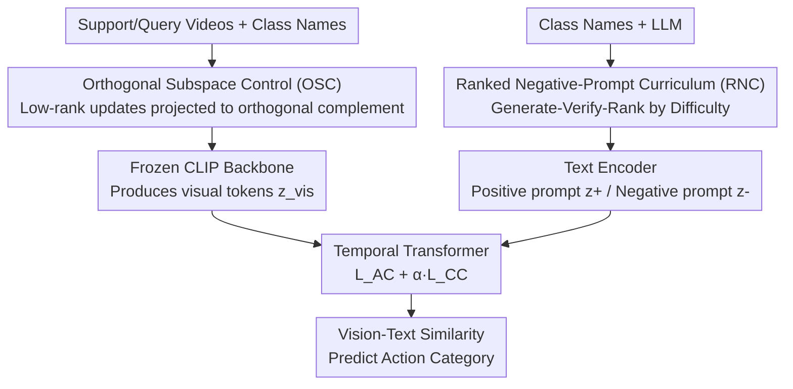

# Protect to Adapt: Orthogonal Subspace Control with Ranked Negative-Prompt Curriculum for Few-Shot Action Recognition

**Conference**: CVPR 2026  
**Paper**: [CVF Open Access](https://openaccess.thecvf.com/content/CVPR2026/html/Qi_Protect_to_Adapt_Orthogonal_Subspace_Control_with_Ranked_Negative-Prompt_Curriculum_CVPR_2026_paper.html)  
**Code**: TBD  
**Area**: Video Understanding  
**Keywords**: Few-Shot Action Recognition, VLM Fine-tuning, Orthogonal Subspace, Hard Negative Curriculum, Catastrophic Forgetting

## TL;DR
P2A decomposes the adaptation of CLIP for few-shot action recognition into two components: Orthogonal Subspace Control (OSC), which constrains low-rank updates to the orthogonal complement of the pre-trained weights' dominant subspace to preserve general semantics and mitigate catastrophic forgetting; and a Ranked Negative-Prompt Curriculum (RNC), which utilizes LLM-generated, verifier-filtered, and difficulty-ranked negative samples to push class boundaries. By tuning only 2% of the parameters, it achieves SOTA performance across five FSAR benchmarks.

## Background & Motivation

**Background**: Few-shot action recognition (FSAR) aims to recognize new action classes given only a few labeled samples per class. Early methods relied on meta-learning or metric learning, but the expressive power of small backbone networks quickly saturated. Recently, the focus has shifted toward leveraging strong priors from Vision-Language Models (VLMs) like CLIP. A representative work, CLIP-FSAR, performs full fine-tuning of the CLIP visual backbone and adds a prototype modulation layer.

**Limitations of Prior Work**: Adapting VLMs to downstream tasks faces a trade-off. First, **full fine-tuning is costly**—CLIP-FSAR updates 58% of the backbone parameters, which damages the original zero-shot transfer ability and exacerbates catastrophic forgetting, particularly critical in continual learning scenarios where old data cannot be replayed. Second, **freezing the backbone with lightweight adapters lacks sufficient adaptation capacity** under few-shot conditions. Furthermore, at the text level, each query in an FSAR episode is only compared against one positive class and a few negative classes. The diversity of prompts seen by the text encoder is extremely low, rarely encountering hard negatives near the decision boundary, leading to small margins and blurred boundaries.

**Key Challenge**: The fundamental trade-off between stability (knowledge retention) and plasticity (task adaptation). Unconstrained low-rank updates naturally align with the dominant directions of pre-trained weights, effectively overwriting the most stable general semantics. Simultaneously, sparse few-shot contrastive signals cannot support clear decision boundaries.

**Goal**: To simultaneously (a) prevent the adaptation process from overwriting general semantics and (b) sharpen inter-class boundaries under few-shot conditions, while modifying minimal parameters.

**Key Insight**: The authors map these failure modes to two orthogonal dimensions: OSC governs "**where adaptation occurs**" (parameter level: restricting updates to directions that do not harm the dominant subspace), and RNC governs "**how adaptation utilizes hard negatives**" (data level: feeding negative prompts ranked by difficulty). These two are decoupled and complementary.

**Core Idea**: "Protect" first (project low-rank updates into the orthogonal complement of the pre-trained dominant subspace to preserve general semantics) and then "Adapt" (sharpen boundaries using an LLM-generated hard negative curriculum)—Protect-to-Adapt.

## Method

### Overall Architecture
Given support/query videos, the frozen CLIP visual backbone produces visual tokens $z_{vis}$ under OSC constraints. The text encoder provides both positive prompt embeddings $z_{text}^+$ for each class and difficulty-ranked negative prompt embeddings $z_{text}^-$ provided by RNC. A temporal Transformer is trained under a composite loss (intra-episode classification loss + curriculum contrastive loss), and category scores are finally generated via text-visual similarity in a shared space. OSC operates at the parameter level, while RNC operates at the data level; they converge during the vision-text contrastive stage.

### Key Designs

**1. Orthogonal Subspace Control (OSC): Forcing low-rank updates out of the dominant subspace to preserve general semantics**

The limitation is straightforward: vanilla LoRA writes weight updates as $\Delta W = BA$ (where $A\in\mathbb{R}^{r\times d_2}, B\in\mathbb{R}^{d_1\times r}$ and rank $r\ll\min(d_1,d_2)$), but it ignores the spectral structure of $W_0$. Updates tend to follow dominant singular directions, overwriting stable general semantics. OSC performs SVD on the weights to be fine-tuned: $W_0=U\Sigma V^\top=\sum_i\sigma_i u_i v_i^\top$, and takes the top $k$ columns of left singular vectors $U$ to span the "protected" dominant subspace $S_p$. It then constructs a projection operator to force updates into the orthogonal complement $S_p^\perp$:

$$P_k^\perp = I_{d_1}-U_kU_k^\top,\qquad \Delta W = P_k^\perp BA = (I_{d_1}-U_kU_k^\top)BA.$$

This constraint is equivalent to the optimization $\min_{\Delta W}\mathcal{L}(W_0+\Delta W)\ \text{s.t.}\ U_k^\top\Delta W=0$. Geometrically, for any input $x$, the projection of the pre-activation response onto the dominant subspace remains **completely unchanged** ($U_k^\top(W_0+\Delta W)x=U_k^\top W_0 x$). This leaves general semantics untouched while allowing task adaptation to operate in the energetically sparse orthogonal complement.

The key hyperparameter is the protected rank $k$. Instead of manual tuning, the authors use **entropy-based effective rank**: singular values are normalized to probabilities $p_i=\sigma_i/\sum_j\sigma_j$, and $k$ is determined as $k=\lfloor\exp(-\sum_i p_i\log p_i)\rfloor$. This is a continuous generalization of matrix rank that is scale-invariant. Layers with flatter spectra (dispersed information) have larger protected subspaces, while concentrated spectra lead to smaller $k$, automatically balancing stability and plasticity per layer. OSC does not increase parameter count beyond LoRA ($r(d_1+d_2)$); $U_k$ is computed once via truncated SVD and cached, adding only $O(d_1kr)$ FLOPs per forward pass.

**2. Ranked Negative-Prompt Curriculum (RNC): Sharpening boundaries with LLM-generated, verified, and ranked results**

FSAR episodes lack strong inter-class separation. RNC addresses this using hard negatives, with the challenge being that negatives must be "hard" but controllable and must not leak labels. It employs a **generator-verifier loop**: for each action $a_i$, a taboo token set $F$ is defined (tokens matching $a_i$ or its variants). An LLM generates $M$ negative samples for three difficulty levels $\ell\in\{e,m,h\}$ (coarse replacement / semantic inversion / fine-grained counterfactuals, e.g., "put down the cello" / "playing the cello backwards" / "playing the cello but barely touching strings"). A non-generative verifier performs schema checks, taboo matching, difficulty consistency, and length checks. If successful, samples are cached; if rejected, the reasons are fed back to the LLM for revision (max 5 rounds). This ensures negatives are "hard but clean" and moves the LLM cost to a one-time pre-processing step.

During training, a **difficulty annealing curriculum** is used: training is divided into stages where only one difficulty level is sampled. Given stage boundaries $T_e<T_m<E$, the active negative pool at epoch $t$ is $S_{neg}(t)=S_e/S_m/S_h$. Coarse boundaries are aligned first (easy), followed by gradual tightening (medium, hard).

**3. Composite Training Objective: Episode classification + Curriculum contrastive**

The total loss is $\mathcal{L}_{total}=\mathcal{L}_{AC}+\alpha\mathcal{L}_{CC}$. $\mathcal{L}_{AC}$ is the standard softmax cross-entropy on query logits within an episode. $\mathcal{L}_{CC}$ is the curriculum contrastive loss, which pulls visual embeddings toward the correct class prototype and pushes them away from the current difficulty's hard negative prompts:

$$\mathcal{L}_{CC}=-\log\frac{e^{s_i^+}}{e^{s_i^+}+\sum_{m=1}^{M}e^{s_{im}^-}},$$

where $s_i^+=\cos(v_i,p_{a_i})$ and $s_{im}^-=\cos(v_i,\phi_{text}(s_{a_i}^{\ell(t),m}))$. $\alpha$ (set to 0.1) balances the objectives. This term effectively converts the negative samples from RNC into "boundary-pushing" gradients.

### Loss & Training
The model uses episode-based training (5-way 1-/5-shot). OSC-LoRA rank is 2 with dropout 0.25, applied to $W_qW_vW_k$ projections in the upper layers (6–11). RNC uses $M=3$ negative samples per class/difficulty. Curriculum boundaries are $(T_e,T_m)=(4,6)$. $\alpha=0.1$. DeepSeek-R1 is the default generator. Results are averaged over 10,000 random episodes.

## Key Experimental Results

### Main Results
On five FSAR benchmarks (HMDB51 / UCF101 / SSv2-Small / SSv2-Full / Kinetics-100), P2A ranks first in 8 out of 10 settings (using CLIP ViT-B).

| Dataset (1-shot) | CLIP-FSAR | EMP-Net | P2A (Ours) | Gain vs CLIP-FSAR |
|--------|-----------|---------|------------|-------------------|
| HMDB51 | 75.8 | 76.8 | **82.3** | +6.5 |
| Kinetics-100 | 89.7 | 89.1 | **93.7** | +4.0 |
| SSv2-Small | 54.5 | 57.1 | **58.5** | +4.0 |
| SSv2-Full | 61.9 | 63.1 | **63.8** | +1.9 |
| UCF101 | 96.6 | 94.3 | **96.9** | +0.3 |

Parameter efficiency (5-way 1-shot):

| Method | Tunable Params | HMDB51 | SSv2-Small | Kinetics-100 |
|------|---------|--------|------------|--------------|
| CLIP-FSAR (Full) | 89M (58.2%) | 75.8 | 54.5 | 89.7 |
| EMP-Net | 7.7M (4.9%) | 76.8 | 57.1 | 89.1 |
| AIM | 14.3M (8.7%) | 75.9 | 50.5 | 89.2 |
| CLIP-FSAR + vanilla LoRA | 3.1M (2.0%) | 78.6 | 56.4 | 90.7 |
| **P2A (Ours)** | **3.1M (2.0%)** | **82.3** | **58.5** | **93.7** |

Tuning only 2% of parameters outperforms full fine-tuning (89M) and EMP-Net (7.7M). The authors conclude: "**In parameter-efficient fine-tuning, the location of adaptation is more critical than the number of tunable parameters.**"

### Ablation Study
Component ablation (5-way 1-shot, HMDB51 / Kinetics-100):

| Config | Tunable Params | HMDB51 | Kinetics-100 |
|------|---------|--------|--------------|
| Frozen Backbone | 3M | 58.2 | 78.9 |
| + vanilla LoRA (VL) | 3.1M | 78.6 | 90.7 |
| + OSC (No RNC) | 3.1M | 79.9 | 91.8 |
| VL + RNC (easy) | 3.1M | 77.3 | 91.0 |
| OSC + RNC (easy) | 3.1M | 80.4 | 92.2 |
| OSC + RNC (hard) | 3.1M | 80.7 | 92.8 |
| **P2A (OSC + RNC + Curriculum)** | 3.1M | **82.3** | **93.7** |

In continual learning (S→K→H sequence, 5-way 5-shot), P2A also excels: AvgAcc 78.0 (vs CLIP-FSAR 74.1), BWT −5.8 (least forgetting), and FWT −7.7 (best forward transfer).

### Key Findings
- **OSC and RNC are complementary**: Neither OSC alone (79.9) nor RNC alone (77.3, lower than pure LoRA) is sufficient. Optimal performance (82.3) requires OSC to protect semantics before layering RNC curriculum.
- **Entropy Rank > Fixed Subspace**: Auto-adjusting $K_{eff}$ outperforms fixed $k$ values, suggesting that per-layer adaptation based on spectral concentration is more reliable.
- **Protecting high layers and attention projections is most effective**: Adding OSC to upper layers (6–11) and focusing on $W_qW_vW_k$ yields better results than lower layers or all projections.
- **Stronger LLMs yield better negatives**: Moving from GPT-3.5 to DeepSeek-R1 improves HMDB51 from 80.1 to 82.3.

## Highlights & Insights
- **Clean "Protect + Adapt" Decoupling**: OSC handles "where to change" while RNC handles "how to use hard samples," addressing parameter and data dimensions separately.
- **Hard "Zero-Overwrite" Guarantee**: $U_k^\top\Delta W=0$ ensures dominant subspace responses are mathematically unchanged, acting as a hard constraint rather than soft regularization.
- **Entropy-based Effective Rank**: This provides a scale-invariant, tuning-free method to determine protection dimensions per layer.
- **LLM-generated Negative Samples with Verifier-in-the-loop**: Taboo tokens and non-generative verifiers prevent hallucinations and leaks, with zero overhead during actual training.

## Limitations & Future Work
- **Reliance on Class Name Semantics**: RNC depends on LLM understanding of action names; performance may degrade for rare or domain-specific actions (e.g., surgical or industrial procedures).
- **Negative FWT in Continual Learning**: While superior to others, the forward transfer relative to a frozen baseline remains negative, indicating room for improvement in initial new-task performance.
- **Engineering Cost of SVD + Caching**: Truncated SVD must be computed and $U_k$ cached for every tunable layer, which is a significant one-time pre-processing cost.
- **Heuristic Difficulty Stages**: The three-stage curriculum and stage boundaries are empirical; more systematic analysis for different datasets could improve results.

## Related Work & Insights
- **vs CLIP-FSAR**: CLIP-FSAR uses 89M parameters and only positive prompts; P2A uses 2% parameters, projects updates to orthogonal complements, and adds hard negatives, outperforming it by 6.5% on HMDB51.
- **vs vanilla LoRA**: LoRA ignores spectral structure; OSC protects general semantics, raising HMDB51 performance from 78.6 to 79.9 with the same parameter budget.
- **vs EMP-Net / AIM / etc.**: These methods do not explicitly protect dominant VLM subspaces. P2A achieves higher accuracy with fewer parameters (3.1M vs 7.7–14.3M).

## Rating
- Novelty: ⭐⭐⭐⭐ Orthogonal complement protection and LLM curricula are known concepts, but the combination is clean and the "position vs quantity" insight is compelling.
- Experimental Thoroughness: ⭐⭐⭐⭐⭐ Comprehensive coverage across five benchmarks, parameter efficiency, cross-domain, and continual learning setups.
- Writing Quality: ⭐⭐⭐⭐ Clear derivation and diagrams, though some notation (taboo sets/verifier logic) is dense.
- Value: ⭐⭐⭐⭐ SOTA with 2% parameters and useful PEFT design insights for few-shot/continual VLM adaptation.

<!-- RELATED:START -->

## Related Papers

- [\[CVPR 2026\] MPL: Match-guided Prototype Learning for Few-shot Action Recognition](mpl_match-guided_prototype_learning_for_few-shot_action_recognition.md)
- [\[CVPR 2026\] SkeletonContext: Skeleton-side Context Prompt Learning for Zero-Shot Skeleton-based Action Recognition](skeletoncontext_skeleton-side_context_prompt_learning_for_zero-shot_skeleton-bas.md)
- [\[AAAI 2026\] Task-Specific Distance Correlation Matching for Few-Shot Action Recognition](../../AAAI2026/video_understanding/task-specific_distance_correlation_matching_for_few-shot_action_recognition.md)
- [\[ECCV 2024\] Efficient Few-Shot Action Recognition via Multi-Level Post-Reasoning](../../ECCV2024/video_understanding/efficient_few-shot_action_recognition_via_multi-level_post-reasoning.md)
- [\[CVPR 2026\] Metadata-Aware Multi-Prompt Reasoning for Zero-Shot Accident Understanding](metadata-aware_multi-prompt_reasoning_for_zero-shot_accident_understanding.md)

<!-- RELATED:END -->
