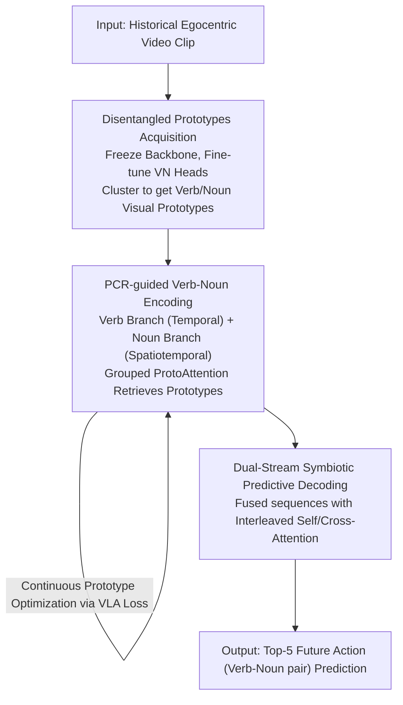

# Prototypical Action Reasoning Facilitated by Vision-Language Alignment for Egocentric Action Anticipation

**Conference**: CVPR 2026  
**Paper**: [CVF Open Access](https://openaccess.thecvf.com/content/CVPR2026/html/Shao_Prototypical_Action_Reasoning_Facilitated_by_Vision_Language_Alignment_for_Egocentric_Action_CVPR_2026_paper.html)  
**Code**: To be confirmed  
**Area**: Video Understanding / Egocentric Action Anticipation  
**Keywords**: Action Anticipation, Egocentric Video, Vision-Language Alignment, Prototypical Learning, Verb-Noun Disentanglement

## TL;DR
PAR-VLA utilizes Vision-Language Models (VLM) to learn verbs and nouns as "disentangled visual prototypes" which serve as stable semantic anchors. It transforms open, unconstrained future action anticipation into conditional prediction guided by these semantic concepts. By refining verb-noun dependencies through a dual-stream symbiotic decoder, it achieves New SOTA on three datasets, including EPIC-KITCHENS-100.

## Background & Motivation

**Background**: Egocentric Action Anticipation (EAA) aims to infer future actions based solely on historical video observations before the action actually occurs. This is a core capability for embodied AI and human-robot collaboration. Mainstream approaches employ pre-trained visual encoders combined with Transformer temporal models to model spatiotemporal context and directly regress future actions.

**Limitations of Prior Work**: The future is inherently stochastic. End-to-end methods lack explicit semantic reasoning capabilities, making it difficult to handle "open future uncertainty." Furthermore, egocentric actions suffer from two "curses of dimensionality": ① Fine-granularity—subtle differences in hand-object interaction (HOI) lead to distinct outcomes; ② The action space, composed of verb-noun pairs, is massive, long-tailed, and sparse.

**Key Challenge**: Prior works (such as S-GEAR) attempted to structure the output space using "holistic action prototypes" (treating verb-noun pairs as a unified representation). However, holistic prototypes suffer from three major flaws: the long-tail distribution makes prototype initialization for rare categories statistically unreliable; fine-granularity causes feature entanglement (e.g., "pick up bottle" and "open bottle" are difficult to distinguish in embedding space); and most critically, they discard the natural semantic dependencies between verbs and nouns, hindering joint prediction.

**Goal**: Instead of using entangled holistic prototypes, this work proposes to disentangle verbs and nouns into independent visual prototypes and explicitly model their dependencies, transforming unconstrained temporal prediction into "semantic anchor-guided" conditional prediction.

**Key Insight**: VLMs pre-trained on large-scale multimodal data inherently possess cross-modal alignment capabilities, providing a unified and robust semantic space. This offers a theoretical and practical foundation for learning highly discriminative verb and noun prototypes separately.

**Core Idea**: Leverage VLM vision-language alignment to learn disentangled verb/noun visual prototypes as semantic anchors. Use prototype-guided contextual reasoning combined with dual-stream symbiotic decoding to converge open prediction into semantically conditional prediction.

## Method

### Overall Architecture
PAR-VLA is a staged framework for "prototypical representation learning-guided temporal reasoning." The training pipeline executes three sequential phases: **Disentangled Prototypes Acquisition** → **PCR-guided Verb-Noun Encoding** → **Dual-Stream Symbiotic Predictive Decoding**. The input is a historical video clip ending at the observation moment, and the output is the Top-5 prediction of future actions (verb-noun pairs) occurring after $\tau_a$ seconds (e.g., 1s).

Specifically: Phase 1 freezes the visual backbone and fine-tunes only the verb-noun recognition heads to align visual embeddings with text features, followed by clustering to initialize verb and noun visual prototype groups. Phase 2 extracts spatiotemporal features from the frozen backbone and utilizes two branches (temporal-heavy for verbs, spatiotemporal-heavy for nouns) to dynamically retrieve relevant prototypes via Grouped ProtoAttention and explicitly model early verb-noun interactions. This outputs future predictive feature sequences while optimizing prototypes via vision-language alignment loss. Phase 3 fuses the predicted sequences into a dual-stream symbiotic decoder, using interleaved self-attention/cross-attention to further characterize verb-noun mutual dependencies for joint prediction. During inference, prototypes are frozen, and the model outputs directly in an end-to-end manner.

### Key Designs

**1. Disentangled Prototypes Acquisition: Separate learning of "Verb Prototypes" and "Noun Prototypes" to resolve feature entanglement in holistic prototypes.**

To address the issues of entanglement and unreliable initialization of rare categories in holistic prototypes, the authors learn verb and noun prototypes separately using Ego-VLM's cross-modal alignment. Implementation-wise, the visual backbone is frozen, and a two-layer MLP maps top-level semantic features to the dimensionality of verb/noun categories, supervised by cross-entropy: $L_{cls}=L_{ce}^{verb}+L_{ce}^{noun}$. Simultaneously, visual features $(F_{verb},F_{noun})$ are aligned with expanded text embeddings $(T_{verb},T_{noun})$ using cosine similarity: $L_{sim}=D_{cos}(F_{verb},T_{verb})+D_{cos}(F_{noun},T_{noun})$, where $D_{cos}(A,B)=1-\frac{A\cdot B}{\|A\|\|B\|}$. After fine-tuning, features are clustered, and $k$ sub-prototypes (cluster centers) are selected for each verb class $v_i$ and noun class $n_j$ to capture intra-class diversity: $P_{v_i}=\{p^1_{v_i},\dots,p^k_{v_i}\}$. These prototypes serve as discriminative semantic anchors, transforming unconstrained prediction into conditional prediction.

**2. PCR-guided Verb-Noun Encoding: Grouped ProtoAttention for dynamic prototype retrieval and early verb-noun interaction.**

This is the core innovation. Recognizing that verb semantics depend more on temporal context while noun perception (focusing on HOI) depends more on spatial context, the authors design two encoding branches. Each layer first performs standard self-attention to obtain an enhanced representation $F^{sa}_v$, followed by two parallel mechanisms. First is **Early Verb-Noun Interaction**: $F^{sa}_v$ acts as the query, while noun features (squeezed via GAP into $\bar F_n$) act as key/value for cross-attention: $F^{n\to v}_v=\mathrm{CrossAtt}(\mathrm{LN}(F^{sa}_v),\mathrm{LN}(\bar F_n))$. Second is **Grouped ProtoAttention**: $F^{sa}_v$ calculates a cosine similarity matrix $M_v$ with the verb prototype set. Vectors within each of the $K$ prototype groups are summed and normalized via Softmax to obtain a similarity distribution $S_v$ across verb prototypes. $S_v$ acts as a multinomial distribution to sample relevant prototype subsets, followed by prototype-guided cross-attention: $F^{pro}_v=\mathrm{CrossAtt}(\mathrm{LN}(F^{sa}_v),P^{selected}_v)$. Finally, the three paths are summed: $F^{out}_v=F^{sa}_v+F^{n\to v}_v+F^{pro}_v$.

**3. Dual-Stream Symbiotic Predictive Decoder: A post-encoding independent stage to refine joint verb-noun dependencies.**

While the encoding branches model temporal and early interactions, final joint prediction requires finer mutual correction. An independent dual-stream symbiotic decoding phase (supervised only by cross-entropy) follows. Verb and noun decoding branches each consist of two self-attention layers and one cross-attention layer. First, verb-noun prediction sequences are fused into a hybrid semantic sequence $\{\hat F^{vn}_\tau\}$. In the verb decoder, the hybrid sequence passes through self-attention, then uses the noun prediction sequence as a prompt for cross-attention, and finally outputs the decoded verb sequence via self-attention. The noun decoder is symmetric. These two streams act as prompts for each other, forming a "symbiotic" mechanism.

### Loss & Training
The encoding stage introduces a self-supervised feature prediction loss $L_{feat}=\frac{1}{t-1}\sum_{\tau=2}^{t}\|\hat F_\tau-F_\tau\|^2$ to predict future features progressively. Predicted sequences are supervised by $L_{cls}$ via classification heads. A vision-language alignment loss $L_{align}=1-\frac12\left(\frac{S_v\cdot T_v}{|S_v||T_v|}+\frac{S_n\cdot T_n}{|S_n||T_n|}\right)$ aligns the aggregated similarity of visual predictive features to text label semantics. Total objective: $L_{total}=L_{feat}+L_{cls}+\lambda L_{align}$. Training is two-stage: Stage 1 trains the PCR encoder independently; Stage 2 introduces and jointly trains the symbiotic decoder. Prototypes remain unfrozen for fine-tuning throughout. Backbone: Ego4D pre-trained LaViLa (noted as TSF-B). Optimizer: SGD (momentum 0.9, weight decay 1e-5), 80 epochs on EPIC-KITCHENS-100, prototype group size $K=5$.

## Key Experimental Results

> Metrics: **Top-5 Recall** (Main metric for EPIC-KITCHENS-100 across action/verb/noun levels, anticipation lag $\tau_a=1$s); EGTEA uses Top-5 Recall/Acc; 50-Salads uses Top-1 Acc.

### Main Results

EPIC-KITCHENS-100 Validation Set (Top-5 Recall %):

| Method | Encoder | Modality | Verb | Noun | Action |
|------|--------|------|------|------|--------|
| AVT+ | ViT | RGB+Obj | 28.2 | 32.0 | 15.9 |
| RAFTformer-2B | MViTv2-16&24 | RGB | 33.8 | 37.9 | 19.1 |
| SGEAR-2B | ViT-B×2 | RGB+Obj | 32.6 | 37.8 | 19.5 |
| **Ours** | TSF-B | RGB | **40.3** | **43.2** | **22.5** |
| **Ours** | TSF-B | RGB+Flow | **44.9** | **47.6** | **24.1** |

Using only RGB, PAR-VLA's action Top-5 Recall reaches 22.5%, outperforming RGB-only RAFTformer (18.0%) by 4.5% and SGEAR-2B (19.5%) by 3.0%. With optical flow, it reaches 24.1%, achieving All-metric SOTA.

Cross-dataset Performance (Top-5 Recall / Top-1 Acc %):

| Dataset | Metric | Prev. SOTA | Ours (RGB) | Ours (RGB+Flow) |
|--------|------|----------|--------------|-------------------|
| EGTEA | Top-5 Recall | 67.4 (VS-TransGRU) | **70.2** | **72.7** |
| 50-Salads | Top-1 Acc | 63.9 (SGEAR-2B) | **65.4** | — |

### Ablation Study

Ablation of PAR (Prototypical Action Reasoning) and VLA (Vision-Language Alignment):

| Configuration | EPIC Act@R5 | EPIC Verb@R5 | EPIC Noun@R5 | EGTEA R5 | EGTEA Acc |
|------|-------------|--------------|--------------|----------|-----------|
| baseline (w/o PAR & VLA) | 19.6 | 39.8 | 19.6 | 66.5 | 71.7 |
| + PAR only | 21.7 | 42.6 | 21.7 | 68.4 | 73.5 |
| + VLA only | 20.3 | 40.1 | 20.3 | 68.1 | 72.1 |
| **Full (PAR + VLA)** | **22.5** | **43.2** | **22.5** | **70.2** | **74.3** |

### Key Findings
- **Synergy between PAR and VLA**: On EPIC, Act@R5 increases from 19.6% (baseline) to 22.5% (Full), showing that "prototypical reasoning" and "language alignment" are non-linearly complementary.
- **Hyperparameter Sensitivity**: The optimal prototype group size is $K=5$, and the optimal number of encoding layers is $N_{par}=6$.
- **Failure Analysis**: In cases of extremely high uncertainty (e.g., observing "washing a knife" but predicting "opening chicken packaging"), the model still deviates.

## Highlights & Insights
- **"Disentangled Prototypes + Semantic Anchors"**: Transforming open prediction into conditional prediction by anchoring verbs and nouns separately effectively reduces uncertainty.
- **Leveraging VLMs for Disentanglement**: Fine-tuning only recognition heads with VLA constraints allows the model to extract clear semantics with near-zero additional annotation cost.
- **Grouped ProtoAttention as Differentiable Sampling**: Using the similarity distribution $S_v$ for multinomial sampling transforms prototypes from a "static lookup table" into "reasoning context."
- **Symbiotic Decoding**: Explicitly utilizing semantic co-occurrence (e.g., "washing → bowl") via mutual prompts between verb and noun streams leads to more stable predictions.

## Limitations & Future Work
- **Extreme Uncertainty**: The model fails when there is a significant semantic leap between observed and target actions.
- **VLM Dependency**: The discriminative power of prototypes relies heavily on the alignment quality of the pre-trained Ego-VLM.
- **Training Complexity**: Two-stage training and multiple loss terms increase hyperparameter tuning overhead.
- **Future Directions**: Exploring target text/action schemas as additional decoding conditions or explicitly modeling "multiple plausible futures" rather than point predictions.

## Related Work & Insights
- **vs S-GEAR**: S-GEAR uses LLMs for linguistic prototypes but maintains **holistic action prototypes**. PAR-VLA uses VLMs to learn **disentangled cross-modal prototypes**, avoiding feature entanglement.
- **vs UADT**: UADT quantifies uncertainty at the probability level for fusion; PAR-VLA reduces uncertainty at the representation level using semantic anchors.
- **vs IPL**: IPL uses verb prototypes to guide noun prediction; PAR-VLA extends this to symmetric interaction with dual-stream symbiotic decoding.

## Rating
- Novelty: ⭐⭐⭐⭐ Systematic combination of disentangled prototypes and symbiotic decoding.
- Experimental Thoroughness: ⭐⭐⭐⭐ Comprehensive results across three datasets; lacks fine-grained analysis of long-tail distributions.
- Writing Quality: ⭐⭐⭐⭐ Clear motivation and complete formulation.
- Value: ⭐⭐⭐⭐ High practical value for embodied AI, reaching SOTA with only RGB input.

## Related Papers

- [\[CVPR 2026\] Streaming Video Crime Anticipation with Spatio-Temporal Causal Reasoning](streaming_video_crime_anticipation_with_spatio-temporal_causal_reasoning.md)
- [\[CVPR 2026\] Polyphony: Diffusion-based Dual-Hand Action Segmentation with Alternating Vision Transformer and Semantic Conditioning](polyphony_diffusion-based_dual-hand_action_segmentation_with_alternating_vision_.md)
- [\[CVPR 2026\] Decompose and Transfer: CoT-Prompting Enhanced Alignment for Open-Vocabulary Temporal Action Detection](decompose_and_transfer_cot-prompting_enhanced_alignment_for_open-vocabulary_temp.md)
- [\[CVPR 2026\] TF-CADE: Foreground-Concentrated Text-Video Alignment for Zero-Shot Temporal Action Detection](tf-cade_foreground-concentrated_text-video_alignment_for_zero-shot_temporal_acti.md)
- [\[CVPR 2026\] MPL: Match-guided Prototype Learning for Few-shot Action Recognition](mpl_match-guided_prototype_learning_for_few-shot_action_recognition.md)

<!-- RELATED:END -->

<!-- RELATED:START -->

## Related Papers

- [\[CVPR 2026\] Decompose and Transfer: CoT-Prompting Enhanced Alignment for Open-Vocabulary Temporal Action Detection](decompose_and_transfer_cot-prompting_enhanced_alignment_for_open-vocabulary_temp.md)
- [\[CVPR 2026\] A Multi-Agent Perception-Action Alliance for Efficient Long Video Reasoning](a_multi-agent_perception-action_alliance_for_efficient_long_video_reasoning.md)
- [\[CVPR 2026\] Spectral Scalpel: Amplifying Adjacent Action Discrepancy via Frequency-Selective Filtering for Skeleton-Based Action Segmentation](spectral_scalpel_amplifying_adjacent_action_discrepancy_via_frequency-selective_.md)
- [\[CVPR 2026\] Seeing Motion Through Polarity for Event-based Action Recognition](seeing_motion_through_polarity_for_event-based_action_recognition.md)
- [\[CVPR 2026\] OpenMarcie: Dataset for Multimodal Action Recognition in Industrial Environments](openmarcie_dataset_for_multimodal_action_recognition_in_industrial_environments.md)

<!-- RELATED:END -->
