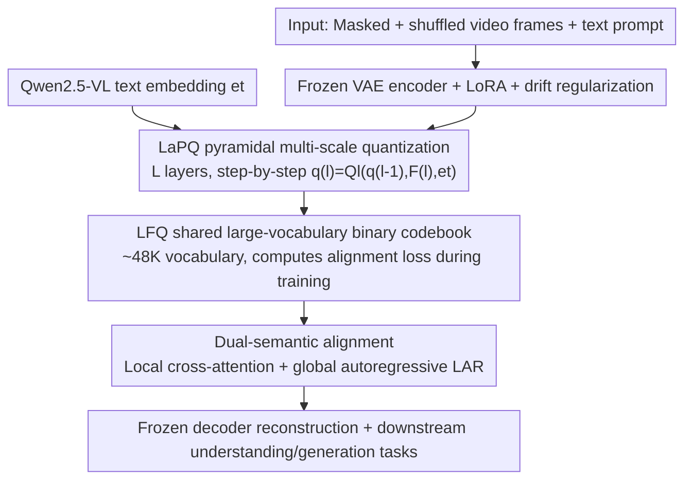

# PyraTok: Language-Aligned Pyramidal Tokenizer for Video Understanding and Generation

**Conference**: CVPR 2026  
**Paper**: [CVF Open Access](https://openaccess.thecvf.com/content/CVPR2026/html/Susladkar_PyraTok_Language-Aligned_Pyramidal_Tokenizer_for_Video_Understanding_and_Generation_CVPR_2026_paper.html)  
**Code**: To be confirmed (Project page https://plan-lab.github.io/pyratok )  
**Area**: Video Understanding / Video Generation / Discrete Video VAE  
**Keywords**: Video Tokenizer, Pyramidal Quantization, Language Alignment, Discrete VAE, Zero-Shot Video Understanding

## TL;DR
PyraTok is a language-aligned, pyramidal video tokenizer. It performs layered pyramidal quantization (LaPQ) across multiple encoder depths of a frozen video VAE, combined with a shared large-vocabulary binary codebook and "local cross-attention + global autoregressive" dual-semantic alignment. This approach not only achieves SOTA reconstruction quality but also sets new records for the same set of discrete tokens in zero-shot video segmentation, temporal action localization, and video understanding/classification.

## Background & Motivation

**Background**: Modern text-to-video (T2V) and video understanding systems mostly build upon discrete VAEs. The VQ-VAE family encodes videos into a learnable codebook, quantizing them into discrete tokens, which are then fed into diffusion or autoregressive models for generation. Discrete tokens are both efficient in compression and naturally suited for sequence modeling, making them the infrastructure for systems like VideoGPT, CogVideoX, and MAGVITv2.

**Limitations of Prior Work**: The authors identify three specific issues with existing video tokenizers. First, **single-scale quantization**: almost all codebooks learn semantics only at the final layer of the encoder (after obtaining the latent), without leveraging the hierarchical structure of VAEs where "shallow layers handle local details and deep layers manage high-level semantics", leading to coarse text-video alignment. Second, **small codebooks**: common vocabularies are only 4K–8K, which suffice for basic visual patterns but limit the representation capacity of both visual and textual modalities, throttling cross-modal alignment and text-conditioned generation. Third, **shallow single-point text alignment causes semantic drift**: existing methods either inject global language signals only at the sequence level using contrastive loss, or perform codebook distillation only at the token level during a one-time codebook learning phase. As a result, local visual tokens fail to align with the global textual intent, causing drift across scales and time.

**Key Challenge**: Stronger cross-modal alignment requires a larger codebook and finer semantic injection, but a larger codebook leads to an explosion of VRAM and computation due to high-dimensional lookups. Meanwhile, single-point alignment fails to control semantic drift across multiple scales and long temporal sequences. Thus, representation capacity, efficiency, and alignment consistency constrain each other.

**Goal**: To concurrently achieve (1) a multi-scale, coarse-to-fine semantic structure in the discrete latent space, (2) affordable utilization of a large vocabulary, and (3) consistency between local tokens and global textual intents across all scales and time steps.

**Key Insight**: The authors observe that videos inherently possess hierarchical spatial and temporal structures. Consequently, quantization should be performed "layer-by-layer" along multiple encoder depths, rather than once at the very end. Simultaneously, language signals should be injected at every level (locally), and a global autoregressive objective should be used to bind the entire token sequence to the textual intent (globally).

**Core Idea**: Replace "single-scale small codebook single-point alignment" with "layered quantization across multiple encoder depths + textual injection at each layer + global autoregressive convergence + shared large-vocabulary binary codebook", allowing a single set of discrete tokens to concurrently serve both generation and zero-shot understanding.

## Method

### Overall Architecture
Given a video $X \in \mathbb{R}^{C \times T \times H \times W}$ and a text prompt, PyraTok aims to learn a set of compact discrete latents that are both physically faithful and semantically aligned with the text. The input video is first **masked and shuffled**, then fed into a **frozen pretrained video VAE encoder** (injected with LoRA for lightweight adaptation). The $L$ hierarchical levels of the encoder yield multi-scale spatiotemporal features $F^{(l)}$. Rather than performing quantization once at the end, PyraTok performs **layered pyramidal quantization** (LaPQ) at each depth. The $l$-th quantization block $Q_l$ simultaneously receives the current feature $F^{(l)}$, the prior level's quantization result $q^{(l-1)}$, and the text embedding $e_t$ from Qwen2.5-VL, outputting a semantically aligned quantized representation $q^{(l)}$. Quantization is conducted using a **shared large-vocabulary binary codebook** (LFQ) across all levels. Internally, each level employs cross-attention to inject text into vision (local alignment), while the entire token sequence is bound to the text via a **global autoregressive objective** (global alignment). Finally, the frozen decoder reconstructs the video from the quantized tokens, and the same tokens are directly fed into downstream generation and zero-shot understanding tasks.

### Key Designs

**1. LaPQ Pyramidal Multi-Scale Quantization: Quantizing from Coarse to Fine Along Encoder Depth**

Address the pain point: "single-scale quantization only at the end discards VAE hierarchical structure". Instead of quantizing only final latents, LaPQ utilizes **lateral connections** across multiple depths of the encoder to quantize features independently: shallow layers capture local details while deep layers capture global semantics. Formally, the encoder computes $F^{(l)} = En(F^{(l-1)})$ (where $F^{(0)} = \tilde{X}$), with each layer assigned a quantization block:

$$q^{(l)} = Q_l(q^{(l-1)}, F^{(l)}, e_t)$$

Note that $Q_l$ takes the previous level's quantization result $q^{(l-1)}$ as input, making it a "step-by-step recursive refinement" rather than independent layers. Deep-level quantization refines semantic structures on top of shallow-layer results (PCA projections in Figure 4 of the paper show that deeper levels show clearer semantic separation of road lanes, vehicles, and background). This avoids the need for extremely high-dimensional codebooks while capturing both coarse and fine spatiotemporal information, bypassing the "large codebook = high memory" bottleneck. Removing LaPQ in the ablation study causes the steepest performance drop (PSNR drops from 35.72 to 31.41), proving it is the foundation of the entire method.

**2. LFQ Shared Large-Vocabulary Binary Codebook: Exceeding ~48K Vocabulary with Binary Codewords without VRAM Explosion**

Regarding the contradiction: "desiring a large codebook for representation, but suffering from computational explosion of high-dimensional lookups", PyraTok utilizes Lookup-Free Quantization (LFQ) to replace the traditional learnable codebook $C \in \mathbb{R}^{K \times d}$ with compact binary codewords $C_v \in \{-1, 1\}^{\log_2 K}$. This eliminates high-dimensional embedding lookups and efficiently expands the vocabulary to around 48K (achieving up to 95% codebook utilization). A key engineering trade-off is that this binary codebook is **shared across all quantization blocks $Q_l$**—ensuring consistency across pyramidal levels while minimizing parameter growth. Furthermore, the codebook is **only used during training** to compute alignment loss and guide structure; **during inference, quantization does not require lookup**, preserving LFQ's efficiency. Ablations show that increasing the codebook size continuously improves reconstruction and perceptual quality, though returns saturate beyond ~80K vocabulary, pointing to a trade-off between capacity and efficiency.

**3. Dual-Semantic Alignment: Local Text Injection per Level + Global Autoregressive Convergence to Suppress Semantic Drift**

To address "shallow single-point alignment causing semantic drift across space and time", PyraTok implements dual-layer alignment. **Locally (per level)**: In each quantization block $Q_l$, lateral connections maintain spatial and temporal locality, while multi-head attention forces visual features to "attend to" the text embedding $e_t$ extracted by a pretrained VLM (using text as key/value), achieving language-guided visual modulation. The fused features are then quantized, ensuring each discrete token conveys corresponding language semantics. **Globally (across the sequence)**: All levels of quantized tokens are concatenated with a separator `<Q-SEP>`, prefixed with an `<SOI>` (start of image) token, placed after the text, and fed into the VLM decoder to autoregressively predict visual tokens from the text prefix:

$$L_{AR} = -\sum_{l=1}^{L} \log p(q^{(l)} \mid q^{(<l)}, e_t)$$

Making "visual tokens predictable from the text prefix" forces the shared codebook to encode globally consistent, language-aligned semantics, locking local tokens to the global textual intent. Separators maintain the hierarchical structure while supporting unified sequence modeling. Removing $L_{AR}$ in the ablation (PSNR drops to ~34.0) and further removing $L_{drift}$ (dropping to 32.17) validates the role of global alignment in maintaining semantic coherence.

**4. Frozen VAE + LoRA + Drift Regularization: Stabilizing Semantic Adaptation Without Altering Pretrained Weights**

To preserve the high-fidelity reconstruction of the pretrained VAE and concentrate learning on semantic alignment, PyraTok **freezes** both the encoder $En$ and decoder $De$, only inserting LoRA into the encoder blocks for lightweight feature modulation. However, text-conditioned supervision might pull the latents away from the pretrained visual manifold (latent drift). To mitigate this, the authors introduce a **drift regularization term**, leveraging KL divergence to anchor adapted features to a frozen scale-reference encoder $\overline{En}$: $L_{drift} = D_{KL}(En(\tilde{X}) \,\|\, \overline{En}(\tilde{X}))$ (⚠️ Note: some typographical noise is present in the original formula's notation; refer to the original paper's definition of terms). This permits semantic-guided updates without allowing the LoRA to drift and ruin original visual priors. Solitary removal of $L_{drift}$ in ablation studies led to a noticeable drop in reconstruction quality, and removing it alongside $L_{AR}$ led to the largest drop.

### Loss & Training
The total loss is a weighted combination of reconstruction, semantic alignment, and quantization consistency:

$$L = \lambda_{recon} L_{recon} + \lambda_{codebook} L_{codebook} + \lambda_{AR} L_{AR} + \lambda_{drift} L_{drift}$$

where reconstruction loss combines pixel-level and perceptual terms: $L_{recon} = L_{SSIM} + L_{L1} + L_{LPIPS}$. The core **hierarchical semantic codebook loss** $L_{codebook}$ (Equation 2 in the paper) stacks five terms for each level $l$: ① visual commitment term $\|q^{(l)} - sg(C_v)\|^2$ (pulling quantization outputs toward binary codewords); ② entropy regularization (pushing allocation to near one-hot); ③ hierarchical consistency $D_{KL}(q^{(l)} \| q^{(l-1)})$ (maintaining coherence between adjacent levels); ④ text-conditioned alignment $D_{KL}(q_i \| sg(e_t))$; and ⑤ text-codebook alignment $D_{KL}(c \| sg(e_t))$ (pulling the codebook itself toward the text embedding). Here, $sg(\cdot)$ is the stop-gradient operator. The training data uses the HD subset of Droplet-10M, plus OpenVid-1M and 4K/8K UltraVideo ultra-high-definition samples with reconstructed captions. The default VLM is Qwen2.5-VL and the default pretrained VAE backbone is Wan 2.2.

## Key Experimental Results

Evaluated across 10 real-world benchmarks, covering frame reconstruction, zero-shot segmentation, temporal action localization, general video understanding/classification, and text-to-video generation. Compared to the strongest prior VAE baselines, PyraTok gains +5.75 mAP in temporal action localization, +2.82 in VideoQA, and up to +9.16 in video classification.

### Main Results: Frame Reconstruction (Table 1, WebVid-10M / COCO-Val)

| Method | Parameters | Latency (ms) | PSNR↑ (W/C) | SSIM↑ (W/C) | LPIPS↓ (W/C) |
|------|--------|---------|-------------|-------------|--------------|
| LARP | 183M | 689 | 33.03 / 34.26 | 0.851 / 0.853 | 0.091 / 0.089 |
| 3D-MBQ-VAE | 317M | 650 | 33.00 / 32.11 | 0.848 / 0.858 | 0.092 / 0.108 |
| TokLIP (Semantic) | 207M | 604 | 31.28 / 33.42 | 0.837 / 0.849 | 0.152 / 0.105 |
| SweetTok (Semantic) | 128M | 432 | 32.32 / 32.78 | 0.842 / 0.847 | 0.137 / 0.123 |
| **PyraTok (Ours)** | 192M | 492 | **35.72 / 36.05** | **0.879 / 0.885** | **0.066 / 0.071** |

Compared to semantic-aligned SweetTok and TokLIP, PyraTok's PSNR is higher by 10.51% and 14.19%, and LPIPS is lower by 51.62% and 56.57%, respectively. It also outperforms non-semantic SOTA models like 3D-MBQ-VAE, CogVideoX, and LARP. The latency of 492ms on a single V100 for 25 frames at 256x256 is moderate without sacrificing too much speed for quality.

### Downstream Zero-Shot Tasks (Table 3/4/5)

| Task / Benchmark | Metric | Prev. SOTA | PyraTok | Gain |
|------------|------|---------|---------|------|
| Video Segmentation YouTube-VIS 2021 | mAP | OmniTok 14.54 | **24.54** | +68.8% relative |
| Video Segmentation OVIS | mAP | OmniTok 2.8 | **8.9** | +217.9% relative |
| Action Localization THUMOS14 | mAP | LARP 27.42 | **33.17** | +5.75 |
| Action Localization ActivityNet v1.3 | mAP | LARP 25.53 | **29.11** | +3.58 |
| Video Understanding MVBench | Accuracy | LARP 83.21 | **86.03** | +2.82 |
| Classification Kinetics-400 | Accuracy | LARP 69.27 | **78.43** | +9.16 |

PyraTok is the first known work to achieve zero-shot video semantic segmentation using a language-aligned discrete VAE, yielding a >2x relative improvement on OVIS. On MVBench, it even surpasses large non-VAE foundation models like InternVL3-78B and Qwen2.5-VL(7B). For text-to-video generation (Table 2, WebVid-10M), replacing the native VAE in MotionAura, Open-MAGVITv2, and OmniGenV2 with PyraTok reduces FVD by 9–22 points and improves temporal consistency (TC) by 20–27 points.

### Ablation Study (Table 6, PSNR on COCO-Val / WebVid-10M)

| Configuration | PSNR (C / W) | Description |
|------|--------------|------|
| Full Model (4 Blocks, Qwen2.5-VL) | 35.72 / 36.05 | Default |
| w/o LaPQ | 31.41 / 31.47 | Removing hierarchical quantization; largest drop (foundation) |
| w/o Text Guidance | 33.43 / 36.02 | Without text guidance, weakening semantic grounding |
| w/o Pyramidal-Q | 34.02 / 34.02 | Without multi-scale structure |
| 2 Blocks → 3 → 4 | 33.21 / 34.78 / 35.72 | More quantization levels are better, 4 blocks is optimal |
| w/o $L_{drift}$ | 33.48 / 34.52 | Without drift regularization |
| w/o $L_{AR}$ | 33.42 / 34.01 | Without global autoregressive alignment |
| w/o $L_{drift}$ & $L_{AR}$ | 32.17 / 32.32 | Removing both, second largest performance drop |
| w/o Visual Commitment Term | 32.88 / 33.45 | Codebook loss term, unstable allocation |
| w/o Text-Codebook Alignment | 34.11 / 34.78 | Global semantic structure degraded |

### Key Findings
- **LaPQ is the most critical contribution**: Removing Facebook-style LaPQ leads to a drop from 35.72 to 31.41, far surpassing the impact of removing any single loss term. This highlights that "multi-scale layered quantization" is the core source of performance, rather than just text alignment as a gimmick.
- **Monotonic benefit of quantization levels**: Performance scales from 2 $\to$ 3 $\to$ 4 blocks, confirming the hypothesis that "deeper quantization levels capture both coarse and fine visual details."
- **Saturating codebook size**: Increasing vocabulary size/dimension consistently improves quality, but gains saturate past ~80K, marking the boundary of capacity-efficiency trade-offs.
- **VLM/VAE backbones are replaceable**: Replacing with LLaMA-3 8B or Gemma-3 4B remains competitive (Qwen2.5-VL performs best); swapping the backbone for 3D-MBQ-VAE, CogVideoX, or Mochi-VAE also yields improvements (Wan 2.2 is default best), showing the design is plug-and-play.

## Highlights & Insights
- **Rethinking "quantization" as a recursive process along the encoder depth**: The recursive formulation $q^{(l)} = Q_l(q^{(l-1)}, F^{(l)}, e_t)$ is highly elegant. It allows deeper layers to refine earlier representations, naturally aligned with VAE's shallow-to-deep semantic gradient—something single-scale approaches cannot achieve.
- **LFQ binary codebook + cross-level sharing + training-only usage**: Extending the vocabulary to 48K via $\{-1,1\}^{\log_2 K}$ codewords without VRAM explosion, while avoiding lookup during inference—this combination of "retaining vocabulary benefits while discarding lookup overhead" can be directly transferred to image tokenizers.
- **A single set of tokens serving both generation and zero-shot understanding**: The most striking "aha" moment is that the same discrete representation can both improve quality when swapped into T2V models and set zero-shot records on segmentation/localization/classification tasks. This proves that language-aligned discrete latents can act as truly transferable general-purpose representations rather than requiring task-specific training.
- **Reusable drift regularization mindset**: In frozen backbone + LoRA adaptation scenarios, using KL to anchor adapted features to a frozen reference encoder to prevent drift is a highly applicable technique for any form of semantic fine-tuning on pre-trained manifolds.

## Limitations & Future Work
- **Dependence on strong pre-trained backbones**: The method builds on a frozen pre-trained video VAE + a large VLM (Qwen2.5-VL). Reconstruction ceilings and semantic quality are bounded by these external components, and the feasibility of training from scratch is not discussed.
- **Opaque training overhead**: The multi-objective weighting of five codebook losses + autoregresive + drift + reconstruction makes the selection of weights $\lambda$ and learning stability somewhat opaque in the main text (details are left to the appendix), which raises reproducibility barriers.
- **Careful horizontal comparison needed**: The relative improvement in zero-shot segmentation (OVIS +217.9%) is calculated over a small base (2.8 $\to$ 8.9 mAP). The absolute values are still significantly lower than supervised methods. The "zero-shot SOTA" refers to leadership within unsupervised/zero-shot contexts and should not be directly juxtaposed against supervised numbers.
- **Future Directions**: The authors look forward to extending PyraTok to long-term, multi-agent, and causal complex video reasoning tasks, and systematically investigating alignment failure and sycophancy.

## Related Work & Insights
- **vs SweetTok**: Both pursue semantic alignment, but SweetTok **decouples and processes spatial/temporal tokens independently**, which breaks global semantic consistency. PyraTok regulates both fine-grained details and temporal coherence through level-wise text-guided quantization + a global autoregressive prior, yielding 10.51% higher PSNR and 51.62% lower LPIPS.
- **vs TokLIP**: TokLIP enriches visual tokens with CLIP-level semantics but **lacks temporal modeling**; PyraTok's global AR objective explicitly enforces temporal consistency.
- **vs LARP**: LARP introduces an autoregressive-friendly latent prior but **lacks explicit text-conditioned supervision**; PyraTok injects text at each quantization level, achieving a +5.75 mAP improvement in action localization.
- **vs MAGVITv2 / LFQ**: PyraTok adopts LFQ's lookup-free binary codebook for large vocabularies but scales it from single-scale quantization to a shared pyramidal codebook across encoder depths, augmenting it with language alignment.
- **vs VideoVAE+**: VideoVAE+ utilizes frozen BERT embeddings to inject captions at the quantization phase for single-resolution alignment; PyraTok leverages the precise "multi-scale, coarse-to-fine" structure that VideoVAE+ neglects.

## Rating
- Novelty: ⭐⭐⭐⭐⭐ The combination of "pyramidal step-by-step quantization + local/global dual alignment + large-vocabulary binary shared codebook" is novel for video tokenizers, and is the first to achieve zero-shot video segmentation.
- Experimental Thoroughness: ⭐⭐⭐⭐⭐ 10 benchmarks spanning both generation and understanding, backed by systematic ablations (components / layer-counts / losses / codebooks / backbones).
- Writing Quality: ⭐⭐⭐⭐ The methodology and motivations are clearly presented, though moving the weights of multiple loss terms and training details to the appendix leaves the main text somewhat lacking in engineering transparency.
- Value: ⭐⭐⭐⭐⭐ A single set of discrete tokens serving both generation and zero-shot understanding exhibits strong transferability as a tokenizer infrastructure.

<!-- RELATED:START -->

## Related Papers

- [\[CVPR 2026\] EVATok: Adaptive Length Video Tokenization for Efficient Visual Autoregressive Generation](evatok_adaptive_length_video_tokenization_for_eff.md)
- [\[CVPR 2026\] DeRVOS: Decoupling Consistent Trajectory Generation and Multimodal Understanding for Referring Video Object Segmentation](dervos_decoupling_consistent_trajectory_generation_and_multimodal_understanding_.md)
- [\[CVPR 2026\] RAGTrack: Language-aware RGBT Tracking with Retrieval-Augmented Generation](ragtrack_language-aware_rgbt_tracking_with_retrieval-augmented_generation.md)
- [\[ICLR 2026\] Progressive Online Video Understanding with Evidence-Aligned Timing and Transparent Decisions](../../ICLR2026/video_understanding/progressive_online_video_understanding_with_evidence-aligned_timing_and_transpar.md)
- [\[CVPR 2026\] Gloria: Consistent Character Video Generation via Content Anchors](gloria_consistent_character_video_generation_via_content_anchors.md)

<!-- RELATED:END -->
