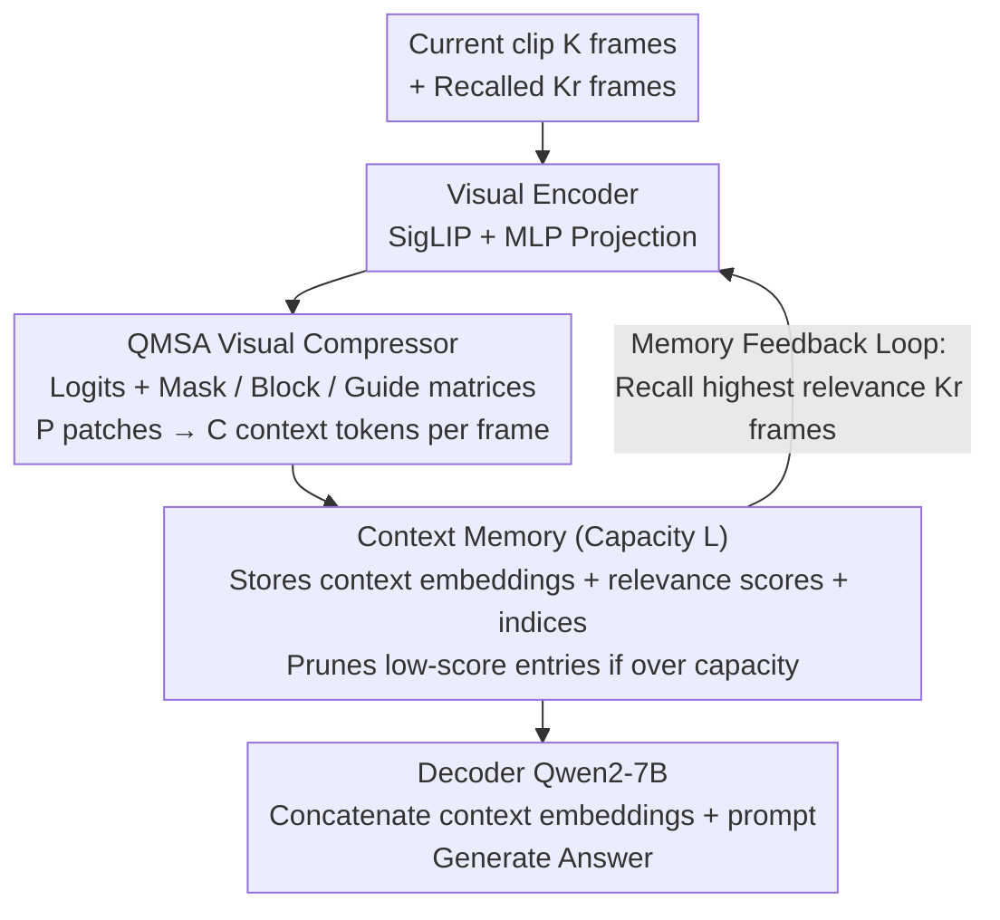

# Question-guided Visual Compression with Memory Feedback for Long-Term Video Understanding

**Conference**: CVPR2026  
**arXiv**: [2603.15167](https://arxiv.org/abs/2603.15167)  
**Code**: [FujitsuResearch/QViC-MF](https://github.com/FujitsuResearch/QViC-MF)  
**Area**: Video Understanding  
**Keywords**: Long-term video understanding, visual compression, memory feedback, question-guided attention, large multimodal models

## TL;DR

The QViC-MF framework is proposed, which achieves SOTA on multiple benchmarks including MLVU, LVBench, and VNBench using minimal visual tokens (16 per frame) through question-guided multi-frame visual compression (QMSA) and a context memory feedback mechanism.

## Background & Motivation

**Requirement for Long Video Understanding**: Real-world applications such as surveillance analysis and industrial process monitoring require models to understand videos spanning tens of minutes to hours. However, the limited context window of LMMs makes it difficult to process complete long videos.

**Limitations of Prior Work using Independent Frame Compression**: Transformer-based visual compressors and memory-enhanced methods typically compress each frame independently, failing to capture cross-frame temporal dependencies. This leads to poor performance in scenarios requiring understanding of complete events, such as temporal ordering tasks.

**Limitations of Unidirectional Perception $\to$ Memory Pipeline**: Traditional frameworks follow a pipeline where visual information is compressed, stored in memory, and then used for inference. Memory does not provide feedback to the perception layer. Once task-relevant information is missed during compression, it cannot be recovered.

**Memory Capacity Issues and Keyframe Loss**: Fixed-capacity memory under improper update strategies may lose visual details relevant to the question, affecting final inference quality.

**Compression Hallucination**: In naive self-attention designs, text token information leaks into context embeddings, causing compressed representations to include semantic content not present in the visual input.

**Question-Insensitive Attention**: When visual and text tokens are jointly fed into self-attention modules, context tokens struggle to adaptively focus on different visual regions based on the specific question.

## Method

### Overall Architecture

QViC-MF addresses the challenge of fitting long videos into the LMM context window by moving beyond the unidirectional "compression $\to$ storage $\to$ inference" pipeline to a closed-loop system where memory informs perception. Videos are processed as a stream of clips. Each clip is represented by minimal tokens, and a memory feedback mechanism retrieves historical frames relevant to the question to assist the compressor for the current clip.

The process involves five steps: ① The **Visual Encoder** concatenates the current clip ($K$ frames) with $K_r$ frames recalled from memory, extracts features via SigLIP So400m/14-384px, and projects them into visual embeddings $\mathcal{E}_{v,n} \in \mathbb{R}^{K_v \times P \times D_e}$ via an MLP; ② The **Visual Compressor** (a Transformer encoder core with QMSA) compresses $P$ patch tokens per frame into $C$ context tokens ($C \ll P$), taking concatenated visual, question, and learnable context seed embeddings as input; ③ **Context Memory** stores context embeddings for each frame along with relevance scores and global frame indices. If capacity $L$ is exceeded, entries with the lowest relevance scores are pruned; ④ **Memory Feedback** selects the $K_r$ frames with the highest relevance scores to be recalled for the next clip; ⑤ The **Decoder** (Qwen2-7B) concatenates all context embeddings from memory with the text prompt to generate the answer. Steps ②, ④, and ③ correspond to the key designs: QMSA, memory feedback loop, and relevance scoring.

### Key Designs

**1. Memory Feedback Loop: Enabling historical memory to inform current frame compression**

Traditional frameworks compress and store information without feedback to the perception layer. QViC-MF connects memory back to perception: after processing each clip, the most relevant $K_r$ frames are retrieved and encoded alongside the next clip. This ensures the current compression is aware of question-relevant clues found in history. Ablation studies show this is the largest source of gain—adding memory without feedback dropped MLVU from 48.8 to 42.4, while adding feedback increased it to 52.2.

**2. QMSA: Addressing frame-level compression, hallucination, and question adaptation via logit manipulation**

Naive self-attention mixing visual and text tokens causes blended cross-frame information, semantic leakage ("compression hallucination"), and non-adaptive focus. QMSA adds three operational matrices to the attention logits:

$$\text{QMSA}(\mathbf{Q}, \mathbf{K}, \mathbf{V}) = \text{softmax}\left(\frac{\mathbf{QK}^\top}{\sqrt{D_e}} + \mathbf{M} + \mathbf{B} + \mathbf{G}\right)\mathbf{V}$$

Where **Masking ($\mathbf{M}$)** extends causal masks to multiple frames, allowing cross-frame context while ensuring each frame's context tokens only attend to its own patches, achieving frame-level compression; **Blocking ($\mathbf{B}$)** severs the "context token $\to$ text token" attention path to prevent text semantics from leaking into visual representations; **Guiding ($\mathbf{G}$)** averages "text $\to$ visual" attention logits and broadcasts them as a bias for "context $\to$ visual" attention, making compression adaptively focus on question-relevant regions. Blocking provided the highest single contribution (+4.9 MLVU), while Guiding significantly aided sparse event localization in VNBench Long (+2.0).

**3. Relevance Score: Determining memory retention and recall**

Relevance score $r_{n,i}$ is calculated as the mean of the Top-$K_h$ heads of the "text $\to$ visual" attention weights from intermediate layers ($L_1$ to $L_2$). It is used for memory pruning and feedback ranking with almost zero extra computational overhead.

### Loss & Training

Only the context seed embeddings and the visual compressor are trained, while the base models remain frozen. The compressor is fine-tuned using LoRA on LLaVA-Video-7B-Qwen2. Training uses 83K samples randomly sampled from LLaVA-Video-178K (maintaining domain balance) on 8×H200 GPUs.

## Key Experimental Results

### Main Results

| Method | LLM | Token/Frame | MLVU test | LVBench | VideoMME Long | VNBench Long |
|------|-----|----------|-----------|---------|---------------|-------------|
| LLaVA-Video | Qwen2-7B | 169 | 53.3 | 41.8 | — | 40.4 |
| Flash-VStream | Qwen2-7B | 128 | — | 42.0 | 50.3 | — |
| Video-XL | Qwen2-7B | 16 | 45.5 | — | — | — |
| **QViC-MF (2fps)** | **Qwen2-7B** | **16** | **59.4** | **50.2** | **54.0** | **58.7** |

Using only 16 tokens per frame, QViC-MF outperforms the Prev. SOTA by 6.1% on MLVU test, 8.2% on LVBench, 18.3% on VNBench Long, and 3.7% on VideoMME Long.

### Ablation Study

| Setting | MLVU test | VNBench Long |
|------|-----------|-------------|
| Vanilla Compressor (64 frames) | 48.8 | 39.3 |
| + Context Memory | 42.4 | 40.9 |
| + Memory Feedback | 52.2 | 55.1 |
| + Framewise Mask ($\mathbf{M}$) | 53.0 | 50.7 |
| + Blocking Ctx2Txt ($\mathbf{B}$) | 57.9 | 56.7 |
| + Guiding Ctx2Vis ($\mathbf{G}$) | **59.4** | **58.7** |

### Key Findings

- **Memory feedback is the core driver of performance**: Simply adding memory (without feedback) decreased MLVU performance (48.8 $\to$ 42.4), while adding feedback significantly boosted it to 52.2.
- **QMSA components are synergistic**: Blocking provided the largest gain (+4.9 MLVU), while Guiding was particularly effective for VNBench Long (+2.0).
- **High precision under extreme compression**: Even when compressed to 1 token per frame, QMSA retains 80%+ of the original accuracy on MLVU, significantly outperforming independent compression and pooling baselines.
- **Task-specific gains**: Gains are most prominent in temporal reasoning tasks such as Ego Reasoning (71.7), Action Order (61.4), and Sports QA (58.3).

## Highlights & Insights

- **Feedback-driven perception-memory loop**: Breaks the traditional unidirectional pipeline, allowing historical context to inform visual compression. This represents a significant paradigm shift in long video understanding.
- **Sophisticated QMSA design**: Simultaneously addresses frame-level compression, compression hallucination, and question adaptation through three unified matrix operations.
- **Exceptional token efficiency**: Achieving state-of-the-art results with 16 tokens/frame, which is far lower than LLaVA-Video (169) and Flash-VStream (128), providing an excellent balance between efficiency and accuracy.
- **SOTA performance on VNBench (NIAH targets)**: Leading by 18.3% on the Long subset proves the feedback mechanism is highly effective for locating sparse key events.

## Limitations & Future Work

- Validated only on 7B models; the benefit for larger LLMs (13B/70B) remains unexplored.
- The streaming architecture relies on fixed clip sizes and recall counts, lacking adaptive sampling strategies.
- Sensitivity to hyperparameters like memory capacity $L=256$ and recall frames $K_r=32$ for different video lengths is not fully discussed.
- Training limited to 83K samples; generalization to larger or more diverse datasets requires further verification.
- Evaluation focused on MCQ tasks; does not yet address open-ended generation or grounding.

## Related Work & Insights

- **Memory-augmented LMMs**: MA-LMM, MovieChat, and Flash-VStream use unidirectional memory strategies; QViC-MF introduces the memory-to-perception feedback loop.
- **Visual Compression**: LLaMA-VID and LLaVA-Mini use independent frame compression; Video-XL uses summary tokens for long videos but lacks question-guidance.
- **Question-aware Encoding**: Q-Former (InstructBLIP) and IQViC explore question-guided compression for images/short videos but lack cross-frame temporal modeling.
- **Frame Selection**: Complementary strategies like Frame-Voyager reduce redundancy through keyframe selection.

## Rating

- Novelty: ⭐⭐⭐⭐ — The feedback loop is a new paradigm for long-video perception; QMSA offers a clever approach to attention manipulation.
- Experimental Thoroughness: ⭐⭐⭐⭐ — Extensive evaluation across four benchmarks with detailed ablation and case studies.
- Writing Quality: ⭐⭐⭐⭐ — Clear problem definition, intuitive visualizations (notably regarding compression hallucination), and rigorous technical descriptions.
- Value: ⭐⭐⭐⭐ — Significant performance leaps at high efficiency (16 tokens/frame) are highly relevant for practical deployment.

<!-- RELATED:START -->

<!-- RELATED:END -->

## Related Papers

- [\[ICLR 2026\] FLoC: Facility Location-Based Efficient Visual Token Compression for Long Video Understanding](../../ICLR2026/video_understanding/floc_facility_location-based_efficient_visual_token_compression_for_long_video_u.md)
- [\[CVPR 2026\] Temporally Consistent Long-Term Memory for 3D Single Object Tracking](chronotrack_temporally_consistent_long_term_memory_for_3d_single_object_tracking.md)
- [\[CVPR 2026\] VideoARM: Agentic Reasoning over Hierarchical Memory for Long-Form Video Understanding](videoarm_agentic_reasoning_over_hierarchical_memory_for_long-form_video_understa.md)
- [\[CVPR 2026\] MuKV: Multi-Grained KV Cache Compression for Long Streaming Video Question-Answering](mukv_multi-grained_kv_cache_compression_for_long_streaming_video_question-answer.md)
- [\[CVPR 2026\] StreamingTOM: Streaming Token Compression for Efficient Video Understanding](streamingtom_streaming_token_compression_for_efficient_video_understanding.md)

<!-- RELATED:END -->
