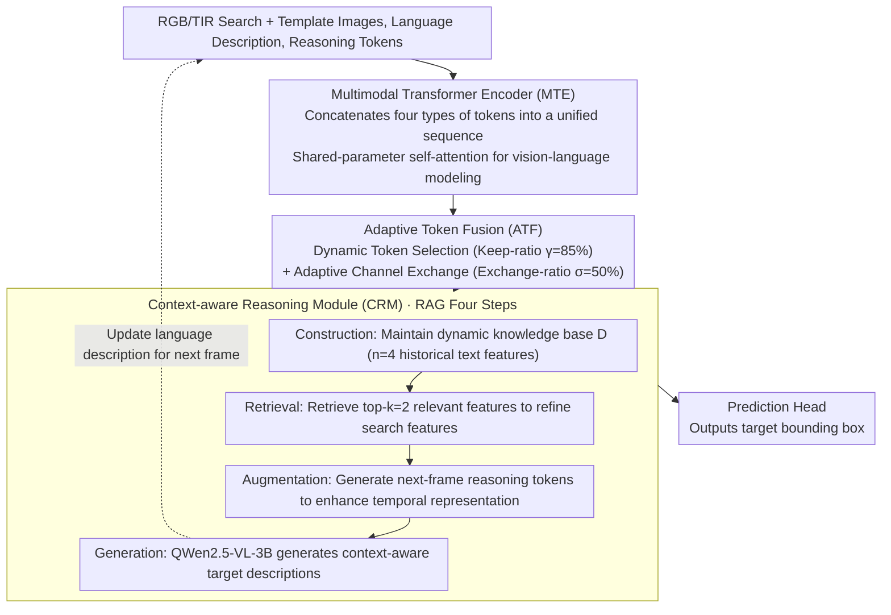

# RAGTrack: Language-aware RGBT Tracking with Retrieval-Augmented Generation

**Conference**: CVPR2026  
**arXiv**: [2603.03617](https://arxiv.org/abs/2603.03617)  
**Code**: [IdolLab/RAGTrack](https://github.com/IdolLab/RAGTrack)  
**Area**: Video Understanding / RGBT Tracking  
**Keywords**: RGBT Tracking, Retrieval-Augmented Generation, Multimodal Fusion, Language-guided Tracking, Adaptive Token Fusion

## TL;DR

Introduces text descriptions to RGBT tracking for the first time, proposing the RAGTrack framework based on Retrieval-Augmented Generation (RAG). By utilizing a multimodal Transformer encoder, adaptive token fusion, and a context-aware reasoning module, it achieves SOTA performance on four RGBT benchmarks.

## Background & Motivation

1. **Limitations of RGBT Tracking**: Existing RGBT trackers rely solely on first-frame visual information to model targets, making them prone to drifting when target appearance changes drastically.
2. **Inadequate Single-frame Templates**: Single template images cannot cover the complete appearance variations of a target from different perspectives, leading to limited semantic representation.
3. **Inherent Target Ambiguity**: Trackers may confuse foreground and background (e.g., brooms, dustpans, lower bodies of pedestrians) due to a lack of high-level semantic discriminative power.
4. **Search Area Redundancy**: Traditional methods process large amounts of redundant background regions and distractors at the token level, reducing tracking accuracy.
5. **Heterogeneous Modality Gap**: Significant feature differences between RGB and TIR modalities hinder effective cross-modal correspondence modeling.
6. **Lack of Language Annotations**: Existing RGBT tracking benchmarks lack text annotations, restricting research into language-guided tracking.

## Method

### Overall Architecture

RGBT tracking has long relied only on visual templates from the first frame for target modeling, which drifts under appearance changes or confuses the target with background elements (like brooms, dustpans, or lower bodies). RAGTrack introduces text descriptions to RGBT tracking for the first time and uses the Retrieval-Augmented Generation (RAG) paradigm to dynamically update target language descriptions across frames. It consists of three components: a Multimodal Transformer Encoder (MTE) for joint vision-language modeling, Adaptive Token Fusion (ATF) for cross-modal feature fusion and redundancy removal, and a Context-aware Reasoning Module (CRM) for temporal language reasoning via the RAG paradigm. Inputs include RGB/TIR search images, template images, and language descriptions, while the output is the target bounding box; new decriptions generated by an MLLM at the end of CRM flow back to the next frame, forming a cross-frame RAG reasoning loop.

### Key Designs

**1. Multimodal Transformer Encoder (MTE): Unified modeling by concatenating reasoning, text, template, and search tokens into a single sequence.**

To truly involve language in tracking, text and vision should not be computed separately. MTE first uses three-stage downsampling to divide template and search images into patch tokens. On the language side, a sequence prefix $\mathbf{E}^t$ (fixed text prompt + learnable tokens) is concatenated with the language description $\mathbf{L}^t$ and passed through a CLIP text encoder. Subsequently, reasoning tokens $\mathbf{R}_m^t$, text tokens $\hat{\mathbf{H}}^t$, template tokens $\hat{\mathbf{Z}}_m^t$, and search tokens $\hat{\mathbf{X}}_m^t$ are concatenated into a unified sequence. RGB/TIR branches perform joint vision-language modeling using shared-parameter multi-head self-attention, allowing text semantics to interact with visual tokens in the same attention space from the start.

**2. Adaptive Token Fusion (ATF): Parameter-free selection of target tokens followed by cross-modal exchange of critical channels.**

Search regions contain many redundant background areas and distractors, and the significant gap between RGB and TIR makes direct fusion unreliable. ATF handles this in two steps: **Dynamic Token Selection** reuses existing self-attention scores to calculate the total attention $\mathbf{A}_m^{total}$ of search tokens toward reasoning/text/template/search tokens, keeping target-related tokens according to a keep-ratio $\gamma=85\%$ without parameter overhead. **Adaptive Channel Exchange** computes cross-modal channel correlation $\mathbf{S}$ between RGB and TIR features, selecting critical channels for exchange based on an exchange-ratio $\sigma=50\%$, followed by MLP fusion. These steps are deployed at layers 6, 12, 18, and 24 of HiViT-B to achieve progressive cross-layer fusion. In fusion paradigm comparisons, ATF achieves better results than heavier solutions like TBSI (145.9M) with only 101.8M parameters.

**3. Context-aware Reasoning Module (CRM): Using RAG to retrieve historical descriptions and maintain target identity across frames.**

Single-frame template information is limited, causing tracking failure during drastic target changes. CRM introduces RAG to tracking through four rolling steps: **Construction** maintains a dynamic knowledge base $\mathbf{D}_m$ (storing $n=4$ historical text features), adding new features only when cosine similarity with existing entries is below threshold $\lambda=1.0$ to avoid redundancy; **Retrieval** retrieves the top-$k=2$ most relevant features from the base to refine search features via intra-modal cross-attention $\Phi$; **Augmentation** concatenates average-pooled reasoning/text/template features and passes them through an MLP to generate next-frame reasoning tokens, enhancing temporal representation via cross-attention and Hadamard product; **Generation** uses QWen2.5-VL-3B to dynamically generate context-aware target descriptions based on search images and structured prompts, continuously updating multimodal references. This RAG loop specifically benefits scenarios in LasHeR attribute analysis such as total occlusion (+10.7% PR) and out-of-view (+5.5% SR).

### Loss & Training

Multi-task joint loss $\mathcal{L} = L_{\text{cls}} + 2 L_{\text{iou}} + 5 L_1$, where Focal Loss is used for classification and L1 + GIoU loss for regression.

## Key Experimental Results

### Main Results

| Dataset | Metric | RAGTrack | Runner-up | Gain |
|---------|------|----------|----------|------|
| GTOT | MPR/MSR | **95.1/79.3** | DMD 94.2/78.6 | +0.9/+0.7 |
| RGBT210 | PR/SR | **93.2/67.1** | AETrack 90.4/66.3 | +2.8/+0.8 |
| RGBT234 | MPR/MSR | **93.8/69.5** | SUTrack 92.1/69.2 | +1.7/+0.3 |
| LasHeR | PR/NPR/SR | **76.8/73.0/61.1** | STTrack 76.0/−/60.3 | +0.8/−/+0.8 |

### Ablation Study (RGBT234)

| Configuration | MPR | MSR |
|------|-----|-----|
| Baseline | 87.9 | 64.5 |
| + CRM* (No text) | 89.1 | 65.0 |
| + MTE + CRM* | 91.1 | 66.7 |
| + MTE + CRM (With text) | 91.8 | 67.4 |
| + MTE + CRM + ATF (Full) | **93.8** | **69.5** |

### Comparison of Fusion Paradigms (RGBT234)

| Method | MPR | MSR | Parameters |
|------|-----|-----|--------|
| TBSI | 92.8 | 67.6 | 145.9M |
| BSI | 93.1 | 68.2 | 103.6M |
| DFM | 92.7 | 67.8 | 110.3M |
| ATF (Ours) | **93.8** | **69.5** | **101.8M** |

LasHeR attribute-level analysis shows: Total Occlusion (TO) +10.7% PR, Out-of-View (OV) +5.5% SR, demonstrating CRM's ability to maintain target identity under drastic appearance changes.

## Highlights & Insights

1. **First to introduce language descriptions to RGBT tracking**: Utilized MLLM to automatically generate text annotations, extending four existing benchmarks (annotating 514,081 descriptions for the LasHeR training set).
2. **Elegant ATF design**: Parameter-free token selection (reusing attention scores) + adaptive channel exchange achieves optimal fusion with minimal parameters.
3. **Novel RAG paradigm**: First to introduce Retrieval-Augmented Generation into RGBT tracking; dynamic knowledge base + reasoning token propagation achieves continuous temporal reasoning.
4. **Dynamic description generation via MLLM**: Overcomes the limitations of static language annotations by adaptively updating target descriptions across frames.

## Limitations & Future Work

1. **Inference Overhead**: Calling QWen2.5-VL-3B per frame to generate descriptions limits real-time performance; FPS is not reported in the paper.
2. **Text Annotation Reliance on MLLM Quality**: Automatically generated text may contain hallucinations; though manually verified, the cost of scaling to larger datasets is high.
3. **Validated only on RGBT**: The framework can theoretically be transferred to other multimodal tracking (e.g., RGB-Depth, RGB-Event), but this was not verified.
4. **Fixed Knowledge Base Size**: $n=4$ was set manually; adaptive size adjustment might further improve performance in long-video scenarios.
5. **Training Resources**: Trained on 4× V100; adaptation for lightweight deployment scenarios is unclear.

## Related Work & Insights

- **vs ViPT/BAT/SDSTrack (Visual Prompt Learning)**: These methods use only visual prompts to enhance tracking and lack language-level semantics; RAGTrack introduces text descriptions for more abstract target representation.
- **vs RGBL Tracking (CiteTracker/UVLTrack)**: RGBL methods face static vision-language misalignment; RAGTrack solves this via dynamic description generation with MLLM.
- **vs TrackingMiM (only other RAG-based tracking)**: TrackingMiM only reuses pre-stored features; RAGTrack achieves true RAG via a dynamic knowledge base and contextual reasoning.
- **vs SUTrack/AINet (Current SOTA)**: On RGBT234, ATF with 101.8M parameters outperforms SUTrack (384 resolution), showing superior efficiency.

## Rating

- Novelty: ⭐⭐⭐⭐ — First to introduce language descriptions and the RAG paradigm to RGBT tracking; the parameter-free token selection in ATF is cleverly designed.
- Experimental Thoroughness: ⭐⭐⭐⭐⭐ — Comprehensive SOTA across four benchmarks; ablations cover every component, hyperparameter, fusion paradigm, and attention score combinations.
- Writing Quality: ⭐⭐⭐⭐ — Clear structure, rich diagrams, and complete formula derivations.
- Value: ⭐⭐⭐⭐ — Opens a new language-guided direction for RGBT tracking, though real-time performance and deployment costs require attention.

<!-- RELATED:START -->

## Related Papers

- [\[NeurIPS 2025\] VGEnt: Graph-Based Retrieval-Reasoning-Augmented Generation for Long Video Understanding](../../NeurIPS2025/video_understanding/vgent_graph-based_retrieval-reasoning-augmented_generation_for_long_video_unders.md)
- [\[CVPR 2026\] Progressive Multi-cue Alignment for Unaligned RGBT Tracking](progressive_multi-cue_alignment_for_unaligned_rgbt_tracking.md)
- [\[CVPR 2026\] Spatio-Temporal Conditional Denoising Transformer for Modality-Missing RGBT Tracking](spatio-temporal_conditional_denoising_transformer_for_modality-missing_rgbt_trac.md)
- [\[CVPR 2026\] Interactive Tracking: A Human-in-the-Loop Paradigm with Memory-Augmented Adaptation](interactive_tracking_a_human-in-the-loop_paradigm_with_memory-augmented_adaptati.md)
- [\[CVPR 2026\] StreamRAG: Enhancing Real-Time Video Understanding with Retrieval Augmentation](streamrag_enhancing_real-time_video_understanding_with_retrieval_augmentation.md)

<!-- RELATED:END -->
