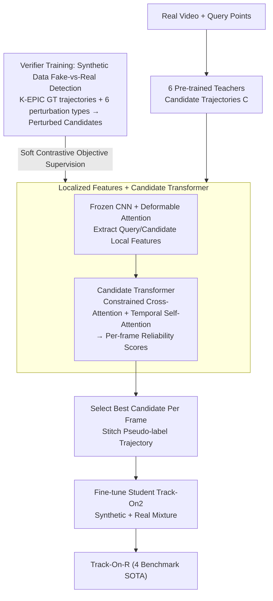

# Real-World Point Tracking with Verifier-Guided Pseudo-Labeling

**Conference**: CVPR 2026  
**arXiv**: [2603.12217](https://arxiv.org/abs/2603.12217)  
**Code**: [kuis-ai.github.io/track_on_r](https://kuis-ai.github.io/track_on_r)  
**Area**: Video Understanding / Point Tracking  
**Keywords**: point tracking, pseudo-labeling, verifier, multi-teacher ensemble, sim-to-real adaptation

## TL;DR

A learnable Verifier meta-model is proposed, trained on synthetic data to "judge tracker prediction reliability" and transferred to the real world. By evaluating predictions from 6 pre-trained teachers frame-by-frame to select the most reliable pseudo-labels, the Track-On-R model achieves comprehensive SOTA across 4 real-world benchmarks using only ~5K real videos for fine-tuning.

## Background & Motivation

**Background**: Long-range point tracking models (e.g., CoTracker, TAPIR, Track-On) are typically trained on synthetic data (TAP-Vid Kubric). Recent self-training methods (BootsTAPIR, CoTracker3) use pseudo-labels on real videos to bridge the sim-to-real gap.

**Limitations of Prior Work**:

1. The reliability of a single tracker varies significantly across different frames/scenes—each excels at specific challenges like fast motion, low texture, occlusion, or identity switches.
2. Naive self-training (randomly selecting one teacher for pseudo-labels) or fixed ensemble strategies cannot handle this heterogeneity and propagate systemic errors.
3. Methods like BootsTAPIR require millions of real videos for large-scale distillation, resulting in low data efficiency.

**Key Challenge**: Oracle experiments indicate that performance could improve significantly if the best tracker were chosen for each frame (revealing a large gap with current methods), but no automated method exists for such frame-level adaptive selection.

**Goal**: Learn to automatically determine the reliability of multiple trackers in every frame and select the most accurate prediction as a pseudo-label.

**Key Insight**: Train a "Verifier" meta-model—it does not perform tracking itself but learns "who tracks well." It learns reliability judgment on synthetic data by "distinguishing real from fake" (applying random perturbations to GT trajectories to simulate tracker errors).

**Core Idea**: The Verifier scores tracker predictions rather than tracking points, converting multi-model complementarity into high-quality pseudo-labels.

## Method

### Overall Architecture

This work addresses the sim-to-real gap in point tracking: tracking models trained on synthetic data (TAP-Vid Kubric) often degrade on real videos. Existing self-training methods either select teachers randomly or require massive datasets like BootsTAPIR. The core innovation is a Verifier meta-model acting as a "judge."

The process is: given a video and query points, 6 pre-trained teacher trackers generate candidate trajectories $\mathbf{C} \in \mathbb{R}^{L \times M \times 2}$. The Verifier assigns reliability scores $\hat{\mathbf{s}}_t \in \mathbb{R}^M$ to these $M$ candidates frame-by-frame, selects the highest-scoring candidate to assemble a complete pseudo-label trajectory, and fine-tunes the student model Track-On2. During inference, the Verifier serves as a plug-and-play ensemble module. The Verifier itself (localized features + Candidate Transformer) is pre-trained on synthetic data via "fake-vs-real" detection.

### Key Designs

**1. Verifier Training: Learning reliability through synthetic "fake-vs-real" without real labels**

The Verifier must learn "who tracks accurately" without real-world GT. Training signals are generated on the K-EPIC synthetic dataset (11K videos): 6 types of random perturbations (drift, jumps, occlusion, identity switches, 1–128 pixel displacement) are applied to GT trajectories to simulate failures. The objective is "higher scores for candidates closer to GT," using a soft contrastive target distribution $\mathbf{s}_t = \text{Softmax}(-\|\mathbf{C}_t - \mathbf{p}_t\| / \tau_s)$ ($\tau_s = 0.1$). Loss is cross-entropy masked for occluded frames $\mathcal{L} = \sum_t v_t \cdot \text{CE}(\hat{\mathbf{s}}_t, \mathbf{s}_t)$. As it learns scene-independent reliability judgment, it transfers easily to the real domain.

**2. Localized Features + Candidate Transformer: Localized observation with temporal context**

The Verifier does not need global reasoning. It uses a frozen CNN encoder from CoTracker3 to extract dense features $\mathbf{F}_t \in \mathbb{R}^{H' \times W' \times D}$ and extracts local features at the query and candidate locations using deformable attention. Positional encoding uses sinusoidal encoding of the displacement $\boldsymbol{\Delta}_t = \mathbf{C}_t - \mathbf{q}_{t_0}$ and learnable identity tokens. The Candidate Transformer uses constrained cross-attention (querying candidates within the same frame) and temporal self-attention to output a temperature-scaled softmax distribution $\hat{\mathbf{s}}_t = \text{Softmax}(\mathbf{f}_t^q \cdot \mathbf{f}_t / \tau)$ ($\tau = 0.1$).

**3. Verifier-Guided Real-World Fine-Tuning: High efficiency via pseudo-labels**

The Verifier converts teacher complementarity into high-quality pseudo-labels. The 6 teachers are Track-On2, BootsTAPIR, BootsTAPNext, Anthro-LocoTrack, AllTracker, and CoTracker3 (window). Real videos are sourced from TAO + OVIS + VSPW (4864 unlabeled segments). Query points are sampled from SIFT (2/3) and motion-salient regions (1/3), with visibility estimated via majority voting. Training uses a mixture of synthetic (GT) and real data (Verifier pseudo-labels), gradually increasing the weight of real data. With only ~5K videos, it outperforms BootsTAPIR (~1M videos), a 100x improvement in data efficiency.

### Loss & Training

Verifier training uses cross-entropy on soft reliability targets with occlusion masking. Student fine-tuning uses standard point tracking losses (L1 for position + BCE for visibility). The student baseline is Track-On2 pre-trained on TAP-Vid Kubric.

## Key Experimental Results

### Main Results

Real-world point tracking benchmark comparison:

| Model | EgoPoints $\delta_{avg}$ | RoboTAP AJ | Kinetics AJ | DAVIS AJ | Type |
| :--- | :--- | :--- | :--- | :--- | :--- |
| Track-On2 | 61.7 | 68.1 | 55.3 | 67.0 | Synthetic Pre-trained |
| BootsTAPIR | 55.7 | 64.9 | 54.6 | 61.4 | Real Fine-tuned (1M+) |
| BootsTAPNext-B | 33.6 | 64.0 | 57.3 | 65.2 | Real Fine-tuned (1M+) |
| CoTracker3 | 54.0 | 66.4 | 55.8 | 63.8 | Real Fine-tuned |
| AllTracker† | 62.0 | 68.8 | 56.8 | 63.7 | Extra Flow Data |
| **Track-On-R (Ours)** | **67.3** | **70.9** | **57.8** | **68.1** | Real Fine-tuned (~5K) |

### Ablation Study

**Verifier Ensemble vs. Individual Teachers ($\delta_{avg}$ / AJ on DAVIS & RoboTAP)**:

| Method | DAVIS $\delta_{avg}$ | RoboTAP $\delta_{avg}$ |
| :--- | :--- | :--- |
| Random Teacher | 79.5 | 77.4 |
| Best Single Teacher | ~79-80 | ~80 |
| **Verifier Selection** | **80.6** | **81.8** |

**Teacher Count**: Increasing teachers monotonically improves Verifier performance—adding weak teachers does not degrade the Verifier (unlike the random selection baseline).

**Data Efficiency**: Most gains are achieved with only ~3K videos (TAO subset), far fewer than BootsTAPIR's millions.

**Verifier vs. Non-learning Ensembles**: The Verifier outperforms all non-learning baselines like Geometric Median, Consensus Voting, and Kalman Filtering.

### Key Findings

- Track-On-R achieves SOTA across all 4 benchmarks; on EgoPoints, $\delta_{avg}$ of 67.3 exceeds AllTracker by 5.3 points.
- Real-world fine-tuning does not hurt synthetic benchmark performance and actually improves PointOdyssey $\delta_{avg}$ by +8.3.
- Different teachers perform inconsistently across datasets (e.g., BootsTAPNext is worst on RoboTAP but second on DAVIS), validating the need for adaptive selection.

## Highlights & Insights

- The Verifier as a "meta-model" is elegant—it converts teacher complementarity into high-quality supervision rather than tracking itself.
- Oracle gap analysis (Fig. 2) powerfully demonstrates the potential of adaptive selection.
- Path perturbation design (6 modes) effectively covers real-world tracker failures while remaining entirely synthetic.
- Extreme data efficiency (~3K videos is sufficient) is a significant practical advantage.
- The Verifier can function as a plug-and-play ensemble module during inference without additional tuning.

## Limitations & Future Work

- The Verifier's ceiling is limited by the teacher set; if all teachers fail in a frame, the Verifier cannot recover.
- Using 6 teachers during inference is computationally expensive (6x cost).
- Current verification is limited to point tracking; applicability to optical flow or VOS requires further exploration.
- Fine-tuning depends on real-world video quality; performance in extreme out-of-distribution domains (e.g., underwater, thermal) is unknown.

## Related Work & Insights

- **vs. CoTracker3**: Both use pseudo-labels, but CoTracker3 uses random selection. The performance gap (Kinetics AJ 55.8 vs. 57.8) highlights the importance of pseudo-label quality.
- **vs. BootsTAPIR/BootsTAPNext**: Large-scale student-teacher distillation requires millions of videos; Ours exceeds them with ~5K videos.
- **vs. AllTracker**: Even with real optical flow labels, AllTracker (62.0) trails Ours (67.3) on EgoPoints, suggesting Verifier pseudo-labels might surpass manual flow labels.
- **Insight**: The Verifier logic is transferable to any multi-teacher distillation scenario (Detection, Segmentation) to select the most confident teacher per sample.

## Rating

- Novelty: ⭐⭐⭐⭐⭐ The Verifier meta-model shifts reliability estimation from heuristics to a learnable paradigm.
- Experimental Thoroughness: ⭐⭐⭐⭐⭐ Comprehensive evaluation across 4 real and 2 synthetic benchmarks with extensive baselines.
- Writing Quality: ⭐⭐⭐⭐⭐ Excellent Oracle analysis and clear methodology figures.
- Value: ⭐⭐⭐⭐⭐ High data efficiency and a generalizable approach provide significant insights for self-training and pseudo-labeling.

<!-- RELATED:START -->

## Related Papers

- [\[CVPR 2026\] Generative Point Tracking and Forecasting](generative_point_tracking_and_forecasting.md)
- [\[CVPR 2026\] OmniGround: A Comprehensive Spatio-Temporal Grounding Benchmark for Real-World Complex Scenarios](omniground_a_comprehensive_spatio-temporal_grounding_benchmark_for_real-world_co.md)
- [\[CVPR 2026\] MV-TAP: Tracking Any Point in Multi-View Videos](mv-tap_tracking_any_point_in_multi-view_videos.md)
- [\[NeurIPS 2025\] Lattice Boltzmann Model for Learning Real-World Pixel Dynamicity](../../NeurIPS2025/video_understanding/lattice_boltzmann_model_for_learning_real-world_pixel_dynamicity.md)
- [\[CVPR 2026\] TAPFormer: Robust Arbitrary Point Tracking via Transient Asynchronous Fusion of Frames and Events](ttapformer_robust_arbitrary_point_tracking_via_transient_asynchronous_fusion_of_.md)

<!-- RELATED:END -->
