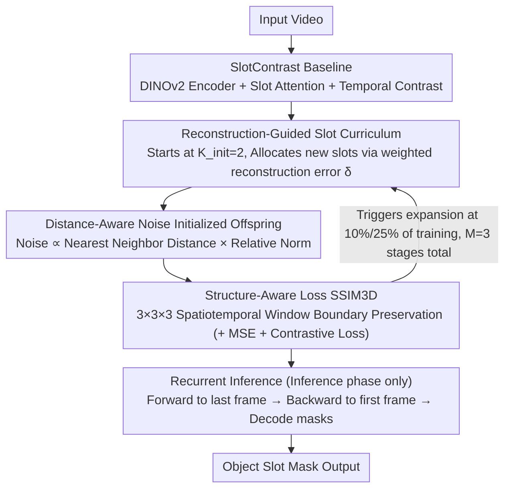

# Reconstruction-Guided Slot Curriculum: Addressing Object Over-Fragmentation in Video Object-Centric Learning

**Conference**: CVPR 2026  
**arXiv**: [2603.22758](https://arxiv.org/abs/2603.22758)  
**Code**: [GitHub](https://github.com/wjun0830/SlotCurri)  
**Area**: Video Understanding / Object-Centric Learning  
**Keywords**: Object-Centric Representation, Over-Fragmentation, Curriculum Learning, Slot Attention, Video Segmentation

## TL;DR

This paper proposes SlotCurri, a reconstruction-guided curriculum learning strategy for slot quantity. By starting training with minimal slots and incrementally expanding slot capacity only in regions with high reconstruction errors, combined with structure-aware loss and recurrent inference, it effectively addresses the over-fragmentation problem in video object-centric learning where a single object is incorrectly split across multiple slots. It achieves a +6.8 FG-ARI improvement on YouTube-VIS.

## Background & Motivation

Video Object-Centric Learning (VOCL) aims to decompose raw video into compact object slot representations, providing a foundation for downstream tasks like scene understanding and video segmentation. However, existing methods suffer from severe **over-fragmentation**:

- **Key Challenge**: Models are implicitly encouraged to utilize all available slots to minimize reconstruction objectives—larger slot budgets typically yield higher reconstruction quality, thus causing multiple slots to collaboratively represent the same object.
- **Limitations of Prior Work**: A single object is split into multiple slots, destroying the one-to-one correspondence between slots and objects, which impacts interpretability and computational efficiency.
- **Existing Solutions**: SOLV adopts a strategy of over-producing slots followed by merging, but the merging stage may fail (as contrastive learning pushes slots toward different representations).

**Key Insight**: Rather than repairing fragmentation post-hoc, it is better to prevent it from the source by treating the number of slots as a curriculum variable that increases progressively. This ensures new slots are allocated only to regions that truly require more expressive capacity.

## Method

### Overall Architecture

This paper addresses the counter-intuitive side effect in VOCL: providing more slots improves reconstruction but leads to models splitting one object across multiple slots. SlotCurri limits the slot supply from the beginning. Using SlotContrast as a baseline, it makes the slot count a curriculum variable starting from a minimum ($K_{\text{init}}=2$) and expanding only into regions with the "worst current reconstruction." The training overlays three new components on top of SlotContrast's temporal consistency contrastive learning: a reconstruction-guided slot curriculum, a structure-aware reconstruction loss (SSIM3D), and inference-only recurrent inference.

### Key Designs

**1. Reconstruction-Guided Slot Curriculum: Growing slots only in "under-represented" areas**

Models over-fragment because they are implicitly encouraged to use all slots to lower reconstruction error. SlotCurri limits supply at the source: training starts with $K_{\text{init}}=2$ slots and expands through $M=3$ stages to reach the baseline quantity. The allocation of "new slots" is not random. At each stage transition, the weighted reconstruction error is calculated for each slot: $\delta^{(k)} = \sum_{t,h,w} \alpha^{(k,t,h,w)} \cdot \mathcal{L}_{\text{MSE}}^{(t,h,w)}$. New slots are allocated to existing slots proportional to this error. For example, a slot covering a large area with high residuals will split into offspring, while a slot that has reconstructed the background cleanly is preserved. Added capacity is directed to where it is truly needed.

Offspring slot initialization uses **distance-aware noise perturbation**:

$$\hat{\mathbf{s}}^{(k^*)} = \hat{\mathbf{s}}^{(k)} + \beta \cdot d_{\text{nearest}}^{(k)} \cdot \frac{\|\hat{\mathbf{s}}^{(k)}\|}{\mu_{\text{norm}}} \cdot \mathbf{v}$$

The noise magnitude is proportional to the distance $d_{\text{nearest}}^{(k)}$ to the nearest neighbor and its relative feature norm. This ensures offspring inherit learned information while being pushed to explore under-represented regions, preventing them from becoming redundant copies—the primary cause of fragmentation.

**2. Structure-Aware Reconstruction Loss SSIM3D: Maintaining boundaries during low-slot stages**

Pixel-wise MSE treats pixels independently, which tends to smooth spatial details and boundaries. This is particularly problematic in early curriculum stages with few slots. SlotCurri adds an SSIM3D loss over a $3\times3\times3$ spatiotemporal window to explicitly preserve local contrast and edges. The total loss is $\mathcal{L} = \mathcal{L}_{\text{MSE}} + \lambda_{\text{SSC}} \mathcal{L}_{\text{SSC}} + \lambda_{\text{SSIM3D}} \mathcal{L}_{\text{SSIM3D}}$. This works in tandem with the curriculum: sharpening semantic boundaries early allows subsequent slot expansion to build upon cleanly separated objects.

**3. Recurrent Inference: Utilizing future context for early frames**

Early frames in a video lack future context, making slot representations unstable. Recurrent inference is introduced only during the inference phase: slots are propagated forward to the last frame, then propagated backward to the first frame. The backward-propagated slots are used for decoding. This allows initial frames to "borrow" future information from the entire video with negligible cost (+0.3% inference time).

### Loss & Training

- Total Loss: MSE Reconstruction + SlotContrast + SSIM3D.
- Curriculum Schedule: Slot expansion at 10% and 25% of total iterations.
- Accelerated slot growth rule: $K^{(m)} = K_{\text{init}} + m \cdot \sigma + 3m(m-1)/2$.
- $\sigma$ adjusted by dataset (YouTube-VIS: 1, MOVi-C: 3, MOVi-E: 5), ensuring the final slot count matches the baseline.
- Hyperparameters: $\beta=0.2$, $\lambda_{\text{SSIM3D}}=0.05$.
- Hardware: 2 × NVIDIA RTX A6000.

## Key Experimental Results

### Main Results

| Method | YouTube-VIS FG-ARI↑ | YouTube-VIS mBO↑ | MOVi-C FG-ARI↑ | MOVi-E FG-ARI↑ |
|------|---------------------|-------------------|-----------------|-----------------|
| STEVE | 15.0 | 19.1 | 36.1 | 50.6 |
| VideoSAUR | 28.9 | 26.3 | 64.8 | 73.9 |
| SlotContrast | 38.0 | 33.7 | 69.3 | 82.9 |
| **Ours (SlotCurri)** | **44.8±1.2** | **35.5±2.2** | **77.6±0.9** | **83.7±0.2** |

Comparison with anti-fragmentation methods (Image FG-ARI):

| Method | MOVi-C | MOVi-E |
|------|--------|--------|
| AdaSlot | 75.6 | 76.7 |
| SOLV | — | 80.8 |
| **Ours (SlotCurri)** | **81.6** | **84.9** |

### Ablation Study

Component contributions on YouTube-VIS:

| Simple Curriculum | Reconstruction-Guided | SSIM | Recurrent Inference | FG-ARI | mBO |
|----------|----------|------|----------|--------|-----|
| — | — | — | — | 36.1 | 32.7 |
| ✓ | — | — | — | 38.8 | 32.3 |
| — | ✓ | — | — | 42.6 | 33.7 |
| — | ✓ | ✓ | — | 43.6 | 35.2 |
| — | ✓ | ✓ | ✓ | **44.8** | **35.5** |

Hyperparameter sensitivity:
- Curriculum stages $M$: $M=3$ is optimal (44.8). $M=2$ is insufficient (41.5).
- Perturbation $\beta$: $\beta=0.2$ is optimal. Too small (0.1: 42.8) leads to redundant offspring; too large (0.3: 40.2) destroys information.

### Key Findings

- Simple curriculum (random initialization of new slots) provides +2.7 FG-ARI, proving progressive expansion itself is effective.
- Reconstruction guidance contributes an additional +3.8, showing targeted allocation is significantly better than random.
- Over-fragmentation metric (DOF@0.5) decreased from 1.38 to 1.26, validating fragmentation reduction.
- Object Identification Recall (OIR@0.5) improved from 24.9% to 30.3%.
- Gains on MOVi-E are smaller as it primarily challenges under-fragmentation (many small objects) rather than over-fragmentation.

## Highlights & Insights

- **Design Philosophy**: "Prevention is better than cure"—controls slot allocation at the source rather than merging post-hoc.
- **Distance-Aware Initialization**: Carefully designed noise ensures offspring inherit parent traits while successfully exploring new regions.
- **Synergy**: SSIM helps sharpen semantic boundaries during the low-slot early stages, providing a cleaner foundation for subsequent expansion.
- **Efficiency**: Recurrent inference is extremely lightweight (+0.3% time) but effectively resolves context deficiencies in early frames.

## Limitations & Future Work

- Limited gains in scenarios requiring fine-grained segmentation of many small objects (under-fragmentation).
- Curriculum stages and expansion timing are currently fixed manual settings; adaptive scheduling remains to be explored.
- Initial slot count is fixed at 2, which might lack capacity for scenes with extremely high object density.
- Compatibility with vision foundation models other than DINOv2 is unknown.

## Related Work & Insights

- **Comparison with SOLV**: SOLV over-produces then merges; SlotCurri constrains then expands—the latter is more fundamental for prevention.
- **Curriculum Learning**: Traditional curriculum uses sample difficulty (Bengio 2009); this work innovatively uses slot quantity as the curriculum variable.
- **Mechanism**: Reconstruction-guided capacity expansion could be generalized to other structured representation learning tasks (e.g., node expansion in graph neural networks).

## Rating

- **Novelty**: ⭐⭐⭐⭐ — Slot quantity curriculum is a novel and effective solution for over-fragmentation.
- **Experimental Thoroughness**: ⭐⭐⭐⭐⭐ — Comprehensive ablation and testing across three datasets with new quantitative metrics for fragmentation.
- **Writing Quality**: ⭐⭐⭐⭐⭐ — Clear motivation and intuitive methodology.
- **Value**: ⭐⭐⭐⭐ — Provides a practical training paradigm for the VOCL community.

<!-- RELATED:START -->

## Related Papers

- [\[CVPR 2025\] Temporally Consistent Object-Centric Learning by Contrasting Slots](../../CVPR2025/video_understanding/temporally_consistent_object-centric_learning_by_contrasting_slots.md)
- [\[ICLR 2026\] From Vicious to Virtuous Cycles: Synergistic Representation Learning for Unsupervised Video Object-Centric Learning](../../ICLR2026/video_understanding/from_vicious_to_virtuous_cycles_synergistic_representation_learning_for_unsuperv.md)
- [\[CVPR 2026\] TGTrack: Temporal Generative Learning for Unified Single Object Tracking](tgtrack_temporal_generative_learning_for_unified_single_object_tracking.md)
- [\[CVPR 2026\] Robust Promptable Video Object Segmentation](robust_promptable_video_object_segmentation.md)
- [\[AAAI 2026\] Predicting Video Slot Attention Queries from Random Slot-Feature Pairs](../../AAAI2026/video_understanding/predicting_video_slot_attention_queries_from_random_slot-feature_pairs.md)

<!-- RELATED:END -->
