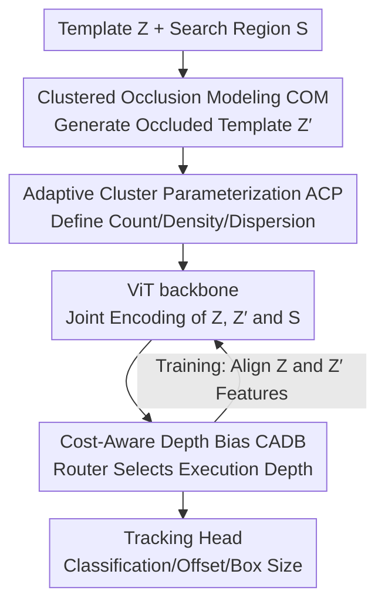

# Rethinking Occlusion Modeling for UAV Tracking

**Conference**: CVPR 2026  
**Paper**: [CVF Open Access](https://openaccess.thecvf.com/content/CVPR2026/html/Zhang_Rethinking_Occlusion_Modeling_for_UAV_Tracking_CVPR_2026_paper.html)  
**Code**: None  
**Area**: Video Understanding  
**Keywords**: UAV Tracking, Occlusion Modeling, Clustering Mask, Dynamic Depth, Single-stream Transformer

## TL;DR
Addressing the "clustered" nature of real-world occlusions in UAV perspectives, this paper generates spatially correlated occlusion masks (COM) via cluster sampling to train robust representations. Combined with a cost-aware depth bias (CADB) that ties inference to layer costs for automatic shallow-layer termination, the resulting OCTrack achieves a balance between accuracy and a real-time speed of 265 FPS across four UAV benchmarks.

## Background & Motivation

**Background**: UAV visual tracking has evolved from Discriminative Correlation Filters (DCF) to Transformer-based single-stream architectures (e.g., MixFormer, OSTrack, DropMAE), unifying template feature extraction and template-search interaction within a single network. Recent works (AVTrack, SGLATrack, Aba-ViTrack) have integrated adaptive token scheduling and dynamic depth control into single-stream models to pursue real-time inference under constrained onboard computational power.

**Limitations of Prior Work**: UAV scenarios involve small targets, abrupt motions, and frequent occlusions that disrupt spatio-temporal continuity. Current Transformer trackers generally treat occlusion enhancement as "random information loss"—masking patches independently and uniformly. This approach ignores the structural nature of real occlusions: in UAV top-down views, occlusions from buildings, vegetation, or traffic are **spatially clustered, locally correlated, and scale-continuous**, simultaneously erasing both target appearance and surrounding contextual cues, leading to inconsistent representations and localization jitter.

**Key Challenge**: The first challenge is the gap between "synthetic occlusion" and the "physical properties of real occlusion"—random masking fails to simulate clustered occlusions. The second is the trade-off between "accuracy and efficiency"—ViT computational complexity scales linearly with depth, where deep features are redundant with diminishing marginal returns, yet existing dynamic inference (via correlation activation or layer skipping) lacks an explicit model for "computational preference," making it difficult to adapt to scene complexity.

**Key Insight**: The authors re-conceptualize occlusion as a "structured process governed by spatial dependencies." While existing work (ORTrack) introduced some spatial correlation via spatial Cox processes, it assumes a continuous intensity field and cannot characterize spatial clusters in real scenes. Consequently, the authors start from the observation that "occlusions appear in clusters" to generate controllable, clustered, and semantically consistent masks.

**Core Idea**: Instead of "random masking + fixed depth," the paper proposes "clustered occlusion modeling + cost-aware depth bias." This simultaneously trains representations robust to structured occlusion and allows inference depth to contract as needed, achieving both robustness and real-time performance.

## Method

### Overall Architecture
OCTrack is a single-stream Transformer tracker consisting of a ViT backbone and a lightweight center-based prediction head. Inputs are the target template $Z\in\mathbb{R}^{3\times H_z\times W_z}$ and search region $S\in\mathbb{R}^{3\times H_s\times W_s}$. During training, COM first creates a clustered-occlusion version of the template $Z'=\mathcal{M}_{com}(Z)$. The original template, occluded template, and search region are partitioned into patch tokens for joint encoding in the backbone. COM forces the model to learn "occlusion-invariant" representations by aligning the features of $Z$ and $Z'$. Within the backbone, CADB inserts a router to decide the execution depth based on a "computation-sensitive prior," allowing simple frames to terminate at shallow layers while difficult frames proceed deeper. Finally, fused features are passed to the tracking head to output classification confidence maps, regression offsets, and box sizes. Crucially, COM operates only during training with zero inference overhead, while CADB saves computation during inference by activating only selected layers.

### Key Designs

**1. Clustered Occlusion Modeling (COM): Replacing Random Masking with Clustered Sampling**

Random masking discards patches independently, failing to simulate real UAV scenarios where "a single building or group of trees blocks both the target and context." COM models occlusion as a controllable clustered spatial process. Given a template feature map $Z\in\mathbb{R}^{C\times H\times W}$ and a mask ratio $\rho\in(0,1)$, the number of masked patches is $K=\lfloor\rho HW\rfloor$. The spatial occlusion intensity is modeled as a mixture of Gaussian fields:

$$\pi(p)\propto\sum_{i=1}^{N_p} w_i\exp\!\left(-\frac{\lVert p-c_i\rVert^2}{2\sigma^2}\right)$$

where the number of clusters $N_p\sim\text{Poisson}(\lambda_p HW)$, cluster centers $c_i$ are sampled, and the intensity per cluster is $w_i\sim\text{Poisson}(\mu)$. For each cluster, $w_i$ occlusion points are generated according to $p_{i,j}\sim\mathcal{N}(c_i,\sigma^2 I_2)$. The union of all points forms the final mask $M$, with random downsampling applied if necessary to maintain the ratio $\rho$. Compared to the fixed continuous fields of Cox processes, COM generates "centers first, then clusters around centers," providing natural spatial aggregation and scale continuity.

**2. Adaptive Cluster Parameterization (ACP): Adjusting Occlusion Styles**

Different feature map sizes and occlusion intensities require different morphologies. ACP parameterizes this via a triplet $P=(\lambda_p, \mu, \sigma)$: $\lambda_p$ determines the expected cluster count, $\mu$ controls the average intensity per cluster, and $\sigma$ adjusts spatial dispersion. The paper defines three styles: **dense** (30 clusters, small $\sigma$, for small/dense occlusions), **balanced** (10 clusters, medium $\sigma$), and **sparse** (3 clusters, large $\sigma$, for large-block occlusions), where $\sigma$ scales with $\min(H,W)$. This exposes the model to a continuous distribution of occlusions during training.

**3. Occlusion-Robust Representation Alignment: Training Invariance**

To translate COM into robustness, a representation alignment objective is added: original and occluded templates are processed by the same network, minimizing the discrepancy of their features at layer $L$:

$$\mathcal{L}=\big\lVert t^{(L)}_{Z}-t^{(L)}_{Z'}\big\rVert_2^2$$

where $t^{(L)}_{Z}$ and $t^{(L)}_{Z'}$ are the feature representations of $Z$ and $Z'=\mathcal{M}_{com}(Z)$, respectively. This term forces representation alignment before and after occlusion, suppressing appearance drift and preserving semantic consistency with zero inference overhead.

**4. Cost-Aware Depth Bias (CADB): Embedding Computational Preference**

Existing layer-skipping strategies focus on task relevance but ignore the preference for shallower execution. CADB treats layer selection as a biased routing process. A two-layer MLP router reads the first token (global descriptor) from a reference layer $i_{ref}$ and outputs importance scores $y=f(x)\in\mathbb{R}^L$ for $L$ candidate layers. A cost bias that decreases with depth is applied:

$$b_i=\kappa\left[1-2(i-i_{ref})/(L-1)\right]$$

where $\kappa>0$ controls the strength of the shallow-layer bias. The final routing probability is $p=\text{softmax}((y+b)/\tau)$. During training, a pseudo-label $t_i$ (one-hot) is generated from the layer with the highest cosine alignment score $s_i$ relative to the reference layer. The router is optimized via bias-corrected cross-entropy:

$$\mathcal{L}_{route}=-\sum_{i=1}^{L} t_i\log\frac{\exp(y_i+b_i)}{\sum_{j=1}^{L}\exp(y_j+b_j)}$$

### Loss & Training
The tracking head predicts classification maps $p$, offsets $o$, and normalized sizes $s$. The total loss combines tracking objectives with routing regularization:

$$\mathcal{L}=\mathcal{L}_{cls}+\lambda_{iou}\mathcal{L}_{iou}+\lambda_{L1}\mathcal{L}_{L1}+\gamma\mathcal{L}_{route}$$

Weights are set to $\lambda_{iou}=2, \lambda_{L1}=5, \gamma=0.1$. Training uses GOT-10k, LaSOT, COCO, and TrackingNet with AdamW optimization. Lightweight backbones include DeiT-Tiny, ViT-Tiny, and Eva-Tiny.

## Key Experimental Results

### Main Results
On four UAV benchmarks (DTB70, UAVDT, VisDrone2018, UAV123), OCTrack-DeiT achieves a balance of accuracy and speed (FPS measured on GPU):

| Method | Source | Avg P(%) | Avg AUC(%) | GPU FPS | Params(M) |
|------|------|-----------|-------------|---------|-----------|
| RACF (DCF) | PR'22 | 75.9 | 51.8 | – | – |
| DRCI (CNN) | ICME'23 | 81.4 | 60.1 | 281.3 | 8.8 |
| AVTrack | ICML'24 | 84.2 | 63.8 | 210.5 | 7.9 |
| ORTrack (Cox) | CVPR'25 | 85.6 | 65.0 | 182.6 | 7.9 |
| SGLATrack | CVPR'25 | – | – | 243.9 | 5.8 |
| **OCTrack-b** | Ours | **86.0** | **65.7** | **265.2** | 5.8–8 |

OCTrack-b achieved the best results on UAVDT with 85.0% Prec. and 63.0% AUC. On the "Partial Occlusion" subset of UAVDT, OCTrack-DeiT achieved 0.656 AUC, outperforming the runner-up by 3%.

### Ablation Study
Component ablation on UAVDT:

| Backbone | COM | CADB | P(%) | AUC(%) | FPS |
|----------|-----|------|------|--------|-----|
| OCTrack-DeiT | | | 80.4 | 59.6 | 197.6 |
| OCTrack-DeiT | ✓ | | 85.2 (+4.8) | 62.9 (+3.3) | – |
| OCTrack-DeiT | ✓ | ✓ | 85.0 (+4.6) | 63.0 (+3.4) | 265.2 (+34%) |

Masking strategy comparison on VisDrone2018:

| Mask Strategy | AUC(%) | Description |
|----------|--------|------|
| MAE Random | 62.9 | Independent patch dropping (Worst) |
| CutMix | 63.6 | Region-level, no spatial clustering |
| **COM** | **67.0** | Clustered mask (Best) |

## Key Findings
- **COM is the primary driver of accuracy**: It brings significant gains across all backbones, proving clustered masks are superior to random/semantic masks for regularizing feature learning under occlusion.
- **CADB is the primary driver of efficiency**: It increases GPU throughput by up to 34% with negligible accuracy loss, indicating many frames can be processed with shallow features.
- **Bias intensity $\kappa$ allows controllable trade-offs**: Higher $\kappa$ pushes routing toward shallower layers, increasing FPS at the cost of slight AUC variations. $\kappa=0.3$ is the recommended trade-off.

## Highlights & Insights
- **Modeling Occlusion's Statistical Structure**: The shift from "random patch dropping" to a "clustered Gaussian mixture" accurately reflects real top-down views where buildings or trees block continuous regions.
- **Dynamic Routing via Dual Constraints**: CADB effectively balances performance and efficiency by pitting a "shallow-pushing" bias against a "depth-pulling" alignment supervision, requiring no complex reinforcement learning.
- **Decoupled Training/Inference Optimization**: COM improves robustness without affecting speed, while CADB improves speed without hurting robustness. Both are modular and transferable to other ViT-based tasks.

## Limitations & Future Work
- **Manual Occlusion Styles**: The dense/balanced/sparse presets are fixed rather than being fully adaptive to per-frame scene statistics.
- **Hard Routing Depth**: Under hard routing, the model might converge to selecting a specific layer globally rather than achieving true frame-by-frame depth diversity. 
- **Open Source Tracking**: The lack of a code link requires manual implementation of the ACP sampling and routing logic.

## Related Work & Insights
- **vs. ORTrack (CVPR'25)**: While both use spatial structures, COM's clustered approach better captures discrete object-like occlusions compared to ORTrack’s continuous fields, yielding a 1.1% AUC gain on VisDrone2018.
- **vs. MAE/DropMAE**: Random masking treats occlusion as noise; COM demonstrates that ignoring the structural nature of occlusion in UAV scenarios leads to suboptimal performance (62.9% vs 67.0% AUC).

## Rating
- Novelty: ⭐⭐⭐⭐ Re-modeling occlusion as a clustered process with cost-aware routing is a clear and effective perspective.
- Experimental Thoroughness: ⭐⭐⭐⭐ Comprehensive testing across UAV benchmarks and backbones, though general object tracking (GOT) benchmarks are missing.
- Writing Quality: ⭐⭐⭐⭐ Clear motivation and rigorous formulation.
- Value: ⭐⭐⭐⭐ Real-time performance (265 FPS) and modular design provide high utility for airborne UAV deployment.

<!-- RELATED:START -->

## Related Papers

- [\[CVPR 2026\] Occlusion-Aware SORT: Observing Occlusion for Robust Multi-Object Tracking](occlusion-aware_sort_observing_occlusion_for_robust_multi-object_tracking.md)
- [\[CVPR 2026\] FlexHook: Rethinking Two-Stage Referring-by-Tracking in RMOT](rethinking_two-stage_referring-by-tracking_in_referring_multi-object_tracking_ma.md)
- [\[CVPR 2026\] Toward Low-Cost yet Effective Temporal Learning for UAV Tracking](toward_low-cost_yet_effective_temporal_learning_for_uav_tracking.md)
- [\[CVPR 2026\] Breaking Smooth-Motion Assumptions: A UAV Benchmark for Multi-Object Tracking in Complex and Adverse Conditions](breaking_smooth-motion_assumptions_a_uav_benchmark_for_multi-object_tracking_in_.md)
- [\[CVPR 2026\] Beyond Explicit Language: Plug-and-Play Visual-to-Linguistic Modeling Toward General Object Tracking](beyond_explicit_language_plug-and-play_visual-to-linguistic_modeling_toward_gene.md)

<!-- RELATED:END -->
