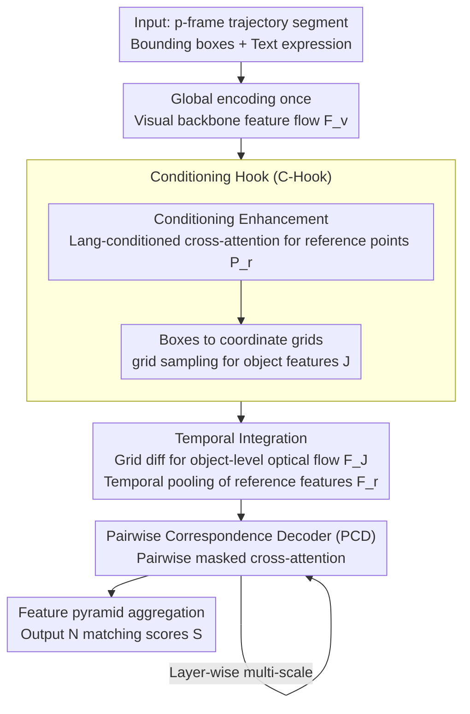

# FlexHook: Rethinking Two-Stage Referring-by-Tracking in RMOT

**Conference**: CVPR 2026  
**arXiv**: [2503.07516](https://arxiv.org/abs/2503.07516)  
**Code**: [GitHub](https://github.com/buptLwz/FlexHook)  
**Area**: Video Understanding  
**Keywords**: Referring Multi-Object Tracking, Two-Stage RBT, Sampling-based Feature Construction, Pairwise Correspondence Decoding, Language Conditioning Enhancement

## TL;DR
Ours proposes FlexHook, a novel two-stage Referring-by-Tracking framework that redefines feature construction through a sampling-based Conditioning Hook (C-Hook) and replaces CLIP cosine similarity matching with a Pairwise Correspondence Decoder (PCD), making a two-stage method fully surpass current state-of-the-art (SOTA) one-stage methods for the first time.

## Background & Motivation
Referring Multi-Object Tracking (RMOT) aims to track multiple objects in videos based on natural language expressions. Existing methods are divided into three paradigms:

**Tracking-by-Referring (TBR)**: Uses GroundingDINO for box localization followed by trajectory association, relying on large-scale VLMs.

**One-Stage RBT**: Decodes trajectory queries based on MOTR and calculates matching scores, requiring end-to-end joint optimization.

**Two-Stage RBT**: Proposed by iKUN, it completely decouples tracking and referring processes, offering low training costs and supporting incremental deployment.

**Key Challenge**: While two-stage RBT has irreplaceable advantages in training efficiency and incremental deployment, its performance lags significantly behind one-stage methods (iKUN achieves only 10.32 HOTA on Refer-KITTI-v2). The authors identify two fundamental limitations:

- **Overly Heuristic Feature Construction**: Existing methods use shared encoders for dual encoding of full images and cropped patches, ignoring the spatial gradient flow and context aggregation capabilities already present in modern visual backbones; furthermore, feature construction is language-agnostic, failing to adaptively focus based on different semantics (position, orientation, etc.).
- **Fragile Correspondence Modeling**: Reliance on cosine similarity within CLIP's pre-trained alignment space causes alignment to collapse when introducing additional modules or replacing backbones, essentially setting a performance ceiling.

## Method

### Overall Architecture
FlexHook "hooks" into the forward flow of the original visual backbone to extract features, much like a hook function in programming, without adding extra encoding stages. For a $p$-frame trajectory segment $\mathcal{B}^i_{t:t+p}$, the image is encoded globally only once. Then, the workflow of C-Hook sampling → temporal integration → PCD decoding is executed repeatedly across backbone layers. Multi-scale results are aggregated via a feature pyramid to output $\hat{N}$ matching scores.

### Key Designs

**1. Conditioning Hook (C-Hook): "Sampling" target features directly from the backbone flow instead of re-encoding.**

This addresses the pain point of iKUN's approach—encoding both the full image and cropped patches separately, which is redundant and discards the backbone's inherent spatial gradient flow and contextual aggregation. C-Hook "hooks" into the backbone forward pass: bounding boxes $B^i_t = \langle x_0, y_0, w_b, h_b \rangle$ are converted into coordinate grids $P^i_t \in \mathbb{R}^{h \times w \times 2}$, and differentiable grid sampling (bilinear interpolation) extracts target features $J$ directly from feature maps $F_v$. The backbone gradient flow is preserved.

To align the distributions of training (using GT trajectories) and inference (using tracker outputs), three augmentations are applied to the sampling grids: random trajectory truncation to simulate object loss, Gaussian noise injection to simulate localization errors, and intra-batch grid sequence shuffling to simulate ID switches—bridging the gap between GT and tracker distributions during training.

The second part is Conditioning Enhancement, enabling the sampling to "understand" the expression. Masked cross-attention between learnable queries $Q_{LR} \in \mathbb{R}^{\hat{N} \times M \times C}$ and text features $F_l$, followed by MLP + sigmoid, yields normalized 2D reference points $P_r$. These are repeated temporally and participate in sampling alongside coordinate grids. Thus, expressions like "person in red" and "person on the left" adaptively focus on different regions.

**2. Temporal Integration: Utilizing coordinate grid differences for zero-cost object-level optical flow.**

Since C-Hook calculates coordinate grids for each frame, inter-frame motion information is readily available without a separate optical flow network. Concatenating adjacent grid displacements $\Delta Grid = \text{Cat}(\{P^i_{t+k} - P^i_{t+k-1}\}_{k=1}^p)$ with multi-frame target features $J$ along the channel dimension, followed by MLP compression, produces trajectory features $F_J \in \mathbb{R}^{h \times w \times C}$ containing motion information; reference features $F_r$, lacking motion, are simply temporally pooled. This step provides object-level optical flow at near-zero cost.

**3. Pairwise Correspondence Decoder (PCD): Replacing cosine similarity with a learned decoder to break the CLIP alignment ceiling.**

Old two-stage methods rely on cosine similarity within CLIP's pre-trained alignment space, which collapses when changing backbones or adding modules. PCD converts passive similarity comparison into active correspondence modeling: $\hat{N}$ sampled expressions are paired with shared trajectory segments into $\hat{N}$ pairs, and learnable queries $Q \in \mathbb{R}^{\hat{N} \times C}$ "probe" each pair for a match. Flattened trajectory features $F_J$, reference features $F_r$, and language features $F_l$ are concatenated as Key/Value, while $Q$ acts as Query for masked cross-attention. The attention mask $A$ ensures queries share trajectory features but only access their specific language and reference features, allowing parallel processing and implicit cross-pair comparison. Post-decoding, one MLP branch outputs matching scores $S \in \mathbb{R}^{\hat{N} \times 2}$, while the other feeds into the next PCD layer for multi-scale decoding.

### Loss & Training
- **Focal Loss**: Supervised on the average output $\bar{S}$ of all layers to enhance multi-scale capability and mitigate sample imbalance.
- **Reference Point Boundary Penalty $\mathcal{L}_r$**: Prevents learned reference point coordinates from collapsing to the boundaries of the normalized space $[-1,1]^2$. Defining the minimum boundary distance $d_{uv} = \min(1-|u|, 1-|v|)$, it uses softplus penalty: $\mathcal{L}_r = \frac{1}{|P_r|}\sum_{u,v}\text{softplus}(\alpha(\delta - d_{uv}))$.
- Final Loss: $\mathcal{L} = \mathcal{L}_{\text{Focal}}(\bar{S}, S_{\text{gt}}) + \lambda \mathcal{L}_r$.
- Training Setup: Input resolution $224 \times 672$, AdamW optimizer lr=3e-5, 20 epochs, 2×RTX 4090.

## Key Experimental Results

### Main Results

| Dataset | Metric | FlexHook-best | Prev. SOTA | Gain |
|--------|------|---------------|----------|------|
| Refer-KITTI | HOTA | 53.83 | 52.41 (HFF-Tracker) | +1.42 |
| Refer-KITTI-V2 | HOTA | 42.53 | 36.18 (HFF-Tracker) | +6.35 |
| Refer-Dance | HOTA | 32.17 | 29.06 (iKUN) | +3.11 |
| LaMOT | HOTA | 56.77 | 48.45 (LaMOTer) | +8.32 |

FlexHook is the first two-stage method to comprehensively outperform one-stage SOTAs across all benchmarks.

### Ablation Study

| Config | HOTA | DetA | AssA | Description |
|------|------|------|------|------|
| iKUN Original | 10.32 | 2.17 | 49.77 | Two-stage baseline |
| +C-Hook | 34.49 | 22.51 | 52.97 | Significant gain from sampling feature construction |
| +C-Hook+PCD | 38.62 | 27.92 | 53.58 | PCD replaces cosine similarity |
| +C-Hook+PCD+TI | 39.19 | 28.47 | 54.11 | Temporal integration of optical flow |

### Key Findings
- C-Hook provides the largest improvement (HOTA +24.17), indicating that sampling-based feature construction is a key innovation.
- PCD is effective not only in non-aligned spaces but also outperforms cosine similarity within the CLIP alignment space.
- The number of reference points $M=10$ for Conditioning Enhancement is empirically optimal and consistent across backbones.
- Freezing the encoder leads to only a slight performance drop (40.86 vs 42.53) in exchange for training efficiency.
- Overall inference speed is the fastest (51.47 min), thanks to the removal of redundant encoding and parallel processing in PCD.

## Highlights & Insights
1. **"Hook" Philosophy**: Does not modify the backbone but "hooks" into the forward flow for sampling, preserving pre-trained capabilities and allowing plug-and-play for any vision/text encoder.
2. **Breaking CLIP Dependence**: PCD transforms passive similarity comparison into active correspondence modeling, freeing the framework from specific pre-trained alignment spaces.
3. **Training-Inference Consistency via Neighboring Grid Sampling**: Noise injection simulates tracker output uncertainty, elegantly bridging the gap between GT and tracker distributions.
4. **Revival of the Two-Stage Paradigm**: Surpasses one-stage methods (requiring 51.68h) with extremely low training cost (1.91h).

## Limitations & Future Work
- Dependent on the quality of external detector-trackers; weak detectors can limit the performance ceiling.
- Limited expression types in current autonomous driving scenarios (e.g., Refer-KITTI), verifying more complex scenarios (e.g., indoor, complex motion descriptions) is needed.
- Reference point collapse requires additional regularization, suggesting optimization instability during learning.

## Related Work & Insights
- Shares the two-stage RBT paradigm with iKUN (CVPR'24) but completely redesigns feature construction and correspondence modeling.
- C-Hook's grid sampling concept shares similarities with Deformable Attention (Deformable DETR).
- PCD's masked cross-attention design aligns with the query-based decoding of the DETR family.
- Highly practical for lightweight incremental deployment scenarios (e.g., vehicles with existing mature trackers).

## Rating
- Novelty: ⭐⭐⭐⭐ Unique core module designs, elegant "hook" philosophy.
- Experimental Thoroughness: ⭐⭐⭐⭐ 4 datasets, various encoder combinations, detailed ablations.
- Writing Quality: ⭐⭐⭐⭐ Clear problem analysis, rich and understandable illustrations.
- Value: ⭐⭐⭐⭐ Revives the two-stage paradigm, significant for industrial deployment.

<!-- RELATED:START -->

## Related Papers

- [\[CVPR 2026\] Rethinking Occlusion Modeling for UAV Tracking](rethinking_occlusion_modeling_for_uav_tracking.md)
- [\[CVPR 2026\] STORM: End-to-End Referring Multi-Object Tracking in Videos](storm_referring_multi_object_tracking.md)
- [\[CVPR 2026\] From Contrast to Consistency: Rethinking Event-based Continuous-Time Optical Flow Estimation](from_contrast_to_consistency_rethinking_event-based_continuous-time_optical_flow.md)
- [\[ECCV 2024\] Referring Atomic Video Action Recognition](../../ECCV2024/video_understanding/referring_atomic_video_action_recognition.md)
- [\[NeurIPS 2025\] Two Causally Related Needles in a Video Haystack](../../NeurIPS2025/video_understanding/two_causally_related_needles_in_a_video_haystack.md)

<!-- RELATED:END -->
