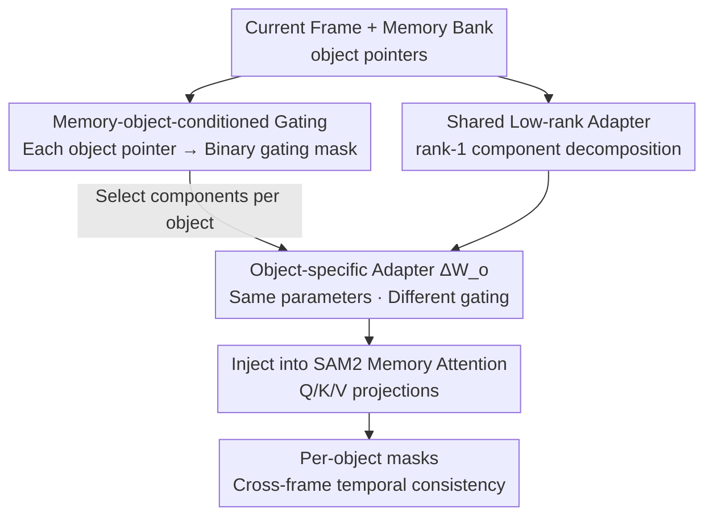

# Robust Promptable Video Object Segmentation

**Conference**: CVPR 2026  
**arXiv**: [2605.12006](https://arxiv.org/abs/2605.12006)  
**Code**: https://sohyun-l.github.io/RobustPVOS_project_page/ (Project page, benchmark available)  
**Area**: Video Understanding / Semantic Segmentation  
**Keywords**: Promptable Video Object Segmentation, Robustness, SAM2, Memory-conditioned Adaptation, Gated Low-rank Adaptation

## TL;DR
Addressing the performance collapse of promptable video object segmentation (PVOS) models like SAM2 under adverse weather and noise, this paper constructs the first RobustPVOS benchmark (351 real-world adverse videos + large-scale time-varying synthetic degradation data) and proposes MoGA. MoGA uses object pointers from the memory bank to "condition" the gating of a shared low-rank adapter, providing each object with unique, cross-frame consistent robustification. Training only 1.1M parameters, it consistently outperforms frame-by-frame robustification methods across various degradations.

## Background & Motivation
**Background**: Promptable Video Object Segmentation (PVOS) allows users to segment and track arbitrary objects in video using flexible prompts such as points, boxes, or masks. SAM2, through its streaming memory architecture, extends image-level promptable segmentation to video, achieving impressive zero-shot results on clean videos and becoming the representative model for this paradigm.

**Limitations of Prior Work**: The authors empirically found that SAM2 performance drops significantly when encountering input degradations such as noise, blur, low light, rain, fog, or snow (e.g., $\mathcal{J}\&\mathcal{F}$ is only 69.6% on MVSeg-adv and 63.5% on ACDC-Video). This is critical for safety-critical scenarios like autonomous driving and robotics where adverse conditions are unavoidable, yet systematic research in this area was previously lacking.

**Key Challenge**: A naive approach is to apply existing robust image segmentation methods frame-by-frame. However, degradations in real videos exhibit **dual spatial and temporal heterogeneity**—different objects in the same scene are affected to varying degrees (distant objects in fog are nearly invisible while near ones remain clear), and degradation patterns change frame-by-frame. Processing frames independently fails to ensure temporal consistency (resulting in mask jitter) and ignores object-specific differences by applying uniform robustification to the entire frame.

**Goal**: ① Establish RobustPVOS as a research direction with a systematic evaluation benchmark; ② Design a method capable of **object-differentiated and cross-frame consistent** robustification.

**Key Insight**: The authors observe that modern video segmentation models (like SAM2) already maintain **cross-frame accumulated representations** (object pointers) in their memory banks. These representations naturally characterize how an object is affected by degradation over time.

**Core Idea**: Condition the robustification process using object pointers from the memory bank. By using object representations as conditions to gate and select several rank-1 components within a shared low-rank adapter, the model applies a dedicated and temporally consistent adaptation to each tracked object based on accumulated memory.

## Method

### Overall Architecture
MoGA (Memory-object-conditioned Gated-rank Adaptation) is embedded as a plugin into the **memory attention module** of a frozen SAM2. During SAM2 inference, processing occurs frame-by-frame: features of processed objects are stored in the memory bank as object pointers, and the current frame retrieves this historical information through memory attention (Self-attention Q/K/V + Cross-attention Q). MoGA does not modify the SAM2 backbone but attaches a **low-rank adapter shared across all objects** to these projection layers, decomposed into $R$ rank-1 components. A shared gating module calculates a set of binary gating masks for each object pointer $\mathbf{m}_o$ in the memory bank, determining which rank-1 components to activate for **that specific object**. Consequently, the same set of adapter parameters produces different effective weights for different objects due to different gating conditions. Since object pointers are accumulated cross-frame in the memory bank, gating selection evolves smoothly over time, ensuring temporal consistency. Only the MoGA modules and LayerNorm are trained, totaling 1.1M parameters.

### Key Designs

**1. Rank-1 Component Decomposition: Adapters as an object-selectable "part library"**

Standard LoRA adds a low-rank increment $\Delta\mathbf{W}=\mathbf{B}\mathbf{A}$ to frozen weights $\mathbf{W}_0$, with the forward pass being $\mathbf{h}=\mathbf{W}_0\mathbf{x}+\mathbf{B}\mathbf{A}\mathbf{x}$. However, it applies the **exact same** adaptation to all inputs and objects, failing to perceive "which object is being tracked and how it is degraded." Drawing from GaRA, MoGA explicitly decomposes $\Delta\mathbf{W}=\mathbf{B}\mathbf{A}$ into $R$ rank-1 components $\{\mathbf{a}_i,\mathbf{b}_i\}_{i=1}^R$, such that $\Delta\mathbf{W}=\sum_{i=1}^{R}\mathbf{b}_i\mathbf{a}_i^\top$. This transforms the adapter from "a single entity" into "a library of parts"—allowing flexible assembly of the weight matrix by selecting specific components based on input characteristics, providing the smallest operable unit for object-specific activation.

**2. Memory-Object Conditioned Gating: Using memory pointers for unique robustification**

This is the core innovation of MoGA, addressing the conflict between varying degradation effects across objects and the need for temporal consistency. The SAM2 memory bank maintains a set of object pointers $\mathcal{M}=\{\mathbf{m}_o\}_{o=1}^{O}$, where each $\mathbf{m}_o\in\mathbb{R}^d$ encodes the accumulated historical characteristics of object $o$. MoGA introduces a **shared but per-object applied** gating module $g(\cdot)$ (a three-layer MLP) that takes an object pointer and outputs a binary gating mask $\mathbf{z}_o=g(\mathbf{m}_o)\in\{0,1\}^R$. It first calculates logits $\boldsymbol{\alpha}_o=\text{MLP}(\mathbf{m}_o)$, then uses Gumbel-Sigmoid relaxation for differentiable discrete selection:
$$\tilde{z}_{o,i}=\sigma\Big(\tfrac{1}{\tau}(\alpha_{o,i}+G_i)\Big),\quad G_i\sim\text{Gumbel}(0,1),$$
During training, the forward pass uses a hard threshold $z_{o,i}=\mathbb{I}[\tilde{z}_{o,i}>0.5]$ and the backward pass uses a straight-through estimator to maintain differentiability. At inference, the gating becomes deterministic $z_{o,i}=\mathbb{I}[\sigma(\alpha_{o,i})>0.5]$.

After obtaining per-object gating, the output is the average of each object's specific adapter:
$$\mathbf{h}=\mathbf{W}_0\mathbf{x}+\frac{1}{O}\sum_{o=1}^{O}\Big(\sum_{i=1}^{R}z_{o,i}\cdot\mathbf{b}_i\mathbf{a}_i^\top\Big)\mathbf{x},$$
where $\Delta\mathbf{W}_o=\sum_i z_{o,i}\cdot\mathbf{b}_i\mathbf{a}_i^\top$ is the specific adapter for object $o$. All objects **share the same set** of $\{\mathbf{a}_i,\mathbf{b}_i\}$ and are differentiated only by gating—this Siamese structure achieves object-level adaptation without duplicating parameters. The efficacy stems from the gating conditions being derived from memory pointers that evolve smoothly over frames; thus, the robustification is both object-specific and temporally consistent.

**3. Injecting Memory Attention + Unsupervised Gating through Segmentation Loss**

MoGA is specifically connected to the linear projections of SAM2's memory attention: Q, K, and V of self-attention and Q of cross-attention. Each projection has its own rank-1 component selection, but the low-rank adapter and gating module are shared across objects. Notably, **the gating module is not directly supervised**—no labels indicate which components should be activated for an object. It learns to select appropriate adaptation paths for each object entirely through backpropagation of the downstream segmentation loss, similar to a Mixture-of-Experts (MoE).

### Loss & Training
Training utilizes standard segmentation loss, averaged across all frames $t$ and all objects $o$:
$$\mathcal{L}_{\text{total}}=\frac{1}{T\cdot O}\sum_{t=1}^{T}\sum_{o=1}^{O}\mathcal{L}_{\text{seg}}(y_{o,t},\hat{y}_{o,t}),$$
where $\mathcal{L}_{\text{seg}}$ is the focal + dice loss, and $\hat{y}_{o,t}$ is the mask predicted using the object-specific adapter $\Delta\mathbf{W}_o$. All SAM2 parameters are frozen, training only the MoGA modules and LayerNorm. AdamW is used with a learning rate of $5\times10^{-6}$, weight decay of 0.1, and batch size of 4, with up to 3 objects per segment. The adapter rank is $R=128$, and Gumbel-Sigmoid temperature $\tau=0.3$ is linearly annealed to stabilize hard gating.

## Key Experimental Results

### Main Results
Zero-shot evaluation (trained on synthetic degradation data, tested on real/synthetic degradation sets). Metrics include standard VOS regional similarity $\mathcal{J}$, contour accuracy $\mathcal{F}$, and their average $\mathcal{J}\&\mathcal{F}$.

| Method | MVSeg-adv $\mathcal{J}\&\mathcal{F}$ | ACDC-Video $\mathcal{J}\&\mathcal{F}$ | YouTube-VOS-C $\mathcal{J}\&\mathcal{F}$ | YouTube-VOS (Clean) $\mathcal{J}\&\mathcal{F}$ |
|------|------|------|------|------|
| SAM2 | 69.6 | 63.5 | 78.7 | 82.2 |
| URIE+SAM2 (Image Restoration) | 69.6 | 60.9 | 78.6 | - |
| AirNet+SAM2 (Image Restoration) | 69.1 | 59.8 | 78.6 | - |
| GaRA+SAM2 (Per-frame Robustification) | 69.7 | 61.3 | 78.1 | 79.8 |
| **MoGA+SAM2** | **71.8** | **64.5** | **79.9** | **82.6** |

Key observation: Image restoration methods (URIE/AirNet) and per-frame robustification (GaRA) show either marginal gains or performance drops on degraded videos (especially on ACDC-Video, dropping from 63.5 to ~60), confirming that per-frame processing disrupts temporal consistency. MoGA consistently improves across all degradation sets and maintains performance on clean videos (82.6 vs. SAM2’s 82.2) without sacrificing clarity.

### Efficiency and Temporal Generalization

| Method | Trainable Params | Training VRAM | MVSeg-adv $\mathcal{J}\&\mathcal{F}$ |
|------|------|------|------|
| Full Fine-tuning SAM2 | 80.9M | 25GB | 71.5 |
| **MoGA+SAM2** | **1.1M** | **22GB** | **71.8** |

Training only 1.1M parameters with 22GB VRAM yields better results than full fine-tuning of 80.9M parameters (71.8 vs. 71.5), demonstrating that memory-conditioned robustification is both more efficient and more accurate. In long videos (~6s segments concatenated to ~42s/1K frames), SAM2's performance collapses from 69.6 to 52.3, while MoGA drops from 71.8 to 56.2, maintaining its lead and showing gating stability as memory grows.

### Ablation Study

| Configuration | MVSeg-adv $\mathcal{J}\&\mathcal{F}$ | Description |
|------|------|------|
| No condition | 69.6 | Equivalent to SAM2 baseline |
| Memory condition only (Aggregated object pointers) | 70.9 | Introduces temporal info, +1.3 |
| Full MoGA (Memory+Object condition) | **71.8** | Adds object-level adaptation, +0.9 |

| Comparison | MVSeg-adv $\mathcal{J}\&\mathcal{F}$ | Description |
|------|------|------|
| LoRA+SAM2 | 70.9 | Uniform adaptation, agnostic to object/memory |
| **MoGA+SAM2** | **71.8** | Memory-object gated condition yields +0.9 |

Sensitivity to Rank $R$ (YouTube-VOS-C): 32 → 79.3, 64 → 79.4, **128 → 79.9**, 256 → 79.8, 512 → 79.7. $R=128$ is optimal; performance saturates beyond this. Temperature $\tau$: 0.1/0.3 is best (79.9). The model is generally insensitive to $\tau$, suggesting memory conditions provide strong guidance for gating, making hard selection stable.

### Key Findings
- **Temporal condition contributes more than object condition**: Adding memory conditions improves from 69.6 to 70.9 (+1.3), while adding per-object independent gating reaches 71.8 (+0.9). This identifies cross-frame consistency as the primary requirement for RobustPVOS, with object-level differentiation as a secondary benefit.
- **Per-frame methods are detrimental**: Restoration and per-frame GaRA drop in most degraded sets. Qualitatively, GaRA masks jitter, and URIE only captures object fragments, proving the fundamental flaw of "per-frame independence" in video robustification.
- **Progressive self-healing during inference**: In night sequences, SAM2 maintains ~40% $\mathcal{J}\&\mathcal{F}$ throughout, while MoGA improves as object pointers accumulate in memory, eventually reaching 80%+ at the sequence end as masks evolve from fragments to complete segments.

## Highlights & Insights
- **Clever observation on memory encoding**: While others treat robustification as an extra task, the authors recognized that SAM2's object pointers naturally track how objects are affected by degradation over time. Robustification is effectively "parasitic" on existing memory with almost zero extra structure.
- **Siamese design of shared adapters + per-object gating**: Using one set of rank-1 parts to create $O$ object-specific adapters via different gating is a elegant trick that unifies "parameter efficiency" with "instance adaptation." This is transferable to any video task with instance memory (e.g., VIS, MOT).
- **Unsupervised emerging gating**: Gating selection is driven entirely by segmentation loss, similar to MoE. This avoids the difficult labeling problem of "which object needs which components" by letting selection emerge end-to-end.
- **First RobustPVOS benchmark**: 351 real adverse videos + 2500+ object masks + time-varying synthetic degradation (Fourier modulation) makes a previously overlooked safety-critical problem quantifiable. The benchmark's value likely exceeds the method itself.

## Limitations & Future Work
- **Small absolute gains**: On real sets, MoGA improves over SAM2 by +1~3 points (MVSeg-adv 69.6→71.8, ACDC 63.5→64.5). The limited gain on ACDC-Video suggests we are still far from "deployable" under extreme degradation; the benchmark exposes problems more than it solves them.
- **Dependence on backbone memory mechanism**: The method is strictly tied to SAM2-style object pointer memory banks and cannot be directly applied to video segmentation architectures without explicit object-level memory.
- **Realism of synthetic degradation**: Training relies on 8 types of synthetic degradation + Fourier modulation. The distribution gap between this and real-world rain/snow/fog is unknown, potentially limiting generalization.
- **Limited gating interpretability**: Visualizations show gating masks are "smooth over time with small changes," but exactly what degradation pattern each component learns and why remains a black box.

## Related Work & Insights
- **vs. GaRA**: GaRA also uses gated-rank adaptation for input-adaptive robustness but processes frames/images independently. It lacks object concepts and cross-frame memory, leading to temporal inconsistency. MoGA swaps the gating condition for memory object pointers, achieving both object-level differentiation and temporal consistency.
- **vs. LoRA**: LoRA applies the same increment to all objects and frames; MoGA uses the same parameter budget to create per-object increments via memory-conditioned gating (71.8 vs. 70.9).
- **vs. Image Restoration (URIE/AirNet) + SAM2**: The two-stage restoration-then-segmentation approach is frame-independent and task-misaligned, often leading to performance drops in video. MoGA is end-to-end and driven solely by segmentation loss.
- **vs. Full Fine-tuning SAM2**: Full fine-tuning of 80.9M parameters is inferior to MoGA’s 1.1M parameters, suggesting that for "conditioned/instantiated" problems like robustification, structural priors (memory-conditioned gating) are more important than sheer parameter count.

## Rating
- Novelty: ⭐⭐⭐⭐ Introduced the RobustPVOS task and benchmark; the "memory-object pointer conditioned gating" is novel, though it extends GaRA/LoRA concepts to video.
- Experimental Thoroughness: ⭐⭐⭐⭐ Comprehensive evaluation on real/synthetic data against restoration, per-frame, and LoRA methods. Rank/temperature/long-video/component ablations are complete, but small absolute gains are a drawback.
- Writing Quality: ⭐⭐⭐⭐ Clear logic from motivation to method. Effective use of formulas and diagrams.
- Value: ⭐⭐⭐⭐ Benchmarking safety-critical video segmentation robustness provides high utility for the autonomous driving and robotics communities.

<!-- RELATED:START -->

## Related Papers

- [\[CVPR 2026\] Long-RVOS: A Comprehensive Benchmark for Long-term Referring Video Object Segmentation](long-rvos_a_comprehensive_benchmark_for_long-term_referring_video_object_segment.md)
- [\[CVPR 2026\] InterRVOS: Interaction-Aware Referring Video Object Segmentation](interrvos_interaction-aware_referring_video_object_segmentation.md)
- [\[CVPR 2026\] Occlusion-Aware SORT: Observing Occlusion for Robust Multi-Object Tracking](occlusion-aware_sort_observing_occlusion_for_robust_multi-object_tracking.md)
- [\[CVPR 2026\] DeRVOS: Decoupling Consistent Trajectory Generation and Multimodal Understanding for Referring Video Object Segmentation](dervos_decoupling_consistent_trajectory_generation_and_multimodal_understanding_.md)
- [\[CVPR 2026\] EgoXtreme: A Dataset for Robust Object Pose Estimation in Egocentric Views under Extreme Conditions](egoxtreme_a_dataset_for_robust_object_pose_estimation_in_egocentric_views_under_.md)

<!-- RELATED:END -->
