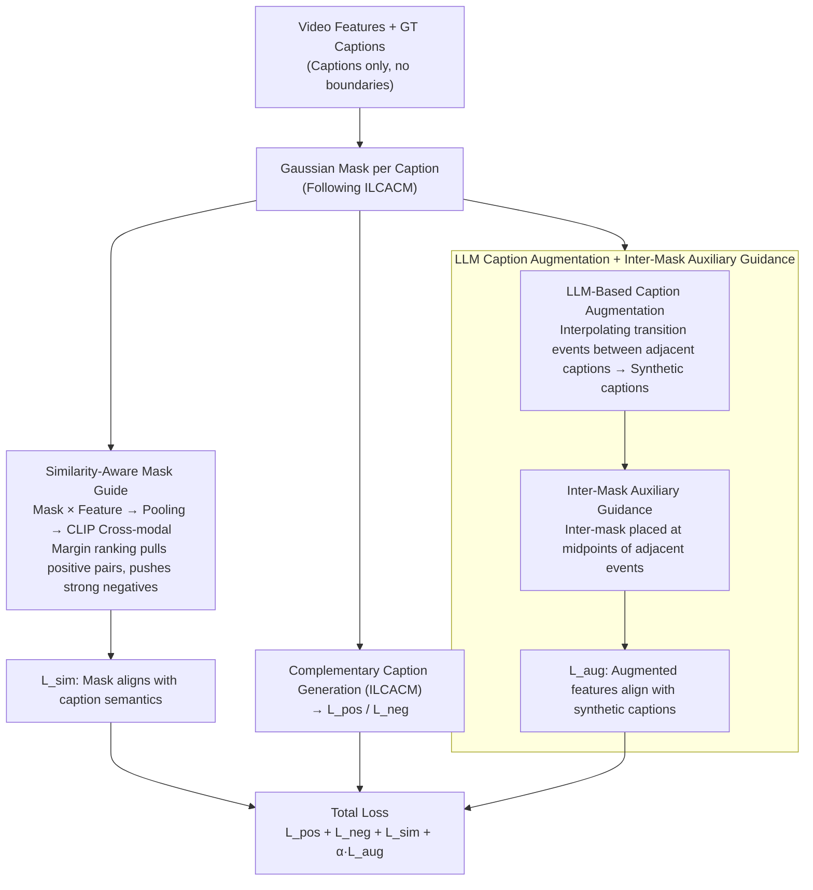

# SAIL: Similarity-Aware Guidance and Inter-Caption Augmentation-based Learning for Weakly-Supervised Dense Video Captioning

**Conference**: CVPR 2026  
**arXiv**: [2603.05437](https://arxiv.org/abs/2603.05437)  
**Code**: None  
**Area**: Video Understanding  
**Keywords**: Weakly-supervised Dense Video Captioning, Cross-modal Alignment, LLM Data Augmentation, Gaussian Mask, Event Localization

## TL;DR
SAIL is proposed to achieve dual SOTA in dense video captioning and event localization on ActivityNet and YouCook2 under a weakly-supervised setting (captions only, no temporal boundaries). This is achieved through cross-modal similarity-guided semantic-aware mask generation and auxiliary supervision from LLM-synthesized captions.

## Background & Motivation
Dense Video Captioning (DVC) requires simultaneous event localization and description generation in untrimmed videos. Fully supervised methods rely on expensive temporal boundary annotations, while Weakly-Supervised DVC (WSDVC) uses only caption annotations for training.

**Limitations of Prior Work**: The current SOTA method, ILCACM, utilizes a Gaussian mask strategy to achieve implicit event localization via complementary caption generation. However, its mask learning has two fundamental flaws:

**Mask lacks semantic alignment**: It only learns non-overlapping mask distributions without considering the semantic relationship between the mask and the corresponding event. Experiments reveal that even fixed, non-trainable uniform distribution masks achieve performance parity with ILCACM—indicating that existing methods only learn to cover different temporal regions rather than capturing semantically relevant regions.

**Annotation sparsity**: Event annotations in existing datasets are extremely sparse. For instance, a 235-second video in ActivityNet might only have 3 event annotations, leaving many potential events unannotated. Although annotations might span the entire video duration, event density remains low.

## Method

### Overall Architecture
In WSDVC training, only "video + several captions" are available without temporal boundaries. Following the framework of ILCACM, which assigns a learnable Gaussian mask to each caption and implicitly pushes masks to different time segments via "complementary caption generation," SAIL addresses its weaknesses with two components: first, ensuring masks are semantically aligned with caption descriptions (Similarity-Aware Mask Guide); and second, using an LLM to densify sparse caption annotations and safely incorporating these synthesized captions into training (Caption Augmentation + Inter-Mask). The pipeline remains "video features → Gaussian mask per caption → masked features for complementary caption generation," with SAIL adding semantic alignment constraints to masks and denser supervision to captions.

### Key Designs

**1. Similarity-Aware Mask Guide: Forcing mask-semantic alignment via cross-modal similarity**

The compelling experiment where fixed uniform masks matched ILCACM performance indicates that old masks only learned to be "mutually non-overlapping" without knowing if the enclosed segment matched the caption. SAIL remedies this by connecting mask learning directly to the CLIP cross-modal space. After generating mask $M_i$, it is element-wise multiplied with video features to obtain positive mask features $\boldsymbol{v}'_i = \boldsymbol{v} \cdot M_i$, which are average-pooled into $\bar{\boldsymbol{v}}'_i$. The objective is to maximize the cosine similarity between $\bar{\boldsymbol{v}}'_i$ and its corresponding caption feature $\boldsymbol{c}_i$, while minimizing it with other captions in the same video. A margin ranking loss implements this "pull positive, push strong negative" requirement:

$$\mathcal{L}_{\text{sim}} = \frac{1}{B}\sum_{b=1}^{B}\frac{1}{N_s}\sum_{i=1}^{N_s}\max(0,\, \Delta - s^+_{b,i} + s^-_{b,i})$$

Where $s^+ = \text{sim}(\bar{\boldsymbol{v}}'_i, \boldsymbol{c}_i)$ is the similarity of the mask feature to its own caption, and $s^- = \max_{j \neq i}\text{sim}(\bar{\boldsymbol{v}}'_i, \boldsymbol{c}_j)$ selects the most similar "other" caption in the same video as a strong negative. This upgrades masks from a weak "different regions" constraint to a strong "semantic consistency" constraint—this single addition improves CIDEr by +1.76.

**2. LLM-Based Caption Augmentation: Mitigating sparsity by interpolating transition events**

WSDVC datasets suffer from extremely low annotation density. SAIL uses an LLM to fill these gaps: for every pair of adjacent GT captions $(C_i, C_{i+1})$, a synthetic caption $C^{syn}_i$ is generated for the interval between them, providing $N_s - 1$ additional supervisions per video. The prompt treats the LLM as a "video context reasoning expert" to infer probable transition actions or state changes between the narrative flow of two captions (implemented using Qwen3-8B ⚠️ refer to original text). This leverages LLM world knowledge and narrative reasoning to generate alignment signals for sparsely annotated videos.

**3. Inter-Mask Auxiliary Guidance: Using synthetic captions as auxiliary signals rather than strong negatives**

The utilization of synthesized captions is critical—incorporating them directly into the primary loss as strong negatives can degrade performance due to noise (confirmed in Table 6). Thus, SAIL creates an "inter-mask" for each synthetic caption, specifically placed in the transition zone between adjacent event masks. For any pair of adjacent event centers $(c_i, c_{i+1})$, the inter-mask center is the mean $c^{inter}_i = \frac{c_i + c_{i+1}}{2}$ with a fixed hyperparameter width $w^{inter}$. This inter-mask is applied to video features, and the resulting augmented features are pulled closer to the synthesized caption via cosine similarity loss:

$$\mathcal{L}_{\text{aug}} = \frac{1}{B}\sum_{b=1}^{B}\frac{1}{N_s-1}\sum_{i=1}^{N_s-1}\bigl(1 - \text{sim}(\bar{\boldsymbol{v}}'^{inter}_{b,i}, \boldsymbol{c}^{syn}_{b,i})\bigr)$$

For example, if one caption is "the chef pours batter into the pan" and the next is "the chef flips the pancake," the LLM-inferred transition might be "the batter slowly solidifies in the pan." The inter-mask covers the time midpoint between these events. Aligning augmented features with this transition description serves as "soft narrative guidance" rather than a "hard constraint," making it more robust than a strong negative strategy.

### Loss & Training
- Final Objective: $\mathcal{L} = \mathcal{L}_{\text{pos}} + \mathcal{L}_{\text{neg}} + \mathcal{L}_{\text{sim}} + \alpha_{\text{aug}}\mathcal{L}_{\text{aug}}$
- $\mathcal{L}_{\text{pos}}$/$\mathcal{L}_{\text{neg}}$: Positive/negative complementary caption generation losses (inherited from ILCACM)
- Hyperparameters: $\Delta=0.1$, $w^{inter}=0.6$, $\alpha_{\text{aug}}=0.25$
- Caption Decoder: Distilled-GPT2, AdamW optimizer
- ActivityNet: lr=1e-4, 10 epochs; YouCook2: lr=5e-5, 5+15 epochs

## Key Experimental Results

### Main Results

| Dataset | Metric | SAIL | ILCACM (Prev. SOTA) | Gain |
|--------|------|------|-----------------|------|
| ActivityNet | CIDEr | 35.38 | 33.42 | +1.96 |
| ActivityNet | SODA_c | 6.29 | 6.08 | +0.21 |
| ActivityNet | F1 (Loc) | 57.00 | 56.20 | +0.80 |
| YouCook2 | CIDEr | 14.61 | 13.49 | +1.12 |
| YouCook2 | F1 (Loc) | 20.94 | 17.88 | +3.06 |

SAIL weakly-supervised performance exceeds fully supervised methods CM2 and E2DVC on most metrics.

### Ablation Study

| Configuration | SODA_c | CIDEr | F1 | Notes |
|------|--------|-------|-----|------|
| Baseline (ILCACM) | 6.08 | 33.42 | 56.20 | No semantic guidance |
| +Similarity-aware | 6.27 | 35.18 | 56.89 | Semantic alignment mask |
| +Synthetic captions | 6.29 | 34.92 | 56.79 | LLM augmented supervision |
| +Both (SAIL) | 6.29 | 35.38 | 57.00 | Optimal combination |

### Key Findings
- Using semantic-aware masks alone improves CIDEr by +1.76, proving the effectiveness of the alignment loss.
- Using synthesized captions as auxiliary signals (inter-mask) is superior to using them as strong negatives (+HN).
- Even using only 25% of synthetic captions improves performance, with monotonic gains as the ratio increases.
- SAIL consistently improves performance across Gaussian, Hard Binary, and Cauchy mask designs, proving the method's generality.
- Training overhead is nearly unchanged: 1h41m vs. 1h38m (ILCACM), while inference is slightly faster (7m01s vs. 7m11s).

## Highlights & Insights
1. **Insight from fixed mask experiments**: The fact that non-trainable uniform masks match ILCACM reveals that "learned" masks in existing methods actually lack semantic information.
2. **Elegant use of LLM augmentation**: Synthesized captions are not mixed directly into the main loss (to avoid noise) but are used via inter-masks as independent auxiliary signals—"soft narrative guidance" instead of "hard constraints."
3. **Weakly-supervised exceeding fully-supervised**: SAIL matches fully supervised methods in localization F1 on ActivityNet and exceeds them in certain caption quality metrics, suggesting semantic alignment is a more fundamental supervision signal than temporal boundaries.

## Limitations & Future Work
- The improvement in SODA_c is relatively small (+0.21), suggesting limited improvement in narrative coherence.
- The quality of synthesized captions depends on the LLM's world knowledge, which may be imprecise in specialized domains (e.g., professional cooking, sports).
- The inter-mask width $w^{inter}$ is a fixed hyperparameter and is not adaptively adjusted.
- Validated only on two datasets; not yet tested on larger-scale or different types of datasets.

## Related Work & Insights
- Built upon the complementary caption generation of ILCACM (current WSDVC SOTA), achieving significant gains with minimal modifications.
- Leverages CLIP's cross-modal alignment capability to guide temporal mask learning, an approach generalizable to other weakly-supervised video understanding tasks.
- The idea of using LLMs to generate transition event descriptions is highly inspired—utilizing LLM narrative reasoning to complete sparse annotations.
- Provides a reference for tasks like weakly-supervised video grounding and temporal action detection.

## Rating
- Novelty: ⭐⭐⭐ Core ideas are intuitive and clear, but technical contributions are incremental (loss + augmentation added to ILCACM).
- Experimental Thoroughness: ⭐⭐⭐⭐ Comprehensive ablation including mask types, data ratios, and utilization strategies.
- Writing Quality: ⭐⭐⭐⭐ Motivation analysis is thorough, and the insight from fixed mask experiments is very persuasive.
- Value: ⭐⭐⭐ Weakly-supervised exceeding fully-supervised has practical significance, though improvement margins are modest.
- Value: To be evaluated.

<!-- RELATED:START -->

## Related Papers

- [\[CVPR 2026\] Learning from Noisy Supervision: A Denoising-Debiasing Framework for Weakly Supervised Video Anomaly Detection](learning_from_noisy_supervision_a_denoising-debiasing_framework_for_weakly_super.md)
- [\[CVPR 2026\] Joint Learning of General and Diverse Patterns with Mixture of Memory Experts for Weakly-Supervised Video Anomaly Detection](joint_learning_of_general_and_diverse_patterns_with_mixture_of_memory_experts_fo.md)
- [\[CVPR 2026\] The Road Less Seen: Segment Exploration for Weakly Supervised Video Anomaly Detection](the_road_less_seen_segment_exploration_for_weakly_supervised_video_anomaly_detec.md)
- [\[CVPR 2026\] Weakly Supervised Video Anomaly Detection with Anomaly-Connected Components and Intention Reasoning](weakly_supervised_video_anomaly_detection_with_anomaly-connected_components_and_.md)
- [\[CVPR 2026\] Stay in your Lane: Role Specific Queries with Overlap Suppression Loss for Dense Video Captioning](stay_in_your_lane_role_specific_queries_with_overlap_suppression_loss_for_dense_.md)

<!-- RELATED:END -->
