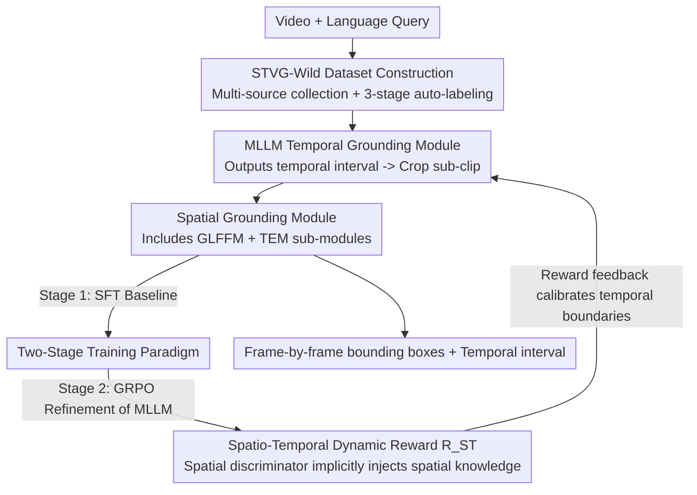

# SARL-STG: A Spatially Aware Reinforcement Learning Framework for Refining MLLMs in Spatio-Temporal Video Grounding

**Conference**: CVPR 2026  
**Paper**: [CVF Open Access](https://openaccess.thecvf.com/content/CVPR2026/html/Gao_SARL-STG_A_Spatially_Aware_Reinforcement_Learning_Framework_for_Refining_MLLMs_CVPR_2026_paper.html)  
**Code**: To be confirmed  
**Area**: Video Understanding / Spatio-Temporal Video Grounding / Multimodal VLM / Reinforcement Learning  
**Keywords**: Spatio-temporal video grounding, MLLM, RLVR, GRPO, Spatial discriminator

## TL;DR
SARL-STG cascades a pretrained MLLM (responsible for temporal localization) and an open-vocabulary detector (responsible for spatial localization) into a unified framework. It utilizes a two-stage training paradigm of "supervised fine-tuning (SFT) first, then GRPO refinement," and presents a dynamic spatio-temporal reward that leverages spatial grounding quality as a feedback signal to calibrate temporal boundaries. Consequently, this work introduces reinforcement learning to spatio-temporal video grounding (STVG) for the first time, achieving state-of-the-art (SOTA) performance on multiple benchmarks such as HCSTVG, VidSTG, and Charades.

## Background & Motivation

**Background**: Spatio-Temporal Video Grounding (STVG) requires a model to simultaneously localize the **temporal interval** (the frames of occurrence) and the **spatial region** (bounding boxes per frame) of a target object based on a natural language query. Existing approaches fall into two categories: one-stage models that jointly predict spatio-temporal tubes, which heavily depend on dataset-specific fine-tuning and show poor generalization; and two-stage models that decouple temporal and spatial localization, which suffer from **error accumulation** in multi-stage inference. Recently, researchers have employed MLLMs to capture complex semantic relations; however, large-scale supervised fine-tuning (SFT) often degrades the models' inherent semantic understanding and open-world generalization, ultimately leading to lower accuracy than small, specialized models.

**Limitations of Prior Work**: Queries in STVG exhibit much higher semantic complexity than those in conventional video temporal grounding (VTG) — they describe not only "interactive actions" but also rich, fine-grained spatial semantics including target attributes, environmental contexts, and spatial relationships (as compared in Figure 1 of the paper). Furthermore, spatial grounding **strongly depends** on accurate temporal grounding: a slight shift in temporal boundaries propagates errors irreversibly to spatial predictions, causing a collapse in accuracy.

**Key Challenge**: Existing methods lack **iterative mutual correction** between temporal and spatial predictions. Temporal modules trained under the VTG paradigm do not learn to capture spatial cues necessary for STVG. Meanwhile, simply cascading the two stages only allows unidirectional error propagation, lacking a feedback loop that utilizes "spatial localization quality" to correct "temporal localization accuracy."

**Goal**: (1) Design a unified architecture where the semantic-reasoning MLLM and the fine-grained localization detector each perform their respective expert duties; (2) Identify a training paradigm that enhances STVG accuracy without sacrificing the generalization capability of the large model; (3) Address the gap in reward design for coupled spatio-temporal optimization.

**Key Insight**: Inspired by the success of Reinforcement Learning from Verifiable Rewards (RLVR) in reasoning and grounding tasks, the authors treat the spatial grounding module as a "discriminator" sensitive to spatio-temporal misalignment. If the provided video sub-clip is temporally misaligned, the target's action or spatial state will not match the query, causing a significant drop in detection accuracy. Therefore, the performance of spatial grounding naturally serves as a high-fidelity signal reflecting the quality of temporal alignment.

**Core Idea**: Use "spatial grounding quality" as an implicit reward to refine the MLLM's temporal predictions via reinforcement learning. This injects fine-grained spatial cues into temporal reasoning and utilizes a reward dynamically weighted by temporal accuracy to guide the optimization transition smoothly from "coarse temporal" to "fine spatio-temporal" alignment.

## Method

### Overall Architecture
SARL-STG is centered around three components: large-scale dataset construction (STVG-Wild), a multi-module joint grounding framework, and a spatio-temporal knowledge-guided two-stage training paradigm.

The inference pipeline is a progressive sequential pipeline: the full video clip and the query are fed through a prompt template into the **MLLM temporal grounding module**, where the MLLM decoder outputs a temporal interval based on global context semantics. This interval is used to crop the original video into a sub-clip, which is sent to the **open-vocabulary spatial grounding module** (GroundingDINO). The spatial module combines "query text features + sub-clip visual features + global video features from the MLLM" to predict $N$ candidates (each containing a binary classification probability and a bounding box) for each frame of the sub-clip. During training, Hungarian matching is used to select the sequence with the lowest matching cost as the positive sample, while others are treated as negative. During inference, the sequence with the highest average classification score is taken as the output.

To enhance the global semantic awareness and cross-frame consistency of the spatial module, two sub-modules are embedded within it: the **Global-Local Feature Fusion Module (GLFFM)** and the **Temporal Enhancement Module (TEM)**. The training paradigm consists of two stages: Stage 1 utilizes task-alignment losses for large-scale SFT to build a baseline for all modules; Stage 2 employs GRPO on a high-quality subset, driven by a **spatio-temporal dynamic reward** to refine only the LLM portion inside the MLLM. The key innovations of the entire pipeline are diagrammed below, organized from top to bottom according to data flow.

### Key Designs

**1. MLLM × Open-Vocabulary Detector Unified Spatio-Temporal Grounding Framework: Separating Semantic Reasoning and Fine-Grained Localization**

Addressing the limitation where "one/two-stage models generalize poorly, and purely SFT-tuned MLLMs suffer drops in accuracy," the authors divide the tasks between two complementary pretrained experts instead of forcing a single model to handle everything. Qwen2.5-VL-7B serves as the **temporal grounding module**, leveraging its open-world semantic understanding to extract "when the event occurs" from the global context. GroundingDINO serves as the **spatial grounding module**, utilizing its fine-grained localization capabilities to trace the target frame-by-frame within the cropped sub-clips. The two are chained through specialized spatio-temporal interactions: the MLLM first outputs the temporal interval to crop the clip, and the spatial module then localizes within it while simultaneously ingesting the MLLM's global video features (vision embeddings) to align local bounding box predictions with global semantics. This preserves the generalization capability of the large model while acquiring the localization precision of the detector, avoiding any compromise of forcing a single model to do both.

To enhance global awareness and cross-frame consistency inside the spatial module, two sub-modules are embedded. **GLFFM (Global-Local Feature Fusion Module)** uses cross-attention where the sub-clip features act as the query to attend to the global video embeddings $E_v$ compressed by the MLLM's vision projector, enabling local information to learn discriminative capabilities relevant to the global context; meanwhile, a Feature Pyramid Network (FPN) performs cross-layer interactions at each layer to obtain multi-scale position-aware features. **TEM (Temporal Enhancement Module)** models temporal dependency using dual self-attention: first, the multidimensional features $[B, T, N, L]$ output by the spatial decoder are reshaped into $[B \times N, T, L]$ and undergo self-attention along the temporal dimension $T$, allowing each query to aggregate information across the entire sequence to guarantee coherent cross-frame trajectories; they are then reshaped again to perform a second self-attention along the query dimension $N$, learning interactions and competitions among different queries at the same timestamp to reinforce spatial coordination and the discriminability of target queries.

**2. Two-Stage Training Paradigm: Supervised Fine-Tuning First to Establish the Foundation, Followed by GRPO Refinement without Sacrificing Generalization**

Addressing the trade-off of "large-scale SFT of MLLMs degrading semantic/generalization capabilities," the authors divide the training process into two distinct stages with clear responsibilities. **Stage 1 (Foundation Building)** performs supervised fine-tuning on the full STVG-Wild dataset using a joint objective $L=\lambda_{ce}L_{ce}+\lambda_{box}(L_{L1}+L_{GIoU})+\lambda_{cls}L_{cls}$ (where $L_{ce}$ is cross-entropy loss supervising the MLLM's text output for temporal boundaries, $L_{box}$ combines L1 and GIoU loss to improve positive-sample box accuracy, and $L_{cls}$ uses Focal Loss for foreground/background classification). To preserve pre-training generalization, parameter-efficient LoRA is applied to pretrained modules, while newly introduced modules undergo full fine-tuning. During this stage, the spatial module is trained using "GT frames with perturbed offsets" as input to improve robustness. **Stage 2 (Spatio-Temporal Knowledge Injection)** utilizes only a 10K high-quality subset, freezes all modules except the internally embedded LLM of the MLLM, and conducts policy gradient updates using GRPO driven by a newly designed reward.

The rationale behind this split is that foundational capabilities (spatio-temporal alignment) are best internalized via bulk SFT on large datasets, whereas fine-grained, subtle spatio-temporal semantic alignment is difficult to extract purely through supervised signals — it requires a "trial-and-error + feedback" reinforcement paradigm. Stage 2 therefore focuses on injecting spatial cues into temporal reasoning, which is the real bottleneck of STVG, and deliberately only tunes the LLM while freezing the rest during refinement, maintaining the generalization learned during the SFT stage while improving precision. Ablation studies demonstrate that compared to Stage 1 joint SFT, the complete two-stage model improves m_tIoU by up to 5.6.

**3. Implicit Reward via Spatial Knowledge Injection: Utilizing the Spatial Grounding Module as a "Spatial Discriminator" to Calibrate Time**

This is the core innovation of the paper. Standard RL formulations focus strictly on temporal grounding and cannot utilize joint spatio-temporal feedback. The authors do the opposite: they directly employ the **spatial grounding module trained in Stage 1 as a spatial discriminator**. The key observation is that this discriminator is highly sensitive to the spatio-temporal consistency of the input sub-clips: once the sub-clip provided by the temporal module deviates from the ground truth (GT), the target's action or spatial state fails to match the query semantics, causing the bounding box accuracy to drop sharply (Ablation Table 6: under 20%/40% random offsets, sIoU drops from 72.1 to 70.3 and 66.4, respectively). Thus, the "spatial localization accuracy" functions as an implicit indicator of "temporal alignment quality."

In the RL stage, rather than relying on explicit human-labeled rewards, the discriminator evaluates whether the predicted sub-clip contains the correct spatial target, producing a spatio-temporal reward $R_{ST}$ proportional to the frame-by-frame bounding box accuracy and spatial clarity. This reward is implicitly backpropagated to the MLLM. Consequently, the model learns to refine temporal predictions while perceiving fine-grained spatial cues. The total reward is $R_{Total}=\lambda_{ST}R_{ST}+\lambda_F R_F+\lambda_{Th}R_{Th}$, where $R_{ST}$ is the core dynamic spatio-temporal reward, $R_F$ (format reward) enforces structured output formatting, and $R_{Th}$ (thinking reward) encourages structured reasoning to enhance interpretability. This bridges the gap of missing "spatio-temporal consistency RL feedback mechanisms" in STVG.

**4. Spatio-Temporal Dynamically Weighted Reward: Applying Temporal Accuracy as a Modulating Factor to Transition Smoothly from Coarse Temporal to Fine Spatio-Temporal**

To address the coupling problem of "which to optimize first, time or space, and how to transition smoothly," the authors design a dynamically weighted, joint spatio-temporal reward:

$$R_{st}=R_{tIoU}+(tIoU)^{\alpha}\cdot R_{sIoU}$$

Here, $R_{tIoU}$ is derived directly from the temporal Intersection-over-Union (tIoU) between the predicted and GT temporal intervals, while $R_{sIoU}$ is the average spatial Intersection-over-Union (sIoU) of predicted and GT bounding boxes within the "temporally overlapping joint region." Crucially, tIoU itself is employed as the **dynamic modulation factor**. The elegance of this design lies in its adaptive guidance: when temporal grounding is poor (low tIoU), $(tIoU)^{\alpha}$ remains minimal, making $R_{tIoU}$ dominate the reward and forcing the RL agent to first converge on coarse temporal boundaries. Once tIoU improves, $(tIoU)^{\alpha}$ scales up significantly, shifting the optimization focus toward $R_{sIoU}$ to encourage the model to refine frame-level spatial details and semantic alignment after the temporal boundaries are largely settled. The hyperparameter $\alpha$ (set to 2 in experiments) controls the steepness of this transition. This curve inherently encodes a "temporal-before-spatial" curriculum-style optimization directly into the reward function rather than relying on hard phase-switching. In ablations, it yields stable improvements over a fixed-weight spatio-temporal reward (63.8 $\rightarrow$ 64.2 on HCSTVG).

### Loss & Training
- **Stage 1 (SFT)**: Joint loss $L=\lambda_{ce}L_{ce}+\lambda_{box}(L_{L1}+L_{GIoU})+\lambda_{cls}L_{cls}$ with weights $(\lambda_{ce},\lambda_{box},\lambda_{cls})=(5,2,1)$; LoRA rank $r=32$, batch size 32, AdamW optimizer with lr=1e-4, trained on 8×H800 GPUs for 11 hours; the spatial module employs GroundingDINO-style Hungarian matching to select positive samples.
- **Stage 2 (GRPO)**: Total reward weights $(\lambda_{ST},\lambda_F,\lambda_{Th})=(2,0.6,0.4)$, dynamic coefficient $\alpha=2$; batch size 8, AdamW optimizer with lr=1e-6 and cosine scheduler (warm-up 0.05); 8 responses are sampled per query for group-relative advantage estimation, trained on 8×H800 GPUs for 72 hours; the spatial module takes a maximum of 64 sub-clip frames sampled at 2 FPS.

## Key Experimental Results

Backbone model: Qwen2.5VL-7B + GroundingDINO-B (Swin-B vision / BERT text). All evaluations are conducted **without dataset-specific fine-tuning**, evaluated on three standard metrics: m_tIoU, m_sIoU, and m_vIoU.

### Main Results

Comparison on major STVG benchmarks (%), where the baseline is a direct sequential cascade of Qwen2.5VL + GD:

| Dataset | Metric | Ours | Prev. SOTA (TA-STVG) | baseline (Qwen+GD) |
|--------|------|------|----------|------|
| HCSTVG V2 | m_tIoU | **64.2** | 60.4 | 46.7 |
| HCSTVG V2 | m_vIoU | **42.5** | 40.2 | 18.0 |
| HCSTVG V2 | vIoU@0.5 | **42.1** | 36.7 | 8.1 |
| VidSTG Declarative | m_tIoU | **52.3** | 51.7 | 35.5 |
| VidSTG Declarative | m_vIoU | **35.5** | 34.4 | 15.9 |
| VidSTG Interrogative | m_tIoU | **50.4** | 50.2 | 28.5 |
| VidSTG Interrogative | m_vIoU | **29.9** | 29.5 | 6.6 |

On HCSTVG, the proposed method outperforms the previous SOTA (TA-STVG) by 3.8 in m_tIoU and 2.3 in m_vIoU, comprehensively exceeding task-specific models and other MLLM methods. For zero-shot generalization (ST-Align benchmark), SARL-STG achieves 49.5 m_tIoU / 40.4 m_sIoU / 26.6 m_vIoU, significantly outperforming LLaVA-ST (43.8 / 22.8 / 13.5), zero-shot CG-STVG, and TA-STVG. For sub-tasks: on Charades-STA (in-domain), it hits a new SOTA with 61.3 m_tIoU / 73.6 R@0.5; on ActivityNet (zero-shot), it matches the SOTA at 36.0 m_tIoU. For the REC task (static images, OOD zero-shot), it surpasses GroundingDINO on RefCOCO/+/g, approaching the current SOTA.

### Ablation Study

Step-by-step additions to the two-stage training paradigm (m_tIoU):

| Configuration | VidSTG | HCSTVG | Charades |
|------|--------|--------|---------|
| Stage 1 SFT (Temporal Only) | 47.7 | 62.5 | 59.1 |
| Stage 1 SFT (Splat-Temp Joint) | 50.5 | 58.6 | 60.8 |
| Stage 2 Temporal-Only Reward | 51.3 | 62.3 | 60.6 |
| Stage 2 Spatio-Temporal Reward | 51.5 | 63.8 | 61.1 |
| Stage 2 Spatio-Temporal **Dynamic** Reward (Full) | **52.3** | **64.2** | **61.3** |

Spatial module components + discriminator sensitivity (HCSTVG, m_sIoU):

| Configuration | GLFFM | TEM | m_sIoU |
|------|-------|-----|--------|
| GroundingDINO + GT Input | × | × | 65.6 |
| GroundingDINO + GT Input | ✓ | × | 68.9 |
| GroundingDINO + GT Input | × | ✓ | 71.0 |
| GroundingDINO + GT Input | ✓ | ✓ | 72.1 |
| GroundingDINO + Random Offset 20% | ✓ | ✓ | 70.3 |
| GroundingDINO + Random Offset 40% | ✓ | ✓ | 66.4 |

### Key Findings
- **Two-stage paradigm contributes the most**: Compared to Stage 1 joint spatio-temporal SFT, the complete model achieves up to a +5.6 increase in m_tIoU. Spatio-temporal rewards outperform temporal-only rewards, and dynamic weighting surpasses fixed-weight setups (63.8 $\rightarrow$ 64.2 on HCSTVG), confirming the effectiveness of the "temporal-before-spatial" curriculum weighting.
- **Spatial discriminator is highly sensitive to spatio-temporal misalignment**: Randomly shifting the input sub-clips by 20%/40% drops the m_sIoU from 72.1 to 70.3 and 66.4, providing empirical justification for using it as an RL reward discriminator (larger offsets trigger heavier penalties).
- **Both sub-modules contribute**: Adding only TEM boosts m_sIoU from 65.6 to 71.0 (indicating larger gains from temporal consistency), and incorporating GLFFM further pushes it to 72.1, yielding a total gain of ~6.5 over the baseline.
- **Data diversity drives OOD generalization**: Expanding the training dataset from "STVG-only" to "STVG+TVG" and finally to the full STVG-Wild leads to up to a +7.5 increase in m_tIoU on OOD datasets like ActivityNet and ST-Align.

## Highlights & Insights
- **"Let the Referee Train the Coach" Implicit Reward Design**: Using the well-trained spatial grounding module as a discriminator sensitive to spatio-temporal shifts to infer temporal alignment quality removes the need for designing explicit verifiable rewards for temporal bounds. This elegantly bypasses the long-standing challenge of "difficult temporal reward design in STVG." This concept of "downstream quality as upstream optimization signal" is transferable to other coupled tasks where B's accuracy depends on A's correctness (e.g., retrieve-and-rerank, localize-and-recognize).
- **tIoU Self-Modulated Curriculum Reward**: Using one's current temporal localization accuracy to dynamically weigh another metric's reward inherently accomplishes the target of "coarse alignment first, then fine details," offering a smoother transition than manual training-phase switching. This serves as a lightweight, reusable trick for handling multi-objective coupled optimizations.
- **Evading a "Single Model Heavyweight" at the Architectural Level**: Decoupling semantic reasoning (MLLM) from fine-grained localization (open-vocabulary detector) using two pre-trained experts and linking them via global feature fusion yields improvements in both generalization and accuracy. This "expert division of labor + global alignment" paradigm is highly referenceable for other multimodal localization tasks.

## Limitations & Future Work
- **Sequential Inference Leads to Potential Unidirectional Error Propagation**: Although the RL phase employs spatial feedback to calibrate temporal boundaries, the **inference** remains a cascaded pipeline ("MLLM predicts time $\rightarrow$ crop clip $\rightarrow$ detector predicts space"). If the temporal interval deviates heavily at inference, the spatial module still ingests misaligned clips (ablations show sIoU drops to 66.4 under a 40% temporal shift), lacking closed-loop inference-phase error correction.
- **High Training Costs**: Stage 2 GRPO samples 8 responses per query and requires 72 hours of training on 8×H800 GPUs, presenting a non-trivial replication barrier.
- **Dependence on Large Models and External Annotation Toolchains**: The construction of STVG-Wild heavily relies on multiple external models, such as Gemini 2.5, Wan 2.1, ChatRex, and DAM4SAM for auto-labeling. Annotation quality and reproducibility are highly contingent on these tools (⚠️ please refer to the original paper for dataset details).
- **Future Directions**: Exploring iterative spatio-temporal loops during inference (rather than only during training), or designing spatial discriminator rewards that more explicitly reflect "whether the error stems from temporal or spatial prediction" to refine credit assignment.

## Related Work & Insights
- **vs TubeDETR / CG-STVG / TA-STVG (Task-Specific One/Two-Stage Models)**: These approaches rely on specialized annotations and context cues for grounding, showing high accuracy but poor generalization, requiring dataset-by-dataset fine-tuning. SARL-STG comprehensively outperforms them without dataset-specific fine-tuning (+3.8% m_tIoU on HCSTVG), gaining advantage in open-world generalization at the cost of heavier training loads.
- **vs RealVG (Training-Free MLLM Framework)**: RealVG is completely training-free, utilizing spatio-temporal decoupling and token filtering for robustness, but sacrifices localization precision. SARL-STG opts for a "lightweight RL refinement" path, utilizing GRPO with 10K data samples to recover accuracy, representing a middle ground between training-free and full SFT approaches.
- **vs VideoChat-R1 / Time-R1 (MLLM + RL for Grounding)**: These methods use RL to improve spatio-temporal awareness/temporal grounding, but their rewards primarily target the temporal dimension. The core difference of SARL-STG lies in **injecting spatial grounding quality into the reward** and dynamically adjusting weights via tIoU for joint optimization. The ablation result ("temporal-only reward < spatio-temporal reward < dynamic reward") directly quantifies the value of this design.
- **vs SpaceVLLM / LLaVA-ST (SFT-Paradigm Spatio-Temporal MLLMs)**: These rely on spatial decoders or fine-grained datasets paired with progressive training for joint modeling, but pure SFT compromises the MLLM's general semantics. SARL-STG deliberately preserves generalization through LoRA and a two-stage paradigm (SFT for bootstrapping, RL for LLM-only refinement).

## Rating
- Novelty: ⭐⭐⭐⭐⭐ The first RL framework for STVG. The design of "using the spatial module as a discriminator for implicit rewards + dynamic tIoU weighting" is highly novel and self-consistent.
- Experimental Thoroughness: ⭐⭐⭐⭐⭐ Covers three categories of tasks (STVG, VTG, and REC), including both in-domain and multiple OOD zero-shot scenarios. The ablation studies thoroughly isolate the contributions of each module and dataset component.
- Writing Quality: ⭐⭐⭐⭐ Clear logical chain and solid derivation of motivations. Detailing of some sub-modules (GLFFM/TEM) is highly condensed but readable.
- Value: ⭐⭐⭐⭐⭐ Offers a reusable RL credit assignment paradigm for cascade spatio-temporal grounding, and constructs a large-scale, open-sourced 220K STVG-Wild dataset.

<!-- RELATED:START -->

## Related Papers

- [\[CVPR 2026\] Learning to Refuse: Refusal-Aware Reinforcement Fine-Tuning for Hard-Irrelevant Queries in Video Temporal Grounding](learning_to_refuse_refusal-aware_reinforcement_fine-tuning_for_hard-irrelevant_q.md)
- [\[CVPR 2026\] OmniGround: A Comprehensive Spatio-Temporal Grounding Benchmark for Real-World Complex Scenarios](omniground_a_comprehensive_spatio-temporal_grounding_benchmark_for_real-world_co.md)
- [\[CVPR 2026\] Efficient Frame Selection for Long Video Understanding via Reinforcement Learning](efficient_frame_selection_for_long_video_understanding_via_reinforcement_learnin.md)
- [\[CVPR 2026\] VideoChat-M1: Collaborative Policy Planning for Video Understanding via Multi-Agent Reinforcement Learning](videochatm1_collaborative_policy_planning_for_vide.md)
- [\[CVPR 2026\] CVA: Context-aware Video-text Alignment for Video Temporal Grounding](cva_context-aware_video-text_alignment_for_video_temporal_grounding.md)

<!-- RELATED:END -->
