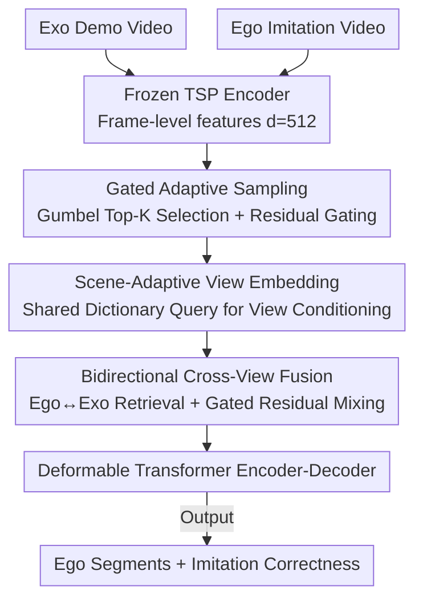

# SAVA-X: Ego-to-Exo Imitation Error Detection via Scene-Adaptive View Alignment and Bidirectional Cross View Fusion

**Conference**: CVPR 2026  
**arXiv**: [2603.12764](https://arxiv.org/abs/2603.12764)  
**Code**: [GitHub](https://github.com/jack1ee/SAVAX)  
**Area**: Video Understanding  
**Keywords**: Cross-view, Imitation Error Detection, Adaptive Sampling, View Embedding, Bidirectional Cross-attention

## TL;DR

This work formalizes the Ego→Exo imitation error detection task and proposes the SAVA-X (Align–Fuse–Detect) framework. It jointly addresses three major challenges—temporal misalignment, video redundancy, and cross-view domain gaps—through three modules: adaptive sampling, scene-adaptive view embedding (SVE), and bidirectional cross-view fusion.

## Background & Motivation

Error detection is critical in scenarios such as industrial training, medical operations, and assembly quality control. A common real-world setting involves using a third-person (exo) demonstration to evaluate the correctness of a first-person (ego) imitation. However, existing methods mostly assume a single-view setup and cannot handle cross-view scenarios.

**Key Challenge**:

1. **Temporal Misalignment**: Ego/Exo videos are recorded asynchronously with different durations and execution tempos (though duration differences are not necessarily errors).
2. **Heavy Redundancy**: Long videos contain significant uninformative content, which dilutes attention mechanisms and amplifies false positives.
3. **Significant View Domain Gap**: The Ego view emphasizes local hand-object interactions, while the Exo view captures global poses and scene layouts. Their appearance and motion statistics differ significantly, making direct fusion unreliable.

Existing Dense Video Captioning (DVC) and Temporal Action Localization (TAL) baselines struggle in these cross-view scenarios.

## Method

### Overall Architecture

SAVA-X processes Ego→Exo imitation error detection: using a third-person (Exo) demonstration to determine if a first-person (Ego) imitation is performed correctly. The framework follows a three-stage **Align–Fuse–Detect** pipeline.

The process is as follows: A frozen video encoder (TSP, pre-trained on ActivityNet, feature dimension $d=512$) extracts frame-level features for both Exo and Ego streams. Gated adaptive sampling selects key segments to suppress redundancy. Scene-adaptive view embedding injects view conditions to mitigate domain gaps. Bidirectional cross-view fusion aligns and aggregates complementary cues. Finally, the fused sequence is fed into a deformable Transformer encoder-decoder to generate Ego temporal segments and imitation correctness predictions.

### Key Designs

**1. Gated Adaptive Sampling: Compressing long videos into keyframes with differentiable gradient flow**

Long video redundancy amplifies false positives, but "hard frame selection" is non-differentiable. SAVA-X calculates saliency scores using self-attention+FFN on the Exo side and cross-attention scores (conditioned on Exo) on the Ego side. During training, a Gumbel Top-K straight-through estimator generates hard indices, while a residual gate $\mathbf{g}^{exo} = \mathbf{1} + \alpha(\text{Norm}(\boldsymbol{s}_x) - \mathbf{1})$ maintains a differentiable gradient path. Downstream modules process only the sparse keyframes, but gradients flow back via soft scores. Selection entropy regularization $\mathcal{L}_{sel}$ prevents selection collapse, and VICReg-style regularization $\mathcal{L}_{vic}$ suppresses dimensional collinearity.

**2. Scene-Adaptive View Embedding: Explicitly encoding "view" into features via a shared dictionary**

Ego and Exo appearance/motion statistics differ greatly; fixed learned view tokens lack flexibility. SAVA-X maintains a shared view-scene dictionary $\mathbf{D} \in \mathbb{R}^{M \times d}$, where each row captures a common view sub-factor (e.g., "close-up hand-object interaction" or "full-body motion structure"). Frame features query this dictionary via multi-head cross-attention with temperature $\mathbf{VE}^u = \text{CrossAttn}(\hat{\mathbf{Z}}^u / \tau, \mathbf{D})$. The resulting embeddings are injected at two points: before fusion (intra-domain alignment) and into encoder layers (multi-level modulation). To ensure dictionary utility, attention entropy regularization $\mathcal{L}_\text{view-ent} = \frac{1}{\log M} \mathbb{E}_t [KL(\alpha_t | U_M)]$ prevents over-sharp queries, and dictionary diversity regularization $\mathcal{L}_\text{dict-div} = \|\hat{\mathbf{D}} \hat{\mathbf{D}}^\top - \mathbf{I}_M\|_F^2$ inhibits prototype redundancy.

**3. Bidirectional Cross-View Fusion: Mutual enhancement without suppression**

Unidirectional fusion might lose complementary information. SAVA-X performs parallel symmetric bidirectional cross-attention: Ego retrieves global boundaries/step cues from Exo, while Exo retrieves hand-object details/local causality from Ego. Learnable gated residual mixing $\mathbf{F}^{ego} = (1-\boldsymbol{\gamma}^e)\tilde{\mathbf{Z}}^{ego} + \boldsymbol{\gamma}^e \mathbf{E}^\star$ (where $\boldsymbol{\gamma}^e = \sigma(\mathbf{W_e}[\tilde{\mathbf{Z}}^{ego}; \mathbf{E}^\star])$) prevents either stream from being suppressed. The model relies more on cross-view evidence at action boundaries/key interactions. Finally, features are fused symmetrically via $\tilde{\mathbf{Z}}^{fused} = \frac{1}{2}(\mathbf{F}^{ego} + \mathbf{F}^{exo})$.

### Loss & Training

The model jointly optimizes the dense video captioning loss $\mathcal{L}_{DVC}$ (following the PDVC configuration) and the imitation discrimination loss $\mathcal{L}_{Imit}$ (weight $\lambda_{Imit} = 0.5$). Hungarian matching establishes one-to-one correspondence between predicted and ground-truth segments. The optimizer is AdamW with a batch size of 16, a learning rate of $10^{-4}$, and regularization weights in the $[0.01, 0.05]$ range.

## Key Experimental Results

### Main Results

Evaluated on the EgoMe dataset (7,902 asynchronous Exo-Ego video pairs, ~82.8 hours):

| Method | Category | Val AUPRC@0.3 | Val AUPRC@0.5 | Val AUPRC@0.7 | Val Mean | Val tIoU | Test Mean | Test tIoU |
|------|------|--------------|--------------|--------------|----------|----------|-----------|-----------|
| PDVC | DVC | 28.21 | 20.48 | 7.95 | 18.88 | 58.58 | 16.20 | 57.98 |
| Exo2EgoDVC | DVC | 31.33 | 20.27 | 7.49 | 19.69 | 59.06 | 15.99 | 58.15 |
| ActionFormer | TAL | 31.37 | 15.41 | 2.63 | 16.47 | 48.89 | 14.08 | 48.25 |
| TriDet | TAL | 30.04 | 14.61 | 2.44 | 15.70 | 49.05 | 13.77 | 49.02 |
| PDVC (Ego-only) | DVC | 19.35 | 13.91 | 5.11 | 12.79 | 57.63 | 13.94 | 57.19 |
| **SAVA-X** | Ours | **33.56** | **24.04** | **9.48** | **22.36** | **59.31** | **18.50** | **58.32** |

### Ablation Study

| AS | SVE | BiX | AUPRC@0.3 | AUPRC@0.5 | AUPRC@0.7 | Mean | tIoU |
|----|-----|-----|-----------|-----------|-----------|------|------|
| | | | 28.21 | 20.48 | 7.95 | 18.88 | 58.58 |
| ✓ | | | 30.90 | 22.60 | 9.21 | 20.90 | 58.88 |
| | ✓ | | 31.64 | 22.87 | 9.37 | 21.29 | 59.27 |
| | | ✓ | 33.08 | 21.86 | 8.23 | 21.06 | 58.27 |
| ✓ | ✓ | | 30.89 | 24.26 | 10.32 | 21.82 | 58.96 |
| ✓ | | ✓ | 29.98 | 22.27 | 8.70 | 20.32 | 58.14 |
| | ✓ | ✓ | 35.09 | 22.58 | 9.31 | 22.33 | 58.76 |
| ✓ | ✓ | ✓ | **33.56** | **24.04** | **9.48** | **22.36** | **59.31** |

### Key Findings

1. **Module Complementarity**: Each module independently provides a +10.7% to +12.8% relative gain. Their combination achieves the best performance, indicating that redundancy removal, domain gap mitigation, and bidirectional fusion address distinct bottlenecks.
2. **SVE+BiX Strongest Pairing**: Combining domain gap reduction with bidirectional cross-verification yields the highest performance.
3. **Unidirectional Ablation**: The Exo→Ego direction is comparable to bidirectional fusion, while Ego→Exo is weaker. This aligns with the task goal—detecting errors in Ego streams requires boundary/ordering cues from the Exo demonstration.
4. **Impact of Demo**: Ego-only performance drops significantly (Mean AUPRC 12.79 vs 18.88), validating the necessity of third-person demonstration signals for reducing false positives.
5. **View Domain Analysis**: Injecting SVE shifts the cross-view similarity distribution to the right and makes it more concentrated, effectively mitigating the domain gap.

## Highlights & Insights

- **Task Formalization**: First systematic formalization of the Ego→Exo imitation error detection task with clearly defined protocols.
- **Problem-Driven Design**: The AS, SVE, and BiX modules precisely map to the three core challenges of redundancy, domain gap, and cross-view fusion.
- **Gumbel Top-K + Residual Gating**: Effectively combines discrete sparse selection with continuous gradient signals to solve the gradient sparsity issue in hard sampling.
- **SVE vs. Fixed Tokens**: Attention-driven dictionary queries adapt to different scenes more effectively than fixed learned tokens.
- **Experimental Rigor**: Extensive analysis covers module-level ablations, frame rates, Top-K ratios, dictionary sizes, and regularization terms.

## Limitations & Future Work

1. **Dataset Breadth**: Validated only on the EgoMe dataset; generalization to other cross-view datasets remains to be explored.
2. **Feature Extraction**: Using frozen encoders; end-to-end fine-tuning might improve performance but increases computational costs.
3. **Semantic Integration**: Incorporating step descriptions/textual information could assist in more precise error classification.
4. **Boundary Refinement**: The gain in tIoU is relatively small compared to AUPRC, suggesting room for improvement in temporal localization.

## Related Work & Insights

- **PDVC** is a mainstream DVC method whose encoder-decoder architecture was adopted as a foundation.
- **ActionFormer / TriDet** are strong TAL baselines that struggle in cross-view settings.
- **Exo2EgoDVC** pioneered cross-view captioning using view-invariant adversarial learning.
- **Insight**: In cross-view tasks, simple concatenation of Ego/Exo features is insufficient; explicit domain gap modeling and information interaction mechanisms are essential.

## Rating

| Dimension | Rating |
|------|------|
| Novelty | ⭐⭐⭐⭐ |
| Theoretical Depth | ⭐⭐⭐⭐ |
| Experimental Thoroughness | ⭐⭐⭐⭐⭐ |
| Value | ⭐⭐⭐⭐ |
| Writing Quality | ⭐⭐⭐⭐ |
| **Overall** | ⭐⭐⭐⭐ |

<!-- RELATED:START -->

## Related Papers

- [\[CVPR 2026\] SHANDS: A Multi-View Dataset and Benchmark for Surgical Hand-Gesture and Error Recognition Toward Medical Training](shands_a_multi-view_dataset_and_benchmark_for_surgical_hand-gesture_and_error_re.md)
- [\[CVPR 2026\] MV-TAP: Tracking Any Point in Multi-View Videos](mv-tap_tracking_any_point_in_multi-view_videos.md)
- [\[CVPR 2025\] Bootstrap Your Own Views: Masked Ego-Exo Modeling for Fine-Grained View-Invariant Video Representations](../../CVPR2025/video_understanding/bootstrap_your_own_views_masked_ego-exo_modeling_for_fine-grained_view-invariant.md)
- [\[CVPR 2026\] SMV-EAR: Bring Spatiotemporal Multi-View Representation Learning into Efficient Event-Based Action Recognition](smv-ear_bring_spatiotemporal_multi-view_representation_learning_into_efficient_e.md)
- [\[CVPR 2026\] MER-Tracker: Towards High-Speed 3D Point Tracking via Multi-View Event-RGB Hybrid Cameras](mer-tracker_towards_high-speed_3d_point_tracking_via_multi-view_event-rgb_hybrid.md)

<!-- RELATED:END -->
